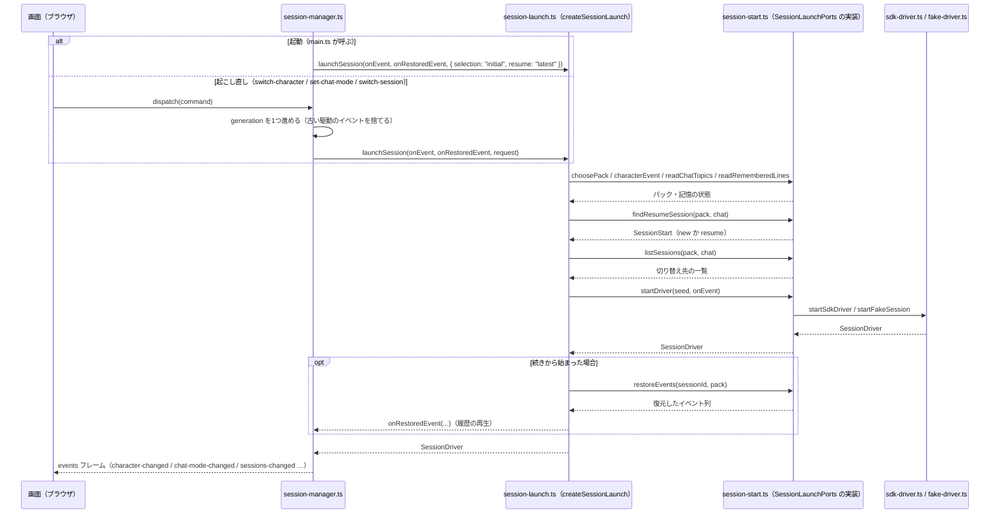

# 設計書（描く層をブラウザ側へ移す）

最終更新: 2026-09-13（起こした日。**移行の決定は同日**。経緯と採らなかった案は
`docs/research/architecture-rethink.md`）
ステータス: **正典**。構造は `shared` / `server`（`core` と `adapter`）/ `browser` の3層 +
`src/` 直下の配線（`docs/architecture.md`「現在の実装状況」）。**残っているのは
キャラクターパック（7章）の段だけ**で、`develop/task/` 側の別タスクとして進める。
移行の段階そのものの記録は `docs/history/decision.md`「design.md 12. 移行の段階」にある。
**13章「画面のデザイン」は `docs/screen-design.md` へ移した**（2026-09-23。節の番号 `13.x` は
そのまま）。この設計書の中でファイル名を添えずに `13.6` のように書いた番号は、そちらの節を指す。

## このドキュメントの読み方

### このファイルは通読しない

節を1つ特定して、その節だけを次の形で読む:

```bash
sed -n '/^## 4\. shared/,/^## /p' docs/design.md
```

**このファイルには「いまどうなっているか」だけを書く**（2026-09-21 決定）。却下した案の理由・
値の根拠の実測・覆した決定の記録は `docs/history/` に置き、ここからは1行で参照する。何を残して
何を移すかの表は `docs/requirements.md`「正典に残すもの・`docs/history/` へ移すもの」。

### 節の索引

**索引の行は本文の `## <番号>.` の章と1対1**（`###` の節は載せない。章を足したり消したりしたら、
ここも同じ数だけ動かす）。

| 節                             | 中身                                                                                                                     |
| ------------------------------ | ------------------------------------------------------------------------------------------------------------------------ |
| ## 1. 何を変え、何を残すか     | 決定の要約。**最初にここ**                                                                                               |
| ## 2. 全体構成                 | 層（shared / server / browser）の図、依存の向き、ディレクトリ、`components/ui/` の variant 部品の作法と一覧              |
| ## 3. 動きの流れ               | 起動・接続・依頼・答え待ち・再接続の順序                                                                                 |
| ## 4. shared                   | **両側が共有する契約**。イベント・状態・reducer・コマンド・フレーム・版                                                  |
| ## 5. core と adapter          | サーバ側のモジュールと責務。判断（core）と外の世界に触る境界（adapter）。成果の集め方と日記の保存・訪問の契機と状態      |
| ## 6. browser                  | ブラウザ側の部品の木、状態の持ち方、Markdown、重いライブラリ、立ち絵の動き                                               |
| ## 7. キャラクターパック       | `character.json` + `persona.md` + 素材。人格の注入と切り替え、書き戻し、雑談の要約とアーカイブ、パックの一覧と素材の URL |
| ## 8. セッションの復元と複数化 | 復元（4.8）を新しい形に載せる。複数セッションへ広げる余地                                                                |
| ## 9. 会話内容と安全           | `127.0.0.1`・Origin・起動トークン・ディスクに書く2つの例外と直近を読み戻す口・ブラウザ側のメモリ                         |
| ## 10. テスト                  | reducer・スキーマ・部品・fake driver + Playwright・層の検査                                                              |
| ## 11. ビルドと依存            | `bun build` の入口、tsconfig、**足す依存の一覧（承認済み）**                                                             |

## 1. 何を変え、何を残すか

**変えるのは「描く」層の重心だけ。** サーバが HTML 文字列を組み立てて Server-Sent Events で押し、
ブラウザが Idiomorph で当てる形をやめ、**両側が共有する型付きプロトコルでイベントを押し、
ブラウザ側の React の部品が状態から描く**形にする。言語は TypeScript のまま、ランタイムは当面 Bun
（Node で動く形を保つ）。

| 残すもの                                                                                                                       | 変えるもの                                                                     |
| ------------------------------------------------------------------------------------------------------------------------------ | ------------------------------------------------------------------------------ |
| Agent SDK で Claude Code を動かす。SDK を import する場所を機能の `adapter/` 直下の `sdk-` で始まるファイルに閉じる            | サーバ側の HTML 組み立て（`presentation/view.ts`）→ ブラウザ側の部品           |
| `speak(text, expression)` の MCP ツール。戻り値は `"ok"` だけ                                                                  | SSE 5本 + POST 6本 → WebSocket 1本（フレームとコマンド）                       |
| `SessionEvent` の union と `applySessionEvent` の純粋な畳み込み                                                                | 自前の Markdown レンダラとサニタイザ → unified（remark / rehype）              |
| 答え待ちの列（`canUseTool` の Promise を保留する）                                                                             | 4層（domain / usecase / presentation / infrastructure）→ 3層                   |
| 会話をプロセスの外へ出さない。`127.0.0.1` だけ。ディスクに書かない                                                             | キャラクター定義 → 人格を含む**パック**                                        |
| 起動時は組み立て済みの成果物（`dist/browser/`）を読むだけ（束ねるのは `bun run build`。2026-09-21 に起動時の組み立てをやめた） | 1プロセス = 1セッション固定 → 起こし直せる `SessionManager`（セッションは1つ） |
| ホストのポート（`showView` 1つ）と Orca のアダプタ                                                                             | HTML の文字列一致のテスト → 部品のテストと fake driver                         |

**決めたこと**（迷ったら蒸し返さない。理由は `docs/research/architecture-rethink.md`）:

- UI は **React 19**。Preact は alias で差し替えられる位置に置く（`bun build` の `--define` / alias）
- 通信は **WebSocket 1本**（`ws` パッケージ。`Bun.serve` の WebSocket に寄せない）
- Markdown は **react-markdown + remark-gfm + rehype-raw + rehype-sanitize + rehype-highlight**
- 立ち絵は**動くが話さない**（表情の遷移・まばたき・登場と退場の演出。音声・口パクは持たない）
- 端末ペイン（PTY）は持たない。**設計上の余地も残さない**（2026-09-13。用途が無いことを確認した）
- **TypeScript は本質的な選択、Bun はそうではない**（2026-09-13 のユーザーの問い「既存だからではなく
  本質的な最善手か」への答え）。Agent SDK の公式実装は TypeScript と Python だけで、表示はどの箱でも
  ブラウザの JS なので、**両端を1言語で通せるのは TypeScript だけ**（reducer と zod を両側で共有する
  この設計は、それが無いと成立しない）。**Bun は「道具が1つで済む」以上の実利が無く**、Node 22.18 以降 +
  Vite + Vitest で同じことができ参考資料はそちらが多い。それでも当面 Bun なのは移行の作業量を増やさない
  ためで、**`Bun.*` に寄せない規約を保つ**。**2026-09-17 に「いま寄せ替えない」と決めた**（箱が
  Orca のブラウザタブである限り、Node へ移す差し迫った理由が無い）。**再検討するのは箱が変わった
  ときだけ**（Electron なら core を Electron の Node で動かせるので Bun は不要になる）

## 2. 全体構成

```
┌────────────────────────────────────────────────────────────┐
│ browser（ブラウザ。React）                                  │
│   <App> ─ <Layout> ─ Main / Character / Sidebar / Dispatch  │
│   状態 = shared の SessionState（reducer は core と同じ物）   │
└──────────────▲───────────────────────────┬─────────────────┘
               │ ServerFrame                │ ClientCommand
               │  hello（snapshot）/ events  │  prompt / answer / …
               │        WebSocket 1本（127.0.0.1、起動トークン付き）
┌──────────────┴───────────────────────────▼─────────────────┐
│ server/<機能>/core（サーバ側の純粋な判断。外の世界に触らない）│
│   session/session-manager ／ session-driver/session-driver   │
│   （駆動の契約）／ session-driver/sdk-message ／ host/host      │
└──────────────▲───────────────────────────┬─────────────────┘
               │ 呼ばれる                   │ core を import する
┌──────────────┴───────────────────────────▼─────────────────┐
│ server/<機能>/adapter（外の世界に触る場所。1ファイル = 1境界）│
│   session-driver/sdk-* ・fake-driver（駆動）                  │
│   view-server/server（http）・session-socket（ws）・bundle    │
│   character-pack/character-pack ／ host/orca-host ／ …        │
│ （機能に属さない共有のものは server/core/ と server/adapter/）│
└──────────────▲───────────────────────────┬─────────────────┘
               │ SDKMessage                 │ query / interrupt / canUseTool
┌──────────────┴───────────────────────────▼─────────────────┐
│ Claude Code（SDK が起こす子プロセス）                         │
└────────────────────────────────────────────────────────────┘
      shared（語彙・イベント・状態・reducer・zod スキーマ。browser と core の両方が import する）
      辺は adapter ──▶ core ──▶ shared ◀── browser（**core → adapter は禁止**。結ぶのは src/ 直下だけ）
      サーバ側の機能どうしの辺は下の「サーバの機能と、機能どうしの辺」の表にあるものだけ
```

### 層と依存の向き

**この形は「共有コントラクト＋クライアント/サーバ分割」で、旧の4層（クリーンアーキテクチャの
写し）とは別物**。`shared` は TypeScript のモノレポでいう `packages/shared` / `contracts`
の位置（サーバとブラウザの両方が import する契約）、`browser` はクライアント、`core` と `adapter` は
サーバで、「受け取る／決める／描く」という役割の分割ではなく「どちらの実行環境で動くか」で
分けている。**サーバ側だけをもう一段、「純粋な判断（`server/core/`）」と「外の世界に触る境界
（`server/adapter/`）」に割ってある**（この形に至った比較は
`docs/research/architecture-proposal.md` / `docs/history/architecture-placement.md`）。
**2026-09-25 に、サーバ側を機能のまとまりで割ると決めた**: `core` と `adapter` の割りは
**機能の中**に置き（`server/<機能>/core/` と `server/<機能>/adapter/`）、どの機能にも属さない
共有のものだけを `server/core/` と `server/adapter/` の直下に残す（下の「サーバの機能と、
機能どうしの辺」。比べた案は `docs/history/decision.md`「design.md 2. 全体構成 / ディレクトリ
（`src/server/` を機能で割った）」）。**`core` と `adapter` という名前はどの深さでも層だけを表す。**

| 層               | 置くもの                                                                                                                                                                                                                                                                          | import してよい先                 | 実行場所         |
| ---------------- | --------------------------------------------------------------------------------------------------------------------------------------------------------------------------------------------------------------------------------------------------------------------------------- | --------------------------------- | ---------------- |
| `shared`         | 概念の語彙・`SessionEvent`・`SessionState`・`applySessionEvent`・コマンドとフレームの zod。**`SessionState` から純粋に導けるもの**も含む（ブラウザしか読まないものを含む。`main-view.ts` `turn-step.ts` `turn-speech.ts` `portrait-motion.ts` `room.ts` `command-suggestion.ts`） | `shared` のみ（`zod` は可）       | サーバとブラウザ |
| `server/core`    | サーバ側の純粋な判断。セッション管理・駆動の契約・イベントの検証・ポートの決定・設定の解釈。**`server/<機能>/core/` と、共有の `server/core/`**                                                                                                                                   | `shared` / `core`                 | サーバ（Bun）    |
| `server/adapter` | 外の世界に触る場所。SDK・WebSocket・HTTP・ホスト・ファイル・子プロセス・fake driver。**`server/<機能>/adapter/` と、共有の `server/adapter/`**                                                                                                                                    | `shared` / `core` / `adapter`     | サーバ（Bun）    |
| `browser`        | React の部品・hooks・CSS・Markdown の変換                                                                                                                                                                                                                                         | `shared`（React などの npm は可） | ブラウザ         |
| `src/` 直下      | 配線（composition root。`cli.ts` / `main.ts` と起動の段取り）                                                                                                                                                                                                                     | すべて                            | サーバ           |

- **`core` と `browser` は互いを import しない。** 両者が知っているのは `shared` だけ
- **`core → adapter` は禁止。** 辺は `adapter ──▶ core ──▶ shared ◀── browser` の一方通行で、
  `core` と `adapter` を結ぶのは `src/` 直下の配線だけ。**機能をまたいでも同じ**で、どの機能の
  `core/` もどの機能の `adapter/` も import しない（層は機能より先に効く）。**`core` は `node:` / SDK（`@anthropic-ai/*`）/
  `ws` を import しない**ので、`core` から外の世界へ出る道は無い
- **`adapter` は1ファイル = 1つの境界。** インターフェースは切らない（実装が2つあるもの —
  駆動とホスト — だけ、契約の型を `core` に置く: `server/session-driver/core/session-driver.ts` /
  `server/host/core/host.ts`）
- **`shared` は `node:` も `document` も触らない。** これは設計上の好みではなく**物理的な制約**
  である。`shared` はサーバ（Bun/Node）とブラウザの両方の実行環境で読み込まれるので、
  片方にしか無い API（`node:fs` や `document` など）に触れた時点でもう片方で動かなくなる。
  純粋関数と型と zod スキーマだけが両方で動く共通部分
- 許した辺以外は `test/architecture.test.ts` が落とす（層の辺は上の4本。サーバ側の機能どうしの辺は
  次の節の表）

### サーバの機能と、機能どうしの辺

`src/server/` は**機能のまとまりで割り、機能の中を層（`core/` と `adapter/`）で割る**（2026-09-25
決定）。機能の名前は `docs/glossary.md` の語（単数形）で、**1つの機能 = 1つのディレクトリ**。
機能の中は `core/`（判断）と `adapter/`（境界）の2段だけで、中身の無い段は作らない。

| 機能              | 何の機能か                                                                                | `core/`                                                                                                                                                  | `adapter/`                                                                               |
| ----------------- | ----------------------------------------------------------------------------------------- | -------------------------------------------------------------------------------------------------------------------------------------------------------- | ---------------------------------------------------------------------------------------- |
| `session/`        | セッションを持つ・起こす・頼む。**各機能の判断を束ねる**（下の「束ねる機能」）            | `session-manager` `session-launch` `event-batch` `driver-command`                                                                                        | `remembered-default`                                                                     |
| `session-driver/` | セッション駆動。契約・SDK の実装・fake driver・メッセージの変換・答え待ち・続きから始める | `session-driver` `sdk-message` `pending-answer` `self-started-turn` `visible-output-nudge` `session-restore` `session-title` `prompt-image-shelf` `plan` | `sdk-driver` `sdk-tool` `sdk-session` `sdk-context-usage` `fake-driver` `claude-account` |
| `report/`         | レポートの記法・`report` ツール・検査と差し戻し                                           | `report-notation` `report-tool` `report-review` `report-violation`                                                                                       | —                                                                                        |
| `system-prompt/`  | `systemPrompt` の append の組み立てと、セリフの間合いの規約                               | `system-prompt` `speech-cadence`                                                                                                                         | —                                                                                        |
| `chat/`           | 雑談モード。作法・記憶・話しかけ・`/compact`・アーカイブ・要約・覚えたこと                | `chat-manner` `chat-memory-prompt` `chat-nudge` `chat-compact` `chat-archive-entry`                                                                      | `chat-archive` `chat-summary` `persona-memory`                                           |
| `character-pack/` | キャラクターパックの選択・読み込み・画面からの編集                                        | `character-selection`                                                                                                                                    | `character-pack` `character-edit`                                                        |
| `visit/`          | 訪問。契機・来客・台本・見張り                                                            | `visit-timing` `visit-guest` `visit-script` `visit-script-writer` `visit-watch`                                                                          | `sdk-visit-script` `visit-clock`                                                         |
| `diary/`          | 日記。`diary` ツールと保存                                                                | `diary-tool` `diary-writer`                                                                                                                              | `diary` `sdk-diary`                                                                      |
| `achievement/`    | 成果。`main` の履歴から数える                                                             | `achievement`                                                                                                                                            | `main-history`                                                                           |
| `usage-review/`   | 見直し。2つのツール・前回の結果・見送り                                                   | `usage-review-tool`                                                                                                                                      | `previous-usage-review` `usage-proposal-dismissal`                                       |
| `token-usage/`    | トークン消費の記録と集計                                                                  | `token-usage`                                                                                                                                            | `token-usage-log`                                                                        |
| `context-usage/`  | コンテキストの内訳の記録                                                                  | `context-usage`                                                                                                                                          | `context-usage-log`                                                                      |
| `host/`           | ホストのポートと Orca の実装、ホストへ渡す前の門番                                        | `host` `tracked-file`                                                                                                                                    | `orca-host`                                                                              |
| `view-server/`    | ビューサーバ。ポートの決定・http・ws・同梱の外部ライブラリ・ブラウザ側の組み立てと見張り  | `port-resolution`                                                                                                                                        | `server` `session-socket` `vendor-asset` `bundle` `ui-rebuild` `source-fingerprint`      |
| `repository/`     | 作業ディレクトリの git リポジトリを読む。`git` を起こす口・管理下のファイル・タスク一覧   | —                                                                                                                                                        | `git` `repository-file` `task-summary`                                                   |

**どの機能にも属さない共有のもの**は、`server/core/` と `server/adapter/` の**直下**に置く
（`core/config.ts`、`adapter/tsukumo-home.ts` `bundled-path.ts` `local-time.ts` と
`adapter/lib/json-file.ts` `jsonl.ts`）。置いてよいのは**どの機能の語彙も名乗らず、読み手が
2つ以上ある（機能・共有の箱・配線のどれでも数える）もの**だけで、読み手が1つの機能だけに
なったらその機能へ下ろす（`browser/domain/` と同じ引き金）。

**機能どうしの import の規則**:

- **層の規則が先に効く。** `core/` は、どの機能のものでも `adapter/` を import しない
- **機能 A が機能 B を import してよいのは、下の表にある組だけ。** 共有の箱はどの機能からも
  読んでよく、**共有の箱は機能を読まない**
- **層ごとに循環させない。** 機能の `core/` どうしの辺と、機能の `adapter/` どうしの辺は、それぞれ
  一方通行（表はその順に並ぶ）。**機能の単位で見ると輪が2つある**: `chat` ↔ `session-driver`
  （`session-driver/core/session-driver.ts` が雑談の書き口の型（`ChatArchive` など）を持ち、
  SDK の境界の `session-driver/adapter/` が雑談のツールの判断の `chat/core/` を読む）と、
  `view-server` → `session` → `session-driver` → `view-server`（`session-socket.ts` が
  `driver-command.ts` を、`session-restore.ts` が `port-resolution.ts` を読む）。どちらも1本が
  `adapter → 別の機能の core` で、これは層の辺と同じ向きなので、ファイルの単位では輪にならない
- **束ねる機能は `session/` の1つ。** `session-manager.ts` は外の世界に触らないので `core` だが、
  各機能の判断（訪問の見張り・日記・トークン消費・雑談のアーカイブ）を読んで1つのセッションに
  まとめる。**外の世界の実装を選んで渡すのは配線（`src/` 直下の `session-start.ts` など）**、
  渡されたものを使って順序と状態を持つのが `session/`、という境目
- **Agent SDK を import してよいのは、機能の `adapter/` の直下の `sdk-` で始まるファイルだけ**
  （原則3）。1つの箱にはまとめず、**その境界が属する機能に置く**: 駆動の本体・ツール・
  セッションの一覧・コンテキストの内訳は `session-driver/adapter/`、訪問の台本を書かせる
  使い捨ての `query()` は `visit/adapter/`、日記を書かせる使い捨ての `query()` は `diary/adapter/`
- **機能を足すときは、検査の機能の一覧と下の表に足す**（知らない機能のディレクトリと、
  `core/` `adapter/` の外に置いたファイルは `test/architecture.test.ts` が落とす）

| 機能（import する側） | 読んでよい機能                                                                              | いまある辺の層                                                                                                                                          |
| --------------------- | ------------------------------------------------------------------------------------------- | ------------------------------------------------------------------------------------------------------------------------------------------------------- |
| `session`             | `session-driver` `chat` `visit` `diary` `token-usage` `context-usage` `character-pack`      | core → core だけ                                                                                                                                        |
| `system-prompt`       | `session-driver` `chat` `report`                                                            | core → core だけ                                                                                                                                        |
| `view-server`         | `session` `achievement`                                                                     | adapter → core（`session-socket` → `driver-command`）・adapter → adapter（`server` → `main-history`）                                                   |
| `chat`                | `session-driver` `character-pack`                                                           | core → core と adapter → core（駆動の契約にある雑談の型）・adapter → adapter（`persona-memory` / `chat-summary` → `character-pack` / `character-edit`） |
| `context-usage`       | `session-driver`                                                                            | core → core（駆動の契約）                                                                                                                               |
| `session-driver`      | `chat` `report` `usage-review` `view-server`                                                | core → core（`report-review` `port-resolution`）・adapter → core（各ツールの判断）                                                                      |
| `diary`               | `character-pack` `repository` `session-driver`                                              | adapter → adapter・adapter → core（`sdk-diary` → `session-driver/core/sdk-message.ts` の `tsukumoToolFullName`）                                        |
| `achievement`         | `repository`                                                                                | adapter → adapter（`main-history` → `git`）                                                                                                             |
| そのほか              | —（葉。`report` `visit` `usage-review` `token-usage` `character-pack` `host` `repository`） | —                                                                                                                                                       |

### ディレクトリ

```
src/
  cli.ts                      入口。引数の受け取り・環境変数の読み出し・終了コードの返し方だけ
  main.ts                     起動の段取り。即時終了する前提不足（ポート・組み立て・疑似セッション）もここ
  current-character.ts        いま出しているパックと選択肢の持ち主（切り替えと画面からの編集で入れ替わる）
  view-delivery.ts            ビューの配信。組み立てたブラウザ側と開いているタブを持ち、/ws と見張りを束ねる
  session-start.ts            セッションを1つ起こす（どの駆動で起こすか・続きをどう探すか）
  shared/
    session-event.ts          SessionEvent（zod と z.infer）
    session-state.ts          SessionState と applySessionEvent（いまの session-view.ts）
    session-choice.ts         切り替え先として選べるセッション1件（サーバとブラウザの両方が読む契約）
    session-default.ts        新しいセッションの既定（モデル・許可モード。次に起こすときの初期値）
    session-socket.ts         WebSocket の経路名とトークンのクエリ名（サーバとブラウザの両方が同じ値を見る）
    main-view.ts              メインビューに出す形（MainViewEntry）と、ターンごとのまとめ
    turn.ts                   記録を依頼の区切りでターンに割る（割り方の唯一の持ち主。4.2）
    turn-step.ts              「依頼の手順」を確定した記録（SessionRecord）から導く純関数
    turn-speech.ts            ターンごとのセリフと表情を確定した記録（SessionRecord）から引き直す純関数
    portrait-motion.ts        立ち絵をいま動かしてよいか・どれで動かすかを決める純関数
    command-suggestion.ts     入力欄の / 補完に出す候補（姿から導くだけ）
    command.ts                ClientCommand（zod）
    frame.ts                  ServerFrame（zod）・PROTOCOL_VERSION
    vendor-asset.ts           外部ライブラリ（npm の依存）を配る経路の名前
    expression.ts / question.ts / pending-ask.ts / task-summary.ts / character.ts
                              語彙（いまの domain のうち、両側が使うもの）
    character-definition.ts   character.json そのものの形。解析と、1件を重ねた書き戻しの文字列
    character-asset.ts        /character/<pack>/<file> の URL の組み立てと読み分け・取り直しの印・拡張子による仕分け
    character-background.ts   キャラビューに敷く背景（character.json の background から導く）
    expression-choice.ts      speak が選べる表情とラベル（ラベルの出どころは定義ファイル）
    image-data-url.ts         画面から届いた画像1枚の data URL の受け渡しの形（立ち絵・背景・依頼の画像で共有）
    portrait-image.ts         画面から届いた立ち絵1枚（data URL）の受け渡しの形
    prompt-image.ts           依頼に添える画像（貼り付け・ドロップで届く data URL）
    persona-memory.ts         覚えたこと（persona.md の節）に関わる、両側が見る値（1行の長さの上限）
    chat-log.ts               雑談モードの会話のログ（セッションの姿から導くだけ）
    context-usage.ts          いまのセッションのコンテキストの内訳と、配る経路の名前
    context-usage-record.ts   コンテキストの内訳を記録に残すときの形（1行 = 1セッション）
    token-usage.ts            トークン消費の記録の形（型だけ）
    token-usage-summary.ts    トークン消費の集計（期間で切って軸ごとに畳んだ形）と、配る経路の名前
    repository-file.ts        ファイル一覧の経路名と読み取り（入力欄の @ 補完。両側が見る）
    room.ts                   部屋の名前（ビューのポート1つ＝部屋1つ。語彙と、語彙の外の名乗り方。13.9）
    blank-text.ts             本文が読める文字を1字も持たないかを判定する純関数（ゼロ幅スペース等も空扱い）
    background-task.ts        背景のタスク（ターンのあとも claude が動かし続けているもの）の語彙（型だけ）
  server/                     サーバ（Bun）側。機能ごとのディレクトリの中を、判断（core/）と境界（adapter/）の2段に割る
                              （機能の一覧と辺は上の「サーバの機能と、機能どうしの辺」）
    core/                     共有の判断（どの機能にも属さないもの）。node: / SDK / ws を import しない
      config.ts               環境変数の解釈（読み取りは cli.ts。ここは渡された env を見るだけ）
    adapter/                  共有の境界（どの機能にも属さないもの）。1ファイル = 1つの境界
      tsukumo-home.ts         ~/.tsukumo/ の場所を組み立てる唯一の口
      bundled-path.ts         同梱物の位置（import.meta.url）
      local-time.ts           ~/.tsukumo/ に積む JSONL の「いつ」の書き方（日の境目も時差もそのマシンのローカル時刻）
      lib/                    境界を名乗らない道具（json-file.ts / jsonl.ts）
    session/                  セッションを持つ・起こす・頼む（各機能の判断を束ねる）
      core/
        session-manager.ts    セッション1つの { generation, state, subscribers }。reducer をサーバ側でも回す
        session-launch.ts     起こす一続きの順序（外に触る部分は session-start.ts が渡す。起動も切り替えも同じ）
        event-batch.ts        届いたイベントをまとめて配る束（間隔と、書きかけの本文の連結）
        driver-command.ts     起き上がっている駆動に1件頼む（受け付けたかどうかの返し方 DispatchResult も）
      adapter/
        remembered-default.ts 次に起こすときの初期値（~/.tsukumo/state.json。キャラクター名・モデル・effort・許可モード・訪問のオン・オフ）
    session-driver/           セッション駆動
      core/
        session-driver.ts     駆動の契約（SessionDriver / SessionDriverOptions と既定値）だけ
        sdk-message.ts        SDK のメッセージを検証して SessionEvent にする（SDK を import しない）
        pending-answer.ts     答え待ちの列（SDK の型は持たない。結び付けるのは adapter 側）
        self-started-turn.ts  claude が依頼なしで始めた続きのターンに turn-resumed を補う
        visible-output-nudge.ts 本体が差し込む「本文の無い応答」への催促への対処
        session-restore.ts    続きから始めるセッションを選ぶ・transcript を履歴イベントにする
        session-title.ts      セッションの見出しを付けさせる判断
        prompt-image-shelf.ts 依頼に添えた画像の原寸の棚（直近の数枚をプロセスのメモリに持ち、/prompt-image/<id> で配る）
        plan.ts               プランの名前をどちらの出どころから採るか
      adapter/
        sdk-driver.ts         SessionDriver の本物の実装（query() を回す）
        sdk-tool.ts           tsukumo の MCP サーバとツール（speak / diary / report / remember ほか）
        sdk-session.ts        セッションの一覧・transcript の読み直し・印（listSessions / getSessionMessages / tagSession）
        sdk-context-usage.ts  コンテキストの内訳の問い合わせと、画面が要る形への写し
        fake-driver.ts        疑似セッションどおりに SessionEvent を流す SessionDriver（疑似セッションは fs から読む）
        claude-account.ts     ~/.claude.json から契約の段を読む
    report/core/              report-notation.ts / report-tool.ts / report-review.ts / report-violation.ts
                              （レポートの記法の規約・report ツール・検査と差し戻し）
    system-prompt/core/       system-prompt.ts（systemPrompt の append の組み立て。人格 → 規約 → 雑談の記憶）と
                              speech-cadence.ts（セリフの間合いの規約）
    chat/                     雑談モード
      core/                   chat-manner.ts / chat-memory-prompt.ts / chat-nudge.ts / chat-compact.ts / chat-archive-entry.ts
      adapter/                chat-archive.ts（~/.tsukumo/chat-archive/）/ chat-summary.ts（~/.tsukumo/chat-summary/）/
                              persona-memory.ts（persona.md の末尾の節へ書く）
    character-pack/           core/character-selection.ts（どのパックを出すかの順位）、
                              adapter/character-pack.ts（列挙・読み込み）/ character-edit.ts（~/.tsukumo/characters/ へ書く）
    visit/                    core/visit-timing.ts / visit-guest.ts / visit-script.ts / visit-script-writer.ts / visit-watch.ts、
                              adapter/sdk-visit-script.ts（台本を書かせる使い捨ての query()）/ visit-clock.ts（時計）
    diary/                    core/diary-tool.ts、adapter/diary.ts（~/.tsukumo/diary/）
    achievement/              core/achievement.ts（数える判断）、adapter/main-history.ts（main の履歴を読む）
    usage-review/             core/usage-review-tool.ts、adapter/previous-usage-review.ts / usage-proposal-dismissal.ts
    token-usage/              core/token-usage.ts、adapter/token-usage-log.ts（~/.tsukumo/token-usage/）
    context-usage/            core/context-usage.ts、adapter/context-usage-log.ts（~/.tsukumo/context-usage/）
    host/                     core/host.ts（ホストのポート。showView）/ tracked-file.ts（git 管理下のときだけホストへ渡す門番）、
                              adapter/orca-host.ts（`orca` コマンドを起こす唯一の場所）
    view-server/              core/port-resolution.ts（どのポートで試すか）、
                              adapter/server.ts（http）/ session-socket.ts（ws）/ vendor-asset.ts（node_modules の実ファイル）/
                              bundle.ts / ui-rebuild.ts / source-fingerprint.ts（bun build と src/browser/ の見張り）
    repository/adapter/       git.ts（`git` を起こす唯一の口）/ repository-file.ts（git ls-files）/
                              task-summary.ts（main のタスク一覧の読み直し）
  browser/
    main.tsx                  入口。部品の木を組み立てて mount する（副作用はここだけ）。出す画面を選ぶ
                              <Root> と、会話の画面の <Layout> に4領域を差し込むのもここ（6.1）
    css-variable.d.ts         browser 全体に効く型拡張（import されない ambient 宣言）
    css-module.d.ts           `*.module.css` を import したときの型（同上）
    css-global.d.ts           `styles/theme.css` を副作用だけで import したときの宣言（中身は空。同上）
    vendor-global.d.ts        外部ライブラリがブラウザのグローバルに置くものの型（`<script>` で読むので npm の型が引けない分。同上）
    components/               React の部品。**`page/` `domain/` `ui/` の3段**（2026-09-25 決定。下の箱の表）
      page/                   画面。**1つの画面 = 1つのディレクトリ**で、名前は `stores/location-hash.ts` の
                              `Screen` の値そのまま
        conversation/         会話の画面。**4つの領域をサブディレクトリに分ける**（組み立ては `main.tsx`）
          main-view/          TurnHeader・Turn・Report・QuestionRecord と markdown/（unified 一式）
          character-view/     BalloonTrack・Balloon・SpeechLog・動きの hooks（立ち絵は domain/portrait.tsx）
          chat-view/          雑談モードでメインの領域に差し替わるビュー（13.7）
          dispatch/           Composer・CommandSuggestions・FileSuggestions・PendingAnswer・TurnStatus
        character/            キャラクター画面と、その上に重なる新しく作るダイアログ（13.6）。
                              パックの一覧と、選んだパックの立ち絵・差し色・背景の差し替え
        token-usage/          トークン消費の画面（期間の消費の札・小さな棒・集計の表）
        achievement/          成果の画面（13.10）と、どの画面にも出る書き終わりの知らせ（DiaryNotice）
      domain/                 **tsukumo の語彙を持つ部品**。直下のファイルは2つ以上の領域が読む部品、
                              サブディレクトリは全画面で共有する枠（領域）
        portrait.tsx          立ち絵（6.5）
        character-face.tsx    キャラクターの顔（13.9）
        prompt-image.tsx      依頼に添えた画像の札と控え（6.1）
        protocol-mismatch.tsx サーバと版が合わないときの知らせ（4.4）
        layout/               Layout・領域の枠・リサイザ・比率の保存
        screen-nav/           全画面の最上部の帯。部屋の名前・仕事/雑談のトグル・3画面の口・
                              いまの作業の札（押すと依頼の手順の一覧）・モデル/許可モードの
                              操作子（13.9）
        sidebar/              SessionInfo・TaskSection（まん中の区画ひとまとまり）と、
                              2区画の枠（SidebarSection）
      ui/                     **語彙を持たない部品**。値と呼び先を全部受け取る。**部品ごとのディレクトリに
                              分ける**（1部品1フォルダの唯一の例外。下の「1部品1フォルダは真似しない」）。
                              variant の作法と部品の一覧は下の「`components/ui/` の部品（variant の作法と一覧）」
        select/               select.tsx・select.module.css
        image-zoom/           image-zoom.tsx・image-zoom.module.css
    features/                 **置かれる機能**。自分の置き場所を持たず、領域の中に置いてもらう
      task-board/             タスク一覧。TaskList（区画の中身）・TaskBoard（表のモーダルの入口）・
                              PresentationalTaskBoard（器）。サイドバーに置いてもらう
                              （下の「領域の機能と、置かれる機能」）
        hooks/                その機能だけが読むフック（`use-task-board.ts`）
        components/           その機能だけが使う部品（TaskTable・TaskRow・TaskItem ほか）
        domain/               その機能の語彙の純関数（`task-status.ts`・`task-list-count.ts`・
                              `task-sidebar-order.ts`）
                              （領域と機能の中も同じ `hooks/` `components/` `domain/` に分け、見た目は
                              それぞれの中の `<名前>.module.css`。6.6）
    hooks/                    語彙を持たない React のフック（`use-modal-dialog.ts` ほか）
    domain/                   画面全体の語彙（複数の領域・機能が読む、状態でも部品でもないもの。
                              `appearance-color.ts`＝画面の色・`reveal-speed.ts`＝演出の速さ）
    lib/                      ライブラリを包む道具（WebSocket・`FileReader`・React の hook）
    utils/                    ライブラリに依存しない汎用の道具（`clock.ts`）
    stores/                   画面全体で共有する状態（セッション・選んでいるターン・出している画面）
    styles/                   グローバルな CSS はこの1枚だけ（theme.css。トークン・body・リンク）
test/                         src/<相対パス>.ts → test/<相対パス>.test.ts（いまのまま）
characters/<name>/            character.json・persona.md・素材
```

**ファイル名は概念**（原則5）。`helpers/` と `common/` は作らない（`lib/` と `utils/` を
置く基準は下の「`lib/` と `utils/` に置く基準」）。**単数形の規約は
`src/browser/` の置き場所のディレクトリ（`components/`（とその下の `page/` `domain/` `ui/`）`features/`
`hooks/` `domain/` `lib/` `utils/` `stores/` `styles/` と、領域・機能の中の `hooks/` `components/`
`domain/`）だけ外れる**（bullet-proof-react の名前をそのまま採る。`components/` の下の3段は利用者の
Next.js の雛形の名前。`shared` / `server` / `core` / `adapter` と、`server/` の下の機能の名前
（`session-driver/` `usage-review/` など。用語集の語）と、
領域・機能の中のファイル名は単数形のまま。`main-view/` のように領域・機能の名前は用語集の語に、
`components/page/` の下の画面の名前は `stores/location-hash.ts` の `Screen` の値に合わせる）。
**手本から採るのはディレクトリの形だけ**で、kebab-case のファイル名・barrel file（`index.ts`）を
作らない・`@/` を使わない相対 import はそのまま（PascalCase・1部品1フォルダは真似しない）。
**例外は `components/ui/` だけ**: 語彙を持たない部品は数が増えていくので、部品ごとに
`ui/<部品>/<部品>.tsx`・`<部品>.module.css` の1フォルダへ分ける（2026-09-25 のユーザーの希望。
理由は部品と CSS の対が平たく並ぶと見づらいこと）。**barrel file は作らない例外の中でも作らない**
——`index.tsx` は置かず、import は `../ui/select/select.tsx` のように実ファイルを直接指す
（`docs/coding-standards.md`「barrel file を作らない」）。

**`src/browser/` の箱と、置く基準**（bullet-proof-react の語をそのまま使う。判断に迷ったら
「その機能しか読まないなら機能の中」が既定（領域も同じで、その領域しか読まないなら領域の中））:

| 箱                   | 置くもの                                                                                                  | import してよい先                                                                                               |
| -------------------- | --------------------------------------------------------------------------------------------------------- | --------------------------------------------------------------------------------------------------------------- |
| `main.tsx`           | 入口。Provider・出す画面の選択（`<Root>`）・`<Layout>` に領域を差し込む（composition root）               | すべて                                                                                                          |
| `components/page/`   | **画面**。1つの画面（会話の画面は1つの領域）に閉じた部品・状態・保存                                      | `components/domain` / `components/ui` / `features` / `hooks` / `domain` / `lib` / `utils` / `stores` / `shared` |
| `components/domain/` | **tsukumo の語彙を持つ部品**。直下は2つ以上の領域が読む部品、サブディレクトリは全画面で共有する枠（領域） | `components/ui` / `features` / `hooks` / `domain` / `lib` / `utils` / `stores` / `shared`                       |
| `features/`          | **置かれる機能**（置き場所を持たず、領域に置いてもらう機能の部品・状態）                                  | `components/ui` / `hooks` / `domain` / `lib` / `utils` / `stores` / `shared`                                    |
| `components/ui/`     | **語彙を持たない** React の部品（値と呼び先を全部受け取る）                                               | `components/ui` / `hooks` / `lib` / `utils` / `shared`                                                          |
| `hooks/`             | **語彙を持たない** React のフック（`use-modal-dialog.ts`）                                                | `lib` / `utils` / `shared`                                                                                      |
| `domain/`            | **画面全体の語彙**（tsukumo の語彙を名乗り、複数の領域・機能が読むもの。部品ではないもの）                | `lib` / `utils` / `shared`                                                                                      |
| `lib/`               | **ライブラリを包む**道具（React の部品ではないもの）                                                      | `utils` / `shared`                                                                                              |
| `utils/`             | **ライブラリに依存しない**汎用の道具（下の「`lib/` と `utils/` に置く基準」）                             | —（`utils` の中だけ）                                                                                           |
| `stores/`            | **画面全体で共有する状態**の store・Context と、それを読む hook                                           | `lib` / `utils` / `shared`                                                                                      |
| `styles/`            | **グローバルな CSS だけ**（`theme.css`。領域・機能の見た目はその中）                                      | —                                                                                                               |

- **部品の箱の向きは `main.tsx` → `components/page` → `components/domain` → `features` →
  `components/ui` の一方通行**（手本の `page` → `domain` → `ui` の間に、置かれる機能を挟んだ形）。
  逆向きは無い——`components/domain` は画面を知らず、`features/` は自分を置く枠も画面も知らず
  （下の「領域の機能と、置かれる機能」の「葉」）、`components/ui` は tsukumo の語彙を知らない
- **`components/domain` と `components/ui` の線は、tsukumo の語彙を持つかで引く**（`browser/domain/`
  と同じ意味の `domain`。改名しない）。`Portrait`（立ち絵）・`CharacterFace`（顔）・`PromptImage`
  （依頼の画像）・`ProtocolMismatch`（サーバとの版）は語彙を持つので `domain`、`Select`・`ImageZoom`
  は持たないので `ui`。**`components/domain` の直下の部品は `stores/` を読んでよい**（箱の表で辺を
  許す。いまは読んでいるものは無く、値と呼び先を props で受け取っている）。`components/ui` は読めない
- **`stores/` は「状態ライブラリの置き場」ではなく「画面全体で共有する状態の置き場」**
  （zustand を入れない決定は 6.2 のまま）。実体は7つあり、
  `stores/session.tsx` は `SessionState` を畳んで全領域に配り（`useSyncExternalStore` + セレクタ。
  Context で配るのは store そのもの）、`stores/main-view-turn.ts` はそこから**ターンの畳み**を
  姿ごとに1回だけ導き、`stores/turn-selection.tsx` は `location.hash` の `turn` から
  メインビューとキャラビューに同じターンの選択を配り、`stores/screen.tsx` は `location.hash` から
  **出している画面**を読む（書く口 `navigateTo` も同じ
  ファイル。13.6）。**1本の hash の書き方は `stores/location-hash.ts` だけが知る**（`screen.tsx` と
  `turn-selection.tsx` の2つがここを通して読み書きする）。`stores/question-answer.tsx` は答え待ちの質問に対する
  **答えの組み立て**を配る Context（質問の札はメインビュー、自由入力は入力欄と、読み手が
  2領域にまたがる）。`stores/question-scroll.tsx` は帯の「いまの作業」の一覧の「質問へ」から
  メインビューの質問の札へスクロールしてほしいという**一回限りの合図**を配る Context。**どれも
  複数の領域が読む**ので領域の中に置けず、`main.tsx` に残すと領域が
  入口を import することになる（だから箱が要る）
- **接続（`lib/socket.ts`）と再読み込み（`lib/refresh.ts`）は状態ではなく道具**なので `lib/`。
  入口の `main.tsx` は直下のまま（`app/` を作らない理由は下の表）
- **領域どうし・機能どうしは import しない**（唯一の例外が「領域 → 置かれる機能」の1方向。次の節）。
  またいで要るものは、**部品なら `components/domain/`（語彙を持つ）か `components/ui/`（持たない）、
  フックなら `hooks/`、状態なら `stores/`、
  それ以外は tsukumo の語彙を名乗るなら `domain/`、ライブラリを包む道具なら `lib/` へ上げる**。
  上げる引き金は「2つ目の読み手が出たとき」で、
  1つの領域しか読まないものは領域の中に残す（`components/domain/layout/split.ts` がその例。
  `appearance-color.ts` は**引き金が引かれたほう**の例——3色の操作子が帯の歯車へ移って
  帯とキャラクター画面の2つが読むようになったので、`browser/domain/` へ上げた）
- **引き金は逆にも引く。** 読み手が1つの領域だけに戻ったら、その中へ**下ろす**
  （2026-09-23 決定。`browser/lib/` に溜まっていた `model-label.ts` /
  `permission-mode-label.ts` → 帯の `domain/`、`prompt-image.ts` →
  入力欄、`chart.ts` / `vendor-script.ts` → メインビューの `markdown/`）。
  **`browser/lib/` と `browser/domain/`、`components/domain/` の直下と `components/ui/` に
  「1つの領域（機能）だけが読むファイル」が無いことは `test/architecture.test.ts` が見る**
  （領域・機能が1つも読まない——`stores/` や `main.tsx` や共有の部品だけが読む `socket.ts` /
  `refresh.ts` / `image-zoom.tsx` のようなもの——は対象外）
- **`domain/` と `lib/` の線は、包んでいる技術の有無では引かない。** 引くのは
  「**ファイル名が tsukumo の語彙を名乗るか**」（下の「`lib/` と `utils/` に置く基準」の手順1）。
  `domain/appearance-color.ts` は `localStorage` と `getComputedStyle` を包むが、名前が指すのは
  **画面の色**という tsukumo の語彙なので `domain/`。逆に `lib/tool-summary.ts` は純関数だが、
  名前が指すのは Claude Code のツールという**外部システムの語彙**なので `lib/`。
  **領域・機能の中の `domain/`（その語彙）を画面全体へ1段上げたもの**が
  `browser/domain/` で、`components/` と `hooks/` が中と画面全体の2段に分かれているのと
  同じ形（2026-09-23 決定）
- **領域と機能は `main.tsx` と `stores/` の中身を「組み立てる側」として import しない。** 触れるのは
  `stores/` が公開する hook（`useSessionSelector` / `useSessionDispatch` / `useMainViewTurns` /
  `useTurnSelection`）まで
- **親が子を組む形も領域どうしの import に数える。** `<Layout>` は領域の中身を props で
  受け取るだけで他の領域を知らず、**どの画面を出すかは `main.tsx` の中の `<Root>` が選ぶ**
  （6.1・13.6）。**画面の組み立てを部品へ移さない**（手本の `Application.tsx` にあたるものを
  `components/domain/` に作ると、枠が画面を import する逆向きの辺になる）
- 検査は `test/architecture.test.ts`（領域と置かれる機能の一覧が横の辺を、箱の一覧が箱を
  またぐ縦の辺を落とす）

**採らなかった bullet-proof-react の要素**（`app/` `api/` `types/` `config/`
`assets/` `testing/`・barrel file・`@/` の絶対 import・ESLint の
`import/no-restricted-paths`）は、**実体が無い箱を先に作らない**ため。要るようになったら足す
（1つずつの理由は `docs/history/decision.md`「design.md 2. 全体構成 / ディレクトリ（採らなかった
bullet-proof-react の要素）」）。**`utils/` は 2026-09-21 に、`hooks/` は 2026-09-22 に
採ることにした**（`browser/hooks/` の箱と、機能の中の `features/<機能>/hooks/` の両方。
下の2つの節）。**`browser/domain/` は 2026-09-23 に足した**——bullet-proof-react には無い名前だが、
機能の中で既に使っている `domain/`（その機能の語彙）と同じ語を1段上げただけで、
**実体が2つ（画面の色・演出の速さ）出てから作った**。**`components/` を `page/` `domain/` `ui/` の
3段に割ったのは 2026-09-25**（利用者の Next.js の雛形に合わせた。経緯と採らなかった案は
`docs/history/decision.md`「design.md 2. 全体構成 / ディレクトリ（`components/` を3段に割った）」）。
手本が空で置いている `states/` `types/` などは同じ理由で作らない。

### `components/ui/` の部品（variant の作法と一覧）

**語彙を持たない部品は、見た目の違いを variant（props の文字列リテラルの合併型）で表す**
（2026-09-25 決定）。各機能の `*.module.css` に手書きで散っていた見出し・文字・並べ方・ボタン・
ダイアログを、呼び出しを読めば見た目が分かる形に寄せるため。**部品が持つ見た目は `theme.css` の
トークンと、この節で決めた段だけ**で、トークンに無い値は足さない。

`components/ui/` の部品は2種類ある:

- **variant 部品**（下の一覧の5つ）: 見た目を部品が持ち、違いを variant で選ぶ
- **形だけの部品**（`Select`）: どこに置いても同じになる分だけを持ち、寸法・枠・地・字の段は
  呼び出し側が `frameClassName` / `className` で渡す。**variant を持たず、この形のまま変えない**
  （プルダウンは置き場所ごとに寸法がまるで違い、語彙にすると段が置き場所の数だけ要る）。
  `ImageZoom` は中で `Dialog` と `Button` を使う組み立てで、`className` を受けない

**variant の表し方**

- **1つの prop が1つの軸**。軸が CSS の1つの property に写るもの（字の大きさ・色・太さ・間隔）は
  **値の名前をトークン名そのままにする**（`size: "secondary"` → `--font-secondary`、
  `tone: "ink-quiet"` → `--ink-quiet`）。読む人が `theme.css` と `docs/screen-design.md` 13.3 の
  語で引ける。トークンの無い軸（太さ・Stack の間隔）は下の一覧で段を決める
- **複数の property の束（ボタンの顔）は、使っている組み合わせごとに1つの値にする**
  （`variant: "outline" | "solid-accent" | …`）。軸を掛け合わせると CSS の無い組み合わせが型の上で
  選べてしまい、選ぶと**黙って素のボタンになる**
- 合併型 → class の対応表は部品のファイルに `const` で置き、
  **`satisfies Record<合併型, string | undefined>` で全域を検査する**（値を足して表の行を足し忘れると
  `tsc` が落とす）。class 名は `<部品>-<軸>-<値>`（`text-size-secondary`）
- **値 `"inherit"` は class を付けない**（親から継ぐ）
- **props はすべて必須**（`?:` を使わない。`docs/coding-standards.md`「「無いかもしれない」値」）。
  既定値を持たないので、呼び出しを読めば見た目が全部分かる。「無い」は合併型の値で表す
  （`pressed: "none"` など）
- **値を足すのは使う箇所が出たときだけ。** トークンに無い値が要るなら、先に
  `docs/screen-design.md` の段を直す（13.3「段は**この6つだけ**」がそのまま効く）

**呼び出し側からの上書き（`className`）**

- variant 部品は `className: string` を1つ受ける（足すものが無ければ `""`）
- **部品の CSS で `:where()` の外に書いた property は部品のもの**で、呼び出し側の class は同じ
  property を書かない。部品が既定として持ち、呼び出し側に譲るもの（`<p>` / `<h2>` の `margin: 0`、
  リンク風のボタンの `padding: 0`）は **`:where()` の中に書く**——詳細度が0なので、呼び出し側の
  class が CSS の読み込み順に関係なく勝つ（`select.module.css` の冒頭の「同じ強さの class の
  勝ち負けが読み込み順で決まる」を起こさない）。**`theme.css` が要素の選択子で書く property
  （フォーム部品の `font`）は `:where()` に入れない**（要素の選択子に負ける）
- 呼び出し側が渡すのは、部品が持たない property だけ: **置き方**（margin・flex・align-self・
  grid-area・幅と高さ・position）と、**語彙に無い見た目**（文字の組み——1行で切る・字間・
  行の高さ・桁揃え・書体——、ボタンとダイアログの箱）。一覧の右端の列が部品ごとの目安
- **語彙と同じ property で画面固有の値を持つもの（トークン消費の画面の `--usage-*`、日記帳の
  `--diary-gold-*`）は部品を使わず、機能の CSS のまま残す**。部品に `className` で色を上書きさせると、
  部品の語彙と画面の語彙が1つの要素の上で競る
- **`className` に渡すのは `styles["…"]` の字面だけ**（変数・props の転送をしない）。次の検査が
  class の中身を引けるようにするため
- **検査で守る**（`test/architecture.test.ts`「components/ui/ の部品の className」）。variant 部品
  （`Select` 以外の `components/ui/` の部品）について、(1) 渡す `className` の式が `styles["…"]` の
  字面（と `??`・三項・テンプレート文字列での組み合わせ）だけでできていること、(2) その class の規則
  （呼び出し側の `*.module.css` で、選択子の最後の複合にその class を含むもの。`:hover` などの
  疑似クラスも含め、`::backdrop` などの疑似要素は別の持ち物として数える）の property が、部品の
  CSS で `:where()` の外に書いた property と重ならないこと（`border` → `border-color` のような
  一括指定は個々の property に開いて比べる）を見る

**描く要素を変える口**: **汎用の `as` は持たない**（要素ごとに props の型を変える多相の型は読みにくく、
`href` のような要素固有の属性が型から外れる）。意味の上で要素を選ぶ必要がある部品だけ、閉じた
合併型の prop を持つ（下の一覧の `level` / `element`）。要素を足すのは使う箇所が出たときで、
テストの行も一緒に足す。

**Text と Heading の境目**: **見出しの意味（`level`）と見た目（`size`）を別の props にする。**
いまの画面は level と大きさが一致しない（`.character-section-heading` は `<h2>` で本文の段、
`.achievement-card-label` は `<h3>` で印の段）ので、level から size を決めると見た目が変わる。
`Heading` は `Text` と同じ語彙（size・tone・weight）を持ち、**対応表は `ui/text/` の1つを読む**
（二重に持たない）。違いは要素が `<h1>`〜`<h4>` になることと、`margin: 0` を既定に持つことだけ。
`<h*>` でない要素に付いた「見出しに見える字」（`<summary>` の `.step-heading` など）は `Heading` に
しない。

**段に丸めない（見た目を変えない）**: 部品に置き換えても**画面の見た目は変えない**のが既定。
段に乗らない値を持つ規則は、部品にせず機能の CSS に残す——Stack の間隔が段に無いもの
（0.4rem・0.6rem・0.625rem・1.1rem など 26規則）、ボタンとダイアログの箱（高さ・余白・角丸。
`className` で渡す）。揃えて丸めるかは別の判断として持ち越す（丸めると決めたら、変わる画面を
目視で確かめる項目を付けて置き換える）。

**読み手の数**: 「browser/ の機能をまたぐ箱」の検査（上の「引き金は逆にも引く」）は
`components/ui/` にもそのまま掛け、**例外を作らない**。部品は、**2つ以上の領域・機能（か
`components/ui/` の部品）から読まれるコミットで作る**。1つからしか読まれないなら `ui/` に作らず
その機能の中に置く。**variant の値ごとの読み手は数えない**（`Dialog` の `backdrop: "deep"` の
読み手が日記帳だけでもよい）が、使う箇所の無い値は作らない。**`components/ui/` はストアを読めない**
ままで、部品は値と呼び先を全部 props で受ける（開いているかは呼び出し側の state、押したときは
`onClick` / `onClose`）。

**テストの範囲**: `test/browser/components/ui/<部品>/<部品>.test.tsx`（`select.test.tsx` と同じ形。
`@testing-library/react` で描いて DOM を見る）。守るのは **variant の値 → 付く class**（軸ごとに
すべての値。値の一覧はテストに字面で書く）・**描く要素**（`level` / `element`）・`"inherit"` で
class が付かないこと・`className` が足されること・**振る舞い**（押したときの呼び先・押せないときに
呼ばないこと・`aria-disabled` / `aria-pressed` / `type`、ダイアログの `open` への追随と Esc・
backdrop のクリックで `onClose` が呼ばれること・中のクリックでは呼ばれないこと）まで。
**色や寸法が効いているか（絵）は守らない**——置き換えのたびに目視で確かめる
（`docs/coding-standards.md`「描画は自動テストで守らない」）。

**部品の一覧**（2026-09-25 時点。props はすべて必須で、「`className` で渡すもの」は置き方の
ほかに渡してよい目安）:

| 部品      | 置き場        | props（variant と要素）                                                                                                                                                                                                                                                                                                                        | `className` で渡すもの                                |
| --------- | ------------- | ---------------------------------------------------------------------------------------------------------------------------------------------------------------------------------------------------------------------------------------------------------------------------------------------------------------------------------------------- | ----------------------------------------------------- |
| `Text`    | `ui/text/`    | `element: "p" \| "span"`、`size`: `label` / `action` / `secondary` / `subheading` / `body` / `heading` / `inherit`（→ `--font-*`）、`tone`: `ink` / `ink-quiet` / `accent` / `state-ok` / `state-warn` / `state-ng` / `state-ask` / `inherit`（→ 同名の色）、`weight`: `normal`（400）/ `semibold`（600）/ `bold`（700）/ `inherit`            | 文字の組み（1行で切る・字間・行の高さ・桁揃え・書体） |
| `Heading` | `ui/heading/` | `level: 1 \| 2 \| 3 \| 4`（→ `<h1>`〜`<h4>`）、`size`・`tone`・`weight` は `Text` と同じ（`size` と `weight` に `inherit` は無い）                                                                                                                                                                                                             | `Text` と同じ                                         |
| `Stack`   | `ui/stack/`   | `element: "div" \| "section" \| "span"`、`direction`: `row` / `column`、`gap`: `none` / `xs` / `sm` / `md` / `lg` / `xl`（0 / 0.25 / 0.5 / 0.75 / 1 / 1.25rem）、`align`: `start` / `center` / `end` / `baseline` / `stretch`、`justify`: `start` / `center` / `end` / `between`、`wrap`: `nowrap` / `wrap`                                    | 箱の見た目（余白・枠・地）                            |
| `Button`  | `ui/button/`  | `type`: `button` / `submit`、`variant`: `outline`（`--rule` の枠）/ `outline-accent` / `outline-warn` / `solid-accent` / `solid-danger`（`--state-ng`）/ `solid-warn` / `ghost`（地も枠も無い静かな字）/ `link`（accent の字・余白0）、`size`: `Text` の `label`〜`body`、`pressed`: `none` / `on` / `off`、`disabled`、`onClick`              | 箱（高さ・余白・角丸）                                |
| `Dialog`  | `ui/dialog/`  | `open`、名前（`aria-label` か `aria-labelledby` の合併型）、`backdrop`: `dim`（`ground` の 70%）/ `deep`（88%）/ `clear`（透明。外側のクリックの読み替えだけ使う）、`placement`: `{ kind: "auto" }`（部品は置き方を持たない。ブラウザ既定の中央か、`className` の CSS で置く）/ `{ kind: "at"; top; left }`（座標を inline で置く）、`onClose` | 顔と箱（幅・余白・地・枠・角丸・影）                  |

- **`Button`**: 押せないは **`aria-disabled` の1通り**にし、押されても `onClick` を呼ばない
  （フォーカスは残るので `title` の理由が読める。`screen-nav-chat-mode.tsx` が `disabled` を使わない
  理由と同じ）。hover・focus-visible・押せないとき・押されたとき（`pressed: "on"`）の見た目は顔ごとに
  部品が持つ。**押せる行・押せる文字**（タスクの ID・件数のチップ・暦の日・吹き出し・覚えたことの
  チップのように、中身そのものを押すもの）は `Button` にしない
- **`Dialog`**: `useModalDialog` の呼び出し・Esc の `close`・backdrop のクリックの読み替え
  （`event.target` が `<dialog>` 自身のときだけ）を部品が持ち、どれも `onClose` を呼ぶ。開いている
  あいだだけ描く使い方（確認）は `open` に `true` を渡す

**採らなかった部品**:

| 候補                      | 採らない理由                                                                                                                                                                                                                                                                   |
| ------------------------- | ------------------------------------------------------------------------------------------------------------------------------------------------------------------------------------------------------------------------------------------------------------------------------ |
| `HStack` / `VStack`       | `Stack` の `direction` と同じもの。2つにすると props もテストも同じものが2組になる                                                                                                                                                                                             |
| Badge / Chip              | 札は6つで、面が重なるのは accent の塗りの3つだけ、箱（ピル・0.5rem・0.3rem・位置指定）は全部違う。部品にしても箱を全部 `className` で渡すことになり、読むときに開くファイルが減らない。レポートの印（`.report-badge-*`）は Markdown が生む HTML に当たる規則で、部品の外にある |
| Disclosure（`<details>`） | 3領域6箇所。`<details>` が開閉を持っていて部品が持つ振る舞いが無く、`<summary>` の見た目は字の段と色だけ                                                                                                                                                                       |
| Card / Surface            | 地の段（`--surface` / `--surface-raised`）を持つ箱は、余白・角丸・枠の値が箱ごとに違う。段に丸めない（上の「段に丸めない」）かぎり、部品にしても値を全部 `className` で渡すことになる                                                                                          |

### 領域の機能と、置かれる機能

画面を組み立てる部品のまとまりは2種類ある（2026-09-22 決定。2026-09-25 に領域を `features/` から
`components/domain/` と `components/page/` へ移し、`features/` には置かれる機能だけを残した）。
**まとまりどうしの辺は「領域 → 置かれる機能」の1方向だけ**を許し、それ以外は落とす。

| 種類                       | どういうものか                                                                      | 置き場                                                                                                                    | 辺                                                                                                 | いまの中身                                                                                                                                                        |
| -------------------------- | ----------------------------------------------------------------------------------- | ------------------------------------------------------------------------------------------------------------------------- | -------------------------------------------------------------------------------------------------- | ----------------------------------------------------------------------------------------------------------------------------------------------------------------- |
| **領域**（region）         | 画面の領域を持つか、領域に差し替わる画面を持つ。**置き場所を決めるのは `main.tsx`** | 枠は `components/domain/<枠>/`、画面は `components/page/<画面>/`（会話の画面だけ `components/page/conversation/<領域>/`） | `main.tsx` だけが import する。**互いに import しない**                                            | 枠: `layout` / `screen-nav` / `sidebar`。会話の画面: `main-view` / `character-view` / `chat-view` / `dispatch`。画面: `character` / `token-usage` / `achievement` |
| **置かれる機能**（placed） | 自分の置き場所を持たず、領域の中に置いてもらう                                      | `features/<機能>/`                                                                                                        | 領域から import してよい。**自分はどの機能も、領域も、`components/domain` も import しない（葉）** | `task-board`                                                                                                                                                      |

- **領域の単位は表の置き場のディレクトリ1つ。** 会話の画面は4つの領域（メインビュー・キャラビュー・
  雑談ビュー・入力欄）に分かれ、**その4つどうしも import しない**（`<Layout>` に差し込むのは
  `main.tsx`。2つ以上が要るものは `components/domain/` の直下の部品か `stores/` へ上げる。
  いまも4つのあいだに辺は無い）。ほかの3画面は画面まるごとが1つの領域
- **`components/domain/` の直下のファイルは領域ではなく共有の部品**（2つ以上の領域が読む）。
  サブディレクトリ（枠）と直下のファイルで種類が分かれるので、**直下にサブディレクトリを足すときは
  枠として一覧に載せる**（載せ忘れは検査が `throw` する）
- **どの画面にも出るが、1つの画面と語彙を共有するものは、その画面の中に置く。** 書き終わりの知らせ
  （`components/page/achievement/diary-notice.tsx`）は成果の画面の見開きを開く合図
  （`diary-book-request.ts`）と鈴の絵（`lantern-calendar.tsx` の `Bell`）を画面と共有するので、
  切り離すと領域どうしの辺ができる。どこに出すかは `main.tsx` が決める（`<ScreenNav>` と同じ位置）
- **「置かれる機能」にするのは、中身が領域の持ち物でなくなったとき。** `task-board` は
  サイドバーの区画に置く一覧（`task-list.tsx`）と、サイドバーの領域には収まらない画面いっぱいの
  `<dialog>`（`task-board.tsx`）の対で、どちらもサイドバーの語彙ではなく**タスクの語彙**で
  書かれている。CSS も同じ語彙を共有する1枚（`task-board.module.css`）にまとまる
- **区画ひとまとまりは領域の側に置く。** 「そこに何を置くか」は領域が知るべきことなので、
  枠・見出しの文言・押せる口・購読・state を1ファイルにまとめて領域の中に置き
  （`components/domain/sidebar/task-section.tsx`）、**置かれる機能からは「何を描くか」だけを import する**
  （`TaskList` と `TaskBoard`）。辺の向きが「領域 → 置かれる機能」なので、`main.tsx` で
  組み合わせる必要はない（`<Sidebar />` のまま）
- **購読と state は、置いた側の区画が持つ**（`task-section.tsx` の `tasks` と `boardOpen`）。
  `main.tsx` の `<Root>` へ上げると購読が木の頂点に移り、タスクが変わるたびに全領域が描き直される。
  区画の中に置けば、描き直しはその区画で止まる
- **置かれる機能の側は、置き場所を知らないまま書く。** `task-board/` は「サイドバー」も
  「区画」も名乗らず、タスクの語彙だけで書く（別の領域から同じものを置けるのはこのため）
- **`components/ui/` とは別物。** `components/ui/` は**語彙を持たない**部品（値と呼び先を全部
  受け取る）で、「置かれる機能」は機能の語彙を名乗ったまま置き場所だけを借りる
- 検査は `test/architecture.test.ts` の領域と置かれる機能の一覧。**どちらにも無いディレクトリが
  `features/` と `components/domain/` の直下、`components/page/` の下にあれば落ちる**（`chat-view` と
  `token-usage` は 2026-09-22 まで領域の一覧に無く、import が
  黙って検査されていなかった。両方を領域として載せ、載せ忘れは `throw` にした）

### 機能の中を分ける（container / presenter と `hooks/`）

**この節の「機能」は、領域（`components/domain/<枠>/`・`components/page/<画面>/`・
`components/page/conversation/<領域>/`）と置かれる機能（`features/<機能>/`）の両方を指す**
（2026-09-25 に領域を `components/` へ移したが、中の分け方は置き場所によらず同じ）。

**割るかどうかは、部品が抱えている「振る舞いの種類」の数で決める**（2026-09-23 決定。それまでは
「フックが0本のときだけ割らない」と書いていて、ストアのセレクタを1本読むだけの部品まで3つに
割る形になっていた）。**行数もフックの本数も数えない。** 数えるのは次の3つ:

| 種類                   | どういうものか                                                                       | 例                                                        |
| ---------------------- | ------------------------------------------------------------------------------------ | --------------------------------------------------------- |
| **保つ**（state）      | `useState` / `useRef` で持ち、イベントで遷移する                                     | 開いているか・下書き・選んだ位置                          |
| **外と同期**（副作用） | `useEffect`・タイマー・`<dialog>` の DOM・取得（`useQuery`）・DOM の出来事の読み替え | 1秒ごとの刻み・`showModal()`・`git ls-files` の一覧の取得 |
| **畳む**（算出）       | 受け取った値を**画面に出す形**へ変える                                               | 経過秒 → 「1分05秒」・並びの反転・候補の絞り込み          |

**ストアを読むだけは数えない。** `useSessionSelector` / `useSessionDispatch` / `useTurnRunning` /
`useQuestionAnswer` は「props で降ろす代わりに自分で読む」だけで、読む場所が変わっても部品の
中身は増えない（降ろす道が遠いときに読むためのもの。6.2）。**これしか無い部品はフックが何本
あっても1ファイルのまま**（`sidebar/session-info.tsx` / `profile-card.tsx` /
`recent-topic-section.tsx` / `sidebar.tsx` / `character-switch.tsx`）。

**2種類以上そろったら割り、1種類までは1ファイルのままにする。** 1種類のあいだは、その部品の
中身がまだ「1つのこと」で説明が付く（`sidebar/session-switch.tsx` は**選択肢のラベルの作り方**
だけ、`sidebar/task-section.tsx` は**何を開いているか**だけ）。2種類そろうと、片方を読むために
もう片方を読み飛ばすことになる。

**割り方は「余分な種類を外へ出す」方向で決める。3つに割るのが唯一の形ではない**（2026-09-23 決定）:

| 抱えているもの                                         | 割り方                                                                | 例                                                                                        |
| ------------------------------------------------------ | --------------------------------------------------------------------- | ----------------------------------------------------------------------------------------- |
| 3種類そろっている（見た目もロジックも重い）            | container / `hooks/use-<名前>.ts` / `presentational-<名前>.tsx` の3つ | `task-board` / `chat-view` / `dispatch/turn-status.tsx` / `character-view/speech-log.tsx` |
| **外の世界に触るフックだけ**が余分                     | そのフックだけを `hooks/use-<概念>.ts` へ出し、残りは1ファイルのまま  | `main-view.tsx` → `main-view/hooks/use-active-turn-scroll.ts`                             |
| **純関数だけ**が余分で、**フックを呼ばない相手**が読む | `domain/<概念>.ts` へ出す                                             | `task-board/domain/task-status.ts`                                                        |

3つに割るときの分担（2026-09-22 決定。それまでは `hooks/` を「採らない」と書いていた）:

| ファイル                    | 持つもの                                                                          | 持たないもの                       |
| --------------------------- | --------------------------------------------------------------------------------- | ---------------------------------- |
| `<名前>.tsx`（container）   | フックを呼び、**戻り値を展開して渡す**（presenter の Props はフックの戻り値の型） | JSX の中身・算出・条件分岐         |
| `hooks/use-<名前>.ts`       | state・副作用・イベントの読み替え。**画面に出す形の値と呼び先を返す**             | JSX                                |
| `presentational-<名前>.tsx` | 器だけ。受け取ったものを `components/` に渡す                                     | **フックを1つも持たない**・算出    |
| `components/*.tsx`          | 部品ひとつずつ。class を付けて値を置く                                            | 算出・判定（**畳んだ値で受ける**） |
| `domain/*.ts`               | **フックに入れられない**機能固有の語彙（対応表・文言）                            | JSX・フック・React                 |

`task-board` がその1件目（2026-09-22 決定）:

```
features/task-board/
  task-board.tsx                  container。useTaskBoard を呼んで PresentationalTaskBoard へ渡す
  task-list.tsx                   区画の中身（畳むだけの1種類なので割らない）
  presentational-task-board.tsx   <dialog> の器（フック無し）
  hooks/use-task-board.ts         <dialog> の ref・backdrop のクリックと、行への畳み方（BoardRow）
  components/task-table.tsx       表（memo）
  components/task-row.tsx         1行
  components/readiness-cell.tsx   着手の列
  components/task-id-list.tsx     IDの並び
  components/task-item.tsx        区画の一覧1件（進行中を除く。印の形で status を区別する）
  components/task-running-card.tsx  区画の一覧の先頭に出す進行中（doing）のカード
  components/task-count-chip-list.tsx  見出し下の件数のチップ
  components/task-run-button.tsx  押せるタスクID（一覧と表の両方が置く）
  components/task-run-confirm.tsx 「<ID> を実行しますか」の確認（押した瞬間だけ組み立てる。下の「`components/` とストア」）
  domain/task-status.ts           status → 色の class（表の行が読む）
  domain/task-list-count.ts       見出し下の件数のチップの元（サイドバーが読む）
  domain/task-sidebar-order.ts    区画の一覧の並び（進行中を先頭にまとめる純関数）
  domain/task-sidebar-filter.ts   件数のチップで選んだ状態だけに絞る純関数（2026-09-23 決定）
```

- **部品に算出を残さない。** 「値が無いときどうするか」「どれを出すか」はフックが
  `BoardRow` へ畳んでから渡す。部品に残ってよいのは **class を選ぶ分岐だけ**
  （`domain/task-status.ts` の呼び出しのように、CSS の名前が絡むもの）
- **純関数でも、まず `hooks/use-<名前>.ts` に入らないかを見る**（2026-09-22 ユーザーの選択）。
  呼ぶのがそのフック1つなら、機能直下に `*.ts` を増やさずフックの下に関数として置く
  （`use-task-board.ts` の `boardRows`）。**`components/` は型だけを `import type` で引く**
- **`domain/` を切るのは、フックに入れないほうが良いもののうち、その機能固有の語彙で
  名乗れるものだけ。** 「純関数だから `domain/`」ではない。入れないほうが良いのは、**フックを
  呼ばない相手が読む**とき——`domain/task-status.ts` は表の行（フックを呼ばない部品）が読み、
  `domain/task-list-count.ts`・`domain/task-sidebar-order.ts`・`domain/task-sidebar-filter.ts`
  はサイドバーの区画（`task-section.tsx` / `task-list.tsx`）が読む。フックに置くと、
  フックを使わない側が `use-*.ts` を import することになる
- **`components/` は機能の中の部品**で、`browser/components/` の3段とは
  別物。**読み手が2つの機能にまたがったら、語彙を持つなら `components/domain/` の直下、持たないなら
  `components/ui/` へ上げる**

- **`presentational-` の接頭辞は、この形のときだけ付けてよい**（`CLAUDE.md` 原則5 の
  「置き場所を名前にしたファイルは作らない」の例外）。**container と1対1で対になっている**
  ことがファイル名で分かるほうが、`task-table.tsx` のような概念の名前より追いやすいため。
  逆に、対になっていない部品に `presentational-` を付けない
- **フックと presenter の名前は、機能名ではなく container の名前に合わせる**
  （`use-<container>.ts` / `presentational-<container>.tsx`。2026-09-23 決定）。**1つの機能に
  container はいくつあってもよく**（`dispatch` の `composer` / `pending-answer` / `turn-status`、
  `character-screen` の `character-create` / `character-edit`、`sidebar` の区画ごと）、機能名で
  名乗ると対が分からなくなる。機能名と一致するのは container が1つの機能だけ
  （`task-board` の `use-task-board.ts`）。**1ファイル1フック**
- **機能の中の `hooks/` に置くのは、その機能だけが読むフック。** 読み手が2つになったら
  **`browser/hooks/` へ上げる**（機能の語彙を持たないものだけが上がる。`use-modal-dialog.ts` は
  `<dialog>` の開閉を DOM へ写すだけでタスクを知らないので、最初から `browser/hooks/`）。
  **container と対になっていないフック**（`use-active-turn-scroll.ts` のように、外の世界に
  触るぶんだけを出したもの）も同じ `hooks/` に置き、名前は container ではなく**その概念**にする。
  **読み手が2つになったらこちらも `browser/hooks/` へ上げる**——`use-repository-file-paths.ts`
  （`git ls-files` の一覧の取得）はもと `dispatch/hooks/` の1件目だったが、`main-view/markdown/`
  （レポートに書かれたパスを押すと Orca のエディタで開ける部品）も読むようになったので
  `browser/hooks/` へ上げた（2026-09-24）
- **フックでない純関数は `hooks/` に置かない。** 機能の直下に概念の名前で置く
  （`components/domain/layout/split.ts` がその形）
- **描き直しを止める `memo` は presenter 側に残す**（`PresentationalTaskBoard` の `TaskTable`）。
  container はフックのぶん毎回描き直されるので、そこに `memo` を置いても効かない

**機能の中に、概念の名前のサブディレクトリを置いてよい**（2026-09-23 決定。`markdown/` が先に
この形で、`reveal/` が2件目）。`hooks/` `components/` `domain/` が**置き場所**を名乗るのに対し、
こちらは**その機能の中の概念**を名乗る（原則5）。**条件は3つで、そろったときだけ切る**:

1. **ファイルが3つ以上**あり、**その概念だけで閉じている**こと（機能の中の他の部品が触るのは
   入口の1つか2つで、残りは中どうしでしか読まない）
2. **`hooks/` `components/` `domain/` のどれか1つに収まらない**こと。収まるならそちらへ置く。
   `reveal/` はフック・DOM を測る/書く道具・純関数・React の外の入れ物が混ざる
3. **名前がその機能の中の概念**（用語集の語か、それに準ずるもの）であること

**そろったら、`hooks/` `components/` `domain/` より概念のディレクトリを優先する。** 概念を
追うのに開くディレクトリが1つで済み、機能の直下に「接頭辞だけが仲間を表す」ファイルが並ばなく
なる。**中では接頭辞を落とす**（`reveal/band.ts`。`markdown/split-blocks.ts` と同じ）。

| ディレクトリ          | 中身                                   | 外から呼ぶ入口                   |
| --------------------- | -------------------------------------- | -------------------------------- |
| `main-view/markdown/` | unified の設定・記法の部品・塊の切り方 | `Markdown` / `splitReportBlocks` |

- **その概念のフックもこの中に置く。** 機能の中の `hooks/` は「その機能だけが読むフック」の箱
  だが、概念のディレクトリを切ったなら、そのフックはそちらへ入れる
  （`markdown/` の中のフック）。`hooks/` に残すと、演出を追うのに2つのディレクトリを開く
- **読み手が1つの機能に閉じているかどうかは、いつもどおり数える。** 逆に2つ目の読み手が
  出たら、部品は `components/domain/` か `components/ui/`、道具は `browser/lib/`、状態は `stores/` へ上げる。
  **概念ディレクトリそのものが2つ目の読み手を得たときも同じ**——`main-view/reveal/`
  （レポートを筆で書き上げる演出。段取り・測る・塗る・帯・ぶら下がり・筆先）は
  `main-view` だけが読む前提で機能の中に置いていたが、2026-09-25 に成果の画面
  （`components/page/achievement/`）の日記の吹き出しも同じ演出を再利用することになり、
  `browser/domain/reveal/` へディレクトリごと引き上げた（`useReportReveal`（`report.tsx`と
  `components/page/achievement/diary-section.tsx`）と `useBrushTip`（`mini-portrait.tsx`。成果の画面は
  `data-brush-origin` を付けないので、ミニ立ち絵の追従だけは main-view 側にとどまる）。**中の
  ファイル名は接頭辞を落としたまま**（`reveal/band.ts` など）で、`browser/domain/` に初めて
  概念のサブディレクトリを持ち込む形になるが、条件（3ファイル以上・概念だけで閉じている・
  `hooks/`/`components/`/`domain/` のどれか1つに収まらない）は機能の中で切るときと同じ

**`components/` とストア**: **機能の中の `components/` はストアを読んでよい**（2026-09-23 決定。
`components/ui/` は読めない——箱の表で `stores/` を引く辺が無い）。**条件は2つ**で、
両方そろったときだけ:

1. **props で降ろす道に `memo` か、その事情を知らない部品が挟まっている**こと。
   `components/task-run-confirm.tsx` がこれで、開くまでの道
   （`PresentationalTaskBoard` → `TaskTable`（`memo`）→ `TaskRow` → `TaskRunButton`）に
   「タスクを実行する口の都合」を知らない部品が並ぶ。降ろすと `memo` の前提が崩れ、
   **黙って描き直しが増える**（`board-close.tsx` が context を使うのと同じ理由）
2. **読んだ値で分けるのは class と文面だけ**であること。`task-run-confirm.tsx` は
   `useTurnRunning()` で文面とボタンを出し分けるだけで、畳み込みは持たない

どちらかを満たさないなら、ストアを読む側を**機能の直下（container）へ出す**。

### `lib/` と `utils/` に置く基準

**どの層の中にも `lib/` と `utils/` を作ってよい**（2026-09-21 決定。それまでは「作らない」と
明記していた）。層（`shared` / `server/core` / `server/adapter` / `browser`）が表すのは
**どの実行環境の話か**で、`lib/` と `utils/` はその**層の中**で「tsukumo の語彙を名乗らない道具」を
2つに分ける箱。**層をまたぐ import の可否は変わらない**（上の「層と依存の向き」の表がそのまま
効く。`lib/` に入れても `core → adapter` は禁止のまま）。

**判定は、ファイル名が指している概念1つで決める**（原則5「ファイル名が概念になっているか」の
続き）。手順は2つで、手順1で箱に入ると決まったものだけが手順2に進む。

**手順1 — そもそも箱に入れるか**

- ファイル名が指すのが **tsukumo の語彙**（`docs/glossary.md` に載る語。セッション・ターン・
  立ち絵・表情・キャラクターパック・フレーム・覆い…）なら、`lib/` にも `utils/` にも置かない。
  置き場は層で分かれる: `shared` は**層の直下に平置き**、サーバ側は**機能の `core/` か `adapter/` の
  直下**（どの機能にも属さないものだけ共有の `server/core/` `server/adapter/` の直下。上の
  「サーバの機能と、機能どうしの辺」）、
  `browser` は **`browser/domain/`**（直下に置くと入口の `main.tsx` と並ぶうえ、機能は入口を
  import できないため。上の箱の表）
- 領域（`src/browser/components/domain/<枠>/`・`components/page/`）と `src/browser/features/` の中のものは、
  **その領域（機能）しか読まないならその中に残す**
  （上げる引き金は「2つ目の読み手が出たとき」。`components/domain/layout/split.ts` と
  `components/page/conversation/main-view/markdown/split-blocks.ts` がその例で、名前が形式（Markdown）を指していても
  読み手が1つなので機能の中）

**手順2 — `lib/` か `utils/` か**

| ファイル名が指しているもの                                                             | 箱       | 例                                                                               |
| -------------------------------------------------------------------------------------- | -------- | -------------------------------------------------------------------------------- |
| **ライブラリを包む道具**（外部パッケージ・実行環境の API・外部システムとファイル形式） | `lib/`   | `browser/lib/socket.ts`（WebSocket）・`browser/lib/data-url.ts`（`FileReader`）  |
| **ライブラリに依存しない汎用の道具**（言語の標準だけで書けるもの）                     | `utils/` | `browser/utils/clock.ts`（`Temporal`）・`retry.ts` / `partition.ts` / `clamp.ts` |

**線は「言語の標準か、その外か」に引く。** ここでの「ライブラリ」は**言語の外から来るもの**
すべて — 外部パッケージ（React・remeda・Chart.js・Agent SDK）、実行環境の API（DOM・WebSocket・
`FileReader`・`canvas`・`matchMedia`・`node:fs`）、外部システムとファイル形式（`git`・Claude Code の
ツール・data URL）。言語の標準は ECMAScript の組み込み（`Math`・`Array`・`Temporal` など）。
実行環境の API（ブラウザの WebSocket・`FileReader`、Node の `node:fs`）はパッケージではないが、
**その実行環境でしか動かない**点でライブラリと同じ側に置く（`utils/` の歯止め3「別のプロジェクトへそのままコピーして意味が通る」を満たさない）。
`Temporal` は言語の標準の組み込みなので、使っていても `utils/` に置ける。

**「複数箇所から呼ばれる」は `lib/` にも `utils/` にも置く理由にならない**（helm-yadokari の原則2と
同じ）。読み手が2つになったら箱へ**上げる**が、上げた先がどちらかは上の表だけで決める。
`browser/lib/debounce.ts` は**手法の名前**だが React の hook（`useEffect` / `useRef`）なので
`lib/` 側、というのが境目の例。

**`utils/` を「どこにも属さない小物」の受け皿にしないための歯止め**（3つとも満たすものだけ置ける）:

1. **import が同じ `utils/` の中だけ**であること。外部パッケージ・`node:` プレフィックス・
   `shared/` の型のどれか1つでも引いたら、その時点で `utils/` ではない
   （技術を引いたなら `lib/`、`shared/` の型を引いたなら層の直下）
2. **ファイル名が動詞か、名前の付いた手法**であること。`string.ts` `object.ts` `format.ts` の
   ような**型・種類の名前**と、`misc.ts` は置けない
3. **別のプロジェクトへ1文字も変えずにコピーして意味が通る**こと

**`helpers/` と `common/` は引き続き作らない。**「助ける」「共通」は上のような判定の問いを1つも
持たず、何を置いてよいかが決まらないため（`lib/` と `utils/` は表の1行で判定できるから許した）。
**ファイル名としての `utils.ts` / `helpers.ts` / `common.ts` も引き続き作らない** — 許したのは
**ディレクトリの名前**だけで、ファイル名は概念のまま（原則5）。

**層ごとの読み方**:

- 機能の `adapter/`（と共有の `server/adapter/`）の直下は**1ファイル = 1つの境界**
  （`host/adapter/orca-host.ts` / `repository/adapter/repository-file.ts`）。
  **例外は Agent SDK の1つだけ**で、1つの境界を `sdk-` で始まる数ファイルに分けてある（理由は
  `docs/architecture.md` 原則3。置く機能は上の「サーバの機能と、機能どうしの辺」）。
  `adapter/lib/` はその下の段で、**境界を名乗らず、技術の扱い方だけを知っている道具**
  （「JSONL を1行ずつ読む」「`~` を展開する」）が入る。`adapter` にあるから `lib/` になるのではなく、
  **ファイル名が tsukumo の境界を名乗るかどうか**で分かれる。**読み手が1つの機能だけなら
  その機能の `adapter/lib/`、2つ以上なら共有の `server/adapter/lib/`**（いまの `json-file.ts` と
  `jsonl.ts` はどちらも3つの機能が読むので共有）
- `core/`（機能の中も共有も）は外の世界に触れないので、`core/lib/` に入れてよいのは **`node:` を要求しない
  技術**（zod の扱いなど）だけ。`core` の小物はたいてい `core/utils/` 側になる
- `shared/` の `lib/` は**両方の実行環境で動く技術**だけ（`node:` も `document` も触らない）
- **`src/browser/utils/` の辺は `test/architecture.test.ts` が見る**（`BROWSER_BOXES` と
  `ALLOWED_BROWSER_BOX_IMPORTS` が箱をまたぐ辺を、「browser/utils/ の import」が歯止め1
  ——外部パッケージ・`shared/` を含めて `utils/` の外を引いたら落ちる——を検査する）。
  他の層に `utils/` を作るときも、同じ検査を足す

**いまのファイルの行き先**（2026-09-23 に読み手を数え直して振り分けた）:

- **`browser/lib/` に残るのは7つ**。`socket.ts`=WebSocket、`refresh.ts`=`<link>` と `location`、
  `session-token-url.ts`=`URL` と `location`、`data-url.ts`=`FileReader`、`debounce.ts`=React、
  `reduced-motion.ts`=`matchMedia`、`tool-summary.ts`=Claude Code のツール。いずれも
  **ファイル名が指すのが言語の外のもの**（手順2の表の上の行）で、tsukumo の語彙は名乗らない
- **`browser/domain/` は2つ**。`appearance-color.ts`（画面の色）と `reveal-speed.ts`（演出の速さ）は
  どちらも `localStorage` を包むが、**名前が指すのが tsukumo の語彙**なので手順1で `lib/` から外れる
- **機能の中へ下ろしたのは5つ**（読み手が1つの機能しか無かったもの）。
  `model-label.ts` / `permission-mode-label.ts` → `components/domain/screen-nav/domain/`、
  `prompt-image.ts` → `components/page/conversation/dispatch/`、`chart.ts` / `vendor-script.ts` →
  `components/page/conversation/main-view/markdown/`（6.3 が「Markdown 一式はメインビューの機能の中」と書いていたのに
  `lib/` に残っていた2つ）
- `shared/image-data-url.ts` は **`shared/lib/` へ**。名前が指すのは data URL という**形式**で、
  tsukumo の語彙を名乗らず、import も持たない（読み手は `portrait-image.ts` /
  `character-background.ts` / `prompt-image.ts` の3つ）
- **ライブラリに依存しない小物は、`utils/` を作る前に remeda（11章）にあるかを見る**（2026-09-22 決定）。
  8ファイルに書き写していた `isRecord` は、`core/utils/` を作らずに remeda の `isPlainObject` へ
  寄せた。**remeda に無いものだけが `utils/` の1件目になる**
- **`utils/` にあるのは `browser/utils/clock.ts` の1件だけ**（`Temporal` で現在のエポックミリ秒を
  読む。import は無く、歯止めの3つを満たす）。`shared/` の平置きと、`server/` の機能の
  中と共有の箱のファイルは、`server/adapter/lib/` の2つを除いてすべて tsukumo の語彙を名乗っている
  （手順1）ので `lib/` `utils/` へは動かさない（`server/` を機能で割るのは上の「サーバの機能と、
  機能どうしの辺」の決定で、この手順とは別の問い）。**実体が無い箱は先に作らない**ので、
  ほかの層の `utils/` は最初の1件が出たときに作る

## 3. 動きの流れ

### 起動

1. `cli.ts` が `config.ts` で環境変数を読み、`main.ts` の `run(config)` を呼ぶ
   （ポート・キャラクター・自動オープン・駆動の種類・新規起動）
2. `main.ts` が**即時終了する前提**を3つ確かめる — ポート番号として読めるか（`port-resolution.ts`）、
   `bundle.ts` の `readUiBundle` が**組み立て済みの成果物**（`dist/browser/` のスクリプトと CSS の
   1組。束ねるのは事前の `bun run build`）を読めるか（無ければ前提不足で即時終了。ソース
   （`src/browser/` / `src/shared/`）のほうが新しければ、止めずに1行知らせる）、fake driver なら
   疑似セッションを読めるか
3. `current-character.ts` が `character-pack.ts` で一覧を引き、既定のパック（または指定されたもの・
   覚えていたもの）を初期パックに決める。**以降このパックの持ち回りはここに閉じる**
4. `view-delivery.ts` が**起動トークン**を1つ作り、`server.ts` を `127.0.0.1` で listen させる
   （`TSUKUMO_WATCH_UI` のときは `src/browser/` の見張りもここで始める）
5. `session-start.ts` が `session-manager.ts` にセッションを1つ作る。駆動は `TSUKUMO_DRIVER` が
   `fake` なら fake driver、それ以外は SDK。復元（8章）はここで判定する。起こしたセッションは
   `view-delivery.ts` の `connect` で `/ws` に繋ぐ
6. ホストのポートで `http://127.0.0.1:<port>/?t=<token>` を開く（失敗しても続行）

**起こし直し**（`switch-character` / `set-chat-mode` / `switch-session`）も、駆動を起こす一続き
（`core/session-launch.ts` の `createSessionLaunch`）は起動時とまったく同じものを通る。違うのは
`session-manager.ts` が `generation` を1つ進めて古い駆動のイベントを捨ててから同じ一続きを
もう一度呼ぶ、という外側だけ（8章）。



### 接続

1. ページが `/assets/ui.js` を読み、`<App>` が `/ws?t=<token>` へ接続する
2. サーバは Origin とトークンを確かめ、**`hello` フレーム**（`PROTOCOL_VERSION`・
   `SessionState` の snapshot・キャラクターの見せ方）を1つ返す
3. 以降、セッションで起きたイベントを **50〜100ms ごとにまとめた `events` フレーム**で押す。
   ブラウザは同じ `applySessionEvent` で畳む。**サーバとブラウザの `SessionState` は構造的に同じ**

### 依頼

1. Composer が `{ type: "prompt", commandId, text }` を送る
2. サーバは zod で検証し、`SessionManager.dispatch(command)` → 駆動の `prompt(text)`。
   駆動が `request` イベントを起こし、それが `events` で戻ってくる（**ブラウザはローカルで
   echo しない**。ターンの開始はサーバのイベントで知る）
3. 断片（`partial-utterance`）は1バッチ内で連結して1件にする（転送量の抑制。畳み込みの結果は同じ）
4. 受け付けられないとき（検証に落ちた・駆動が失敗を返した）は
   `{ type: "error", commandId, reason }` を返す。理由は定型文で、**依頼の文面を含めない**

### 答え待ち

1. `canUseTool` → `pending-answer.ts` の列 → `pending-changed` イベント → 状態の `pending`
2. PendingAnswer 部品が `pending[0]` を描く。押されたら `{ type: "answer", commandId, id, answer }`
3. 列が解決 → `pending-changed` → 箱が消える。解決済みの id への回答は `error`（いまの 409 と同じ）

### 再接続

WebSocket が切れたらブラウザは指数バックオフで繋ぎ直し、**新しい `hello` の snapshot で状態を
置き換える**（差分の取りこぼしを気にしない）。プロセスが落ちている間は「接続が切れている」印を
Layout に出す。復帰したときにセッションを続きから起こし直す話は 8章。

## 4. shared

**zod を使うのは境界の書き込み側と封筒だけ**（2026-09-13 決定）。
`ClientCommand` は**全部 zod が正典**で型は `z.infer`（ブラウザから届く書き込みの経路なので厳密に見る。
`text` の上限もここ）。`ServerFrame` は**封筒（`type` / `protocolVersion`）だけ** zod で、中身
（`state` / `events`）は検証しない。**`SessionEvent` と `SessionState` は zod にしない**（TS の型のまま。
状態にフィールドを1つ足すたびにスキーマを二重に直す手間のほうが効いてくるため）。
境界（WebSocket の両端）で1回だけ検証し、中では検証済みの型を使う。`shared` の中に `node:` も
`document` も持ち込まない。

### 4.1 SessionEvent

`SessionEvent` の一覧とフィールド、各イベントの出どころは `src/shared/session-event.ts` の型定義
（`kind` ごとの doc コメント）を正典とする。ここに残すのは、コードから読み取れない決定だけ。

**`state.model` の出どころは `session-info`（`init`）だけではない**（2026-09-17）。`init` は
ターンの頭に届くので、`/model haiku` を送ったそのターンの `init` はまだ古いモデルを返し、
正しい値が載るのは**次の依頼の** `init` から。そこで `assistant` に乗る `local_command_run:
{ command: "model", args }` を先回りで見て、`args` が `MODEL_ALIASES`（4.3）と完全一致する
ときだけ `state.model` を更新する（一致しなければ何もせず、次の `init` を待つだけにする。
知らない値でサイドバーを誤った値に倒さないため）。

**サイドバーの `<select>` から `set-model` を送ったときも同じ `model-changed` を使う**
（2026-09-17）。`src/server/session-driver/adapter/sdk-driver.ts` の `setModel` が `session.setModel()` の確定を
待ってから出す（駆動を経ているので、これは「ブラウザ側のローカル echo」の禁止（3章「依頼」）
には当たらない）。

**`local_command_run` は SDK 0.3.274 で入った**（0.3.268 には無い。2026-09-17 に両方で実測）。
古い SDK では `assistant` に `local_command_source`（英語の文面だけ）と `result` の
`local_command`（コマンド名だけで引数を持たない）しか来ず、**どちらからもモデル名を構造的に
取り出せない**。`package.json` の下限をこれより下げると、この経路は黙って効かなくなる
（`init` を待つ元の1ターン遅れに戻るだけで、テストは通ってしまう）。

**`request` は文面だけでなく、添えた画像の控え（`images: string[]`）も運ぶ**（2026-09-21。
`docs/requirements.md` 4.10）。**原寸は載らない** — 原寸は `prompt` コマンドからモデルへ渡ったあと
サーバのメモリの「棚」（`src/server/session-driver/core/prompt-image-shelf.ts`）に直近ぶんだけ残るだけで、
記録（`SessionState`）に残るのは縮めた控えだけになる。控えを作るのはブラウザ側で、
**サーバは画像を加工しない**。

**`character-changed` は、いま出しているパックの姿と一緒に全パックぶんの一覧（`packs`）を運ぶ**
（2026-09-23）。一覧の1件は使用中以外のパックの姿（立ち絵・差し色・背景・ひとこと）まで持つ。
**一覧だけの別のイベントにはしない** — 一覧が変わる契機（起こす・起こし直す・画面から変える・作る）は
いま出しているパックが変わる契機と重なり、使用中の印（`inUse`）は持ち替えのたびに動くので、分けると
契機ごとに2つのイベントを揃えて出すことになり、片方を出し忘れると一覧と姿がずれる。大きさは
1件あたり URL が十数本（1〜2 KB）で、パックが数十に増えても数十 KB に収まり、流れるのは上の契機の
ときだけ（ターンの中では流れない）。1件の形・配り直す契機・素材の URL は 7.2。

**API の不調は3つのイベントと `turn-finished` の `outcome` で運ぶ**（2026-09-24）。`api-retry`
（`system` / `api_retry`）・`api-error`（メインの `assistant` の `error`）・`rate-limit-changed`
（`rate_limit_event`）を足し、`turn-finished` の `status: "success" | "error"` を
`outcome: completed | interrupted | failed(cause)` に替えた（型は `src/shared/turn-failure.ts`）。
**`api-error` だけではターンの失敗にしない**——出力の上限のように本体が立て直して続けることが
あるので、失敗かどうかは `result` を写した `outcome` が決め、`api-error` はその理由の材料になる。
`result` は API のエラーの種類を持たないので、**種類を足すのは畳み込み**（そのターンで届いた
`api-error`、無ければ最後の `api-retry`、どちらも無ければ `unknown`）。変換（`sdk-message.ts`）を
状態を持たない1メッセージ1変換のまま保つため。**中断は失敗にしない**: `error_during_execution` は
`terminal_reason` が中断（`aborted_*`）か無いときは `interrupted` に倒す。**運ぶのは型の決まった値
だけ**で、`result` の `errors` の自由文は契約に入れない（`docs/requirements.md` 4.1）。
`turn-finished` の形を変えたので `PROTOCOL_VERSION` を上げた（4.5）。

イベントは `StampedEvent`（`src/shared/session-event.ts`）として**時刻を持って**送る。`at` は
サーバの `Date.now()`。reducer は `applySessionEvent(state, event, at)`（いまの第3引数 `now` と同じ）。
**ブラウザ側で `Date.now()` を reducer に渡さない**（両側の状態が同じになるように、時刻はイベントの
発生側が決める）。

### 4.2 SessionState

`SessionState`（`src/shared/session-state.ts`）の各フィールドと理由は、その型（および
`TurnProgress` / `CharacterInfo` など内訳の型）の doc コメントを正典とする。ここに残すのは、
`SessionState` の外側にある決定だけ。

**`connection`（接続中／切断中）は `SessionState` に入れない**（サーバ側に意味が無いため）。
ブラウザだけが持つ状態で、`src/browser/stores/session.tsx` の `SessionSnapshot`
（`connection: ConnectionStatus`）が `SessionState` と同じ購読に相乗りさせて配る。

`speeches.slice(-1)`（`request` で前のターンの最後の1件だけ残す）・`speechCalledInTurn`・
`MAX_SESSION_STATE_TURNS` の窓、といった**畳み込みの規則も `shared` の側が持つ**。

**記録（`SessionRecord`）を依頼の区切りでターンに割るのは `src/shared/turn.ts` の
`splitIntoTurns` だけ**（2026-09-23）。メインビュー（`main-view.ts`）・ターンごとのセリフ
（`turn-speech.ts`）・依頼の手順（`turn-step.ts`）・記録の窓（`session-state.ts` の
`trimToRecentTurns`）はその並びの上で自分の形に変え、依頼より前の記録（先頭の `pre-request`。
番号は `PRE_REQUEST_TURN_ID`）をどう扱うかも各所が決める。

**経過時間の表示**は `turn` が持つ時刻（`running` の `startedAt`、`finished` の `startedAt` /
`finishedAt`）から browser が計算する（1秒ごとの刻みは browser の
ローカルな時計。`SessionState` に秒数は入れない）。

**API の不調の持ち方**（2026-09-24 決定）。3つに分けて持つ。消える理由がそれぞれ違うため:

- **`apiTrouble`**（`src/shared/api-trouble.ts`）は**いまのターンの中だけ**の状態（呼び直し中・
  API がエラーを返した）。ターンの境目と、**モデルが何かを出したとき**（本文・セリフ・ツール・
  ステップの使用量など。`session-state.ts` の `MODEL_OUTPUT_EVENT_KINDS`）に下ろす。呼び直しが
  実った合図は SDK から来ないので、応答が届いたことを合図の代わりにする
- **`rateLimit`**（`src/shared/rate-limit.ts`）は**セッションを通した**状態で、ターンの境目では
  戻さない。次の `rate-limit-changed` が来るまで持つ（戻る時刻を過ぎても、戻ったかは次の知らせで
  しか分からない）
- **失敗の理由**は2か所に残す。`turn` の `finished` の `ending`（いちばん新しいターンが失敗だったか。
  入力欄の「失敗」の字と立ち絵の動きが読む）と、記録の `turn-failure`（そのやり取りの末尾に出す
  印。過去のターンを遡っても読める）。寿命が違う（前者は次の依頼まで、後者は記録の窓から落ちるまで）

**記録の時刻**（2026-09-23 決定）。記録（`SessionRecord`）のうち**依頼（`request`）とセリフ
（`speech`）の2種類だけ**が `time: RecordTime` を持つ。読むのは雑談のログ（13.7「時刻と日の
区切り」）と、キャラビューのセリフのログの依頼の区切り（依頼の時刻だけ。`restored` には出さない）で、
仕事のメインビューへ渡す形（`MainViewEntry`）には載せない。

- **形は判別可能な合併型**（`RecordTime`。`src/shared/session-state.ts`）: `stamped` は起きた
  時刻が分かり、`restored` は前のセッションを組み直したもので時刻が分からない。
  `at: number | undefined` にしない（「無い」理由が1つに決まっているので、名前を付けて持つ）
- **時刻を打つのはサーバ**（イベントの `StampedEvent.at` をそのまま写す）。畳み込み
  （`applySessionEvent`）の中で時計は読まない（4.1。両側の状態が同じになる）
- **ほかの種類（本文・ツール・質問・圧縮の区切り）には足さない**。雑談のログが拾わないうえ、
  足すと記録を作る場所すべてに時刻の出どころが要る
- **復元した記録の時刻は運ばない**。組み直しの材料は claude の transcript で、読む口
  （SDK の `getSessionMessages`）が各メッセージの `timestamp` を落として返す（SDK 0.3.280 の
  実装で確認）。雑談の会話のアーカイブ（7章）は `at` を持つが、transcript の行と
  **文面で突き合わせるしかなく**、同じ文面（挨拶など）が並ぶと黙って別の時刻を付ける。
  間違った時刻を出すより「分からない」と出すほうを採る
- **組み直しの終わりは `history-restored` イベントで伝える**（`toRestoredEvents` が末尾に1つ
  足す）。畳み込みはそこまでの依頼とセリフを `restored` に書き換える。**起こし直すと記録は
  空から始まる**ので、そこまでの記録はすべて再生のぶんになる。再生のイベントに打たれる `at`
  （流し直した時刻）を記録に残すと、起こし直した直後のログが全部「いま」に見える

### 4.3 ClientCommand

`ClientCommand` の一覧とフィールドは `src/shared/command.ts` の `clientCommandSchema`（zod。
4章冒頭の決定どおりここが正典）を見る。各コマンドの意図はコマンドごとの doc コメントを参照。

- `text` の上限は `MAX_PROMPT_TEXT_LENGTH`（`src/shared/command.ts`）
- `images` は**原寸と控えの対**（`PromptImage`。`src/shared/prompt-image.ts` が正典）。上限・
  形式・枚数はそちらが持ち、値そのものは `docs/requirements.md` 4.10 が正典。**1枚も無いのが
  普通**なので、field ごと省いた形も受け取って空に畳む。`maxPayload`（session-socket.ts）は
  原寸が上限まで全部通る大きさにしてある（値は同じく 4.10）
- `PermissionMode` と `ModelAlias` の値の一覧は **`shared`（`src/shared/command.ts`）に1つだけ
  置く**。SDK の型との一致は `core` 側のテストで守る

### 4.4 ServerFrame

`ServerFrame` の一覧とフィールドは `src/shared/frame.ts` の型定義（`type` ごとの doc コメント）を
正典とする。

- `protocolVersion` が browser の `PROTOCOL_VERSION` と違えば、browser は会話の画面の代わりに
  「ページを読み込み直してください」を出し、以降の `events` を畳まない（起こし直したプロセスと
  古いタブの組み合わせで起きる。見張りつきの起動で**画面だけ**組み直されたときの道は11章の
  指紋の突き合わせで塞いだが、塞ぎ損ねたときは tsukumo を上げ直すまで直らないので、知らせには
  それも書く）。版の合う `hello` がまた届けば戻る
  （`src/browser/stores/session.tsx` の `protocol`）

### 4.5 版と互換

`PROTOCOL_VERSION` は整数1つ。**イベントの追加は版を上げない**（知らない `kind` は reducer が
無視する。いまの「未知の種別で落ちない」と同じ）。既存イベントの形を変える・状態の形を変えるときだけ上げる。

## 5. core と adapter

**サーバ側は機能ごとのディレクトリの中が2つに分かれている**（2章の表と「サーバの機能と、
機能どうしの辺」）。`core/` は純粋な判断だけで `node:` / SDK / `ws` を import せず、外の世界に
触るものは `adapter/` にある。この章の各節は**同じ機能の `core` と `adapter` の組**をファイル名で
引けるようにしてあるので、どちらのディレクトリにあるかは各節の冒頭を、どの機能にあるかは
2章の表を見る。

### session-driver.ts（core）と sdk-driver.ts（adapter）

**契約は `core/session-driver.ts`、SDK の実装は `adapter/` 直下の `sdk-` で始まるファイル**（どちらも `session-driver/` の中）。
境目の基準は「`shared` の語彙で書けるか / SDK の語彙を名乗るか」で、`SessionDriver` の契約
（`prompt` / `interrupt` / `answer` / `pending` / `setModel` / `setPermissionMode` / `close`）と
`onEvent`・`SessionDriverOptions`（覚えた既定のモデル・effort・許可モードを運ぶ）は `core` 側、
`query()` を回す `startSdkDriver` と `buildQuerySeedOptions` は
`adapter/sdk-driver.ts`、`findSessionToResume` / `readRestoredEvents` は `adapter/sdk-session.ts`。**名前が `startSession`
ではないのは、`src/session-start.ts` の `startSession`（セッションを1つ起こす配線）と役割が
違うから**（駆動を1つ起こすだけで、覚えた既定を読む・履歴を復元するといった段取りは持たない）。

- `systemPromptAppend: string` を受け取ってそのまま `systemPrompt.append` にする。**何が
  どの順で載るかは決めない**（組み立ては `system-prompt/core/system-prompt.ts` の `takeSystemPromptAppend`。7章）
- `resume: string | undefined`（8章）

**SDK 側は、SDK のどの口に触るかで4つに分かれる**（import してよい先の規則は
`docs/architecture.md` 原則3）。`query()` を回す本体が `sdk-driver.ts`、`query()` の
`mcpServers` へ渡す tsukumo のツールが `sdk-tool.ts`（`createSdkMcpServer` / `tool`）、
セッションの一覧・transcript・印が `sdk-session.ts`（`listSessions` / `getSessionMessages` /
`tagSession`）、`/context` の内訳が `sdk-context-usage.ts`（`getContextUsage()` の戻り値の検証と
写し）。`sdk-driver.ts` 以外を呼ぶのは駆動と配線層（`src/session-start.ts`）だけ。

**他のファイルと共有する定数は、読む側の層で置き場を決める。** `TSUKUMO_MCP_SERVER_NAME` /
`SPEAK_TOOL_NAME` は、届いた `assistant` メッセージから `speak` の呼び出しを見分ける
`core/sdk-message.ts` が持ち、ツールを組む `sdk-tool.ts` がそこから取る（`core → adapter` は
禁止なので、逆向きには置けない）。**既定の effort（`medium`）は `shared/session-default.ts` の
`BUILTIN_SESSION_DEFAULT.effort` の1箇所だけに持つ**（起こすときに渡す値も歯車の同梱の既定も
同じ値。`sdk-driver.ts` は `SessionDriverOptions.effort` をそのまま `query()` へ渡すだけで、
自分の定数は持たない）。

### fake-driver.ts（adapter）

`SessionDriver` と同じ契約で、**疑似セッション（`StampedEvent[]` の JSON）を時間どおりに流す**。`prompt()` を
受けたら疑似セッションの次の場面を再生し、`canUseTool` 相当の答え待ちも積む（`answer()` で解決）。疑似セッションは
`test/fixture/` に**手で書いた架空の会話**として置く（`docs/coding-standards.md`「会話内容の扱い」）。
用途は 10章（目視・Playwright・スクリーンショット）。`TSUKUMO_DRIVER=fake` で選ぶ。

**場面には名前が付く**（`turns[].name`。`{ name, steps }` の並び）。`TSUKUMO_FAKE_SCENE` で
名指しすると、その場面を起こした直後に `opening` の続きとして流し、次の `prompt()` はその次の
場面から続く。**依頼を手で送らずに特定の状態を出す**ための口で、状態のカタログを撮る
`scripts/capture-catalog.ts` が使う（`docs/architecture.md`「手で確かめること」）。

### session-manager.ts（core）

`SessionManager`（セッション1つぶんの持ち物）の契約と型定義は
`src/server/session/core/session-manager.ts` を正典とする。ここに残すのは、コードから読み取れない決定だけ。

- `createSessionManager(options)`: 駆動を起こし、`onEvent` で **(1) 時刻を打ち (2) 自分の `state` を畳み
  (3) その代の束に積む**。`EVENT_BATCH_INTERVAL_MS`（既定100ms。`event-batch.ts`）ごとに `events`
  フレームを購読者へ配る
- `dispatch(command)`: `switch (command.type)` で駆動へ渡す。**ここが唯一の分岐**
- `subscribe(send)`: 接続ごとに `hello` を送ってから購読に加える
- **セッションは1つで、鍵を持たない**（8章）

**代のあいだだけ意味のある勘定は、駆動1代ぶんの持ち物（`SessionGeneration`）に集める。**
起こし直し（`restart`）は**それを丸ごと作り直すこと**で、勘定を1つずつ空へ戻す行を持たない
——勘定を1つ足すたびに「宣言」「積むところ」「`restart` で戻すところ」の3か所を書き足すことに
なり、`restart` へ足し忘れても型は落とさなかった。いま `restart` が戻すのは、代の持ち物
（`generation = startGeneration(request)`）と画面の状態（`replaceState(INITIAL_SESSION_STATE)`）の
2つだけ。

| 持ち物                            | 置き場                                        | 代をまたぐか                                     |
| --------------------------------- | --------------------------------------------- | ------------------------------------------------ |
| 配る束（間隔と連結）              | `event-batch.ts`                              | またがない（積み残しを新しい画面へ配らない）     |
| 雑談のログの走行合計と `/compact` | `chat-compact.ts`                             | またがない（復元されたログが新しい圧縮点から先） |
| トークンの累計と1ターンの内訳     | `token-usage.ts`                              | またがない（`query()` が変われば累計も振り出し） |
| 起き上がった駆動                  | `session-manager.ts`（代の入れ物）            | またがない                                       |
| コンテキストの内訳を書いた印      | `context-usage.ts`                            | **またぐ**（同じIDなら2行目を書かない）          |
| 依頼の原寸の棚                    | `prompt-image-shelf.ts`（持ち主は `main.ts`） | **またぐ**（捨てるのは記録から消えたときだけ）   |

**「イベントを受けて何かを記録するもの」は、その概念のファイルへ寄せる**（`session-manager.ts`
が `if` の列で全部を持たない）。`chat-compact.ts` / `token-usage.ts` / `context-usage.ts` は
**書き口の契約と一緒に、走行中の勘定を持つ係**も出し、`chat-archive-entry.ts` は「どのイベントを
アーカイブの1行にするか」だけを持つ。`session-manager.ts` に残るのは**どの順で・どちらの由来の
ときに呼ぶか**（`origin` と `chatMode` の門）だけ。

**「ターン中なら断る」の判定は `dispatch` に1か所**（`state.turn.kind === "running"` の中で
コマンドの種類ごとに定型文を選ぶ）。その手前に「雑談の外なら断る」の門が1つあり、**順は
「雑談の外か」→「ターン中か」**——仕事のときに押された `nudge` にターン中の理由を返さないため。
見た目の編集のコマンドの一覧（`CHARACTER_EDIT_COMMAND_TYPES`）は `src/shared/command.ts` の
1つの並びから型も判定も導く（二重に列挙しない）。

### character-pack.ts（adapter）

7章。`listCharacterPacks(dirs)` と `readCharacterPack(dir)`。読めないものは `undefined`（立ち絵なしの
フォールバック）。画面へ流す `character-changed`（いまの姿と全パックの一覧）を組む
`characterChangedEvent` と、`/character/<pack>/<file>` が配ってよい1件を決める `readCharacterAsset`
もここ（7.2）。

**`remembered-default.ts`** はその隣に置く別モジュールで、**次に起こすときの初期値**を
`~/.tsukumo/state.json` に読み書きする（書き込みの失敗で例外を投げない）。覚えるのは3つ:

| 欄                                                   | 読む口                         | 書く口                          | 読めないとき                                                      |
| ---------------------------------------------------- | ------------------------------ | ------------------------------- | ----------------------------------------------------------------- |
| キャラクター名                                       | `readRememberedCharacter`      | `writeRememberedCharacter`      | `undefined`（呼び出し側が既定へ）                                 |
| 新しいセッションの既定（モデル・effort・許可モード） | `readRememberedSessionDefault` | `writeRememberedSessionDefault` | 同梱の既定（Opus・`medium`・`auto`。`shared/session-default.ts`） |
| 歯車の「訪問」のオン・オフ                           | `readRememberedVisitEnabled`   | `writeRememberedVisitEnabled`   | 同梱の既定（する。`shared/visit.ts` の `DEFAULT_VISIT_ENABLED`）  |

**3つを1ファイルに置いてあるのは、書き込みがファイル丸ごとの置き換えだから**（別のモジュールから
書くと後から書いたほうが相手の欄を消す。原則3「1ファイル = 1つの境界」）。**欄ごとに別のスキーマで
読む**ので、1つが壊れていてもほかは読める。外の世界（ホームのファイル）に触るのはここだけで、
覚えた名前が `listCharacterPacks` の一覧に無いときに既定へ落とす判断は呼び出し側
（`current-character.ts`）が持つ。**キャラクター名・新しいセッションの既定は選択そのものが
セッション限り**で、次に起こすときの初期値としてだけ覚える（13.6「第3の扱い」と「新しいセッションの
既定」）。**「訪問」のオン・オフだけは、覚え方（この1ファイル）は同じでも効き方が違う**——次に
起こすときの初期値であることに加えて、書き換えた `visit-enabled-changed` はいま動いている
セッションにも即座に効く（5章「訪問の契機と状態」）。

**`character-edit.ts`** は書き込む側（7.1）。画面から届いた立ち絵・差し色・背景を、コマンドが
名前で指したパックの `~/.tsukumo/characters/<name>/` に書き、書けたパックを読み直して返す
（受け付けなければ `undefined`）。
**ホームの場所を組み立てるのは `tsukumo-home.ts` の1関数だけ**で、`state.json` もパックの置き場も
その下に並ぶ。

### task-summary.ts（adapter）

**読むのは作業ツリーのファイルではなく `main` の上のタスク一覧**（タスクの正典は `main` の
もので、作業ツリーのものは `git merge main` するまで別の作業ツリーで足したタスクを知らない）。
1.5秒ごとに `git rev-parse refs/heads/main` で先端を取り、**先端が変わったときだけ**そのコミットから
読み直して `tasks-changed` を起こす。`git rev-parse` は1回約10msなので、毎回子プロセスを
起こしても負荷は無視できる。1回の見回りが終わってから次を予約するので、`git` が遅くても
見回りは重ならない。

**読むのは `develop/task/*.md` の front matter だけ**（claude-skills の
`docs/task-workflow-redesign.md`。develop/tasks.json の読み方は後から消した）:

先端に `develop/task/` があれば（`git ls-tree --name-only <先端> develop/task/`
が1件でも返せば）、そちらを使う。列挙した `*.md` を `git cat-file --batch` の1回の子プロセスで
まとめて読み、front matter を `src/shared/task-summary.ts` の `parseNewTaskFile` が解釈する。
着手中（旧 `doing`）はファイルに書かれない（`develop/task/T-xxx.md` の3.2「着手中はファイルに
書かない」）ので、`git rev-parse --path-format=absolute --git-common-dir` で共有の `.git` の
台帳の場所を取り、`task-workflow/claim/` の直下のディレクトリ名（着手の印）を
`taskSummaryItemsOfNewTaskFiles` に渡して `status: "doing"` に読み替える。**`task claim` /
`task release` は共有の `.git` の中だけで完結し、`main` を動かさない**（claude-skills の
`docs/task-workflow-redesign.md` 4.2）ので、**先端が同じ見回りでも `task-workflow/claim/` の
一覧だけは毎回読み直し**、前回と違えば `onChange` する。このとき `git cat-file --batch` は
起こさず、前回読んだ front matter（`NewTaskFile[]`）に新しい印の集合を当て直すだけにする
（読む量を絞る）。`develop/task/` が無ければ「不明」にする。

- **`git` を起こすのはこのファイル自身**（`test/architecture.test.ts`「子プロセスを起こす箇所」の
  許可に入っている）。`main` の上のファイルを読む汎用の adapter を別に切らないのは、読み手が
  この一覧しかなく、切っても開くファイルが増えるだけで概念が増えないため
- **`main` が読めないとき（git リポジトリでない・`main` ブランチが無い・`git` が無い）、
  `develop/task/` が無いときは `{ kind: "unknown" }`**。作業ツリーのファイルへは落とさない
  （読み元が2つになり、`main` の名前が違うリポジトリで一覧が黙って古いほうへ戻る）。最初から
  読めないときは通知そのものを送らない（既定値の「不明」と同じ）
- **`git` がタイムアウトしたときはその回を諦め**、覚えている状態も変えない（次の回で読み直す）
- **台帳（着手の印）が読めない・無いときは「印なし」に倒す**（一覧全体を「不明」にはしない。
  台帳はこの一覧の表示だけに使い、着手の取り合いの判定には使わない——それは `task` コマンドの
  仕事）

### server.ts と session-socket.ts（adapter）

**HTTP と WebSocket は別の境界**なので、ファイルも2つに分かれている。静的配信と、会話を含まない
JSON を配る経路（`/repository-file`・`/token-usage`・`/context-usage`・`/achievement`）と会話の
内容を運ぶ `/prompt-image/<id>` は `server.ts`（listen するのもここ。経路の一覧は `respond` 関数と、
経路ごとの定数（`LAYOUT_PATH` / `uiScriptPath()` ・ `styleSheetPath()` / `VENDOR_PATH_PREFIX` /
`CHARACTER_ASSET_PATH_PREFIX` / `REPOSITORY_FILE_PATH` / `TOKEN_USAGE_SUMMARY_PATH` /
`CONTEXT_USAGE_PATH` / `PROMPT_IMAGE_PATH_PREFIX` / `ACHIEVEMENT_PATH`）が正典）、`/ws` の upgrade と
コマンドの受け口は `session-socket.ts`（`SESSION_SOCKET_PATH`。listen 済みのサーバに受け口を
足すだけ）。**起動トークンは1つ**で、`server.ts` の `createStartupToken` が作ったものを両方が見る。

会話の内容が乗るのは `/ws`（`session-socket.ts`）と、依頼に添えた画像を配る `/prompt-image/<id>`
だけ。ページ・同梱物・素材（`/`・`/assets/*`・`/vendor/*`・`/character/*`）は静的な物なので
トークン無しでよい。**`/repository-file`・`/token-usage`・`/context-usage`・`/achievement` は
会話を含まないがトークンが要る** — 配るのは利用者の作業ディレクトリの中身・使った量・いまの
セッションが積んでいるものの内訳・タスクの要約で、誰にでも配ってよい静的な物ではない
（各経路の判断の理由は `server.ts` の関数ごとの doc コメントを参照）。

### config.ts（core）

**この表を正典のままにする**（2026-09-23 決定。`src/server/core/config.ts` 冒頭のコメントも
同じ向きを明記している）。4章の `SessionEvent` / `SessionState` と違い、各環境変数名の doc コメントは
読み取り方や関連ファイルだけを持ち、既定値と挙動の説明は `port-resolution.ts` ・
`tsukumo-home.ts` など複数のファイルに分かれている。1つの型の doc コメントに寄せられないので、
表だけがこの10個をまとめて見渡せる場所になる。

| 環境変数                          | 意味                                                                                           | 既定             |
| --------------------------------- | ---------------------------------------------------------------------------------------------- | ---------------- |
| `TSUKUMO_VIEW_PORT`               | ビューを配るポート（既定のまま塞がっていれば +1 で20個まで試す。明示指定したときはずらさない） | 7327             |
| `TSUKUMO_VIEW_PORT_FALLBACK_BASE` | `TSUKUMO_VIEW_PORT` が未設定のときの起点を差し替える（下記）                                   | 7327             |
| `TSUKUMO_CHARACTER`               | パック定義ディレクトリのパス（相対は cwd 相対）                                                | `tsukumo-spirit` |
| `TSUKUMO_OPEN_VIEW`               | 起動時にタブを自動で開くか（`0` のときだけ開かない）                                           | 開く             |
| `TSUKUMO_DRIVER`                  | `sdk` / `fake`                                                                                 | `sdk`            |
| `TSUKUMO_FAKE_SCENE`              | `fake` のとき起こした直後に流す場面の名前                                                      | 流さない         |
| `TSUKUMO_NEW_SESSION`             | `1` で復元せず新規に起こす（8章の逃げ道）                                                      | 復元する         |
| `TSUKUMO_WATCH_UI`                | `1` で `src/browser/` を見張って組み立て直す（11章）                                           | 見張らない       |
| `TSUKUMO_VISIT_QUICK`             | `1` で訪問のしきい値を縮める（5章「訪問の契機と状態」）                                        | 縮めない         |
| `TSUKUMO_HOME`                    | tsukumo の持ち物を置くホーム（相対は cwd 相対）                                                | `~/.tsukumo`     |

`TSUKUMO_VIEW_PORT_FALLBACK_BASE` は**既定の帯（`DEFAULT_VIEW_PORT`〜+19）そのものを差し替える
口**で、`TSUKUMO_VIEW_PORT` を明示したときは効かない（明示指定はそもそもずらさないため）。
読めない値は `TSUKUMO_VIEW_PORT` と違って**起動を止めず**、黙って既定の 7327 に倒す
（`resolveViewPortFallbackBase`）。**この口が要る場面は1つだけ**——`test/cli.test.ts`
「既定ポートから上限まで全部塞がっている」テストが、実際の 7327〜7346 帯（他の tsukumo が
日常的に使っている）を塞がずに、その帯が全滅したときの失敗経路（試した範囲を伝えて終了コード1）
を確かめるための私的な帯を選ぶために使う。

`TSUKUMO_CHARACTER` は**パスとしてだけ解く**（`src/server/adapter/bundled-path.ts` の
`resolveBundledDir`。相対は cwd 相対、絶対はそのまま）。**パックの名前では指せない** —
`TSUKUMO_CHARACTER=local` は `<cwd>/local` に解かれる。一覧（`listCharacterPacks`）は同梱の
`characters/` ・ `~/.tsukumo/characters/` ・起動先の `characters/local` を常に返すので、
**この口が要るのはその3つの外にパックを置いたときだけ**。`TSUKUMO_CHARACTER_DIR` は
`TSUKUMO_CHARACTER` に統合済みで、いまは無い。

`TSUKUMO_HOME` は**ホームの丸ごとの差し替え口**（`state.json`・雑談の要約とアーカイブ・
トークンの記録・画面から作ったパックがすべて移る。7章の表の置き場）。**渡すのは、tsukumo を
2つ並行して動かす人が明示的に渡すときだけ**で、セッション単位で自動には分けない —
キャラクターの好みはプロジェクトごとではない（13.6）という決定はそのまま、**並行させたい
ときの逃げ道だけ**を開けてある。`TSUKUMO_VIEW_PORT` と2つ揃えて分けないと、ポートだけ分けても
ホームは共有されたまま。パスとしてだけ解き（相対は cwd 相対、絶対はそのまま）、`~` は展開しない
（展開するのはシェルの仕事）。読むのは `src/server/adapter/tsukumo-home.ts`
（`readConfig` ではない。理由はそのファイルの冒頭）。

### 見直しのツールと状態（usage-review-tool.ts と usage-review.ts）

トークン消費の画面の「減らし方を見てもらう」は、**いまの会話の1ターンとしてスキル
`token-usage-diet` を流し、結果を tsukumo の MCP ツールで構造のまま受け取る**（2026-09-24。
語は `docs/glossary.md`「見直し」「見直しの段」「提案」）。tsukumo 本体は分析しない。

| 置き場                                                        | 持つもの                                                                                                                                       |
| ------------------------------------------------------------- | ---------------------------------------------------------------------------------------------------------------------------------------------- |
| `src/shared/usage-review.ts`                                  | 段・提案の型と列挙、状態 `UsageReview` / `PreviousUsageReview`、提案の識別子 `usageProposalKey`、押す口の依頼文 `usageProposalRequestText`     |
| `src/server/usage-review/core/usage-review-tool.ts`           | ツールの名前と説明文、形の外の条の検査、受け付けた呼び出しをイベントにする窓口 `createUsageReviewIntake`                                       |
| `src/server/session-driver/adapter/sdk-tool.ts`               | 2つのツール（zod の形）を仕事のときだけ載せる                                                                                                  |
| `src/shared/session-state.ts`                                 | `usageReview` / `previousUsageReview` の畳み込み（`usage-review-stage` / `usage-review-result` / `usage-proposal-dismissed` / ターンの終わり） |
| `src/server/usage-review/adapter/previous-usage-review.ts`    | 前回の見直しの結果の読み書き（`~/.tsukumo/usage-review.json`。持つのは直前の1回だけ）                                                          |
| `src/server/usage-review/adapter/usage-proposal-dismissal.ts` | 見送った提案の識別子の読み書き（`~/.tsukumo/usage-review-dismissed.json`）                                                                     |
| `src/shared/command.ts`                                       | 画面から提案を見送るコマンド `dismiss-usage-proposal`                                                                                          |

決めたこと（論点ごと）:

- **ツールは2つに分ける**: 段の進みを渡す `usage_review_stage`（`stage` と `days`）と、結果を1回で
  渡す `usage_review_result`（`days`・`headline`・`proposals`）。見直し中の画面が段ごとの済 /
  進行中 / 未着手を出すので、結果だけでは足りない。段は**いまの段だけ**を運び、並び
  （`USAGE_REVIEW_STAGES`）より前を済と読む
- **イベントを流すのはツールの handler**（`report` と逆）。`report` は `assistant` メッセージの
  変換がイベントを作り、差し戻しの判定が出るまで預かるが、見直しは**検査を通したものだけを
  状態に入れればよい**ので、handler が検査して通したときに駆動の `onEvent` へ流す。預かりが要らず、
  変換（`sdk-message.ts`）は2つのツールを知らない（呼び出しはふつうのツールとして記録に残る）。
  復元の再生には出てこないので、**起こし直すと状態はふだんから始まる**
- **段の右の数（モデルの数・キャッシュ読み・ツールの種類）はスキルから受け取らない。** 画面が
  既存の集計（`GET /token-usage?days=<見直しの期間>`。`src/shared/token-usage-summary.ts`）から
  出す。tsukumo が持っている数を tsukumo が出せば、スキルの書き間違いが画面に出ない。そのために
  段にも `days` を持たせる
- **提案の識別子は種類 + 対象**（`usageProposalKey`。`kind:target`）。種類は `shared` に固定した
  列挙（`USAGE_PROPOSAL_KINDS`。スキルの SKILL.md「4. 何を候補にするか」の候補に揃える）で、
  列挙の外は境界で断る——自由な文字列だと言い回しの揺れで同じ提案を見分けられず、見送りが
  黙って効かなくなる。種類を足すときは `shared` とスキルを一緒に直す
- **押す口は `delegate`（「tsukumo に頼む」）と `task`（「タスクにする」）の2つ。** 押したときの
  依頼文は**提案に持たせず**、`usageProposalRequestText` が見出し・やること・根拠から組み立てる
  （スキルが書く欄を増やさず、頼み方を1箇所で揃える）。画面はこれを `prompt` で送るだけ
- **見直し中の判定は「そのターンで `usage_review_stage` が届いた」こと。** 画面のボタンから
  頼んだか、入力欄でスキルを呼んだかは見ない（依頼の文面を読まないので、スキルの名前が変わっても
  黙って効かなくならない）。経過の起点はそのターンの始まり（ボタンを押してから最初の段までも
  数える）。**見直し中のままターンが終わったら（成功・止めた・失敗のどれでも）、セッションが
  終わったら、ふだんへ戻す。** 結果はターンが終わっても次の見直しまで残る。状態は判別可能な
  合併型（`idle` / `running` / `result`）
- **引数の検査は境界で2段**: 型・列挙・整数は zod の形で SDK が先に断り（handler は呼ばれず、
  SDK が理由を `isError` 付きで返す）、形の外の条（空の `headline`・空の欄・
  `MAX_USAGE_PROPOSALS` を超える件数・識別子の重なり・見送った提案）は core が断って、直し方を
  `isError` 付きの戻り値で返す（`report` と同じく、モデルが書いた文面は写さない）。**断った
  呼び出しは状態を変えない**
- **見送った提案の一覧は `usage_review_stage` の戻り値で返す**（`"ok"` のあとに識別子を並べる）。
  ボタンが送る依頼文に含める形だと、入力欄で呼んだときに渡らない。結果の検査も同じ一覧を見て、
  混じっていれば差し戻す。一覧を読む口は `SessionDriverOptions.dismissedUsageProposalKeys` で、
  **`src/session-start.ts` が `usage-proposal-dismissal.ts` の読み口を渡している**（段に入る
  たびに呼び直すので、見直しの途中で見送りが増えても効く）
- 2つのツールは**仕事のときだけ**載る（`report` と同じ）。`PROTOCOL_VERSION` は状態に
  `usageReview` を足したので上げた

見送りと前回の結果の記録:

- **見送りの記録はホームのファイル**（`~/.tsukumo/usage-review-dismissed.json`。読み書きは
  `usage-proposal-dismissal.ts`）に**識別子の並びとして持つ**。取り消す口は画面に無い
  （見本にも無い）——取り消したくなったら、このファイルの `keys` から手で1件消す
- **画面から見送るコマンドは `dismiss-usage-proposal`**（`src/shared/command.ts`）。書き込みは
  `forget-remembered-line` と同じ立場——駆動には渡さず、書いてから `usage-proposal-dismissed`
  を流し直すだけで、セッションは起こし直さない。見送りは書けなかった回も含めて常に受け付けた
  ことにする（`rememberSessionDefault` と同じ。失敗を区別して画面へ返す手立てが無い）
- **前回の見直しの結果はホームのファイル**（`~/.tsukumo/usage-review.json`。読み書きは
  `previous-usage-review.ts`）に**直前の1回だけ**を上書きで持つ。見本の「前回の提案（日付）」も
  直前の1回しか指さないので、履歴を並べて選ぶ画面は作らない——新しい結果が届くたびに丸ごと
  置き換える
- **`SessionState` にこの前回の結果を別の状態として持つ**（`previousUsageReview`）。`usageReview`
  は起こし直すとふだんへ戻る決まりのままにし（蒸し返さない）、「前回の提案」はその別の状態が
  出す。起こしたときに1回だけホームから読み、駆動の起こし直し（`switch-character` など）を
  またいで残る（起こし直しは `usageReview` だけをふだんへ戻し、`previousUsageReview` は
  そのまま引き継ぐ）。プロセスを再起動したときは、次に起こした `session-manager` が改めて
  ホームから読む
- **`usage-review-result` は `usageReview` と `previousUsageReview` の両方をいっぺんに更新し、
  ホームへも書く。** 結果が届いたその場で「前回の提案」も最新になる（次の起動を待たない）
- **`usage-proposal-dismissed` は両方の状態から該当の提案を取り除く**（識別子の一致は
  `usageProposalKey`）。**ホームの「前回の結果」ファイルそのものは書き換えない**——見送りは
  次の見直しを除く効果があれば十分で、そのプロセスが生きている間の画面の食い違い（見送った
  はずの札が「前回の提案」を開き直すと出る）は起きない。プロセスを再起動したときは、
  ホームから読んだ前回の結果から見送り済みの識別子を除いて配る（`withoutDismissedProposals`）。
  書き込み経路を1つ増やすより、読む側で除くほうが単純なため
- 会話の文面はここでも書かない——入るのは見直しの結果（`UsageReviewFindings`）と識別子の文字列
  だけで、どちらの型にも文面の口が無い（`docs/coding-standards.md`「会話内容の扱い」）

### 成果の集め方と配り方（main-history.ts と achievement.ts）

成果の画面（13.10）の中身は、**画面が開いているときにブラウザが HTTP で取りに行く**（2026-09-24
決定。2026-09-25 に卒業・節目・日記と暦を足した。数え方の規則は `docs/requirements.md` 4.11 が
正典で、ここは置き場と渡し方だけ）。語は `docs/glossary.md`「成果」「成果の振り返り」「日記」
「灯りの暦」「卒業」「節目」。**経路は2本**: 1日ぶん（`GET /achievement?date=`）と、暦
（`GET /achievement-calendar`）。日記の受け取りと保存は次の節。

| 置き場                                           | 持つもの                                                                                                                                                                                                                                                                                                                                             |
| ------------------------------------------------ | ---------------------------------------------------------------------------------------------------------------------------------------------------------------------------------------------------------------------------------------------------------------------------------------------------------------------------------------------------- |
| `src/shared/achievement.ts`                      | 1日ぶんの応答の型 `DailyAchievement`（卒業・節目・日記を含む）、経路の名前 `ACHIEVEMENT_PATH`（`/achievement`）とクエリ名（`date`）、応答の読み手（配られない形は「取れなかった」に倒す）、日付キーの前後（`Temporal.PlainDate` の足し引き。時計は読まない）、振り返りの依頼文 `achievementReflectionRequestText`                                    |
| `src/shared/achievement-calendar.ts`             | 暦の応答の型 `AchievementCalendar`、経路の名前 `ACHIEVEMENT_CALENDAR_PATH`（`/achievement-calendar`）、応答の読み手、暦の範囲（今日から5週ぶんのマスの並び）、**灯りの段階の判定 `lampLevel`**（区切りは `docs/requirements.md` 4.11「灯りの段階」を `satisfies` で持つ表）                                                                          |
| `src/server/achievement/core/achievement.ts`     | 判断だけ: 運用の帳面のパスの判定、`git log` の出力からその日のコミットを数える、切り口の中身（3つの読み元と、消えたファイルの消える直前の版）から `done` の ID と `summary` を集める、2つの切り口の差を取る、**卒業（登録日の表から）と節目（通算の数から）を選ぶ**、**`git log` 1回の出力を日ごとのコミットの数に畳む**（暦）。旧形式の読み手もここ |
| `src/server/achievement/adapter/main-history.ts` | `main` の履歴を読む境界。下の手順で `git` を起こし、core に渡す                                                                                                                                                                                                                                                                                      |
| `src/server/repository/adapter/git.ts`           | `git` を起こす口（`runGit` と `git cat-file --batch`）。`task-summary.ts` と `main-history.ts` が使う                                                                                                                                                                                                                                                |
| `src/server/adapter/local-time.ts`               | 日付キーからその日の始まりと終わり（エポックミリ秒）を出す口。今日の日付キーは `todayLocalDateKey`                                                                                                                                                                                                                                                   |
| `src/server/view-server/adapter/server.ts`       | `GET /achievement?date=YYYY-MM-DD` と `GET /achievement-calendar`。**どちらも起動トークンが要る**（`/token-usage` と同じ）                                                                                                                                                                                                                           |
| `src/view-delivery.ts`                           | 配線。1日ぶんは `main-history.ts` の数と `diary.ts` のその日の日記を合わせて1つの応答にし、暦は `main-history.ts` の日ごとの数（覚えの入れ物もここで作る）と `diary.ts` の日記のある日の一覧を合わせる                                                                                                                                               |
| `src/browser/components/page/achievement/`       | 領域（成果の画面）。取りに行く hook と画面の部品（(a)(b)(c)・暦・見開き）。`stores/location-hash.ts` の `SCREENS` の `achievement` と、hash の `date`                                                                                                                                                                                                |

**1日ぶんの応答の形**（`DailyAchievement`。`graduations` 以下は 2026-09-25 に足す）:

```ts
type DailyAchievement =
  | { readonly kind: "unknown" } // main が読めない
  | {
      readonly kind: "known"
      readonly date: string // 見た日（YYYY-MM-DD）
      readonly today: string // サーバのローカル時刻の今日（ブラウザは時計を読まない）
      readonly commitCount: number
      readonly doneTasks:
        | { readonly kind: "unknown" } // タスクの記録が無いリポジトリ
        | {
            readonly kind: "known"
            readonly items: readonly { readonly id: string; readonly summary: string }[]
          }
      readonly graduations: readonly {
        readonly id: string
        readonly summary: string
        readonly registeredOn: string // 登録日（YYYY-MM-DD）
        readonly days: number // 登録から終えた日までの日数
      }[]
      readonly milestones: readonly (
        | { readonly kind: "task"; readonly count: number; readonly taskId: string }
        | { readonly kind: "commit"; readonly count: number; readonly time: string } // HH:MM
      )[]
      readonly diary:
        | { readonly kind: "written"; readonly diary: Diary } // 次の節
        | { readonly kind: "none" } // まだ振り返っていない日
        | { readonly kind: "unreadable" } // 日記のファイルが読めない
    }
```

- `date` が無い・`YYYY-MM-DD` に読めない・今日より先のときは**今日に倒す**（`readTokenUsageDays` と
  同じく、読めない値で断らない）。応答の `date` が実際に見た日で、ブラウザはそれを出す
- **`today` を応答に入れる**のは、日の境目を決める場所をサーバの `local-time.ts` の1つに保つため
  （ブラウザは「今日」「昨日」の言い方と「次の日」を押せるかを `today` との比較で決める）
- 卒業・節目は該当が無ければ空の並び。タスクの記録が無いリポジトリでは卒業とタスクの節目は
  いつも空
- **日記は `diary.ts` が読み、読めなくても数は配る**（`unreadable`。数の読み取りの失敗と違い、
  503 にしない。日記のファイルが壊れていても成果は見える）

**`main-history.ts` の手順**（1回の応答ぶん。日 D の始まり `start`・終わり `end`）:

1. `git rev-parse --verify --quiet refs/heads/main^{commit}` で先端 H を取る。取れなければ
   `{ kind: "unknown" }`（`task-summary.ts` と同じく、作業ツリーのファイルへは落とさない）
2. **コミット**: `git log H --no-merges --since=<start の7日前> --format=<区切り>%H %ct --name-only`。
   **区切りは ASCII の record separator（`\x1e`）**——`node:child_process` の `execFile` は
   引数に NUL（`\x00`）を含む文字列を渡すと例外を投げるため使えない。core が committer date
   （`%ct`）で `[start, end)` に入るものだけを残し、変更したファイルがすべて運用の帳面のものを
   外して数える。**`--since` に7日の余裕を持たせる**のは、`git log` の `--since` がコミットの
   日付の古いものに続けて当たると辿るのを打ち切るため（旧形式では作業ツリーで積んだ時刻の
   ままのコミットが後から `main` に入り、日付が前後する）
3. **切り口**: `git rev-list -1 --first-parent --before=<end> H` と `--before=<start>`。
   前の日の切り口が無ければ（リポジトリの最初の日）空の集合として比べる
4. **切り口ごとの中身**: H・その日の2つの切り口（今日ぶん・前の日ぶん）の**3つそれぞれ**に対し、
   `git ls-tree --name-only <切り口> develop/task/` で新形式のファイルを列挙し、それと
   `<切り口>:develop/tasks.json`・`<切り口>:docs/history/tasks.md` を**1回の
   `git cat-file --batch`** で読む（無いものは飛ばす）。どの形式を読むかを選ばず、あるものを
   全部読んで ID で合わせる（形式の切り替えの前後で読み方を変えない）
5. **タスクの記録が無いかどうかは先端 H で決める**（H の切り口を4と同じ形で読み、3つの読み元の
   どれも無ければ `doneTasks` を「数えられない」にする）。その日の切り口に無いだけなら0件
6. **タスクファイルの出入り**（卒業・節目・消えたファイル。2026-09-25 に足す）:
   `git log H --first-parent --format=<区切り>%H %ct --name-status -- develop/task/ develop/tasks.json`
   を1回。core がここから次の3つを作る:
   - **登録日の表**: ファイルごとに、いちばん古い `A` のコミットの日付。`develop/tasks.json` の
     `D` を含むコミット（形式の切り替え）で入ったファイルは表に入れない（旧形式で登録したタスク）
   - **消えたファイル**: `end` より前の `D`。消したコミットの親の版（`<コミット>^:develop/task/T-xxx.md`）
     を**別の1回の** `git cat-file --batch` で読み（4の切り口ごとの読みには混ぜない。切り口の読みを3回同じ形のまま保つため）、`status: done` のものを、消えた日の終わりの
     切り口にあるものとみなす（`docs/requirements.md` 4.11「`done` になった日」）
   - **通算のタスクの数**: `end` の切り口の `done` の ID の集合と、`end` より前に消えた `done` の
     ファイルの ID の和集合の大きさ。`start` でも同じく数え、差が節目をまたいだかを見る
7. **通算のコミットの数**（節目）: `git log H --no-merges --until=<end> --format=<区切り>%ct --name-only`
   を1回（履歴の頭から）。2と同じ規則で数え、`start` までと `end` までの数を出す。
   **この数は日ごとに変わらないので、今日以外の日は覚える**（下の暦と同じ入れ物
   `AchievementCommitCache`（`main-history.ts`）の通算の数。暦の日ごとの数とは別の並びで、同じ
   1つの入れ物に持つ。持ち主は `src/view-delivery.ts`。
   `main` の 1,334 コミットで 0.2 秒ほど）

`git` の呼び出しは `task-summary.ts` と同じ上限（5秒・16MB）。**どれか1つでも時間切れ・失敗
したら 503 を返し**、ブラウザは「取れなかった」を出す（部分的な数を出さない）。
`docs/history/tasks.md` は 2.7MB あり、1回の応答で（H・今日・前の日の）**最大3版**読む。
**切り口をまたいで blob が同じかどうかは見ない**——複数の切り口を1回の `git cat-file --batch`
にまとめて呼ぶ形より、切り口ごとに素直に読むほうを実装の単純さで採った。新形式に移ったあとは
このファイルへ書き足されなくなるので、読む回数を減らすなら次にここへ手を入れるときの課題として
残す。

**暦の応答の形**（`AchievementCalendar`。2026-09-25）:

```ts
type AchievementCalendar =
  | { readonly kind: "unknown" } // main が読めない
  | {
      readonly kind: "known"
      readonly today: string
      readonly days: readonly { readonly date: string; readonly commitCount: number }[] // 最初の月曜〜今日
      readonly diaryDates: readonly string[] // 日記のある日のすべて（新しい順。暦の5週に限らない）
    }
```

- **灯りの段階は応答に入れない**（`commitCount` からブラウザが `lampLevel` で出す。区切りを
  shared の1箇所に置き、応答の形を段階の数に縛らない）
- **`diaryDates` は暦の5週に限らない**（見開きの目次と前後の送りが同じ一覧を使う。日記の置き場の
  `readdir` 1回で取れる）
- 範囲は「今日を含む週の月曜から4週前の月曜」〜今日（`shared` の暦の範囲の関数が出す。今日より
  後のマスはブラウザが並べるだけで、数は無い）

**暦の数え方**（`main-history.ts` の `readCommitCalendar`）: `git log H --no-merges --since=<最初の
月曜の7日前> --format=<区切り>%H %ct --name-only` を**1回**だけ起こし、1日ぶんの手順2と同じ規則で
日ごとに畳む（2026-09-25 のユーザーの決定の代わりの案3）。**今日以外の日の数はプロセスの中で
覚えて取り直さない**:

- 覚えの入れ物（`main-history.ts` の `AchievementCommitCache`）は**配線（`src/view-delivery.ts`）で
  1つ作り、`readCommitCalendar` と `readAchievement` の両方に渡す**（モジュールのトップレベルに
  可変の入れ物を置かない。`docs/coding-standards.md`）。日ごとの数（鍵は日付キー、値はその日の
  コミットの数）と、手順7の通算の数を1つに持ち、覚える・引く口だけを外へ出す（中の `Map` を
  呼び出し先に直接書き換えさせない）。覚えていない日が範囲に
  1日でもあれば `git log` を1回起こして範囲全体を数え直し、今日以外を覚える。すべて覚えていれば、
  今日の分だけを `--since=<今日の始まりの7日前>` で数える
- **覚えた数が後で変わりうるのは、旧形式で過去の日付のコミットが後から `main` に入ったときだけ**
  （新形式の `task ship` は積み直すので、`main` に入った日の日付になる）。プロセスを起こし直せば
  取り直す。このずれは受け入れる
- 失敗・時間切れは 503（暦ごと「取れなかった」。1日ぶんの応答とは別に落ちる）

**push ではなく取りに行く形にした理由**:

- **要るのは画面を開いているときだけ。** `SessionState` に入れると、どの画面を見ていても
  フレームと再接続のたびに運ぶことになり、`PROTOCOL_VERSION` も上がる
- **日を選べる。** push で運べるのは「今日」の1つで、遡る日は結局取りに行く口が要る
- **数えるのに `git` を何度も起こし、大きいファイルも読む。** 先端が動くたびにサーバが数え直す
  形にすると、画面を開いていなくても重い仕事が走る
- 先例がある: トークン消費の画面（`GET /token-usage`）と同じ取り方・守り方で、ブラウザは
  TanStack Query で持つ

**取り直す契機**: 画面を開いたとき・日を切り替えたとき・窓にフォーカスが戻ったとき
（`staleTime: 0`。前の日の数も、あとから `main` に入った分で変わりうる）。**今日を見ているあいだ
だけ、60秒ごとにも取り直す**（`refetchInterval`。暦も同じ）。**日記が書き上がったとき
（`diaryWriting` が `written` になったとき）は、その日の1日ぶんと暦を取り直す**（鈴と吹き出しを
差し替えるため）。タスク板の `tasks-changed` には繋がない — その知らせは着手の印の出入りでも
飛び、成果の画面がタスク板の見張りの都合に縛られる。振り返りの画面なので、1分の遅れは問題に
ならない。

**振り返りの依頼**は次の節（`reflect-achievement` のコマンド）。

**会話内容と安全**: 応答に入るのはコミットの数・時刻とタスクの ID・`summary`・日付、それに日記
（次の節）だけで、**コミットの件名も会話の文面も入らない**。数えた結果はどこにも書かず、ログにも
出さない。起動トークンを要るのは、利用者のリポジトリの中身（タスクの要約）と日記を配るため
（9章。`/repository-file` と同じ判断）。

### 日記の受け取りと保存（diary-tool.ts と diary.ts）

成果の画面の振り返りは、**tsukumo がその日の成果を数えて依頼文を組み、会話とは別の使い捨ての
`query()` に `diary` ツールだけを持たせて書かせ、受け取った日記をリポジトリごと・日付ごとにホームへ
書き足す**（2026-09-25 決定。同日、会話へ1ターンの依頼を送る形から会話と切り離す形へ改めた。
規則は `docs/requirements.md` 4.11「日記」「振り返りの依頼」、画面は 13.10、語は
`docs/glossary.md`「日記」「しおり」「diary ツール」）。**会話のセッション（駆動）は振り返りに
関わらない**——`diary` は会話の MCP に載らず、依頼は会話の `prompt` を通らない。

| 置き場                                       | 持つもの                                                                                                                                                                                 |
| -------------------------------------------- | ---------------------------------------------------------------------------------------------------------------------------------------------------------------------------------------- |
| `src/shared/diary.ts`                        | 日記の型 `Diary`・段落 `DiaryParagraph`・しおり `DiaryBookmark`、保存の形の読み手（zod）、状態 `DiaryWriting` と3段の並び `DIARY_STAGES`                                                 |
| `src/shared/command.ts`                      | 振り返りのコマンド `reflect-achievement`（`date`）                                                                                                                                       |
| `src/server/diary/core/diary-tool.ts`        | ツールの名前と説明文、形の外の条の検査、受け付けた呼び出しを保存してイベントにする窓口 `createDiaryIntake`（**書く日を1つ受け取って作る**）、引数の断片から3段目を見つける純関数         |
| `src/server/diary/core/diary-writer.ts`      | 振り返り1回ぶん。依頼文と指示文を組み、`query()` の口を呼び、「書けた／書けなかった」に畳んで `diary-failed` を流す。時間切れ。作る口と出どころの型（`visit-script-writer.ts` と同じ形） |
| `src/server/diary/adapter/sdk-diary.ts`      | 使い捨ての `query()`。`diary`（zod の形）だけを持つプロセス内の MCP サーバを載せ、断片を3段の合図へ変えて流す                                                                            |
| `src/server/session/core/session-manager.ts` | `reflect-achievement` を受け、その日の成果を読む口で数え、書いている最中なら断り、代の持ち物の書き手に1回ぶんを渡して `diary-requested` を流す。代を閉じたら中断する                     |
| `src/shared/session-state.ts`                | `diaryWriting` の畳み込み（`diary-requested` / `diary-drafting` / `diary-stage` / `diary-written` / `diary-failed`）。**会話のターンの終わりとセッションの終わりでは動かさない**         |
| `src/server/diary/adapter/diary.ts`          | 日記の読み書き（`~/.tsukumo/diary/<リポジトリ>/<日付>.json`）と、日記のある日の一覧。リポジトリの見分け（`git rev-parse --git-common-dir`）もここ                                        |

**機能どうしの辺**（2章「サーバの機能と、機能どうしの辺」の表は、実装と同時にこの形へ直す）:
`session-driver` → `diary` の辺は無くなる（`sdk-tool.ts` の `diary`・`sdk-message.ts` の
`diary-drafting`・`sdk-driver.ts` の窓口・契約の `beginDiaryDay` を外す）。`diary` は MCP の名前の
組み立て（`session-driver/core/sdk-message.ts` の `tsukumoToolFullName`）を読む（adapter → core）。

**問い合わせの起こし方**（`sdk-diary.ts`。訪問の台本（下の「訪問の台本」）と同じ使い捨ての形）:

| 項目                       | 値                                                                                                                                                                                                                                                                                                                           |
| -------------------------- | ---------------------------------------------------------------------------------------------------------------------------------------------------------------------------------------------------------------------------------------------------------------------------------------------------------------------------- |
| 指示文（`systemPrompt`）   | **文字列で丸ごと置き換える**: 人格（`persona.md` の全文。雑談で覚えたことの節も入る）と、日記を書く役目の短い指示（`diary` を1回呼んで終える・ほかの文は書かない）。Claude Code の既定の指示文も CLAUDE.md も載らない。**雑談の記憶の読み戻しは載せない**（`take` の写しの印を動かさない。仕事でも雑談でも同じ書き手にする） |
| 依頼（`prompt`）           | `achievementReflectionRequestText`（`docs/requirements.md` 4.11 の例文。モードの引数は外す）                                                                                                                                                                                                                                 |
| ツール                     | 組み込みは無し（`tools: []`）。MCP はプロセス内のサーバ1つに `diary` だけ（`strictMcpConfig: true`）。`allowedTools` に `mcp__tsukumo__diary` だけ、`permissionMode: "dontAsk"`（ほかは聞かずに断る。許可を尋ねる先が無い）                                                                                                  |
| 設定・保存                 | `settingSources: []`（フック・CLAUDE.md・スキルが載らない）、`persistSession: false`（transcript を書かない。セッションの一覧と「続きから」に出ない）                                                                                                                                                                        |
| モデル・考える段           | **会話のいまのモデル**（`SessionState.model`。分からなければ既定）。考える段は切る（`thinking: { type: "disabled" }`。`effort` は渡さない）                                                                                                                                                                                  |
| 回数・時間                 | `maxTurns: 4`（仮。断られて呼び直す余地）。`includePartialMessages: true`（3段の合図）。**120 秒で諦める**（仮。`diary-failed`）                                                                                                                                                                                             |
| 作業ディレクトリ・環境変数 | 会話と同じ（tsukumo を起こしたディレクトリと、引き継いだ環境変数。ファイルは読ませないので、子プロセスの置き場としてだけ使う）                                                                                                                                                                                               |

- **使用量は記録しない**（訪問の台本と同じ）。`result` の `modelUsage` は読み捨てる。トークン消費の
  記録は会話の `query()` の累計の差（`TokenUsageRecorder`）で、使い捨ての累計を混ぜると差が崩れる
- **疑似セッション（`TSUKUMO_DRIVER=fake`）では起こさない**。書き手の出どころを「書かない」にし、
  押すと `diary-requested` のすぐ後に `diary-failed` を流す（訪問の `pack-only` と同じ線。日記の
  中身の見え方は `docs/architecture.md` の場面 `diary-written` とホームに置いた架空の日記で見る）
- **採らなかった案**: 会話の駆動の中で画面に出さないターンにする——依頼と日記が会話の claude の
  文脈と transcript に残り（次のターンから見え、続きから始めると履歴に出る）、ターン中は送れず、
  隠すための印を畳み込み・履歴の組み直し・雑談のアーカイブ・トークン消費の記録のそれぞれに持たせる
  ことになる。`diary` ツールを使わず `structured_output`（訪問の台本の json_schema）で受ける——
  しおりの ID や長さの検査がスキーマの外に残って呼び直させられず、3段目の合図が SDK の中の合成
  ツールの名前に頼って黙って効かなくなりうる。会話と別に軽いモデル（訪問の `haiku`）で書かせる——
  日記は後から読み返す物なので、会話と同じ声で書かせるほうを採った

**`diary` ツールの欄**（zod の形。この順に並べる——3段目の合図が引数の並びに頼るため）:

| 欄           | 形                                                 | 説明（モデルに見せる要旨）                                                                         |
| ------------ | -------------------------------------------------- | -------------------------------------------------------------------------------------------------- |
| `body`       | 文字列                                             | 日記の本文。キャラクターの口調で、この日の仕事の感想とねぎらいを短く                               |
| `expression` | `speak` と同じ表情の列挙                           | 書いたときの表情（成果の画面の立ち絵に出る）                                                       |
| `bookmark`   | `{ taskId: string; reason: string }`（省略できる） | この日のいちばん。依頼に並んだ終えたタスクから1件と、選んだ理由の1文。終えたタスクが無い日だけ省く |

- **説明文に書くのは「その日の日記を書く」「1回だけ」「断られたら直して呼び直す」**。日付は欄に
  持たない（書く日は窓口を作るときに決まっている。下の関所）。表情の列挙は書き手のパックのもの
- **戻り値は受け付けたら `"ok"` だけ**（7.1 の「戻り値は既定が ok だけ」のまま）。断るときは
  理由と直し方を `isError` 付きで返す（`report` / `usage_review_result` と同じ線。モデルが書いた
  文面は写さない）

**関所（形の外の条）**。どれかに当たれば状態を変えずに断る:

| 条                                                  | 断る理由の要旨                                                     |
| --------------------------------------------------- | ------------------------------------------------------------------ |
| 同じ問い合わせで既に受け付けた                      | 1回だけ                                                            |
| `body` が空・長すぎる（仮に600文字まで）            | 空の本文・長すぎる本文は書けない                                   |
| `bookmark` が無いのに終えたタスクがある             | しおりに1件選ぶ                                                    |
| `bookmark.taskId` がその日の終えたタスクに無い      | 依頼に並んだ ID から選ぶ（その日の終えたタスクの ID を並べて返す） |
| `bookmark.reason` が空・長すぎる（仮に120文字まで） | 理由を1文で                                                        |
| 保存に失敗した                                      | いまは書けない（呼び直さなくてよい）                               |

**書く日**（日付・その日の終えたタスクの ID と `summary`）は、`reflect-achievement` を受けたときに
session-manager が数え直した結果から書き手へ渡し、書き手が**問い合わせ1回ごとに窓口を1つ作る**
（窓口が「いま書く日」を覚えたり忘れたりしない。会話のセッションに `diary` が無いので、入力欄から
「日記を書いて」と打っても書けない）。

**コマンドと依頼**（`reflect-achievement`。13.10 のボタンと見開きの「この日を振り返る」）:

- ブラウザは**日付だけ**を送る（依頼文を組まない）。session-manager がその日の成果を読む口で
  数え直し、書き手に渡す。依頼文は `achievementReflectionRequestText`（shared。文面の規則は
  `docs/requirements.md` 4.11「振り返りの依頼」）で組む。**依頼文をブラウザで組まない**のは、
  関所の材料（その日の終えたタスク）と依頼に載せた一覧を同じ読み取りから作るため（ブラウザが
  組むと、画面で読んだ数とサーバの検査の数が別の読み取りになる）
- **会話のターン中・答え待ちでも受ける**。断るのは、日記を書いている最中
  （`diaryWriting.kind === "writing"`。`FRAME_ERROR_REASON` に理由を足し、ターン中の理由は外す）と、
  その日の成果が読めない（`main` が読めない・503 の事情）・空の日のとき
- **雑談でも同じ形で書く**（依頼文も指示文もモードで変えない）
- **書き手は代の持ち物**（訪問の見張りと同じ）。起こし直し（キャラクター・モード・セッションの
  切り替え）で代を閉じると問い合わせを中断する。状態は起こし直しで初期値に戻るので、画面では
  ボタンが戻る

**3段の進みの決まり方**（仮。段のツールは足さない）:

| 段                   | 入る合図                                                                                           |
| -------------------- | -------------------------------------------------------------------------------------------------- |
| この日のタスクを読む | `reflect-achievement` を受けて書き手に渡した（`diary-requested`）                                  |
| 日記を書く           | 問い合わせの `includePartialMessages` の断片で、`diary` の呼び出しの塊が開いた（`diary-drafting`） |
| いちばんを選ぶ       | 同じ塊の引数の断片（`input_json_delta`）に、最上位の鍵 `bookmark` が現れた（`diary-stage`）        |

- **段のツール（`usage_review_stage` の形）を採らない**のは、振り返りは1回の `diary` の呼び出しで
  済む短い問い合わせで、段ごとにツールを呼ばせると往復がそのまま増えるため。見直しはスキルが実際に
  段ごとに別の仕事をするので段のツールが要ったが、ここでは段が1つの呼び出しの中にある
- 3段目の合図は、引数の断片を**その塊が閉じるまでつなぎ**、文字列の中かどうかと入れ子の深さを
  数えながら最上位の鍵を拾う純関数が出す（`diary-tool.ts`。断片が鍵の途中で切れても拾える）。
  つなぐ入れ物は問い合わせごとに1つで、塊が閉じたら捨てる。**運ぶのは段だけ**で、引数の中身は
  イベントに載せない（途中の本文は流さない。13.10）
- モデルが欄の順を守らず `bookmark` を先に書くと、2段目から3段目へすぐ移る。しおりの無い日は
  3段目に入らずに書き上がる。**どちらも画面が進みを飛ばすだけで、書き上がりの判定には効かない**
  （書き上がりは窓口が受け付けたことで決まる）

**状態とイベント**（`SessionState.diaryWriting`。判別可能な合併型）:

```ts
type DiaryWriting =
  | { readonly kind: "idle" }
  | {
      readonly kind: "writing"
      readonly date: string
      readonly startedAt: number
      readonly stage: DiaryStage
    }
  | { readonly kind: "written"; readonly date: string; readonly writtenAt: number }
  | { readonly kind: "failed"; readonly date: string }
```

- `diary-requested { date }` → `writing`（段は `read`）。`diary-drafting` → 段を `write` に、
  `diary-stage { stage: "pick" }` → `pick` に（段は戻らない）。`diary-written { date }` → `written`
- **`writing` のまま問い合わせが受け付けずに終わったら（時間切れ・失敗・中断のどれでも。代を
  閉じたときは除く）、書き手が `diary-failed { date }` を流して `failed`**。会話の `turn-finished` と
  `session-ended` は `diaryWriting` を動かさない（会話と並んで書いているため）。`written` と
  `failed` は次の `diary-requested` まで残る（13.10 の知らせと「書けなかった」の材料）。
  **起こし直すと `idle` から始まる**（`usageReview` と同じ。復元の再生に `diary-requested` は
  出てこない）
- イベントを流すのは: `diary-requested` は session-manager、`diary-drafting` と `diary-stage` は
  `sdk-diary.ts` の断片の変換、`diary-written` は窓口（検査と保存を通したときだけ。見直しと同じく
  handler が流す）、`diary-failed` は書き手。どれも**代を閉じたあとに届いたものは捨てる**
- `diary-failed` を足すので `PROTOCOL_VERSION` を上げる
- 帯の「いまの作業」の「振り返り中」は `diaryWriting.kind === "writing"` から出す（13.9。会話の
  ターンが走っていれば「作業中」が勝つ）

**保存の形**（`src/server/diary/adapter/diary.ts`）:

- **置き場は `~/.tsukumo/diary/<リポジトリ>/<YYYY-MM-DD>.json`**（1日1ファイル。`TSUKUMO_HOME` で
  ホームを分けていれば、その下）。日付は振り返りの対象の日
- **`<リポジトリ>` は、共有の `.git`（`git rev-parse --path-format=absolute --git-common-dir`）の
  親ディレクトリの名前と、`.git` の絶対パスの SHA-256 の先頭12桁を `-` でつないだもの**
  （`tsukumo-3f2a9c01be47` の形）。作業ツリーではなく共有の `.git` で見分けるので、同じ
  リポジトリのどの作業ツリーから書いても同じ日記帳に入る。名前だけだと別の場所の同じ名前の
  リポジトリと混ざり、パスだけだとディレクトリの名前として読めない。**リポジトリを別の場所へ
  移すと別の日記帳になる**（受け入れる）
- 中身は `Diary`（版つき）:

```ts
type Diary = {
  readonly version: 1
  readonly date: string
  readonly paragraphs: readonly {
    readonly writtenAt: string // ローカル時刻のオフセットつき ISO（`isoWithOffset`）
    readonly body: string
    readonly expression: string // 書いたパックの表情名
    readonly writer: { readonly pack: string; readonly name: string } // ディレクトリ名と表示名
  }[] // 書いた順。1つ以上
  readonly bookmark:
    | { readonly kind: "none" }
    | {
        readonly kind: "placed"
        readonly taskId: string
        readonly summary: string
        readonly reason: string
      }
}
```

- **書き足し**: 読んで、段落を末尾に足し、しおりを新しいほうに差し替えて、一時ファイルに書いてから
  置き換える（途中で落ちても前の版が残る）。**読めない・版の違うファイルがあった日は、新しい1段落
  だけのファイルで置き換える**（壊れたファイルのために書けなくしない。前の中身は捨てる）
- **しおりの `summary` は書いた時点のものを残す**（あとでタスクファイルが消えても、見開きで読める）
- **顔は画像を写さず、パックのディレクトリ名で指す**（仮）。画面は7.2の一覧でそのパックの顔と
  立ち絵の URL を引き、一覧に無ければ名前だけを出す（13.10「書いたパックが無いとき」）。
  パックを消しても顔を残したくなったら、そのとき画像の写しを持つ形に変える
- **日記のある日の一覧**は `readdir` で `<YYYY-MM-DD>.json` の形の名前だけを拾う（中身は読まない）
- 読み書きに失敗しても例外を投げない（常駐プロセスは1回の失敗で落ちない）。書けなかったときは
  窓口が断り、読めなかったときは1日ぶんの応答の `diary` が `unreadable` になる

**会話内容と安全**: 日記はキャラクターがツールで渡した成果物で、会話の写しではない（9章の表）。
それでも**文面はログにも `error` フレームにも出さず、ホームの外へ出さない**。テストのフィクスチャは
架空の文面だけ。

### 訪問の契機と状態（visit-timing.ts と visit.ts）

待ち時間にほかのキャラクター（客）が訪ねてくる仕組みのうち、**いつ来て・いつ帰るか**と、その様子を
画面へ運ぶ状態（`docs/requirements.md` 2.2・4.3、提案は `docs/research/character-visit.md`）。
訪問のコードは訪問専用のファイルに寄せてあり、既存のファイルへの差し込みは型・呼び出し・分岐だけ
（あとから丸ごと戻せるようにするため）。

| ファイル                                  | 持ち物                                                                                           |
| ----------------------------------------- | ------------------------------------------------------------------------------------------------ |
| `src/shared/visit.ts`                     | 訪問の状態（`none` / `visiting` / `left`）・3つのイベント・帰る理由・畳み込み                    |
| `src/server/visit/core/visit-timing.ts`   | 待ちの信号・来る／まだ／来ない・帰る合図・次の行（純関数）と、しきい値の表                       |
| `src/server/visit/core/visit-guest.ts`    | パックの一覧から客の候補を拾い、客・台本・帰りの一言を選ぶ（純関数）                             |
| `src/server/visit/core/visit-watch.ts`    | 代ごとの見張り。待ちの勘定と掛けた時計を持ち、訪問のイベントを出す。時計の口（`VisitClock`）の型 |
| `src/server/visit/adapter/visit-clock.ts` | 時計の口の実装（`setTimeout` + `unref()`）                                                       |

- **見張りは駆動1代ぶんの持ち物**（`session-manager.ts` の `GenerationTally.visit`）。`receive` が
  駆動由来のイベントを畳んだあとに渡し、見張りが出したイベントも同じ `receive` へ戻して畳む。
  起こし直すと時計ごと捨てられ、状態も初期値の `none` へ戻る（切り替えで帰るのはこの形で、
  `visit-ended` は流れない）。前の訪問からの間の勘定も代と一緒に数え直す。**状態を読めるのが
  ここだけ**なので、`session-launch.ts` の `watchTasks` の形（状態を見られない見張り）にはしない
- **行を進める間はサーバが刻む**（`visit-line-advanced`）。状態が「いま何行目か」を持つので、
  接続し直したタブは `hello` の snapshot から同じ行を出せる。台本の終わりも帰る合図の1つで、
  帰る合図はサーバの1つの `visit-ended` にまとめる決まり（4.3 の例外の条件3）なので、サーバは
  どのみち台本の時間を数える。ブラウザは添字で引くだけにして、時計を2つにしない
- **帰りの一言は来たときに選んで `visit-started` に載せる**。`visit-ended` で状態は `left`（客・
  一言・帰った時刻）になり、一言をどれだけ出すかは描く側が帰った時刻から決める
- **客の選び方**: `visit` を持つパックから、あるじを除き、来るたびに等しい確率で1つ選ぶ（落とし先の
  台本と帰りの一言も同じ。台本の作り方は次の節「訪問の台本」）。一覧は来るときに1回だけ読む
  （`listCharacterPacks`。ホームのパックが同梱を覆うので、ホームの版に `visit` が無ければ来ない）。
  あるじがまだ分からない・候補が居ないときは、その待ちでは来ない
- **しきい値**は `VISIT_TIMING`（90 秒・30 分・2 秒）。`TSUKUMO_VISIT_QUICK=1` で
  `QUICK_VISIT_TIMING`（5 秒・間を空けない・2 秒）に縮める。「1回の待ちに1度」は縮めない
- **台本は会話の内容に当たる**。状態とフレームに乗るだけで、ログにもファイルにも書かない（9章）
- **歯車の「訪問」のオン・オフ**（`SessionState.visitEnabled`。`docs/screen-design.md` 13.6・
  13.9「設定の歯車」）は `set-visit-enabled` で書き換える。**覚え方は `sessionDefault` と同じ**
  （`~/.tsukumo/state.json`。`remembered-default.ts` の3つ目の欄）で、起こすたびに
  `readVisitEnabled`（`session-launch.ts`）が読んで `visit-enabled-changed` を流す（起こし直すと
  一度この値へ戻る）。**効き方だけが違う**——`rememberSessionDefault` は書いて画面へ流すだけ
  （いま動いているセッションには効かない）が、`rememberVisitEnabled`
  （`src/session-start.ts`）が返す `visit-enabled-changed` はほかの駆動由来のイベントと同じ
  `receive` を通るので、**いま動いている訪問の見張りにも即座に届く**。オフのあいだは
  `visitArrival` が「来ない」を返し、訪問中に届けば `departureReason` が `visit-enabled-changed`
  を見て帰る合図（理由 `"disabled"`）にする。台本を作っている最中（`visit-started` の前）に
  オフが届いたときも `interruptsVisitScript`（`visit-script.ts`）が中断するので、作りかけの客が
  そのまま来ることはない。訪問専用の新しいファイルは増やさず、`visit-timing.ts` /
  `visit-script.ts` の純関数に条件を1つずつ足しただけ（既存の見張り〔`visit-watch.ts`〕の
  `observe` は変えていない——このイベントも他と同じ道を通るので、ゲートだけで正しく効く）

### 訪問の台本（visit-script.ts と sdk-visit-script.ts）

訪問1回ぶんの台本を、来ると決めた時点で使い捨ての `query()` に書かせる（提案は
`docs/research/character-visit.md` 論点2。仕事の会話を渡してよいことは `docs/requirements.md` 2.2）。

| ファイル                                       | 持ち物                                                                                    |
| ---------------------------------------------- | ----------------------------------------------------------------------------------------- |
| `src/server/visit/core/visit-script.ts`        | 仕事の抜き書き・指示文・出力の形（JSON Schema）・台本の検査・作るのをやめる合図（純関数） |
| `src/server/visit/core/visit-script-writer.ts` | 材料を集めて `query()` の口を呼び、「作れた／作れなかった」に畳む。作る口と出どころの型   |
| `src/server/visit/adapter/sdk-visit-script.ts` | 使い捨ての `query()`（`structured_output` を返すだけ）                                    |

- **来てから作る**: しきい値に届いたら客を選んで作り始め、できたら `visit-started` を出す（客が
  来るのは作る時間ぶん遅れる）。先に作り始めないのは、待ちが途切れたら捨てる・話題が古くなる、の
  勘定を見張りに持たせないため
- **渡すもの**: 2人の人格（`persona.md` の全文）と選べる表情、いまの仕事の抜き書き（最後の依頼の
  先頭・直近のセリフ数件・走っているトップレベルのツールの説明とコマンドか背景のタスクの説明）、
  待った長さ、ローカル時刻、今日の成果（コミット数と終えたタスクの summary）。量は
  `VISIT_SCRIPT_LIMITS` の1か所
- **起こし方**: 軽いモデル（`VISIT_SCRIPT_MODEL`）・`tools: []`・MCP なし・`settingSources: []`・
  `maxTurns: 1`・`persistSession: false`・考える段なし（`thinking: disabled`。考え込ませると軽いモデルでも
  1分を超えた）・json_schema（話し手・表情・セリフの並び）。指示文は
  `systemPrompt` をそのまま置き換える（Claude Code の既定の指示文も CLAUDE.md も載らない）
- **検査**（`parseVisitScript`）: 行数・各行の長さ・話し手（`host` / `guest`、1行目は客、2人とも話す）・
  表情（**その行の話し手のパック**の選択肢）。1か所でも崩れていたら丸ごと落とし先へ
- **落とし先**: 作れなかった（起こせない・30 秒の時間切れ・形の崩れ）→ 客のパックの
  `visit.scripts` から1本 → それも無ければ来ない。作る口は reject しない（常駐プロセスは落ちない）
- **作っている最中の帰る合図**（依頼・本物の `speak`・セッションの終わり・待ちの終わり）で
  `query()` を中断し、来ない。どの場合もその待ちでは作り直さない。代を閉じたときも中断する
- **疑似セッション（`TSUKUMO_DRIVER=fake`）では作らない**（`VisitScriptSource` の `pack-only`）。
  パックの台本でしきい値に届いたその場で来る
- 渡した文面も受け取った台本もメモリにだけ持ち、ログにもファイルにも書かない（9章）

## 6. browser

### 6.1 部品の木

```
<SessionProvider>            lib/socket.ts で接続。SessionState を持つ store を Context で配る（6.2）
└ <TurnSelectionProvider>    選んでいるターンを配る（6.2）
   └ <Root>                  main.tsx の中（export しない）。useScreen() で出す画面を選ぶ（6.2・13.6）。
      │                      **会話の画面は外さず hidden で隠す**（下書き・選んでいるターン・スクロール位置を保つ）
      ├ <ScreenNav>          **全画面の最上部の帯**（13.9）。部屋の名前・仕事/雑談のトグル・
      │                      3つの口（会話 / キャラクター / トークン消費）・いまの作業の札
      │                      （押すと依頼の手順の一覧）・モデル/許可モードのドロップダウン・
      │                      右端の設定の歯車。狭い画面ではタブ帯の右端の「≡」に畳む
      │   └ 設定の歯車       押すとポップオーバー（13.9「設定の歯車」）。いまある群は
      │                      画面の色（ground / surface / ink。domain/appearance-color.ts。localStorage）
      ├ <DiaryNotice>        書き終わりの知らせ（13.10）。帯と同じく、どの画面でも出す
      ├ <Layout>             会話の画面。grid。リサイザ。接続切れの印。答え待ちの印（タブのタイトル・枠色）。
      │  │                   比率を動かして既定と違う値になったときだけ、上下の仕切りの右端に
      │  │                   「比率を既定に戻す」ピルが出る（13.6）。**狭い画面では画面の高さに
      │  │                   固定し、上段（メインビュー / サイドバー）をタブで切り替える**（4.7）
      │  ├ <MainView>        札（<TurnHeader> + <Turn>）+ <QuestionAsk>。札の頭は ‹ › ・依頼の1行目の
      │  │                    タイトル・n / N・最新 / 最新へで、直近20件（`MAX_MAIN_VIEW_TURNS`）を1件ずつ遡る。
      │  │                    タイトル横の `⌄` を押すと窓の中のやり取りへ一度で飛べる一覧が開く
      │  │                    （新しいものを上に並べ、番号は `‹` `›` の脇と同じ古いほうを1とする
      │  │                    通し番号のまま。見ている行にだけ ● の印）
      │  │   └ <QuestionAsk> 答え待ちの質問の**札**（レポートの下）。「質問」のチップ + header + n / N、
      │  │                    選択肢を横に並べたカード（**選択肢ごとの `preview` は説明の下**。
      │  │                    ラベル末尾の (Recommended) は「おすすめ」のバッジ）、
      │  │                    下端に「これで答える」。**自由入力は入力欄が担う**（2026-09-23）
      │  │   └ <Turn>        <RequestRest>（依頼の2行目以降 + <PromptImageThumbnails>）
      │  │                    + [<Report> | <QuestionRecord>]*
      │  │       └ <Report>  Markdown（6.3）。書きかけはブロック単位で memo
      │  ├ <CharacterView>   <SpeechLog> + <Portrait> + <BalloonTrack>
      │  │   ├ <SpeechLog>   右上の「ログ」と、舞台を帯の下まで上へ伸ばしてセリフを遡るモーダル（4.2）。
      │  │   │               立ち絵はキャラビューから受け取り、吹き出しは <Balloon> を共有。位置は
      │  │   │               CSS の anchor positioning でキャラビューの床と吹き出しの並びに重ねる
      │  │   ├ <Portrait>    立ち絵。**components/domain/portrait.tsx**（キャラクター画面の並びも使う）。SVG は
      │  │   │               インラインで差し色、ラスタは 。動きの hooks はキャラビュー側に残る（6.5）
      │  │   └ <BalloonTrack> <Balloon>*。最新を一番下、下端の位置を固定（4.2 の決定どおり）。
      │  │                   出るのは `speak` で来たセリフだけ。最新にだけ話し手の名前を添える（4.2）
      │  ├ <Sidebar>         {taskSection} + <SessionInfo>。**雑談中は chatMode を見て自分で差し替え**、
      │  │                   <ProfileCard> + <RecentTopicSection> + <PersonaMemorySection> +
      │  │                   <SessionInfo>（キャラクターの対なし）になる（13.7「雑談のときのサイドバー」）
      │  │   └ <TaskSection> **features/task-board/** を置く区画（置かれる機能。2章）。枠は props で受け取り、
      │  │                   <TaskList>（区画の中身）と <TaskBoard> を描く。差し込むのは main.tsx
      │  │   └ <TaskBoard>   タスク一覧の表。見出しの「一覧を見る」から <dialog> で開く（4.2）
      │  │   └ <ProfileCard> 雑談中だけ。顔・名前・ひとことプロフィール・「変える ⌄」
      │  │                   （<CharacterSwitch> を透明にして重ねる。13.7）
      │  │   └ <SessionInfo> **区画ではなく下端の帯**（.sidebar-footer。見出しを名乗らず、
      │  │                   SidebarSection も通らない）。キャラクター（左に顔。
      │  │                   components/domain/character-face.tsx。帯と共有）とセッションの2つの
      │  │                   <select> を、小さなラベルを上に置いて横に等分で並べる
      │  │                   （**仕事/雑談・モデル・許可モードとキャラクター画面へ入る口は
      │  │                   帯へ移った**。13.9）
      │  └ <Dispatch>        <PendingAnswer> + <Composer> + <TurnStatus>
      │      ├ <PendingAnswer> 許可（許可 / 拒否）だけ。**質問はここに出ない**（札はメインビュー）
      │      ├ <Composer>    <textarea>。Enter 改行 / ⌘Enter 送信。**質問が出ている間は答えを書く場所**
      │      │                （上に帯「↑ <キャラクター名> が質問しています…」、プレースホルダ
      │      │                「選択肢以外の答えを書く…」、枠は `--state-warn`、送るボタンは「答える」）。貼り付け / ドロップ / 画像のボタンで
      │      │                画像を添える（4.10）。<CommandSuggestions>（`/`）と
      │      │                <FileSuggestions>（`@`。同時には出さない）・<PromptImageChips>（札）を内包。
      │      │                下に道具の行（画像・`/`・`@` のボタン、操作の案内、<TurnStatus>）
      │      └ <TurnStatus>  経過 / 所要、送信 ⇄ 中断（道具の行の右端）
      ├ <TokenUsageScreen>   トークン消費の画面（#token-usage）
      ├ <AchievementScreen>  成果の画面（#achievement。13.10）
      └ <CharacterScreen>    キャラクター画面（#character。13.6）。**戻る口と答え待ちの印は帯が持つ**（13.9）。
          │                  パックのラベルと名前・「新しく作る」（<CharacterCreate> を開く）。
          │                  **画面の色は帯の歯車へ移した**ので、この画面にはパックの持ち物だけが残る
          ├ <CharacterEdit>   立ち絵の並び（表情ごと。<Portrait> を使う）と差し色（衣装ごと）・背景の差し替え（7.1）
          └ <CharacterCreate> 新しく作るダイアログ（キャラクター画面に重なる。開閉は
                              <CharacterScreen> の state。7.1）。作れたら自動で閉じ、
                              一覧で作ったパックを選ぶ（切り替えない）
```

**部品の置き場**（2章「`src/browser/` の箱と、置く基準」）: `<Root>` と Provider は入口の `main.tsx`。
`<Root>` の直下に並ぶ部品のうち、**全画面で共有する枠**（`<ScreenNav>`・`<Layout>`・`<Sidebar>`）は
`components/domain/<枠>/`、**会話の画面の領域**（`<MainView>`・`<CharacterView>`・`<ChatView>`・
`<Dispatch>`）は `components/page/conversation/<領域>/`、**ほかの画面**（`<CharacterScreen>`・
`<TokenUsageScreen>`・`<AchievementScreen>`）と `<DiaryNotice>` は `components/page/<画面>/`。
`<TaskList>` と `<TaskBoard>` は置かれる機能の `features/task-board/`。領域をまたいで使う
`<Portrait>`・`<CharacterFace>`・`<PromptImageChips>`・`<PromptImageThumbnails>`・`<ProtocolMismatch>`
は `components/domain/` の直下、語彙を持たない `<Select>`・`<ImageZoom>` は
`components/ui/select/`・`components/ui/image-zoom/`（部品ごとのディレクトリ。2章「1部品1フォルダは
真似しない」の例外）。

**部品は `SessionState` と `dispatch` だけを見る。** DOM を直接いじる配線（`MutationObserver`・
`data-` 属性で状態を渡す）は持たない。

**依頼に添えた画像は `components/domain/prompt-image.tsx` の2つが出す**（`docs/requirements.md` 4.10）:
送る前の札（`<PromptImageChips>`。縮めた絵と外す `×`）と、送ったあとの控え
（`<PromptImageThumbnails>`。依頼の見出しの下と、雑談の利用者の吹き出しの中）。**どちらも1枚も
無ければ何も描かない**ので常設の枠にならない。**どちらも押すと原寸を拡大して見られる**
（`image-zoom.tsx`）——札は `<Composer>` のローカル状態にある原寸をそのまま出し、控えは押した
瞬間に id でサーバの「棚」（`src/server/session-driver/core/prompt-image-shelf.ts`。`docs/requirements.md`
4.10「会話内容の扱い」）から原寸を取りに行き、棚から落ちていれば控えを代わりに拡大する。

**質問が出ている間も `<Composer>` は出したまま**（2026-09-23。札がメインビューへ移り、入力欄の
領域を質問に明け渡す必要がなくなった）。入力欄は**選択肢にない答えを書く場所**になり、送ると
その字が**いま見ている1問の答え**になる（`stores/question-answer.tsx` の `onAnswerWithText`）。
**進行中でも送れる**——SDK は答えを待って止まっているので、送るボタンは「中断」ではなく「答える」。

**選んでいるターンは `<SessionProvider>` の内側の `<TurnSelectionProvider>`
（`browser/stores/turn-selection.tsx`）が配る**（6.2）。`<MainView>` の札だけでなく **`<CharacterView>` の吹き出しと表情も同じ選択に
従う**（過去のターンを選んでいる間は、そのターンのセリフと**最後のセリフの表情**に戻す。
ターンごとのセリフは `shared/turn-speech.ts` が記録から引く）。**立ち絵の「動き」は遡らない**
（時間相対のアニメーションなので、遡るには `docs/requirements.md` 4.3 の決定の見直しが要る）。

### 6.2 状態の持ち方

| 状態                                                             | 置き場所                                                                                                                                                                       |
| ---------------------------------------------------------------- | ------------------------------------------------------------------------------------------------------------------------------------------------------------------------------ |
| `SessionState`                                                   | `<SessionProvider>` が持つ**React の外の store**（`applySessionEvent` で `events` を畳み、`hello` で置き換える）。部品は `useSessionSelector` で**自分が読む値だけ**を購読する |
| 接続中 / 切断中、プロトコルの版違い                              | 同じ store の snapshot に相乗りさせる（`browser/stores/session.tsx`。`SessionState` には入れない）                                                                             |
| 選んでいるターン（`turnId`）、追従中か（いちばん下を見ていたか） | `location.hash` の `turn`（`#?turn=3`。追従中は書かない）を `browser/stores/turn-selection.tsx` の Context が読んで配る（メインビューとキャラビューの両方が読む）              |
| 入力欄の下書き、候補の開閉と選択位置                             | `<Composer>` のローカル状態                                                                                                                                                    |
| 質問の選択（送る前）・何問目を見ているか・入力欄に書いた答え     | `browser/stores/question-answer.tsx` の Context（**メインビューの札と入力欄の両方が読み書きする**ので機能のローカル状態にしない）                                              |
| 経過時間の秒数                                                   | `<TurnStatus>` の1秒タイマー（`turn` の `startedAt` から計算）                                                                                                                 |
| 領域の比率                                                       | `<Layout>`。`localStorage` に**比率だけ**保存（会話は保存しない）                                                                                                              |
| 出している画面（会話 / キャラクター / 作る）                     | `location.hash` の `?` より前（`stores/screen.tsx` の `useScreen()` が `hashchange` を読む）。保存しない（URL が持つ。13.6）。hash の書き方は `stores/location-hash.ts` だけ   |

zustand などの状態ライブラリは**入れない**。`useSyncExternalStore` + セレクタで足りる
（畳み込みは `shared` の `applySessionEvent` のまま。**姿そのものを Context で配らない** —
読んでいる値が変わっていない部品まで毎フレーム描き直しになるため）。
**答え待ち（`pending`）が動くフレームだけ緊急**にし、レポートやツールの進行は
`startTransition` に載せる。
**`browser/stores/` はその「画面全体で共有する状態」の置き場であって、状態ライブラリの置き場ではない**
（2章）。

### 6.3 Markdown（`components/page/conversation/main-view/markdown/markdown.tsx`）

```
react-markdown
  remarkPlugins: [remark-gfm]
  rehypePlugins: [rehype-raw, [rehype-sanitize, schema], rehype-highlight]
  components: { code: フェンスの言語で MermaidBlock / ChartBlock / 通常 に振り分け, a: 許可スキームだけ }
```

- Markdown 一式（unified の設定・`sanitize-schema.ts`・`MermaidBlock` / `ChartBlock`・
  `vendor-script.ts`）は**メインビューの機能の中**に置く（読み手が `<Report>` だけなので、
  共有の箱に上げない。2章）
- **`schema` はいまの `sanitizeReportHtml` の許可リストを写す**（54要素・42属性 + `class` の語彙
  `note` / `badge` / `cols` / `card` など）。`style` 属性は `url(` / `@import` を含むものを落とす
  規則も `schema` の `attributes` の正規表現で表す。**規約（`report-notation.ts`）・schema・部品
  （`notation.tsx`）・CSS の4つは同じコミットで揃える**（いまの決定のまま）
- **記法の class 名は部品に解決する**（`notation.tsx` を `components` の `div` / `span` に挿す）。
  モデルが書くのは骨格（`note` / `badge` / `cols` / `card` / `stats` / `stat`）で、**CSS が受ける
  class 名（`report-` 付き）は tsukumo が付ける**ので、モデルの書いた文字列とセレクタが直接
  つながらない。**知らない class 名と `style` 属性は素通し**（変換は足し算だけで、規約の表に無い
  見せ方を落とさない）。お願いのラベル（「お願い」の文字）もここが描く
- 引用 `> `・ネストしたリスト・水平線・列揃え（`:---:`）は GFM でそのまま描ける。
  `report-notation.ts` は「描けない記法」の迂回を持たない
- **流れる本文**: 書きかけの Markdown を空行で塊に割り、塊ごとに `memo`（鍵は塊の文字列）。
  描き直すのは末尾の塊だけ。**コードフェンスと HTML ブロックの中の空行では割らない**
  （フェンスは表や見出しに化けないため、HTML は `<details>` の中身が外へこぼれないため。
  HTML は閉じタグが必須の要素だけを深さで数え、閉じタグを省ける `p` / `li` / `td` などは数えない
  ——省略された閉じタグを待つと以降ずっと割れなくなる）。**閉じていないものは末尾の塊の中に
  閉じる**ので、書きかけの間だけその塊の `memo` が効かない
- コードスパンの中の HTML は文字のまま（GFM の仕様どおり。自前の特別扱いは要らなくなる）

### 6.4 重いライブラリ

| もの                                                               | 読み方                                                                                                                      | 置き場所            |
| ------------------------------------------------------------------ | --------------------------------------------------------------------------------------------------------------------------- | ------------------- |
| React・react-markdown 一式・`ws`（ブラウザ側は標準の `WebSocket`） | `bun build` が npm から束ねる                                                                                               | `node_modules`      |
| highlight.js                                                       | `rehype-highlight`（`lowlight` の common 言語）を束ねる。テーマ CSS だけ `/vendor/` で配る                                  | 束ねる / `/vendor/` |
| mermaid（5.3MB）・Chart.js                                         | **束ねず `/vendor/` で配り、その記法が出たときだけ `<script>` で読む**。`MermaidBlock` / `ChartBlock` が `useEffect` で描く | `/vendor/`          |
| Idiomorph                                                          | **消える**                                                                                                                  | —                   |

`/vendor/<name>` が返すのは `node_modules` の実ファイル（`src/server/view-server/adapter/vendor-asset.ts`）で、
**CDN からは読まない**。`bun build` の出力は1本（コード分割はしない。分割するとディスクに
置かないメモリ配信と噛み合わない）。

### 6.5 立ち絵の動き

**立ち絵は「1枚の矩形」として扱う**（2026-09-13 決定。`docs/requirements.md` 4.3）。`<Portrait>` が
動かすのは**位置・大きさ・傾き・上下・不透明度**だけで、**素材の中身には触らない**。
`docs/requirements.md` 2.2 が「素材は利用者が自分で用意する」と決めている以上、素材がどう
作られているかを当てにできないため（既定のパックの SVG も `id="body"` しか持たない）。
**この割り切りの見返りに、SVG でも PNG でも GIF でも同じだけ動く。**

- **まばたき・表情のクロスフェード・部分の動きは作らない**（素材の構造に依存するため）。
  Lottie / Live2D も同じ理由で採らない
- **動くのは利用者の注意が空いているときだけ。** `<Portrait>` は `SessionState` の
  `turn`（と、失敗の判定に使う `lastToolFailureAt`、「書いている」の判定に使う
  `reportDrafting`）から「いま読んでいるか、待っているか」を
  決め、**読んでいる間は呼吸だけに落とす**
- 作るのは5つ。**呼吸**（常時のごく小さい上下）/ **待っている間の移動**（ターン進行中に
  領域の中をゆっくり歩く）/ **書いている**（メインが `report` の引数を書いている間、
  筆を運ぶように小さく速く横へ揺れる。2026-09-23 決定。材料は 2026-09-24 に `report` の引数へ移した）/ **完了の反応**（小さく跳ねる）/
  **失敗でびくっ**（一瞬のけぞる）
- **ターンが失敗で終わったときも「失敗でびくっ」にし、「完了の反応」は出さない**（2026-09-24 決定。
  材料は `turn` の `finished` の `ending`）。びくっのあとに跳ねると失敗を喜んで見える。**表情は
  変えない**（表情の源は `speak` だけ。`docs/requirements.md` 4.3）——動きは矩形の位置だけなので
  この原則に触れない
- **`<Portrait>` の4つの動きは領域の外へ出さない。** `.character-region` の中で閉じる。
  **レポートの上に出てよいのはミニ立ち絵だけ**（`docs/requirements.md` 4.3。2026-09-20 に
  「レポートの上に被らせない」をこの1件だけ見直した）。ミニ立ち絵は `components/page/conversation/main-view/` 側の
  別の部品にし、矩形を描く `components/domain/portrait.tsx` を共有する——**`<Portrait>` の中に閉じる
  形は崩れるが、「1枚の矩形しか動かさない」原則は崩れない**（動かすのは位置と大きさだけ）
- `prefers-reduced-motion: reduce` を尊重する（`src/browser/styles/theme.css`）
- 動きは CSS の `@keyframes` と `transform` で足りる。**`<canvas>` もアニメーションの
  ライブラリも要らない**（矩形しか動かさないため）

**既にあるもの**: `portrait-fade-in`（登場。`components/domain/portrait.module.css`）・`balloon-appear`・
`balloon-push-up`（`components/page/conversation/character-view/character-view.module.css`）。登場はここで作り直さない。

### 6.6 CSS

**CSS Modules（`*.module.css`）を領域・機能と同居させる。** 置き場は**領域・機能ごとに1枚**
（`<領域>/<領域>.module.css`・`features/<機能>/<機能>.module.css`）と、**自分の見た目を持つ共有部品の隣**
（`components/domain/portrait.module.css`）。**グローバルなのは `styles/theme.css` だけ**で、
トークン（`:root`）・`body`・フォーカスの輪・`prefers-reduced-motion`・リンクを持つ。
**16進の色を書いてよいのもそこだけ**（13.2）。

**機能の中の部品でも、見た目が独立しているときはその部品の隣に `<部品>.module.css` を置いてよい**
（`components/page/conversation/main-view/mini-portrait.module.css` / `components/domain/sidebar/session-switch.module.css`
がその形）。分ける目安は「**その部品しか使わない class の塊になっているか**」——1つの
`*.module.css` に複数の部品の class が混ざって育ち、どれがどの部品のものか読み取りにくく
なったら、部品ごとに分ける側へ倒す（機能の1枚に戻すのが原則で、これは「その機能の中でも
部品の輪郭がはっきりしている」ときだけの例外）。

class 名は用語集の語（`balloon` / `portrait` / `turn-header` など）を**そのまま**保ち、部品からは
`styles["balloon-track"]` と引く（キャメルケースへ変換しない）。実際に DOM へ付く名前は
`balloon-track_uHH43w` のように**組み立てのたびにハッシュ化される**ので、外から要素を指す口が
要るところは `data-*` を持つ（4領域の `data-region`。`scripts/capture-view.ts` が使う）。

同居に移した理由は `docs/history/decision.md`「design.md 6.6 CSS（機能と同居させる形に
移した理由）」。

**Tailwind には移らない**（2026-09-24 決定）。移ると `theme.css` のトークンと `color-mix` の導出を
`@theme` へ作り直し、`docs/screen-design.md` のトークンの節を書き直すことになる。npm の依存も
1つ増える。CSS Modules に移したあと困りごとが出ていないので、その作り直しに見合う理由が無い。
候補に上がったのは「React + TypeScript + CSS で最もメジャーな方法は」という問いからで、
困りごとから出たものではなかった。

**機能をまたいで見た目が要るときは className を渡す**（CSS の選択子で他の機能の class を
指さない）。`<Portrait>` が例で、立ち絵そのものの中身と動きは `components/domain/portrait.module.css`、
**どこにどれだけの大きさで置くか**は呼び出し側（キャラビュー／キャラクター画面）が
`className` で足す。打ち消しは**親の class から**書いて（`.character-layout .portrait`）、
読み込み順ではなく詳細度で勝たせる。

**テストの中では class 名が CSS に書いた綴りのまま届く**（`test/css-module-loader.ts` が
`bun test` の読み込みに差し込む）。`bun` のテストランナーは CSS を組み立てないので、これが無いと
対応表が空で届いて class 名が全部 `undefined` になる。CSS に無い名前は `undefined` のままなので、
**綴りを間違えるとテストで落ちる**。

## 7. キャラクターパック

```
characters/<name>/
  character.json     name / portraits（表情 → ファイル名）/ outfitAccents / expressions（名前 → 日本語ラベル）/ diaryFont（日記の書体のファイル名）
  persona.md         人格。tsukumo が systemPrompt.append で足す（口調・セリフと詳細の書き分け。セリフの間合いとレポートの記法は core 側）
  *.svg / *.png      素材
  *.woff2 / *.woff / *.ttf / *.otf   日記の書体（任意。`diaryFont` が指す）
```

- **`diaryFont` は日記の本文の書体**（`docs/screen-design.md` 13.3「例外は日記の本文だけ」。効くのは
  成果の画面の吹き出しと日記帳の見開きの本文だけ）。パックに同梱した書体ファイル
  （`woff2` / `woff` / `ttf` / `otf`）だけを指せる——外部フォントは足さない、という決定は変わらない
  （`src/shared/character-diary-font.ts` の `isDiaryFontFileName` がパックの外を指すパスを拒む）。
  配る経路・allowlist の仕組みは立ち絵・顔・背景と同じ（`/character/<pack>/<file>`）。無いパックは
  いままでどおり `--font-serif`（端末の明朝体）のまま。**キャラクター編集の画面から差し替える口は
  無い**（手で `character.json` と書体ファイルをパックに置く）
- **`expressions` のラベルを定義に移す**（いまは `expression.ts` の `expressionLabel` にコードで
  持っている。原則4）。`speak` の enum と説明はここから作る
- `persona.md` は**tsukumo 向けの人格**。グローバルの `~/.claude/output-styles/asuna.md` は
  TUI 向けの正典のまま触らない
- **二重適用を避ける**: tsukumo のセッションではグローバルの出力スタイルも効くので、`persona.md` と
  重なる。`applyFlagSettings({ outputStyle: "default" })`（セッション限り。設定ファイルは
  書き換わらない）で中立に戻してから `persona.md` を足す。**実測と、`settingSources` から
  ユーザー設定を外す案を採らない理由は `docs/requirements.md` 4.4**
- **切り替え**（`switch-character`）は**別のパックでセッションを起こし直す**。`speak` の enum も
  人格も、起こし直せば確実に入れ替わる（`startSdkDriver` が `mcpServers` を毎回組み直しているので
  `setMcpServers` は要らない。2026-09-14 実測）。切り替え時に画面から消すのは吹き出し・立ち絵・
  メインビューの3つ
- **キャラクターごとに別のセッションを持つ**（2026-09-14 決定。「キャラクターごとに別の部屋が
  ある」）。セッションの印を **`tsukumo:<パック名>@<目印>`**（雑談は
  **`tsukumo:<パック名>:chat@<目印>`**。13.7。**末尾の目印はビューのポート番号そのもの**
  （`@7327` / `@7328` …）。`docs/requirements.md` 4.8「鍵」）にし、**起動時も切り替え時も、これから起こす側の印を
  持つ最新のセッションを探して `resume` する**（無ければ新規）。印の組み立ても読み取りも
  `session-driver/core/session-restore.ts` の `sessionTag` / `readSessionMark` 1箇所で、
  `session-start.ts` はそれを `findSessionToResume` と `startSdkDriver` の `tag` の両方に渡す。
  **戻ってくれば、そのパックの会話も口調も戻る**
  - 画面の履歴は `readRestoredEvents` の再生をそのまま使う（8章）
  - **印はターンが終わって3秒後に付く**（`SESSION_TAG_DELAY_MS`）。ターンを1つも終えずに離れた
    パックのセッションは、次に来たときに見つからず新規から始まる
    （`docs/requirements.md` 4.8「復元できなかったときどうするか」の範囲）
- 素材が1体しか無いときも `<select>` は出す（選択肢1つ。無いように見えるほうが分かりにくい）
- パックの探し先は**同梱の `characters/`・`~/.tsukumo/characters/`・起動先の
  `characters/local/`** の3箇所。同名は後ろが勝つ（7.1）

**`systemPrompt` の append を組むのは `system-prompt/core/system-prompt.ts` の `takeSystemPromptAppend` 1つだけ**
（2026-09-23。それまでは並べる順を配線層が、モードごとの選び方を `core/session-rule.ts` が、人格との
連結を `adapter/character-pack.ts` が持っていた。寄せた理由は `docs/architecture.md`「新しいコードを
置く場所」）。**`persona.md` の全文を fs から読むのは adapter（`character-pack.ts`）のままで、
組み立てには文字列で渡す**ので、`core` はパックの型も fs も知らない。並びはモードで入れ替わる:

| 場面                             | append に入る節の並び                                              |
| -------------------------------- | ------------------------------------------------------------------ |
| 仕事                             | 人格 → セリフの間合い → レポートの記法                             |
| 雑談（記憶が載るとき）           | 人格 → 雑談の作法 → 前回までの要約 → 残すと決めた雑談 → 直近の雑談 |
| 雑談（続きから・写しが渡し済み） | 人格 → 雑談の作法                                                  |

- **人格が無いパックは先頭が落ちるだけ**（tsukumo 側の規約だけで起動する）
- **雑談の記憶の3節は、中身が無ければそれぞれ落ちる**（載せるかどうかの条件は下の「雑談の記憶の
  要約はどこに置くか」）
- **仕事と雑談は入れ替え**（並べない。理由は `chat/core/chat-manner.ts` の冒頭）

### 7.1 画面から作るときの置き場と受け取り方

**書き込み先は `~/.tsukumo/characters/<name>/` の1箇所だけ。** `state.json` と同じ
`~/.tsukumo/` の下に置く。

- キャラクターの好みはプロジェクトごとではない（13.6 で `remembered-default` を cwd に
  依存させないと決めたのと同じ理由）
- **リポジトリの作業ツリーが汚れない。** `bun link` でグローバルに入っているので、別プロジェクトから
  作ったパックが同梱側に現れると git の差分になる
- 権利のある素材が公開リポジトリに入る経路がそもそも生まれない（`README.md` と
  `characters/README.md` の約束）

**探索先は3箇所で、同名は後ろが勝つ**（`listCharacterPacks`）:

| 順  | 置き場                            | 中身                                            |
| --- | --------------------------------- | ----------------------------------------------- |
| 1   | 同梱の `characters/*`             | `tsukumo` / `tsukumo-spirit`（自作の既定）      |
| 2   | `~/.tsukumo/characters/*`         | **画面から作ったパック**（全プロジェクト共通）  |
| 3   | 起動先の `<cwd>/characters/local` | そのプロジェクトで用意した素材（1つ固定のまま） |

- **`local` の特別扱いは残す。** 起動先側は今までどおり `characters/local` の1つだけを見るので、
  `.gitignore` も `characters/README.md` の説明も変えなくてよい
- **「同名は起動先が勝つ」という既存の規則は変えない。** ホームはその手前に挟まる

**画像は data URL を JSON に載せ、いまの WebSocket のコマンドで受け取る。**
`src/shared/command.ts` に `ClientCommand` を1つ足すだけで、`src/server/view-server/adapter/server.ts` に新しい
書き込み経路を作らない。起動トークンと `Origin` の照合・zod の検証・定型文の `error` が
そのまま効く。`multipart/form-data` の POST は node:http にパーサーが無く外部依存が要るので採らない。
生バイトの POST は照合と上限をもう一組書くことになるので採らない。

| 何                        | 上限                                                         |
| ------------------------- | ------------------------------------------------------------ |
| 画像1枚（デコード後）     | 2 MiB                                                        |
| 1つのパックが持てる画像   | 表情の数 + 4 枚（いまは 13 枚）                              |
| WebSocket の `maxPayload` | 16 MiB（依頼に添える画像の上限で決まる。4.10「上限」と同じ） |

- `MAX_MESSAGE_BYTES` はいま 16 MiB（依頼に添える画像2枚の base64 ＋ 控え ＋ 文面から置いた値。
  内訳は `docs/requirements.md` 4.10「上限」）。**依頼の文面の上限（zod の 20,000 文字）は
  別に効いている**ので、`maxPayload` を上げても文面の上限は緩まない
- **書いてよいのは `~/.tsukumo/characters/<name>/` の下だけ。** `<name>` とファイル名は受け取った
  文字列からパスを組み立てる前に shared のスキーマで検証する（`[A-Za-z0-9._-]` だけ・`.` で
  始まらない・区切り文字を含まない）。`..` が名前として通らないので、パストラバーサルの経路が
  生まれない
- 受け付けるのは `.svg` / `.png` / `.gif`（`classifyPortraitFile` が既に知っている種類）。
  差し色が効くのはインラインで埋め込んだ SVG だけ（`docs/requirements.md` 4.4）
- **会話の記録とは混ざらない。** transcript は Claude Code 側（`~/.claude/`）にあり、雑談の要約の
  写しは `~/.tsukumo/chat-summary/` に**パックの外**で置く（下の「雑談の記憶の要約はどこに置くか」）。
  素材は利用者のファイルであって会話ではないが、この経路で会話を書かないことは変わらない（9章）
- **背景（13.8）もこの経路に乗り、1枚あたりの上限は据え置く**（2026-09-21 決定）。**枚数は
  表情の数から数える**（立ち絵は表情ごとに1枚 + ミニ立ち絵1 + 背景1 + 顔1 + 訪問の peek 1）。**固定の数にしない**のは、
  表情が6つから8つに増えたときに 8 枚のままだったせいで、立ち絵を全部そろえたパックでは背景の
  差し替えだけが黙って弾かれていたため（2026-09-21 に修正）。受け付けるのは `.png` / `.jpg` / `.webp` の3つ
  （`rasterMimeType` が既に知っている形式。背景は写真が主な素材で、透過も差し色のインライン
  埋め込みも要らない。**`.gif` は入れない** — 動く背景は読む面の隣で気が散る）。ファイル名は
  立ち絵と同じ考え方で `background.<形式>` と組み立てる（受け取った名前をパスにしない）
- **顔（13.9「顔」）もこの経路に乗る**（2026-09-25 決定。それまでは定義ファイルを手で直す
  だけだった）。**受け付ける形式・大きさの上限は立ち絵と同じ**（`.svg` / `.png` / `.gif`。
  `src/shared/character-face.ts` が `src/shared/portrait-image.ts` の検証をそのまま使う）——
  顔は帯・一覧・名乗りの丸に出す正方形の1枚で、写真が主な素材の背景（`.png` / `.jpg` /
  `.webp`）より、立ち絵と同じ「キャラクターの絵」という素材の性質に近いため。ファイル名は
  背景と同じ考え方で `face.<形式>` と組み立てる

**差し替えるときの細部**:

- **書き込む先のパックはコマンドが名前（`pack`）で指す**（2026-09-24。見た目の編集のコマンドの
  10（`set-portrait` / `clear-portrait` / `set-outfit-accent` / `set-accent` /
  `clear-chat-accent` / `set-profile` / `set-background` / `clear-background` / `set-face` /
  `clear-face`）がどれも必須で持つ）。
  **使用中を暗黙にしない**のは、キャラクター画面の一覧で選んだ使用中以外のパックも同じ口で
  変えるため（7.2・`docs/screen-design.md` 13.6）。形は作るときと同じ `isCharacterPackName` で
  境界が見て、**サーバは一覧（素材を配るのと同じ `findCharacterPack` の規則。使用中のパックで
  置き換えた一覧）と突き合わせて引くだけ**で、名前からディレクトリを組み立てない
- **無いパック・起動先の `characters/local` と同じ名前のパックを指されたら書かない**。返すのは
  ほかの受け付けない場合と同じ定型文の `error`（`FRAME_ERROR_REASON.characterEditFailed`）で、
  理由を分けない — どちらも画面は口を出さない（一覧に無いパックは選べず、`local` は
  `editable: false`）ので、届くのは画面を経ない送り手か、一覧が古いままの競合だけ
- **ファイル名は受け取らず、表情と形式から組み立てる**（`<表情>.<svg|png|gif>`）。届いた文字列が
  パスの一部になる経路がそもそも無くなり、同じ表情の差し替えは同じ名前の上書きになる
- **初めて変えるときに、書き込む先のパックをホームへ丸ごと写す**（定義・`persona.md`・
  `portraits` の素材）。**人格ごと写さないと、次の起動でそのパックの人格が消える。** ホームに
  同じ名前のパックが既にあれば写さない（画面から重ねた変更を上書きしないため）
- **参照が外れた素材は消す**（形式を変えて差し替えたときの古いファイル）。消すのはホームの
  そのパックのディレクトリの中の、どの表情からも参照されていない画像だけ
- **素材の URL に素材の版を混ぜる**（`?v=<更新時刻>`。7.2）。ファイル名が同じまま中身だけ
  変わるので、パックの名前（経路に入っている）だけではブラウザが取り直さない
- **起動先の `characters/local` と同じ名前のパックは画面から変えられない**（`editable: false`。
  ホームに書いても探索の順で負け、次の起動で消えたように見えるため）。画面はその口を無効にする
- 反映は**セッションを起こし直さずに `character-changed` を流し直すだけ**（会話も履歴も消えない）。
  **どのパックを変えても同じ**で、流し直す `character-changed` は一覧（7.2）を読み直して組むので、
  使用中以外のパックの変更も一覧の姿に出る。**使用中のパックを変えたときだけ、書けたパックへ
  持ち替える**（使用中の姿と素材がホームの版に替わる）。使用中以外を変えても使用中の姿は変わらない。
  **立ち絵を足した表情を `speak` の側で選べるようになるのは次の起動から**（`speak` の enum は
  起こしたときの定義から作る）

**新しく作るときの細部**:

- **`create-character` は `id`・`name`・`portraits.default`・`accent`・`chatAccent` の5つを
  分けて受け取る**（2026-09-24 決定。見本 `docs/history/mockup/character-create-2026-09-23.html`
  が id と名前を別の欄に分けているのに合わせる）。**保存するフォルダの名前になるのは
  `id` だけ**——`name`（画面や吹き出しに出る表示名）はディレクトリ名と無関係な、単なる
  `character.json` の `name` の値
- **既にある id は弾く。** 探索の順で後ろが勝つので、作れてしまうと**既存のパックが黙って隠れる**。
  既にあるものを変えたいなら、切り替えてから上の編集の口で変える。画面は一覧にある id を
  そのまま押せない理由として出す（`error` フレームはまだ画面に出していないので、**判断を画面と
  サーバの両方に置く** — 画面は押させない、サーバは書かない）
- **id に使えるのは半角の英数字と `.` `_` `-` だけで、`.` では始められない**
  （`src/shared/character.ts` の `isCharacterPackName`）。ディレクトリ名になるのはこの1つだけ
  なので、パスの区切り・`..`・隠しディレクトリを id として通さない
- **`name`（表示名）は空文字を許し、文字種も縛らない**（日本語も使える。長さの上限だけ
  `MAX_CHARACTER_NAME_LENGTH` で見る。`src/shared/character-definition.ts`）。**空なら
  `character.json` に `name` を書かない**——名前の無い定義は、読む側
  （`character-screen.tsx` の `character.name ?? character.pack`・`CharacterPackChoice.label` の
  `pack.definition?.name ?? pack.name`）がもともと id へ折り返す既存の仕組みに乗るので、
  書き込む側でわざわざ id を代入し直さない（`definitionWithName`）。**必須にしない理由**は、
  見本の「名前」欄のプレースホルダが id と同じ「例：tsukumo」であることと、多くの利用者は
  最初は id と同じ名前で作るはずで、そのときに同じ文字列を2回打たせる意味が無いため
- **最低限そろえさせるのは `default` の1枚。** 必須にするのは境界のスキーマ（`portraits` の
  `default` を required）で、書き込む側まで欠けた形が届かない
- **作った直後に自動では切り替えない。** 増えるのはサイドバーの `<select>` の選択肢で、
  切り替えは選んだときに起きる（切り替えは駆動の起こし直し＝会話の画面の初期化なので、作る操作の
  副作用にしない）。**作れたら自動でダイアログを閉じ、一覧で作ったパックを選んだ状態にするだけ**
  （2026-09-24 に改めた。それまでは作るダイアログ〔当時は独立した画面〕に「このキャラクターに
  切り替える」を出し、押したときだけ切り替わっていた〔2026-09-17〕）。**切り替える口は作る側に
  置かない**——選んだあとの `<CharacterEdit>` の「このキャラクターに切り替える」（ターン進行中は
  押せない）で行う。13.6「作るダイアログ」
- **画面の差し色（`accent` / `chatAccent`）は両方 required で受け取る。** 見本の作るダイアログが
  仕事・雑談の2色を最初から埋まった状態で出すのに合わせ、`set-accent` の `target` のように
  2つに割らずコマンド1つで両方運ぶ。**衣装ごとの出し分け（`outfitAccents`）はここでは書かない**
  （`proud` / `flustered` の立ち絵と同じく、作ったあと切り替えてキャラクター画面の編集の口で
  足す。**作る口は最低限にする**）。作ったあと雑談の差し色だけ消したくなったら
  `clear-chat-accent` で外せる（**作る口に「同じにする」は無い** — 作る時点では両方の値を
  画面が渡しているので、消す操作は変える側の口に任せる）。**作る口と変える口がどの画面にどう
  並ぶかは 13.6**
- 書く順は**素材 → `character.json`**。途中で失敗したディレクトリは定義を持たないので一覧に
  出ず、そのうえで書きかけのディレクトリは消す
- **名前とひとことプロフィールをあとから変える口は `set-profile`**（`pack`・`name`・`tagline`。
  ほかの見た目の編集コマンドと同じく `pack` で書き込む先を指し、駆動へは渡らない。見本の
  「名前とプロフィールを変える」ボタンに対応し、画面側は `docs/screen-design.md` 13.6）。
  **1つのボタンから2つの欄をまとめて送る**ので、`set-accent` のように2つのコマンドへ
  割らない。**どちらも空文字を
  通し、空なら書き込む側が畳む**——名前は上と同じく「書かない＝id へ折り返す」、ひとことは
  `definitionWithTagline` が空白だけの値を「無い」に畳む（`toCharacterDefinition` の読み取りと
  同じ規則）

**消すときの細部**（2026-09-24 決定。コマンドは `delete-character`。`pack` だけを持つ）:

- **消すのはいつもホームの版（`~/.tsukumo/characters/<name>/`）だけ。** 同梱の `characters/*` と
  起動先の `characters/local` はどの経路でも消さない。**使用中のパックは断る**（画面は押せなく
  する。切り替えてから消す）。**id を打って確かめるのは画面の側**で、サーバは名前を受けて消すだけ
- **消すと何が起きるかを一覧の1件に持たせる**（`CharacterPackEntry.removal`。7.2）。値は3つで、
  **使用中かどうかは混ぜない**（使用中のパックも消したときに起きることは同じ。押せなくするのは
  画面が `inUse` と合わせて行い、サーバも別に断る）:

  | `removal`             | どのパック                                      | 消したあと                                       |
  | --------------------- | ----------------------------------------------- | ------------------------------------------------ |
  | `"delete"`            | ホームにしか無い（画面から作ったもの）          | 一覧から消える。雑談の要約とアーカイブも消える   |
  | `"revert-to-bundled"` | 同梱のパックを画面で直したホームの版            | **同梱の版が一覧に戻る**。雑談の記録は残る       |
  | `"none"`              | 同梱だけ・起動先の `characters/local`・一覧の外 | 画面から消す口を出さない（届いてもサーバが断る） |

- **同梱を直したものを「同梱に戻す」と見せる**のは、「消す」と見せると押したあとも同じ名前が
  一覧に残って、消えなかったように見えるから。**口を出さない案を採らない**のは、画面で直した
  同梱のパックを元へ戻す手がファイルを開く以外に無くなるから（元に戻す手はこれまで「ホームの
  `<pack>` を消す」だけだった。下の「覚えたことを人格に書き足す」）。**戻すと、画面で直した
  見た目と、キャラクター自身が人格に書き足した「覚えたこと」も消える**（どちらもホームの版の
  中にある）ので、画面はそれを文言で伝える。コマンドは消すのと同じ1つ（サーバがすることは
  「ホームの版を消す」で変わらず、違うのは一覧に何が残るかだけ）
- **判定は1つの関数（`characterPackRemoval`。`src/server/character-pack/adapter/character-pack.ts`）が持ち、
  画面に配る値と消す側（`deleteCharacterPack`。`character-edit.ts`）が断る判断の両方がそこを
  通る。** 出した口と通る口がずれない
- **消す範囲をホームの下に閉じ込める確かめ方**: 届いた名前はパスに使わず、一覧（素材を配る・
  見た目を変えるのと同じ `findCharacterPack` の規則。使用中のパックで置き換えた一覧）から引く。
  **引けたパックの場所が `<ホームの置き場>/<名前>` そのものであるときだけ消す**（同名は後ろが
  勝つので、起動先の `local`・`TSUKUMO_CHARACTER` で指した一覧の外・同梱だけのパックはここで
  外れる）。消す先もホームの置き場と一覧の名前から組む。名前の形は見た目の編集と同じ
  `isCharacterPackName` で境界が見る。ホームの版がシンボリックリンクなら消えるのはリンクだけ
- **ほかの記録は、一覧から名前ごと消えるとき（`"delete"`）だけ一緒に消す。** 雑談の要約
  （`~/.tsukumo/chat-summary/<name>.md`）とアーカイブ（`~/.tsukumo/chat-archive/<name>/`。日ごとの
  会話・「残す」旗・日ごとの索引）はパックの外にあり、**鍵がパックの名前だけ**なので、残すと同じ
  id で作り直したパックが消したパックの要約を載せ、会話を読み戻して思い出す。作り直しのときに
  古い記録を見つけて断る・避ける仕掛けを足すより、**記録の鍵の持ち主が消えるときに記録も消す**
  ほうが、読む人が追う場所が少ない。人格に書き足した「覚えたこと」はパックの中にあるので、
  ディレクトリと一緒に消える。**同梱に戻すとき（`"revert-to-bundled"`）は残す**（同じ名前の
  キャラクターが続くので、雑談の記憶も続いてよい）。消すのは配線層（`src/current-character.ts`
  の `applyDelete`）で、それぞれの置き場を知っているファイル（`chat-summary.ts` の
  `discardChatSummary`・`chat-archive.ts` の `discardChatArchive`）に頼む（原則3。パスの組み立てを
  置き場の外へ出さない）。記録が消せなくてもパックを消したことは取り消さない
- **消せないもの（既知の制約）**: claude 側の transcript（`~/.claude/`）は tsukumo の持ち物では
  ないので触らない。**同じ id で作り直し、同じ起動先・同じポートで起こすと、印
  （`tsukumo:<name>@<ポート>`。7章）が同じなので消したパックのセッションを続きから拾いうる。**
  別の tsukumo のプロセスがそのパックを使用中のときも止めない（そのプロセスでは素材が 404 になり、
  次に起こすと既定のパックへ落ちる。覚えたキャラクターが消えたパックを指していても同じく既定へ
  落ちる）
- 反映は作るときと同じく**セッションを起こし直さず、選択肢の減った `character-changed` を流し
  直すだけ**。使用中は消さないので、ターン中でも受け付ける。消せなかったときの `error` は定型文
  （`FRAME_ERROR_REASON.characterDeleteFailed`）で、理由を分けない

#### 覚えたことを人格に書き足す・1行だけ忘れる

2026-09-21 決定。**何を書いてよいかの正典は `docs/chat-mode.md` 4.9**（利用者については
書かない、という線引きを含む）。ここが決めるのは**どこに・誰が・どう書くか**と、上限・
元に戻す手。

**書き込み先は他の編集と同じ `~/.tsukumo/characters/<pack>/persona.md` の1箇所だけ。**
初めて書くときに**いま出しているパックをホームへ丸ごと写す**既存の道（`character-edit.ts` の
`copyPackOnce`）にそのまま乗る。同梱の `characters/*` と起動先の `characters/local` は書かない
（リポジトリの作業ツリーが汚れる。`docs/requirements.md` 2.2）。**起動先の `characters/local`
と同じ名前のパックにも書かない**（`isEditableCharacterPack`。書いても探索の順で負け、次の起動で
消えたように見える）。

**書くのはキャラクター自身。** `speak` と同じプロセス内の MCP サーバにツールをもう1つ出し、
モデルが呼んだときだけ書く。引数は**1行の文字列1つ**だけ、戻り値は `"ok"` だけ（tsukumo から
モデルへ情報が戻る経路を作らない。`speak` と同じ）。

- **ツールは雑談モードのときだけ載せる**（`system-prompt/core/system-prompt.ts` が `CHAT_MANNER_PROMPT` を
  選ぶのと同じ単位）。仕事のときに出すと、作業の文脈（プロジェクトの事情・利用者の都合）が
  人格に入り込む経路になる
- **何を書くかの判断は `chat/core/chat-manner.ts` の条が持つ**（4.9 の3条件と書かないものの一覧を
  写す）。tsukumo 側は「受け取った1行をどこにどう書くか」だけを持ち、**会話を読んで判定しない**

**tsukumo がターンの終わりに会話を見て判定する案は採らない。** 本文とセリフを溜めて解析する
経路が要り、`docs/coding-standards.md`「会話内容の扱い」と正面からぶつかる。**別のモデル
呼び出しに抜き出させる案も採らない**（`docs/requirements.md` 2.2「分離や整形のために会話を
外部のモデルへ送ることも含めて対象外」）。

**書き方は末尾の追記専用の節。** `persona.md` の**いちばん最後**に `## 覚えたこと` を置き、
`- ` の箇条書きを1行ずつ足す。節が無ければ見出しごと作る。

- **節より前は1バイトも触らない。** 人が書いた見出しと表、機械が書いた領域の境目が、ファイルの
  中で1本に決まる
  **上限**（承認も通知も無いので、積み上がって人格が崩れる経路はここで塞ぐ）:

| 何                | 上限                                                        |
| ----------------- | ----------------------------------------------------------- |
| 1ターンに書ける数 | 1行（2回目以降は書かずに `"ok"` を返す）                    |
| 1ターンに消せる数 | 1行（**`remember` とは別に数える**。下の「1行だけ忘れる」） |
| 1行の長さ         | 120 文字（超えたら書かない。改行を含む行も弾く）            |
| 節が持てる行数    | 20 行（超えたら**いちばん古い行を落とす**）                 |
| 触るファイル      | そのパックの `persona.md` 1つだけ                           |

**1行だけ忘れる口も、同じ節の中だけを触る**（2026-09-21 決定。ユーザーの指示「雑談モードで、
キャラが覚えたことを自身で削除できるようにしたい。ただし、もともとのファイルに記載してあった
ことは編集できず、自身で書いたことのみ対象とする」）。**消すのもキャラクター自身**で、
`remember` と同じプロセス内の MCP サーバに `forget` ツールをもう1つ出す。引数は**消したい1行の
文字列1つ**だけ、戻り値は `"ok"` だけ、**雑談モードのときだけ載る** — どれも `remember` と同じ。
**何を消してよいかの正典は `docs/chat-mode.md` 4.9**で、判断は `chat/core/chat-manner.ts` の条が
持つ（tsukumo 側は**会話を読んで判定しない**）。

- **指し方は完全一致**（`- ` の印と前後の空白だけ吸収する）。**番号では指さない** —
  `systemPrompt` に載った時点の並びは、同じセッションで `remember` が走れば末尾に積まれ、
  20 行の上限で古い行が落ちる。番号はその2つの経路でズレ、**ズレたまま別の行を消す**
  （消すのは戻せない操作なので、ズレる指し方を採らない）。前方一致も採らない
  （書き出しの似た行を巻き込む）
- **一致する行が無いときは何もしない。** 見つからなかったことも**モデルへ戻さない**
  （戻り値は `"ok"` だけ。7.1 の「tsukumo からモデルへ情報が戻る経路を作らない」）。
  節の中身は次に起こしたときの `systemPrompt` に載るので、**消えたかどうかはそこで分かる**
- **同じ文面の行が2つあるときは、いちばん古い1つだけを消す**（行数の上限で落ちるのと同じ向き）。
  残った重複は、次のターンでもう一度呼べば消える
- **`remember` と `forget` は同じターンに1回ずつ呼べる**（別々に数える）。覚え違いをその場で
  言い直す（古い1行を消して新しい1行を書く）のが雑談では普通で、片方しか呼べないと誤った1行が
  1往復ぶん残る
- **節が空になったら見出しごと消す。** 空の節が `systemPrompt` に載っても意味が無く、全部
  忘れた状態は「書き足す前の人格」と同じであるべき。**節より前は1バイトも触らない**のは書き
  足すときと同じなので、節を作るときに入れた見出しの前の改行だけが残る
- **消せるのは `## 覚えたこと` の節の行だけ。** もともと人が書いた節（「好きなもの」など）は
  消せない——**節の境目がそのまま「自分で書いたものだけ」の線**になるので、線を引く仕掛けを
  別に持たずに済む

**元に戻す手は3つあり、あとの2つは新しい仕掛けが要らない:**

- **キャラクター自身に `forget` で1行ずつ消させる**（上の「1行だけ忘れる」。雑談の中で言えば
  済むので、ファイルを開かない唯一の手）
- **`## 覚えたこと` の節を消せば、書き足す前の人格に戻る**（節より前を触らないので、ホームへ
  写した時点の文面がそのまま残っている）
- **ホームの `<pack>` ディレクトリごと消せば、次の起動で同梱（または起動先）のパックが読まれる**
  （同梱を直したパックなら、画面の「同梱に戻す」が同じことをする。上の「消すときの細部」）

**世代バックアップは採らない**（会話をきっかけに書いたものの残る場所を増やさない。9章）。

**画面からも1行ずつ消せる**（2026-09-23 決定。サイドバー「覚えていること」〔13.7〕の
「編集」。それまでは対象利用者は作者本人だけでファイルを直接開ける、という理由で見送っていたが、
雑談のサイドバーの器ができたので、開かずに消せる手を画面側にも足した）。
**消せるのはキャラクター自身が書き足した行だけで、消し方も `forget` と同じ**
（完全一致・節より前は触らない・同じ文面が2行あればいちばん古いほうを消す。書き込みは
`src/server/chat/adapter/persona-memory.ts` の `forgetRememberedLineFromScreen` を通し、
`forget` ツールの裏にある `PersonaMemory` とは別の呼び口だが、突き合わせと書き込みの関数は
同じものを使う）。**1ターン1行の上限だけは掛からない**——その上限はモデルの暴走を防ぐ
ためのもので、利用者が画面から名指しした削除には要らない。

- **画面のサイドバーへ渡す形**: `SessionState.rememberedLines: readonly string[]`
  （`- ` を外した文面、古い→新しいの順）。源は `remembered-lines-changed` の1つだけで、
  **雑談で起こしたとき**（`chat-topics-changed` の直後）、**キャラクター自身の `remember` /
  `forget` で節が変わったとき**（`createPersonaMemory` の `onChange`）、**画面の「編集」から
  消したとき**のどれかで流れ直す。起こし直すと `chatTopics` と同じく初期値の空へ戻る
- **消すコマンド**: `src/shared/command.ts` の `forget-remembered-line`（`line: string`。
  消したい1行の文面そのまま、チップに出した文面を送る）。`editCharacter` と同じく**駆動には
  渡らず**、書き込みと `remembered-lines-changed` の流し直しで済む（セッションは起こし直さない）。
  **雑談モードでなければサーバも断る**（サイドバーの「覚えていること」自体が雑談中にしか
  出ないので、画面を経ない依頼の取りこぼし対策として `nudge` と同じ理由でここでも見る）
- **チップと全文**: 1行＝チップ1つのまま（決定は変えない）。**先頭20文字で切り、
  `…` を付ける。押すとその場で全文に開き、もう一度押すと閉じる**——`title` の hover にしな
  かったのは、キーボードでもタッチでも開ける手を選んだため
- **「編集」の形**: 区画の見出しの `action`（タスク一覧の「一覧を見る」と同じ枠）を「編集」⇄
  「完了」のトグルにし、押すと**各チップに × が付く**（一覧を別に開かない）。一覧を画面いっぱい
  に開く手は採らなかった——タスクの表と違って持つのは短い1行の並びだけで、区画の中で足りる
- **消す前の確認**: × を押すと確認のダイアログ（`task-run-confirm.tsx` と同じ `<dialog>` の形）
  を挟む（**消した行は戻せない**ため）。OK を押したら**サーバの返事を待たず即座に閉じる**
  （楽観的）
- **ターン中に同時に消えたとき**（キャラクター自身が同じ行を `forget` していた、など）:
  **レースは起きない**——Node は単一スレッドで、書き込みも `readFileSync` / `writeFileSync` の
  同期呼び出しなので、どちらが先に走っても片方が完全に終わってからもう片方が始まる。
  `forgetRememberedLineFromScreen` は完全一致でしか消さない**冪等な操作**なので、二重に消しても・
  行がもう無くても壊れない（一致しなければ何もせず `undefined`）。画面はどのみち次に届く
  `remembered-lines-changed` で最新になるので、**衝突を検出して待たせる仕掛けは持たない**

#### 雑談の記憶の要約はどこに置くか

2026-09-21 決定。**`~/.tsukumo/chat-summary/<パック名>.md` に1つだけ置く**（認められた例外の
範囲は `docs/chat-mode.md` 4.9「記憶の圧縮と忘却」が正典）。ここが決めるのは
**どこに・誰が・どう書き、どう渡すか**と上限。

**置き場は `~/.tsukumo/chat-summary/<パック名>.md`。**

- `~/.tsukumo/` の下（`state.json`・`characters/` と同じ親）。**パックごとに1ファイル**で、
  雑談のセッションがパックごとに分かれているのと同じ単位（7章「キャラクターごとに別のセッション」）
- **`cwd` には依存させない**（覚えたキャラクターと同じ。13.6）。雑談はプロジェクトの話ではなく、
  プロジェクトの事情を**そもそも書かないと決めている**ので、どこから起こしても同じものを読んでよい。
  別の起動先から上書きされることはあるが、**上書き＝忘却**なので害にならない
- **キャラクターパックのディレクトリの中には置かない。** パックは素材のまとまりで、ホームへ丸ごと
  写す道（`copyPackOnce`）と画面から作る道がある。会話に由来する文章をその中へ混ぜると、
  **パックを渡すことが要約を渡すことになる**
- パスに使う文字列はパックの名前1つだけで、`isCharacterPackName` を通してから組み立てる
  （`..` も区切り文字も名前として通らない。7.1 と同じ規則）
- 中身は**1行目が印、2行目から要約の本文**（見出しも日時も付けない）。印は「次に起こすセッションへ
  渡す必要があるか」の1ビットで、下の「渡し方」が使う。**同じファイルに持つ**のは、写しと印が
  1回の書き込みで揃うから（別ファイルにすると片方だけ残った状態が生まれる）。写しを消せば印も
  一緒に消える（元に戻す手が1つのまま）。`systemPrompt` へ載せるときの前置きは core 側で、
  **印の行は載せない**

**捕まえ方は `PostCompact` フック**（`query` の options。**フックは `adapter` に閉じる**。原則3）。
`compact_summary` に要約の本文がそのまま届くので、transcript を読み直さずに済む。

- フックは `trigger: "manual" | "auto"` のどちらでも呼ばれるので、**claude 側の自動の圧縮
  （最後の受け皿。`docs/chat-mode.md` 4.9）でも写しが新しくなる**
- 受け取った文字列は**ログにも画面にも出さない**（出してよいのは長さまで）
- **`/clear` も同じ口で受ける。** `conversation-cleared`（`src/server/session-driver/core/sdk-message.ts`）が
  流れたら、写しの印を「未渡し」に戻す。見る場所は `relayMessages` の中で、`turn-finished` で
  `personaMemory.finishTurn()` を呼んでいるのと同じ1行の形

**最近の話題の見出しも同じ写しから取る**（2026-09-23 決定。範囲と理由は
`docs/chat-mode.md` 4.9「記憶の圧縮と忘却」。画面は 13.7「雑談のときのサイドバー」）。
別のファイルは持たない。

- **書かせ方**: `/compact` の依頼の文面（`src/server/chat/core/chat-compact.ts` の
  `CHAT_COMPACT_COMMAND`）に、要約のいちばん最後へ `<topics>` と `</topics>` の行で挟んだ見出しを
  新しい順に3件まで（1行1件、`- ` で始める）書くよう足す。**印を XML の組にするのは**、
  `/compact` がもともと `<analysis>` と `<summary>` の組で書かせる形で、`compact_summary` にも
  その生の出力（下書きの `<analysis>` を含む）がそのまま届くから
- **取り出し方**: `chat-compact.ts` の `chatTopics`（純関数）。**最後の `<topics>` から次の
  `</topics>` まで**を読むので、下書きにも組があれば本文のほうが採られる。箇条の印を落とし、
  空行を飛ばし、3件で切る。**印が無い・閉じが無いときは空**（推し量って出さない）。依頼の
  文面と同じファイルに置くのは、印の形を両側で1つに保つため
- **流す契機は2つ**で、どちらも `chat-topics-changed` イベント（`SessionState.chatTopics` に
  畳む）: (1) **雑談で起こしたとき**（`src/server/session/core/session-launch.ts` が
  `chat-mode-changed` の直後に、ポート `readChatTopics` 越しに写しを読む） (2) **`PostCompact`
  で写したあと**（`sdk-driver.ts` の `chatSummaryHooks` が、**書いた直後の写しを読み直して**
  流す。上限で行が落ちたあとの写しから取るので、次に起こしたときと同じ見出しになる）。
  写しを読んで見出しにするのは core の `readChatTopics` 1つで、2つの契機はそれを呼ぶだけ
- **運ぶのは見出しだけ**で、要約の本文はブラウザへ渡らない

**渡し方は `systemPrompt` の append**（`persona.md` と同じ道。`takeSystemPromptAppend`）。
**2026-09-21 に、同じ口で直近の逐語も渡すことにした**（`docs/chat-mode.md` 4.9「直近の会話は
逐語のまま読み戻す」）。載せるかどうかの条件は下の2つで**要約の写しと逐語に共通**なので、
**判断は1箇所にまとめる**。

- **載せる条件は2つで、どちらかに当たれば載せる**: (1) 続きから始めない（`SessionLaunchSeed.resume`
  が `undefined`） (2) 続きから始めるが、**写しの印が「未渡し」**。どちらでもなければ載せない
  （`resume` した文脈に claude 側の要約が既にある）。**判断そのものは core の中で閉じる**
- **`/clear` を「続きから始めない」では拾えない。** 印はターンが終わるたびにそのときの
  セッションIDへ付け直され、`/clear` の直後は新しい `session_id` になる（`sdk-driver.ts` の
  `relayMessages` と `sdk-session.ts` の `scheduleMarkSession`）。だから**`/clear` のあと1ターン回せば空のほうが印を
  持ち**、次の起動は `seed.resume !== undefined` で始まる。条件(2)が無いと、そのパックの記憶は
  `TSUKUMO_NEW_SESSION=1` を使うまで戻らない
- **印が無い・読めないときは「未渡し」として扱う。** 倒れる方向を「同じ要約が2度載る」側にして、
  **黙って記憶が消えるほうへ倒さない**
- **載せたら印を「渡し済み」に戻す**（同じ写しを起こし直しのたびに重ねない）
- **雑談のときだけ**渡す（`personaMemory` と同じ単位。`system-prompt.ts` が規約を選ぶのと同じ境目）
- 前置きの文面は core（`chat-manner.ts` の隣）。**要約であって会話ではないこと**と、
  **引用しないこと**を短く添える
- **判断と印の書き換えを1回で済ませ、要約の写しと直近の逐語を同じ機会に組み立てて返す**
  （口を2つに分けない。**採らなかった案は `docs/history/decision.md`「design.md 7. 雑談の記憶の
  要約はどこに置くか（覆した記録と採らない案）」**）
- **逐語だけが載る場合がある。** 条件を決めるのは `resume` と印だけなので、**写しがまだ無い
  （要約が一度も作られていない）ときも逐語は載る**。いまの実装は写しが無いと早々に `undefined`
  を返すので、そこを分ける
- **ファイル名は `chat-summary-prompt.ts` から `chat-memory-prompt.ts` へ改める。** 概念が
  「要約を載せるか」から**「雑談の記憶を `systemPrompt` に載せる」**へ広がり、名前が概念を
  指さなくなるため（原則5）

**上限と積み重ね方**

| 何              | 決め                                                                  |
| --------------- | --------------------------------------------------------------------- |
| 積み重ね方      | **上書き**（継ぎ足さない）                                            |
| 1ファイルの上限 | **8 KiB**。溢れたら**古いほうの行から落とす**（行の途中では切らない） |
| 持つ世代        | 1つだけ（バックアップを取らない）                                     |
| 触るファイル    | そのパックの1つだけ                                                   |

- **継ぎ足さない理由**: 次の圧縮は前の要約が入った文脈から作られるので、継ぎ足すと同じ内容が
  二重になる。「要約＋新たな会話から要約を作る」は claude 側で既に起きている
- **8 KiB は逐語で読み戻す量（64 KiB）の 1/8。** 要約がそこへ近づいたときは、畳まれたものでは
  なく**要約の形をした会話の写し**になっている。そこで切る。**逐語の窓を広げてもここは動かさない**
  （目的が「要約が会話の写しに育つ経路を塞ぐ」ことで、どれだけ戻すかとは別。
  `docs/chat-mode.md` 4.9）
- 世代バックアップを採らないのは 7.1 と同じ理由（会話をきっかけに書いたものの残る場所を増やさない）

**層の切り方は `persona.md` の書き戻しと同じ**: 口（型）は `session-driver/core/session-driver.ts`、ファイルに
触るのは `adapter`、結ぶのは配線層（`src/session-start.ts`）。

**`~/.tsukumo/` の中身は `state.json`・キャラクターパックのディレクトリ・雑談の要約の写し・
雑談の会話のアーカイブ（下）の4つ**（9章）。

#### 雑談の会話のアーカイブはどこに置くか

2026-09-21 決定。**残すかどうかと何を残すかの正典は `docs/chat-mode.md` 4.9
「雑談の会話のアーカイブ」**（雑談だけ・依頼とセリフと表情だけ・遡っては取り込まない）。
ここが決めるのは**どこに・どんな形で・誰がいつ書くか**と上限、そして**誰がどう読み戻すか**
（読み戻す理由と量の正典は 4.9「直近の会話は逐語のまま読み戻す」）。

**置き場は `~/.tsukumo/chat-archive/<パック名>/<YYYY-MM-DD>.jsonl`。**

- `~/.tsukumo/` の下（`state.json`・`characters/`・`chat-summary/` と同じ親）。**`cwd` には
  依存させない**（雑談はプロジェクトの話ではない。要約の写しと同じ理由）
- **パックごとに割る。** 雑談のセッションがパックごとに分かれているのと同じ単位（7章）
- **日ごとに割る。** 追記で伸びるものなので、**太り方が目で分かり、消す単位も人に分かる**
  区切りが要る。日の境目は**そのマシンのローカル時刻**（利用者が「その日」と読む単位）
- **キャラクターパックのディレクトリの中には置かない**（パックを渡すことが会話を渡すことに
  なる。要約の写しと同じ理由）
- パスに使う文字列はパックの名前1つだけで、`isCharacterPackName` を通してから組み立てる
  （`..` も区切り文字も名前として通らない。7.1 と同じ規則）

**形式は JSONL（1行1件、追記）。**

```jsonl
{"v":1,"at":"2026-09-21T14:03:12+09:00","pack":"tsukumo","speaker":"user","text":"ただいま"}
{"v":1,"at":"2026-09-21T14:03:20+09:00","pack":"tsukumo","speaker":"character","text":"おかえり","expression":"smile"}
```

| 鍵           | 中身                                                               |
| ------------ | ------------------------------------------------------------------ |
| `v`          | 行の形の版（いまは `1`）。形を変えたら上げ、古い行と見分ける       |
| `at`         | ISO 8601（**オフセット付き**）。行だけで時刻が決まる               |
| `pack`       | キャラクターパックの名前                                           |
| `speaker`    | `"user"` か `"character"` の2つだけ                                |
| `text`       | 文面（依頼かセリフ）                                               |
| `expression` | 表情の名前。**`"character"` の行だけ**が持つ                       |
| `images`     | 添えた画像の**枚数**。**`"user"` の行が、1枚以上あるときだけ**持つ |

- **tsukumo の内部の型をそのまま書き出さない。** `SessionEvent` も `SessionRecord` も
  `ChatLogEntry` も JSON にせず、**上の7つの鍵に決め打った形へ変換して書く**（変換は
  `adapter` の1箇所）。内部の型が変わってもファイルの形は変わらない — これが
  「設計変更に耐える」の中身で、**`v` はその形が変わった日のための逃げ道**（4.5 と同じ考え方）
- **行だけで意味が決まるようにする。** 時刻もパックも各行が持つので、**別の場所へ移しても、
  何本かを結合しても読める**。パスとの重複は承知のうえで、倒れる方向を「読めなくなる」側に
  しない
- **JSON の配列1つにしない。** 追記で閉じ括弧を書き換えることになり、途中で止まったときに
  ファイル全体が読めなくなる。JSONL は**壊れても被害が1行**で、`grep` でも読める
- **Markdown にしない。** 人が読むのは要約の写しの役で、こちらは**機械で読むため**に置く
- セッションIDは持たない（**Claude Code の都合**で、起こし直すたびに変わる。ターンの境目は
  時刻の並びで足りる）

**誰がいつ書くか。** `src/server/session/core/session-manager.ts` の `receive`（イベントが1件ずつ通る
場所）で、**雑談のときだけ**、依頼とセリフが届いたその場で1行足す。

- **`state.records` からは書かない。** `trimToRecentTurns` に切り詰められたあとの記録から
  拾うと、窓から溢れたターンが永久に落ちる（`chatLogBytesSinceCompact` を走行合計で持つのと
  同じ理由。`docs/chat-mode.md` 4.9）。**書く材料は届いたイベントそのもの**
- **復元で流し直されたイベントは書かない。** いまは `createSessionLaunch`（`core/session-launch.ts`）
  が組み直した履歴を駆動と同じ `onEvent` へ流しているので、**そのままでは起こし直すたびに同じ
  会話がもう一度積まれる**。復元の再生を**別の口**（`onRestoredEvent`）に分け、`session-manager`
  は「駆動から新しく届いたぶんだけ書く」。畳み方と配り方はどちらも今までどおり
- ターンの終わりにまとめない（溜めている間にプロセスが終わるとそのターンが丸ごと落ちる）
- **書けなくても例外を投げない**（常駐プロセスは1回の失敗で落ちない。
  `docs/coding-standards.md`「エラーハンドリング」）。落ちるのはその1行だけ
- **層の切り方は要約の写し・人格への書き戻しと同じ**: 口（型）は `session-driver/core/session-driver.ts`、
  ファイルに触るのは `chat/adapter/chat-archive.ts`（**1ファイル = 1つの境界**。原則3）、結ぶのは
  配線層（`src/session-start.ts`）。置き場を差し替えられる `root` 引数も同じ手で持つ
  （テストがホームを汚さないため）

**誰がどう読み戻すか。** 口は `ChatArchive` に**もう1つ足す**（`readRecent(packName, limitBytes)`。
型は `session-driver/core/session-driver.ts`、実装はこのファイル）。呼ぶのは**セッションを起こすとき1回だけ**で、
結ぶのは配線層（`src/session-start.ts`）——書き口が `session-manager` から呼ばれるのと持ち場が
違うが、**触るファイルは同じ1つ**なので境界は増やさない（原則3）。

- **新しい日のファイルから遡って読む。** ディレクトリの日付のファイル名を降順に並べ、各ファイルは
  末尾の行から遡り、**文面のバイト数の合計が `limitBytes` に届いたら止める**（全部は読まない。
  ファイルが何年ぶん増えても読む量は変わらない）
- **返すのは古い→新しいの順**（会話として読める並び）。`readRecent` が並べ替えまで済ませ、
  呼ぶ側に順序の都合を持たせない
- **読めない行は飛ばす。** JSON として壊れている行・`v` が知らない版の行・鍵が足りない行は
  1行ずつ落とす（JSONL は壊れても被害が1行、がここでも効く）。**例外は投げない**——
  読めなければ空を返し、そのセッションは逐語なしで始まる（常駐プロセスは1回の失敗で落ちない）
- **返す形は「話者の別・文面・その行の日付」だけ。** `expression` も `images` も返さない
  （`docs/chat-mode.md` 4.9。**読む側が落とすのではなく、口が最初から渡さない**）
- **文面を読んで判定しない**（要約の写しと同じ）。`readRecent` がするのは遡って集めることと
  並べ替えだけで、中身で載せる・載せないを決めない
- `packName` は書き口と同じく `isCharacterPackName` を通してから組み立てる
- **窓から溢れた1往復でも、旗が立っていれば同じ口が一緒に返す**（下の「「残す」旗はどこに
  置くか」）。**読む口を増やさない**のは、窓と重なった件をその場で落とせるのが、両方を1度に
  見ているときだけだから

**上限と消す手**

| 何         | 決め                                                     |
| ---------- | -------------------------------------------------------- |
| 積み重ね方 | **追記**（1行1件、上書きしない）                         |
| 保持期間   | **持たない**（tsukumo は自分で消さない）                 |
| 総量の上限 | **持たない**（歯止めは日ごとに割ること）                 |
| 1行の上限  | 依頼は zod の 20,000 文字が既に効く。別の上限は足さない  |
| 読み戻す量 | **64 KiB**（文面のバイト数。`docs/chat-mode.md` 4.9）    |
| 消す手     | ファイル・ディレクトリを消す（日ごと・パックごと・全部） |

- **`8 KiB` のような上限を持たせない。** 要約の写しに上限があるのは**要約が会話の写しに育つ
  経路を塞ぐため**で、こちらは会話を残すことが目的なので、同じ理由が当たらない
- 日ごと・1件ごとに画面から消す口は作らない（7.1 の「覚えたこと」と同じ理由）。**パックごと
  消えるのは、画面からそのキャラクターを消したときだけ**（7.1「消すときの細部」）

#### 「残す」旗はどこに置くか

2026-09-21 決定。**立てるかどうか・何のためかの正典は `docs/chat-mode.md` 4.9
「残すと決めた1往復は窓から落とさない」**（旗を立てるのはキャラクター自身・1往復・窓の外に
8 KiB）。ここが決めるのは**どこに・どんな形で・誰がいつ書くか**と、**どう読み戻すか**。

**置き場は `~/.tsukumo/chat-archive/<パック名>/kept.jsonl`。**

- **アーカイブと同じディレクトリ**（旗はそのパックの会話に付くもので、別の親に分ける理由が無い）
- **日付のファイルとは名前で見分ける。** 窓の側は `YYYY-MM-DD.jsonl` にだけ当たる正規表現で
  ファイルを選ぶので、`kept.jsonl` は**窓の走査に混ざらない**
- **日ごとに割らない。** 旗はたまにしか立たず、太り方の歯止めは読み戻す側の 8 KiB が持つ

**形式は JSONL（1行1件、追記）。文面を持たない。**

```jsonl
{"v":1,"at":"2026-09-21T14:03:12+09:00","pack":"tsukumo"}
{"v":1,"at":"2026-09-21T14:03:20+09:00","pack":"tsukumo"}
```

| 鍵     | 中身                                                     |
| ------ | -------------------------------------------------------- |
| `v`    | 行の形の版（いまは `1`）。アーカイブの行と同じ番号を使う |
| `at`   | 指している行の `at`（**照合に使うのはこれだけ**）        |
| `pack` | キャラクターパックの名前（行だけで意味が決まるように）   |

- **文面を複製しない。** 積むのは**アーカイブの行を指す時刻**だけで、会話はディスクの上に1つの
  まま。`docs/coding-standards.md`「会話内容の扱い」の**書き出してよいものの表に数えずに済ませる**
  ための形で、ここを「文面ごと写す」に変えると例外を1つ増やすことになる（変えるにはユーザーの
  決定が要る）
- **日付のファイルは書き換えない。** 行に `keep` の鍵を足す案（＝追記しかしていない作りを、
  行を書き換える作りに変える）は採らなかった — 追記だけなら途中で止まっても被害が1行で済む性質が
  崩れ、**`v` を上げるかどうかの判断**も抱え込む。索引を別に持てば、**古い行はそのまま `v: 1` で
  読める**
- **同じ秒に書かれた行は区別しない。** 索引が指すのは「その秒に書いた行」で、隣の1件が一緒に
  載ることはありうる（**足りないより多いほうへ倒す**。秒より細かい印を足すほどの害ではない）

**誰がいつ書くか。** 旗を立てるのは `keep` ツール（`src/server/session-driver/adapter/sdk-tool.ts`）、書くのは
**ターンの終わり**。

- **ツールは引数を取らない**（指せるのはそのターンだけ。`docs/chat-mode.md` 4.9）。戻り値は
  他のツールと同じ `"ok"` だけで、**旗が立ったかどうかもモデルへ戻さない**
- **口は `ChatKeep`**（`session-driver/core/session-driver.ts`）。`ChatArchive` をそのまま駆動へ渡さないために
  分けてある — 駆動に要るのは旗を立てる1つの動きだけで、書き口も読み口も要らない。渡す実体は
  `session-start.ts` が作る**同じ1つのアーカイブ**
- **アーカイブは「このターンで書いた行の時刻」をメモリに持つ**（文面は持たない）。旗が立っていれば
  `finishTurn` で索引へ写し、立っていなければ捨てる。**覚えている量は1ターンぶんで頭打ち**
- **`finishTurn` を呼ぶのは `session-manager` の `receive`**（`turn-finished` が通る場所）。
  ターンの途中のどこで `keep` を呼んでも、**その1往復ぜんぶに付く**のはこのため
- **雑談のときだけ載る**（`chatKeep` が渡るのは `seed.chat` のときだけ。`remember` / `forget` と
  同じ単位）

**どう読み戻すか。** 口は**増やさない** — `readRecent` が窓と旗の両方を返す。

```
readRecent(packName, { recentBytes, keptBytes }) → { kept, recent }
```

- **窓を先に決め、旗のほうは窓に入らなかった件だけを足す。** 逆にすると同じ件が両方に出る
- **返すのが2つに分かれているのは、載せる場所が分かれているから**（旗のぶんは直近より前で、
  間に残っていない会話がある）。**節を分けて `systemPrompt` に載せる**のは
  `chat/core/chat-memory-prompt.ts`（要約 → 旗 → 直近の順）
- **索引が指す日付のファイルだけを開く。** 旗の立った日を新しい順に並べ、`keptBytes` が埋まった
  ところで止めるので、**アーカイブが何年ぶん増えても開くファイルの数は頭打ち**になる
- **切り方は窓と同じ**（1件を単位にし、溢れる1件は載せない。そこで止める）。**溢れるのは古い旗**
- **読めない索引の行は飛ばす**（壊れた JSON・知らない版）。指す先の行が無くても例外は投げない
  （消されたファイルを指していても、窓はそのまま読める）

**上限と消す手**

| 何           | 決め                                                        |
| ------------ | ----------------------------------------------------------- |
| 積み重ね方   | **追記**（1行1件、上書きしない）                            |
| 索引の上限   | **持たない**（歯止めは読み戻す側の 8 KiB）                  |
| 読み戻す量   | **8 KiB**（文面のバイト数。窓の 64 KiB の**外側**に足す）   |
| 消す手       | `kept.jsonl` を消す（旗が全部落ち、**会話そのものは残る**） |
| 画面から消す | **口を作らない**（7.1 の「覚えたこと」・アーカイブと同じ）  |

#### 日ごとの索引はどこに置くか

2026-09-21 決定。**持つかどうか・何のためか・誰が書くかの正典は `docs/chat-mode.md` 4.9
「古い雑談は索引を引いて思い出す」**（見出しを書くのも引くのもキャラクター自身・1ターンに1行・
1回 8 KiB）。ここが決めるのは**どこに・どんな形で書き、どう引くか**と上限。

**置き場は `~/.tsukumo/chat-archive/<パック名>/index.jsonl`。**

- **アーカイブと同じディレクトリ**（索引はそのパックの会話に付く目次で、別の親に分ける理由が無い）。
  **パックをまたがない** — 雑談のセッションがパックごとに分かれているのと同じ単位
- **日付のファイルとは名前で見分ける。** 窓の側は `YYYY-MM-DD.jsonl` にだけ当たる正規表現で
  ファイルを選ぶので、`index.jsonl` は**窓の走査に混ざらない**（`kept.jsonl` と同じ）
- **日ごとに割らない。** 1ターンに1行・区切りがついたときだけ書くので、1日に数行になっても
  太り方は日数と区切りの数で読める

**形式は JSONL（1行1件、追記）。** `kept.jsonl` と同じく、日付のファイルは1バイトも書き換えない。

```jsonl
{"v":1,"date":"2026-09-20","pack":"tsukumo","line":"（その日の見出し。モデルが自分の言葉で書く）"}
{"v":1,"date":"2026-09-21","pack":"tsukumo","line":"（その日の見出し）"}
```

| 鍵     | 中身                                                            |
| ------ | --------------------------------------------------------------- |
| `v`    | 行の形の版（いまは `1`）。アーカイブの行と同じ番号を使う        |
| `date` | 見出しが付く日（`YYYY-MM-DD`。**書いた日のローカル日付**）      |
| `pack` | キャラクターパックの名前（行だけで意味が決まるように）          |
| `line` | その日の見出し（**モデルが書く**。120文字まで・改行を含まない） |

- **`index.md` にしない。** 機械で読む口が同じディレクトリに既に2つ（`YYYY-MM-DD.jsonl` と
  `kept.jsonl`）あり、**3つ目の形式と検査を増やさない**ほうが、読む人の覚えることが少ない。
  1日に数行なので JSONL のままでも目で読める
- **同じ日に2行以上あっても、行は書き換えず追記するだけ。** 区切りがつくたびに書くので同じ日に
  何行あってもよく、**読む側はその日の行を全部照合の対象にする**（`matchedIndexDates` はどれか
  1行にでも当たればその日を拾う。追記だけなら途中で止まっても被害が1行で済む性質は崩れない）
- **`v` を上げない。** 日付のファイルも `kept.jsonl` も1バイトも変わらない

**誰がいつ書くか。** 書くのは `index` ツール（`src/server/session-driver/adapter/sdk-tool.ts`）で、
**受け取った1行をそのまま**その日の行として積む。

- **口は `ChatRecall`**（`session-driver/core/session-driver.ts`。`index` と `recall` の2つ）。`ChatArchive` を
  そのまま駆動へ渡さないのは `ChatKeep` と同じで、**パックの名前と読む量は配線層
  （`src/session-start.ts`）が縛ってから渡す**
- **1ターンに1行**（`remember` と同じ縛り。空・改行つき・120文字超は黙って捨て、その1行も使わない）。
  **ターンの終わりに戻すのは `finishTurn`** で、旗の索引と同じ合図に相乗りする
- **戻り値は `"ok"` だけ**（書けたかどうかをモデルへ戻さない）
- **雑談のときだけ載る**（`chatRecall` が渡るのは `seed.chat` のときだけ。`keep` と同じ単位）

**どう引くか。** 口は `recall(packName, keyword, limitBytes)` の1つ（実装は
`chat/adapter/chat-archive.ts`。**ファイルに触るのは同じ1ファイルのまま**で、境界は増やさない）。

```
recall(packName, keyword, limitBytes) → { kind: "found", entries } | { kind: "not-found" } | { kind: "already-recalled" }
```

- **索引を先に読み、当たった日のファイルだけを開く。** 当たる日が無ければ**日のファイルは
  1つも開かない**（`not-found`）。開く順は**新しい日から**で、`limitBytes` が埋まったところで
  止めるので、**アーカイブが何年ぶん増えても開くファイルの数は頭打ち**になる
- **照合は小文字にしての部分一致**で、空白で分けた語は**どれか1つでも当たれば**その日を拾う
  （言葉のずれを吸収するのが索引の役。足りないより多いほうへ倒す）。**同じ日に行が複数あっても
  全部照合の対象**で、どれか1行にでも当たればその日を拾う。**`date` も照合の対象**なので、
  `2026-09-21` のような鍵でも引ける
- **`grep` を起こさない。** 外部コマンドを増やすにはユーザーの承認が要るうえ、索引は1日に数行
  止まりなので `node:fs` で読んで絞るだけで足りる（`docs/chat-mode.md` 4.9）
- **切り方は窓と同じ**（1件を単位にし、溢れる1件は載せない）。**走査そのものも窓と同じ1つ**
  （`readEntriesBackward`）で、違うのは渡すファイルの並びだけ
- **引けるのは1ターンに1回**（2回目以降は索引も日のファイルも開かず `already-recalled`）。
  **1ターンで増える文脈がこの上限（8 KiB）で頭打ちになる**
- **返す形は `readRecent` と同じ**（話者の別・文面・その行の日付だけ。`expression` も `images` も
  返さない）。**モデルへ返す文面に組み立てるのは core**（`chat/core/chat-memory-prompt.ts` の
  `chatRecallText`）で、**逐語の並べ方は `systemPrompt` の節と同じ1つ**
- **読めない索引の行は飛ばす**（壊れた JSON・知らない版）。指す先のファイルが無くても例外は
  投げない（**索引が無い・壊れていても `readRecent` はそのまま動く**）

**上限と消す手**

| 何           | 決め                                                                             |
| ------------ | -------------------------------------------------------------------------------- |
| 積み重ね方   | **追記**（1行1件、上書きしない。同じ日は行が増え、どれに当たってもその日を拾う） |
| 1行の上限    | **120文字**（`remember` の1行と同じ値。超えた行は書かない）                      |
| 書ける数     | **1ターンに1行**                                                                 |
| 索引の上限   | **持たない**（1日に数行止まりなので、太り方が日数と区切りの数で読める）          |
| 読み戻す量   | **8 KiB**（文面のバイト数。窓の 64 KiB・旗の 8 KiB とは**別に**数える）          |
| 引ける数     | **1ターンに1回**                                                                 |
| 消す手       | `index.jsonl` を消す（索引が全部落ち、**会話そのものは残る**）                   |
| 画面から消す | **口を作らない**（7.1 の「覚えたこと」・アーカイブ・旗と同じ）                   |

### 7.2 パックの一覧と素材の URL

2026-09-23 決定。キャラクター画面は**使用中以外のパックも**一覧（顔・名前・表情の枚数・使用中か）と
詳しい設定（立ち絵・差し色・背景・ひとこと）に出し、そこで編集もできる（`docs/screen-design.md`
13.6）。そのために**全パックぶんの画面向けの形をサーバが組んで配り、素材も全パックぶん配る**。

**1件の形は `CharacterPackEntry`**（`src/shared/character.ts`。フィールドの意味は型の doc コメントが
正典）:

- **サイドバーの選択肢（`CharacterPackChoice`。`name`・`label`）を含み**、姿（`character`）・
  `inUse`・`removal` を足す。選択肢だけを読む `<select>` には一覧をそのまま渡せる
- **姿は `CharacterInfo` をそのまま入れ子で持つ。** 使用中のパックの姿を読む部品に使用中以外の
  パックの姿を同じ型で渡せ、画面向けの型が2つに割れない。平らに広げないのは、
  `CharacterPackChoice.name`（ディレクトリ名）と `CharacterInfo.name`（表示名）がぶつかるため
- **表情の枚数は `character.expressionsWithPortrait` の数、変えられるかは `character.editable`**
  から読み、重ねて持たない

**変えられるか・消すと何が起きるかはサーバが決めて持たせる。** `editable` は 7.1 の
`isEditableCharacterPack`（起動先の `characters/local` と同じ名前のパックだけ false）。`removal` は
7.1「消すときの細部」の `characterPackRemoval`（`"delete"` / `"revert-to-bundled"` / `"none"`。
**使用中かどうかは混ぜない**ので、押せなくするのは画面が `inUse` と合わせて行う）。画面は理由を
推し量らず、これらを見て口を出し分ける。

**一覧を配り直す契機: `character-changed` を組むたびに一覧を読み直す**（`src/current-character.ts`
の `event`）。起こす・起こし直す・画面から変える・作るのどれも最後に `event()` を返すので、
**パックの集まりを変える口（これから足す「消す」も）は「書いたら `event()` を返す」だけで一覧が
配り直される。** 読み直しを口ごとに呼ぶ形にしないのは、1つ呼び忘れると古い一覧が黙って配られる
ため。読み直しは置き場の `readdir` と各 `character.json` の読み取りだけで、流れる回数も少ない。
素材を配るときに突き合わせる一覧も、最後に `event()` で読んだものを使う（配った URL が 404 に
ならない）。

**素材の URL は `/character/<pack>/<file>?v=<版>` の1つの形に揃える**（使用中のパックも同じ）:

- 使用中だけ `/character/<file>` を残すと、同じパックの姿が使用中かどうかで違う URL を持ち、
  持ち替えのたびに URL が変わり、配る側にも経路の読み方が2つ残る
- パック名とファイル名は**それぞれ `encodeURIComponent` した1区間**。組み立て
  （`characterAssetPath`）と読み分け（`readCharacterAssetPath`）は `src/shared/character-asset.ts`
  の1箇所で、区切りの `/` がちょうど1つでない経路・デコードできない経路は引きに行かずに 404
- **取り直しの印（`?v=`）は素材の版（更新時刻）だけ。** パックの名前は経路に入ったので、別の
  パックの同じファイル名（`default.png` など）とは印が無くても URL が分かれる。配る側は `?` 以降を
  見ない
- **配ってよいのは、一覧にあるパックの、そのパックの定義に載っているファイル名だけ**
  （`readCharacterAsset` → `readCharacterPackFile`。allowlist はパックごと）。パック名も一覧と
  突き合わせるだけでパスにしないので、無いパック名・`..` を含む名前・別のパックの定義にしか無い
  名前は自然に 404 になる
- **一覧の中の、使用中と同じ名前の1件は使用中のパックに置き換える**（一覧に無ければ末尾に足す）。
  `TSUKUMO_CHARACTER` で一覧の外を指したときや、一覧を読んだあとに持ち替えたときも、画面に出す
  もの・配るものが「いま出しているもの」とずれない
- 素材はトークン無しで配る（9章。会話を含まない静的な物なのは使用中以外のパックでも同じ）

## 8. セッションの復元と複数化

**復元の決定は `docs/requirements.md` 4.8 のまま**（`cwd` + tsukumo の印（パックごと。7章）、
常に自動で続きから、**復元のためには**会話を保存しない、失敗したら新規で起こす）。**雑談の会話の
アーカイブ（7章）は復元の材料ではない** — 画面を組み直すのは今までどおり transcript からで、
アーカイブは読み戻さない。新しい形では次が楽になる。

- 画面の履歴の組み直しは「`getSessionMessages` → `SessionEvent[]`（時刻付き）→ `session-manager` の
  `state` に畳む」だけ。接続したブラウザは `hello` の snapshot でそのまま同じ姿になる
  （**ブラウザ側に復元の特別な経路は要らない**）
- 逃げ道は `TSUKUMO_NEW_SESSION=1`（起動時）と、画面から新規に起こすコマンド（`ClientCommand` に
  はまだ足していない）
- **どのセッションの続きから始めるかは画面から選べる**（2026-09-22。サイドバーの「セッション」の
  `<select>` → `switch-session` → `session-launch` の起こし直し）。並ぶのは**同じパック・同じモードの、
  目印（`@7327` / `@7328`）違い**で、新しいほうから `MAX_SESSION_CHOICES` 件まで。**起動時は今までどおり
  自動で続きから始まる**（選ばせる画面は出さない）

**複数化は当面やらない**（2026-09-21 決定。`docs/requirements.md` 2.2。それ以前は未決事項
だった）。**`SessionManager` はセッションを1つだけ持ち、鍵（`sessionId`）を持たない**
（2026-09-23 に外した）。キャラクター・雑談モード・セッションの切り替えは、同じ `SessionManager` の
中で駆動を起こし直す（何代目かの印で古い駆動のイベントを捨てる）ので、古い側と新しい側を
並べて持つ場面が無い。`hello` も `sessionId` を名乗らない（画面に出るセッションのIDは
`SessionState` の側にある claude 自身のID）。広げるときの形はここに描かない
（要件から落としたので、描いておくと布石として読まれる）。

## 9. 会話内容と安全

`docs/coding-standards.md`「会話内容の扱い」は最優先のまま。新しい形で変わる点と変わらない点:

| 項目                                               | 扱い                                                                                                                                                                                                                                                                                                                                                                                                                                                                                                                                                                                                        |
| -------------------------------------------------- | ----------------------------------------------------------------------------------------------------------------------------------------------------------------------------------------------------------------------------------------------------------------------------------------------------------------------------------------------------------------------------------------------------------------------------------------------------------------------------------------------------------------------------------------------------------------------------------------------------------- |
| バインド先                                         | `127.0.0.1` だけ。変えない                                                                                                                                                                                                                                                                                                                                                                                                                                                                                                                                                                                  |
| Origin                                             | WebSocket の upgrade で確かめる（いまの POST と同じ規則。`Origin` が無ければ通す、あれば自分と一致）                                                                                                                                                                                                                                                                                                                                                                                                                                                                                                        |
| 起動トークン                                       | 起動ごとに乱数を1つ作り、`/ws?t=` で要求する。ページの URL に付けて配る（`showView` に渡す URL に含む）。同じマシンの別プロセスが `127.0.0.1:7327` を読める、という既知の割り切りを塞ぐ                                                                                                                                                                                                                                                                                                                                                                                                                     |
| ディスク                                           | 会話を**書く**のは**2つの例外だけ**（下の「雑談の要約の写し」と「雑談の会話のアーカイブ」。その次の行は書かずに**読む**ほう）。`bun build` の出力もメモリ。`localStorage` に置くのは領域の比率だけ（キャラクターパックへ書くのは**会話ではなくキャラクターの属性1行**だけ。下の行）                                                                                                                                                                                                                                                                                                                         |
| ブラウザ側のメモリ                                 | `SessionState` として会話の一部を持つ。**同じオリジンの `127.0.0.1` のタブの中に閉じる**（いまも DOM として持っている。持ち方が変わるだけ）                                                                                                                                                                                                                                                                                                                                                                                                                                                                 |
| ログ                                               | `error` フレームの `reason` は定型文。サーバの stderr に会話を出さない（いまのまま）                                                                                                                                                                                                                                                                                                                                                                                                                                                                                                                        |
| 雑談の記憶の要約                                   | 作るのは claude 自身の圧縮（`/compact`）で、tsukumo がするのは容量を数えて圧縮を頼むことと、区切りを画面に出すことだけ。**要約の文面は画面にも `error` フレームにも stderr にも出さない**（画面に出すのは写しから取り出した話題の見出しだけ。7章）                                                                                                                                                                                                                                                                                                                                                          |
| 雑談の要約の写し                                   | `~/.tsukumo/chat-summary/<pack>.md` に**最新の1つだけ**を上書きで持つ（8 KiB まで）。**ユーザーが 2026-09-21 に認めた「別の場所に複製しない」の例外の1つ目**（範囲と理由は `docs/chat-mode.md` 4.9、形と上限は7章）。載せ直すのは**雑談のセッションの `systemPrompt`** で、条件は「新規に起こした」か「`/clear` を見たあと」の2つ（写しの1行目の印が持つ）                                                                                                                                                                                                                                                  |
| 雑談の会話のアーカイブ                             | `~/.tsukumo/chat-archive/<pack>/<日付>.jsonl` に、雑談の依頼とセリフを表情つきで1行ずつ追記する。**ユーザーが 2026-09-21 に認めた「別の場所に複製しない」の例外の2つ目**（範囲と理由は `docs/chat-mode.md` 4.9、形と上限は7章）。**画面の 100 ターンには影響されない。** 画面にも `error` フレームにも stderr にも出さない                                                                                                                                                                                                                                                                                  |
| 直近の雑談を逐語で読み戻す                         | アーカイブの**新しいほうから 64 KiB まで**を読み、**雑談のセッションの `systemPrompt`** へ逐語のまま載せる。載せる条件は要約の写しと同じ2つ。**渡す先はそこだけ**で、画面にも `error` フレームにも stderr にも出さず、**仕事の側の文脈にも載せない**。逐語が新しいセッションの transcript に書かれることは承認に含まれる（範囲と量は `docs/chat-mode.md` 4.9「直近の会話は逐語のまま読み戻す」、読み口は7章）                                                                                                                                                                                               |
| 人格への書き戻し（覚えたこと）                     | 雑談で覚えたことを `~/.tsukumo/characters/<pack>/persona.md` の末尾の節へ1行ずつ足す。**利用者については書かない**（範囲は `docs/chat-mode.md` 4.9、形と上限は 7.1）。会話の文面はディスクに届かない                                                                                                                                                                                                                                                                                                                                                                                                        |
| コンテキストの内訳の記録                           | `~/.tsukumo/context-usage/<日付>.jsonl` に、**セッション1つにつき1行**だけ積む（最初のターンが終わったとき、`detail: "full"` で取った値）。**会話の複製ではない** — 入るのは数と、SDK が内訳として返す名前（分類の表示名・MCP ツール名・メモリファイルのパス・スキル名）だけで、文面の口が型に無い。**ターンごとのトークン消費の記録（`~/.tsukumo/token-usage/`）とは置き場も版も分ける** — 「書いてよいもの」の線が種類ごとに違い、同じファイルに混ぜると広いほうの線が狭いほうにもかかるため（線の正典は `src/shared/context-usage-record.ts`）                                                           |
| 見直しの結果と見送りの記録                         | `~/.tsukumo/usage-review.json`（前回の見直しの結果。直前の1回だけ）と `~/.tsukumo/usage-review-dismissed.json`（見送った提案の識別子）。**会話の複製ではない** — 入るのはスキルが渡した見直しの結果（`UsageReviewFindings`。見出し・根拠・やることの文字列を含むが、これ自体が「見直しの結果」であって会話ではない）と、種類:対象の形の識別子の文字列だけ（線の正典は `src/shared/usage-review.ts`）                                                                                                                                                                                                        |
| 日記                                               | `~/.tsukumo/diary/<リポジトリ>/<日付>.json` に、振り返りの使い捨ての問い合わせでキャラクターが `diary` ツールで渡した日記（本文・しおり・表情）を、書いた時刻と書いたパックの名前を添えて日ごとに書き足す（2026-09-25 のユーザーの決定。形は5章「日記の受け取りと保存」）。**会話の複製ではない** — 入るのはツールが渡した日記（キャラクターがその日の仕事について書いた成果物）と、タスクの ID・`summary`・理由だけで、依頼の文面・セリフ・ほかのツールの引数と結果は通らない（線の正典は `src/shared/diary.ts`）。**文面はログにも `error` フレームにも stderr にも出さず、画面（成果の画面）にだけ配る** |
| テストのフィクスチャ・fake driver の疑似セッション | 手で書いた架空の会話だけ                                                                                                                                                                                                                                                                                                                                                                                                                                                                                                                                                                                    |

## 10. テスト

| 対象                           | 方法                                                                                                                           | 置き場所                                                |
| ------------------------------ | ------------------------------------------------------------------------------------------------------------------------------ | ------------------------------------------------------- |
| reducer（`applySessionEvent`） | いまの `session-view.test.ts` をそのまま持ち越す（純粋関数）                                                                   | `test/shared/session-state.test.ts`                     |
| zod スキーマ                   | 受け付ける形・落とす形を1件ずつ                                                                                                | `test/shared/command.test.ts` など                      |
| SDK の型との一致               | `PERMISSION_MODES` / `MODEL_ALIASES` が SDK の型と同じ値であること（型レベルの検査）                                           | `test/server/session-driver/adapter/sdk-driver.test.ts` |
| `session-manager`              | fake driver を差し込み、`hello` → `events` の順序・バッチ・`dispatch` の分岐                                                   | `test/server/session/core/session-manager.test.ts`      |
| `server`（ws）                 | 接続 → `hello` が返る、トークン無しは 403、Origin 違いは 403、コマンド → 駆動が呼ばれる                                        | `test/server/view-server/adapter/server.test.ts`        |
| browser の部品                 | `bun test` + `happy-dom` + `@testing-library/react`。**役割と文言で当てる**（HTML の文字列一致はしない）                       | `test/browser/**`                                       |
| 層の検査                       | `shared ← core` / `shared ← browser` / `core ⟂ browser` の3辺。外部ツールは増やさない                                          | `test/architecture.test.ts`                             |
| 画面全体                       | **fake driver で起こした tsukumo に Playwright**（`webapp-testing` スキル）。数値で読めるものは CDP で読む。色・間合いは人の目 | `scripts/`（本体から呼ばれない）                        |
| 状態のカタログ                 | 疑似セッションの場面を名指しして起こし直し、広い窓と狭い窓で撮って索引 HTML に並べる（`TSUKUMO_FAKE_SCENE`）                   | `scripts/capture-catalog.ts`                            |

**ブラウザに出た絵は自動テストで守らない**、という方針は変えない。変わるのは「claude を起こさずに
絵を出せる」こと（fake driver）で、目視の手順が `docs/architecture.md`「手で確かめること」から
API を使わない形になる。

## 11. ビルドと依存

- **成果物は事前に組み立てて `dist/browser/` に置く**（2026-09-21 決定。それまでは起動のたびに
  組み立てていた）。作るのは `bun run build`（`scripts/build-ui.ts`）と `bun run dev` の見張りの
  2つで、**起動（`src/main.ts`）は置いてあるものを読む**。`bun build` の子プロセスは起動の
  経路から消えた（`docs/architecture.md`「ブラウザ側は事前に組み立てて置く」）。**同日のうちに
  追加で、`bun run dev` は起こす前に `bun run build` を1回打つようにした**（`package.json` の
  `dev` が `bun run build && TSUKUMO_WATCH_UI=1 bun run src/cli.ts` になる。見張りが直すのは
  保存のたび、この前置きは起動の1回だけで、上の「起動は置いてあるものを読む」は変わらない）
- `bun run build` が起こすのは `bun build src/browser/main.tsx --target=browser --outdir dist/browser`
  の1本で、`main.js` と `main.css` の対が置かれる（JSX は tsconfig の `"jsx": "react-jsx"` で自動。
  CSS は `main.tsx` から import で辿れるものが1本にまとまる。`--outdir` が要るのは CSS Modules で
  出力が2本になるため）
- **`dist/` は `.gitignore` する。** 2.6MB の生成物を `src/browser/` を直すたびに履歴へ入れない。
  代わりに、リポジトリを取り直したら `bun install` のあとに `bun run build` を1回打つ
  （`tsukumo` は `bun link` でこのリポジトリを指しているので、**「配布」の実体はこのリポジトリ
  そのもの**）
- **成果物が無ければ起動しない**（起動時の前提不足として終了コード1。理由に `bun run build` を
  添える）。**ソース（`src/browser/` と `src/shared/`）のほうが新しければ、1行知らせてそのまま
  配る** — 2026-09-12 の決定が挙げていた「古い成果物を配る事故」には**黙って配らない**ことで
  答える（古くても画面は動くので止めない）。**見張りが `src/browser/` しか見ないのと違い、
  ここは `src/shared/` も見る**（起動時はプロセスごと入れ替わるので、両側が食い違わない）
- tsconfig に `"jsx": "react-jsx"` を足す。ブラウザの型は `@types/bun` が持っているのでそのまま
- **HMR（差分を当てる）は持たない。** 代わりに、**`src/browser/` を見張って組み立て直し、開いている
  タブに「取り直せ」を押す**（2026-09-16 決定。下の「作り直しを押す仕組み」）。**Vite は足していない**し、
  `Bun.serve` の HMR も `Bun.build()` も使わない（「Bun固有APIに寄せない」規約のまま）

**作り直しを押す仕組み。** `src/server/view-server/adapter/ui-rebuild.ts` が `node:fs` の `watch` で `src/browser/` を**再帰に**見張り、保存が静まって
から（120ms）`bundle.ts` の `buildUiBundle()` を呼び直す。**出し先は起動が読むのと同じ
`dist/browser/`** なので、開発中に直したぶんはそのまま次の起動に乗る（`bun run dev` を閉じたあとに
`bun run build` を打ち直さなくてよい）。組み上がったものは `src/view-delivery.ts` が持ち替え、
`shared` の `refresh` フレーム（4.4）で開いているタブへ押す。**差分は当てない**（当てた時点で
HMR そのものになり、規模が跳ねる）。配るのは前と同じくメモリに持った文字列。

**救えるのはブラウザに配る側だけ**で、`src/` を直すたびに上げ直さずに済むわけではない:

| 直した場所                       | どうなるか                                                                                                       |
| -------------------------------- | ---------------------------------------------------------------------------------------------------------------- |
| `src/browser/**/*.css`           | ページを読み込み直す（下の注記）。状態は繋ぎ直しの `hello` で戻る                                                |
| `src/browser/` の `.ts` / `.tsx` | ページを読み込み直す（`refresh` の `page`）。状態は繋ぎ直しの `hello` で戻る                                     |
| `src/shared/`                    | **プロセスの上げ直しが要る**（下）。上げ直すまで画面の組み直しも止まる                                           |
| `src/server/core/` `src/` 直下   | **プロセスの上げ直しが要る**。サーバ側のコードは動いているプロセスの中にある。上げ直すまで画面の組み直しも止まる |

**CSS だけを取り直す道（`refresh` の `style`）は使わない**（2026-09-20）。CSS Modules の class 名は
ハッシュ化されて JS 側の対応表にも焼かれるので、片方だけ新しくすると綴りが食い違って崩れた画面が
残る。`shared` には `style` が残っているが、押すのは常に `page`。

`src/shared/` を見張らないのは、**畳み込み（`session-state.ts`）がサーバ側でも回っている**から。
ブラウザ側だけ新しくすると、新旧が食い違ったまま動く状態ができる。片方だけ救うより
「`src/browser/` だけが救える」という1本の線のほうが信用できる。

**サーバ側のソースが起動時から変わっていたら、組み直さない**（2026-09-23 決定）。見張るのは
`src/browser/` だけでも、**組み立ては import で辿れる `src/shared/` も束ねる**。tsukumo の中の
Claude が同じ作業ツリーで `git merge main` を打つと `src/browser/` と `src/shared/` が一度に
変わり、見張りが新しい契約の画面を組んで古いサーバへ配っていた（版が合わない知らせが出て、
読み込み直しても同じ画面が配られるので戻れなかった）。そこで見張りの始めに**サーバ側のソース
（`src/` の下で `browser/` 以外）の中身の指紋**を取り、組み直す前に取り直して比べる
（`src/server/view-server/adapter/source-fingerprint.ts`）。違えば組み立てず、前の版を配り続けて理由の1行を
ペインに出す（組み立てに失敗したときと同じ扱い）。**時刻ではなく中身で比べる**ので、同じ中身へ
書き戻されただけなら組み直しは止まらない。指紋が取れなかったときは止める根拠が無いので組み直す。

**見張るのは `TSUKUMO_WATCH_UI=1` のときだけ**（既定は見張らない）。`tsukumo` は `bun link` で
リポジトリを指していて**普段使いと開発が同じ経路**なので、常に入れると仕事中の保存でページが
読み込み直されうる（入力欄の書きかけが消える）。tsukumo 自身を直しながら動かすときだけ
**`bun run dev`**（= `bun run build && TSUKUMO_WATCH_UI=1 bun run src/cli.ts`）で入れる。
`bun run start` は見張らないままにしてある（普段使いと開発を打ち分けで分ける）。

**組み立て直しが失敗したときは、前の版を配り続ける。** `onRebuilt` を呼ばず `refresh` も押さない
ので、ブラウザは何も起きていないように見える。理由の1行だけがペインに出る（常駐プロセスは
描画1回の失敗で落ちない、の側）。なお `bun build` はトランスパイルだけで**型を見ない**ので、
型エラーだけのコードは組み上がってそのまま配られる。組み立てが失敗するのは構文が壊れているとき・
import 先が解けないとき（＝書きかけを保存したとき）。

**足す依存**（**2026-09-13 に「移行しようか」の
決定で一括して承認済み**。ここに無いものを足すときは改めて承認を得る）:

| 種別    | パッケージ                                                                         | 用途                                                                                                |
| ------- | ---------------------------------------------------------------------------------- | --------------------------------------------------------------------------------------------------- |
| runtime | `react` `react-dom`                                                                | browser                                                                                             |
| runtime | `ws`                                                                               | core の WebSocket サーバ                                                                            |
| runtime | `react-markdown` `remark-gfm` `rehype-raw` `rehype-sanitize` `rehype-highlight`    | Markdown                                                                                            |
| runtime | `remark-cjk-friendly`                                                              | CJK の強調（`**「…」**`）。2026-09-13 にユーザーの承認を得て追加                                    |
| runtime | `remeda`                                                                           | 型ガードなど一般的な小物（`isPlainObject` / `isObjectType`）。2026-09-22 にユーザーの承認を得て追加 |
| runtime | `mermaid` `chart.js` `highlight.js`                                                | ブラウザへそのまま配る外部ライブラリ（6.4）。2026-09-20 に `vendor/` の同梱から移した               |
| dev     | `@types/react` `@types/react-dom` `@types/ws` `@testing-library/react` `happy-dom` | 型とテスト                                                                                          |
| dev     | `playwright-core`                                                                  | 画面全体の確認（10章）                                                                              |

`zod` はある。`@anthropic-ai/claude-agent-sdk` はある。**`Bun.*` の固有 API に寄せない**規約は続く
（`ws` を選ぶのはそのため）。

**`playwright-core` を選ぶ理由**（2026-09-13 にユーザーの承認を得て追加）: **ブラウザを落とさない**。`playwright` の側は postinstall で
約130MB のブラウザを `~/Library/Caches/ms-playwright` へ取りに行くが、`playwright-core` は driver
だけ（13MB）で、`chromium.launch({ channel: "chrome" })` として**手元の Google Chrome を動かす**。
リポジトリの外に何も置かないので、`node_modules` を消せば消える。**テストランナーは足さない**
（`@playwright/test` ではなくライブラリだけを使い、`bun test` と競合させない）。呼ぶのは
`scripts/capture-view.ts` で、**`bun run check` には入れない**（生きたサーバが要って遅いため)。
