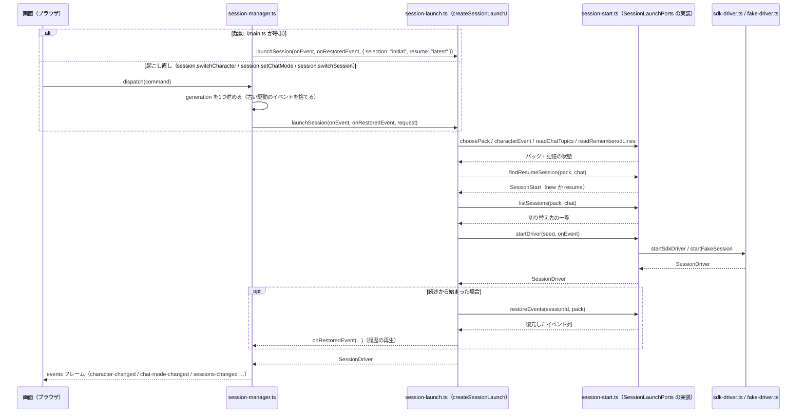

# 設計書

最終更新: 2026-09-27。ステータス: **正典**。

**このファイルの役割は、コードを1ファイル読んでも分からない構造の規則だけを持つこと**
（層と機能の辺・置き場所の基準・プロトコルの不変条件・動きの順序・安全の境界。2026-09-26
ユーザー承認）。ほかは持ち主へ返す:

| 種類                                 | 返す先                                                 |
| ------------------------------------ | ------------------------------------------------------ |
| コードの写し                         | **削除**（`docs/history/` へ移さない）                 |
| 機能の仕様                           | `docs/chat-mode.md` / `docs/requirements.md`           |
| 経緯と実測                           | `docs/history/`                                        |
| 「なぜこの形か」で残す価値があるもの | `docs/architecture.md`「設計判断（なぜ今の形なのか）」 |

**13章「画面のデザイン」は `docs/screen-design.md` へ移した**（2026-09-23。節の番号 `13.x` は
そのまま）。この設計書の中でファイル名を添えずに `13.6` のように書いた番号は、そちらの節を指す。

## このドキュメントの読み方

### このファイルは通読しない

節を1つ特定して、その節だけを次の形で読む:

```bash
sed -n '/^## 4\. shared/,/^## /p' docs/design.md
```

**このファイルには「いまどうなっているか」だけを書く**（2026-09-21 決定）。却下した案の理由・
値の根拠の実測・覆した決定の記録は `docs/history/` に置き、ここからは1行で参照する。何を残して
何を移すかの表は `docs/requirements.md`「正典に残すもの・`docs/history/` へ移すもの」。

### 節の索引

**索引の行は本文の `## <番号>.` の章と1対1**（`###` の節は載せない。章を足したり消したりしたら、
ここも同じ数だけ動かす）。**1章は欠番**（旧「何を変え、何を残すか」。2026-09-27 に撤去し、
いまも効く決定は `docs/architecture.md`「設計判断」へ、移行前後の対照表は
`docs/history/decision.md` へ移した）。

| 節                             | 中身                                                                                                                                                  |
| ------------------------------ | ----------------------------------------------------------------------------------------------------------------------------------------------------- |
| ## 2. 全体構成                 | 層（shared / server / browser）の図、依存の向き、ディレクトリ、`components/ui/` の variant 部品の作法と一覧                                           |
| ## 3. 動きの流れ               | 起動・接続・依頼・答え待ち・再接続の順序                                                                                                              |
| ## 4. shared                   | **両側が共有する契約**。イベント・状態・reducer・コマンド・フレーム・版                                                                               |
| ## 5. core と adapter          | 判断（core）と境界（adapter）の境目、SDK に触るファイルの分け方、代の持ち物、ツールで受け取るものと使い捨ての `query()` の形                          |
| ## 6. browser                  | 状態の持ち方、Markdown、重いライブラリ、立ち絵の動き（6.1 は欠番）                                                                                    |
| ## 7. キャラクターパック       | パックの形・探索順・`systemPrompt` の append の並び、画面から書くときの安全の境界、一覧と素材の URL、雑談の記憶の置き場（仕様は `docs/chat-mode.md`） |
| ## 8. セッションの復元と複数化 | 復元（4.8）を新しい形に載せる。複数セッションへ広げる余地                                                                                             |
| ## 9. 会話内容と安全           | `127.0.0.1`・Origin・起動トークン・ディスクに書く3つの例外と読み戻す口・定着・ブラウザ側のメモリ                                                      |
| ## 10. テスト                  | reducer・スキーマ・部品・**E2E（走らせ方・成果物・シナリオ）**・層の検査                                                                              |
| ## 11. ビルドと依存            | `vite build` の入口、tsconfig、**足す依存の一覧（承認済み）**                                                                                         |

## 2. 全体構成

```
┌────────────────────────────────────────────────────────────┐
│ browser（ブラウザ。React）                                  │
│   <App> ─ <Layout> ─ Main / Character / Sidebar / Dispatch  │
│   状態 = shared の SessionState（reducer は core と同じ物）   │
└──────────────▲───────────────────────────┬─────────────────┘
               │ ServerFrame                │ コマンドの手続き（oRPC）
               │  hello（snapshot）/ events  │  session.prompt / session.answer / …
               │        WebSocket 1本（127.0.0.1、起動トークン付き）
┌──────────────┴───────────────────────────▼─────────────────┐
│ server/<機能>/core（サーバ側の純粋な判断。外の世界に触らない）│
│   session/session-manager ／ session-driver/session-driver   │
│   （駆動の契約）／ session-driver/sdk-message ／ host/host      │
└──────────────▲───────────────────────────┬─────────────────┘
               │ 呼ばれる                   │ core を import する
┌──────────────┴───────────────────────────▼─────────────────┐
│ server/<機能>/adapter（外の世界に触る場所。1ファイル = 1境界）│
│   session-driver/sdk-* ・fake-driver（駆動）                  │
│   view-server/server（http）・session-socket（ws）・bundle    │
│   character-pack/character-pack ／ host/orca-host ／ …        │
│ （機能に属さない共有のものは server/core/ と server/adapter/）│
└──────────────▲───────────────────────────┬─────────────────┘
               │ SDKMessage                 │ query / interrupt / canUseTool
┌──────────────┴───────────────────────────▼─────────────────┐
│ Claude Code（SDK が起こす子プロセス）                         │
└────────────────────────────────────────────────────────────┘
      shared（語彙・イベント・状態・reducer・zod スキーマ。browser と core の両方が import する）
      辺は adapter ──▶ core ──▶ shared ◀── browser（**core → adapter は禁止**。結ぶのは src/ 直下だけ）
      サーバ側の機能どうしの辺は下の「サーバの機能と、機能どうしの辺」の表にあるものだけ
```

### 層と依存の向き

**この形は「共有コントラクト＋クライアント/サーバ分割」で、旧の4層（クリーンアーキテクチャの
写し）とは別物**。`shared` は TypeScript のモノレポでいう `packages/shared` / `contracts`
の位置（サーバとブラウザの両方が import する契約）、`browser` はクライアント、`core` と `adapter` は
サーバで、「受け取る／決める／描く」という役割の分割ではなく「どちらの実行環境で動くか」で
分けている。**サーバ側だけをもう一段、「純粋な判断（`server/core/`）」と「外の世界に触る境界
（`server/adapter/`）」に割ってある**（この形に至った比較は
`docs/research/architecture-proposal.md` / `docs/history/architecture-placement.md`）。
**2026-09-25 に、サーバ側を機能のまとまりで割ると決めた**: `core` と `adapter` の割りは
**機能の中**に置き（`server/<機能>/core/` と `server/<機能>/adapter/`）、どの機能にも属さない
共有のものだけを `server/core/` と `server/adapter/` の直下に残す（下の「サーバの機能と、
機能どうしの辺」。比べた案は `docs/history/decision.md`「design.md 2. 全体構成 / ディレクトリ
（`src/server/` を機能で割った）」）。**`core` と `adapter` という名前はどの深さでも層だけを表す。**

| 層               | 置くもの                                                                                                                                                                                                                                                                                        | import してよい先                                       | 実行場所         |
| ---------------- | ----------------------------------------------------------------------------------------------------------------------------------------------------------------------------------------------------------------------------------------------------------------------------------------------- | ------------------------------------------------------- | ---------------- |
| `shared`         | 概念の語彙・`SessionEvent`・`SessionState`・`applySessionEvent`・コマンドとフレームの zod・手続きの契約。**`SessionState` から純粋に導けるもの**も含む（ブラウザしか読まないものを含む。`main-view.ts` `turn-step.ts` `turn-speech.ts` `portrait-motion.ts` `room.ts` `command-suggestion.ts`） | `shared` のみ（`zod`・`@orpc/contract`・`remeda` は可） | サーバとブラウザ |
| `server/core`    | サーバ側の純粋な判断。セッション管理・駆動の契約・イベントの検証・ポートの決定・設定の解釈。**`server/<機能>/core/` と、共有の `server/core/`**                                                                                                                                                 | `shared` / `core`                                       | サーバ（Bun）    |
| `server/adapter` | 外の世界に触る場所。SDK・WebSocket・HTTP・ホスト・ファイル・子プロセス・fake driver。**`server/<機能>/adapter/` と、共有の `server/adapter/`**                                                                                                                                                  | `shared` / `core` / `adapter`                           | サーバ（Bun）    |
| `browser`        | React の部品・hooks・CSS・Markdown の変換                                                                                                                                                                                                                                                       | `shared`（React などの npm は可）                       | ブラウザ         |
| `src/` 直下      | 配線（composition root。`cli.ts` / `main.ts` と起動の段取り）                                                                                                                                                                                                                                   | すべて                                                  | サーバ           |

- **`core` と `browser` は互いを import しない。** 両者が知っているのは `shared` だけ
- **`core → adapter` は禁止。** 辺は `adapter ──▶ core ──▶ shared ◀── browser` の一方通行で、
  `core` と `adapter` を結ぶのは `src/` 直下の配線だけ。**機能をまたいでも同じ**で、どの機能の
  `core/` もどの機能の `adapter/` も import しない（層は機能より先に効く）。**`core` は `node:` / SDK（`@anthropic-ai/*`）/
  `ws` を import しない**ので、`core` から外の世界へ出る道は無い
- **`adapter` は1ファイル = 1つの境界。** インターフェースは切らない（実装が2つあるもの —
  駆動とホスト — だけ、契約の型を `core` に置く: `server/session-driver/core/session-driver.ts` /
  `server/host/core/host.ts`）
- **`shared` は `node:` も `document` も触らない。** これは設計上の好みではなく**物理的な制約**
  である。`shared` はサーバ（Bun/Node）とブラウザの両方の実行環境で読み込まれるので、
  片方にしか無い API（`node:fs` や `document` など）に触れた時点でもう片方で動かなくなる。
  純粋関数と型と zod スキーマだけが両方で動く共通部分
- 許した辺以外は `test/architecture.test.ts` が落とす（層の辺は上の4本。サーバ側の機能どうしの辺は
  次の節の表）

### サーバの機能と、機能どうしの辺

`src/server/` は**機能のまとまりで割り、機能の中を層（`core/` と `adapter/`）で割る**（2026-09-25
決定）。機能の名前は `docs/glossary.md` の語（単数形）で、**1つの機能 = 1つのディレクトリ**。
機能の中は `core/`（判断）と `adapter/`（境界）の2段だけで、中身の無い段は作らない。

| 機能              | 何の機能か                                                                                   | `core/`                                                                                                                                                  | `adapter/`                                                                               |
| ----------------- | -------------------------------------------------------------------------------------------- | -------------------------------------------------------------------------------------------------------------------------------------------------------- | ---------------------------------------------------------------------------------------- |
| `session/`        | セッションを持つ・起こす・頼む。**各機能の判断を束ねる**（下の「束ねる機能」）               | `session-manager` `session-launch` `event-batch` `driver-command` `command-session` `session-command`                                                    | `remembered-default`                                                                     |
| `session-driver/` | セッション駆動。契約・SDK の実装・fake driver・メッセージの変換・答え待ち・続きから始める    | `session-driver` `sdk-message` `pending-answer` `self-started-turn` `visible-output-nudge` `session-restore` `session-title` `prompt-image-shelf` `plan` | `sdk-driver` `sdk-tool` `sdk-session` `sdk-context-usage` `fake-driver` `claude-account` |
| `report/`         | レポートの記法・`report` ツール・検査と差し戻し・塊の使われ方の記録                          | `report-notation` `report-tool` `report-review` `report-violation` `report-usage`                                                                        | `report-usage-log`                                                                       |
| `system-prompt/`  | `systemPrompt` の append の組み立てと、セリフの間合いの規約                                  | `system-prompt` `speech-cadence`                                                                                                                         | —                                                                                        |
| `chat/`           | 雑談モード。作法・記憶・話しかけ・アーカイブ・要約・覚えたこと・定着                         | `chat-manner` `chat-memory-prompt` `chat-nudge` `chat-archive-entry` `chat-episode-score` `chat-consolidation` `chat-consolidation-writer` `chat-recall` | `chat-archive` `chat-summary` `persona-memory` `sdk-chat-consolidation`                  |
| `character-pack/` | キャラクターパックの選択・読み込み・画面からの編集                                           | `character-selection`                                                                                                                                    | `character-pack` `character-edit`                                                        |
| `visit/`          | 訪問。契機・来客・台本・見張り                                                               | `visit-timing` `visit-guest` `visit-script` `visit-script-writer` `visit-watch`                                                                          | `sdk-visit-script` `visit-clock`                                                         |
| `diary/`          | 日記。`diary` ツールと保存                                                                   | `diary-tool` `diary-writer`                                                                                                                              | `diary` `sdk-diary`                                                                      |
| `achievement/`    | 成果。`main` の履歴から数える                                                                | `achievement`                                                                                                                                            | `main-history`                                                                           |
| `usage-review/`   | 見直し。2つのツール・前回の結果・見送り                                                      | `usage-review-tool`                                                                                                                                      | `previous-usage-review` `usage-proposal-dismissal`                                       |
| `token-usage/`    | トークン消費の記録と集計                                                                     | `token-usage`                                                                                                                                            | `token-usage-log`                                                                        |
| `context-usage/`  | コンテキストの内訳の記録                                                                     | `context-usage`                                                                                                                                          | `context-usage-log`                                                                      |
| `host/`           | ホストのポートと Orca の実装、ホストへ渡す前の門番                                           | `host` `tracked-file`                                                                                                                                    | `orca-host`                                                                              |
| `view-server/`    | ビューサーバ。ポートの決定・http・ws・同梱の外部ライブラリ・ブラウザ側の組み立てと開発サーバ | `port-resolution`                                                                                                                                        | `server` `session-socket` `vendor-asset` `bundle` `ui-dev-server` `source-fingerprint`   |
| `repository/`     | 作業ディレクトリの git リポジトリを読む。`git` を起こす口・管理下のファイル・タスク一覧      | —                                                                                                                                                        | `git` `repository-file` `task-summary`                                                   |

**どの機能にも属さない共有のもの**は、`server/core/` と `server/adapter/` の**直下**に置く
（`core/config.ts`、`adapter/tsukumo-home.ts` `bundled-path.ts` `local-time.ts` と
`adapter/lib/json-file.ts` `jsonl.ts`）。置いてよいのは**どの機能の語彙も名乗らず、読み手が
2つ以上ある（機能・共有の箱・配線のどれでも数える）もの**だけで、読み手が1つの機能だけに
なったらその機能へ下ろす（`browser/domain/` と同じ引き金）。

**機能どうしの import の規則**:

- **層の規則が先に効く。** `core/` は、どの機能のものでも `adapter/` を import しない
- **機能 A が機能 B を import してよいのは、下の表にある組だけ。** 共有の箱はどの機能からも
  読んでよく、**共有の箱は機能を読まない**
- **層ごとに循環させない。** 機能の `core/` どうしの辺と、機能の `adapter/` どうしの辺は、それぞれ
  一方通行（表はその順に並ぶ）。**機能の単位で見ると輪が2つある**: `chat` ↔ `session-driver`
  （`session-driver/core/session-driver.ts` が雑談の書き口の型（`ChatArchive` など）を持ち、
  SDK の境界の `session-driver/adapter/` が雑談のツールの判断の `chat/core/` を読む）と、
  `view-server` → `session` → `session-driver` → `view-server`（`session-socket.ts` が
  `command-session.ts` を、`session-restore.ts` が `port-resolution.ts` を読む）。どちらも1本が
  `adapter → 別の機能の core` で、これは層の辺と同じ向きなので、ファイルの単位では輪にならない
- **束ねる機能は `session/` の1つ。** `session-manager.ts` は外の世界に触らないので `core` だが、
  各機能の判断（訪問の見張り・日記・トークン消費・雑談のアーカイブ）を読んで1つのセッションに
  まとめる。**外の世界の実装を選んで渡すのは配線（`src/` 直下の `session-start.ts` など）**、
  渡されたものを使って順序と状態を持つのが `session/`、という境目
- **Agent SDK を import してよいのは、機能の `adapter/` の直下の `sdk-` で始まるファイルだけ**
  （原則3）。1つの箱にはまとめず、**その境界が属する機能に置く**: 駆動の本体・ツール・
  セッションの一覧・コンテキストの内訳は `session-driver/adapter/`、訪問の台本を書かせる
  使い捨ての `query()` は `visit/adapter/`、日記を書かせる使い捨ての `query()` は `diary/adapter/`
- **機能を足すときは、検査の機能の一覧と下の表に足す**（知らない機能のディレクトリと、
  `core/` `adapter/` の外に置いたファイルは `test/architecture.test.ts` が落とす）

| 機能（import する側） | 読んでよい機能                                                                                  | いまある辺の層                                                                                                                                          |
| --------------------- | ----------------------------------------------------------------------------------------------- | ------------------------------------------------------------------------------------------------------------------------------------------------------- |
| `session`             | `session-driver` `chat` `visit` `diary` `token-usage` `context-usage` `character-pack` `report` | core → core だけ（`session-manager` → `report-usage`）                                                                                                  |
| `system-prompt`       | `session-driver` `chat` `report`                                                                | core → core だけ                                                                                                                                        |
| `view-server`         | `session` `achievement`                                                                         | adapter → core（`session-socket` / `rpc-guard` → `command-session`）・adapter → adapter（`server` → `main-history`）                                    |
| `chat`                | `session-driver` `character-pack`                                                               | core → core と adapter → core（駆動の契約にある雑談の型）・adapter → adapter（`persona-memory` / `chat-summary` → `character-pack` / `character-edit`） |
| `context-usage`       | `session-driver`                                                                                | core → core（駆動の契約）                                                                                                                               |
| `session-driver`      | `chat` `report` `usage-review` `view-server`                                                    | core → core（`report-review` `port-resolution`）・adapter → core（各ツールの判断）                                                                      |
| `diary`               | `character-pack` `repository` `session-driver`                                                  | adapter → adapter・adapter → core（`sdk-diary` → `session-driver/core/sdk-message.ts` の `tsukumoToolFullName`）                                        |
| `achievement`         | `repository`                                                                                    | adapter → adapter（`main-history` → `git`）                                                                                                             |
| そのほか              | —（葉。`report` `visit` `usage-review` `token-usage` `character-pack` `host` `repository`）     | —                                                                                                                                                       |

#### コマンドの受け手と手続きの置き方

**2026-09-26 に `docs/research/server-procedure-proposal.md` の段1〜3を採り、同日中に3段とも移し
終えた**（道具の比較・手本・採らなかった案はそちら）。目的は「**どのコマンドをどの機能が受け、どの
条件で断るか**」を、`session-manager.ts` の `switch` と `SessionManagerOptions` の口ではなく、契約と
機能の側の表から辿れるようにすること。**画面からのコマンドは `/ws` の上の oRPC の手続き**（`ClientCommand`
の和と `parseClientCommand` は消えた）、読み取り5本は HTTP の `/rpc` の手続き。

**辿り方**: `src/router.ts` で名前を探す → `shared/contract/<機能>.ts`（形と断る条件の `meta`）→
`<機能>/adapter/<機能>-procedure.ts`（委ね先）→ `<機能>/core/`（コマンドなら `<機能>-command.ts` の
行）。**どのコマンドでも同じ4段**。

**置くもの**

| 置くもの                                                         | 場所                                            |
| ---------------------------------------------------------------- | ----------------------------------------------- |
| 契約（形・**断る条件の `meta`**）                                | `src/shared/contract/<機能>.ts`                 |
| 契約の束（`rpcContract` / `commandContract` / `socketContract`） | `src/shared/rpc.ts`                             |
| 機能の表（コマンドだけ）                                         | `src/server/<機能>/core/<機能>-command.ts`      |
| 行の型と、葉の行を呼ぶ関数                                       | `src/server/core/command-receiver.ts`           |
| セッションの口 `CommandSession`                                  | `src/server/session/core/command-session.ts`    |
| 手続き（`implement(contract.<機能>)` の受け手）                  | `src/server/<機能>/adapter/<機能>-procedure.ts` |
| ルータ（配線）                                                   | `src/router.ts`                                 |
| 照合と断る条件のミドルウェア                                     | `src/server/view-server/adapter/rpc-guard.ts`   |

- **断る条件は契約の `meta` に書く**（行には持たない。二重に持たない）。形は
  `{ chatOnly: false | 理由, idleTurn: false | 理由 }`（`src/shared/command.ts` の `CommandMeta`）で、
  理由は `FRAME_ERROR_REASON`（`shared/frame.ts`）の値。**条件と理由を同じ所に書く**。断ったときは
  理由を添えた `REFUSED` が応答で返り、受け手は呼ばれない
- **受け手の3種**（判別可能な合併型。`kind` で分ける）:
  - `write`: 書き込み口を呼び、返った `SessionEvent` をいまの代へ流す（`undefined` なら失敗の理由で
    断る）
  - `call`: 外へ頼むだけでイベントを流さない（`boolean` で成否を返す）。`host.openFile`
  - `session`: `CommandSession` を受け取って `DispatchResult` を返す。**`session` の表にだけ書ける**
    （型が `session/core/` にあるので、葉の機能からは物理的に書けない）
- **`CommandSession` の口は4つだけ**（受け手が `SessionGeneration`・束・購読者を知らずに済む深い形）:
  `state()`（いまの姿）・`driver()`（いまの代の駆動を待つ）・`restart(request)`（起こし直し）・
  `generation()`（いまの代に固定した `emit` と `diarySignal`。長く続く受け手が起こし直しをまたいで
  混ざらないため）。`session-manager.ts` が `commandSession` として出し、`/ws` の接続が手続きの
  context（`CommandRpcContext` の `session`）に載せる。**葉の機能の手続きは同じものを
  `CommandEventSink`（`generation().emit` だけの型。`command-receiver.ts`）で受ける**ので、`session` の
  型を読まない
- **書き込み口は各機能の `ports` にある**（`SessionManagerOptions` には無い）: `editCharacter`
  `createCharacter` `deleteCharacter` `forgetRememberedLine` `rememberSessionDefault`
  `rememberVisitEnabled` `dismissUsageProposal` `openFile`、振り返りだけが使う `readAchievementDay`
  `diary`。中身を選ぶのは `src/session-start.ts` で、`createCommandRouter` へ渡す
- **束ねるのを配線に置く理由**: 表を `session/core/` で束ねると、`session` が `usage-review` と
  `host` を読む辺（いまの表に無い）が要り、`session` がまた全部を知る場所に戻る。配線なら
  **機能どうしの辺の表は増えない**。葉の機能の表と手続きが読むのは `shared` と共有の `core`
  （`command-receiver.ts`）と自分の機能だけ
- **押し出しも手続き**（購読 `frame.subscribe`。受け手は `src/server/view-server/adapter/frame-procedure.ts`）。
  ブラウザが接続ごとに1回呼び、`hello` / `events` / `refresh` のフレームが Event Iterator で届く。**`/ws` の上は
  すべて oRPC の手続きの要求と応答**で、ブラウザは接続をそのまま `RPCLink` へ渡す（振り分けない）。購読の元は
  コールバックの `subscribe`（`session-manager` の `subscribe` に `view-delivery.ts` の `refresh` を相乗りさせた
  もの）のままで、接続の context（`SocketRpcContext` の `subscribe`）に載る。受け手はそれを**取りこぼさず・
  捨てずに** async generator へ写し、手続きの `signal`（接続が切れると oRPC が中断する）で購読を外す。
  購読には照合（`rpcGuard`）だけを掛け、断る条件（`commandGuard`）は見ない。サーバに届く読めない
  メッセージは中身をどこにも出さずに捨てる
- ブラウザは `src/browser/stores/session.tsx` の `dispatch`（`commandContract` から導いた型付きの
  client）で `dispatch.session.prompt({ text, images })` のように呼ぶ。**送りっぱなしで、断られても
  画面には出さない**（画面は同じ条件で先に操作子を塞いでいる）

読み取りは `repository`・`token-usage`・`context-usage`・`achievement` の4機能の手続き（HTTP の `/rpc`）で、
`/prompt-image/<id>`（`` で読む）と静的な配信は HTTP の経路のまま。

**許す依存の辺**（`test/architecture.test.ts` が見る）:

| 辺                                    | 許す場所                                                                                                                |
| ------------------------------------- | ----------------------------------------------------------------------------------------------------------------------- |
| `shared` → 外部                       | `zod` と `@orpc/contract`（`@orpc/server`・`node:` は読まない）。手続きより前から読んでいる `remeda` も可               |
| `@orpc/server` を import してよい場所 | 機能の `adapter/`（`view-server/adapter/` を含む）と配線（`src/router.ts`）だけ。**`core` と共有の箱は禁止**            |
| `browser` → 外部                      | `@orpc/client`（`/rpc` は `@orpc/client/fetch`、`/ws` は `@orpc/client/websocket`）と `@orpc/tanstack-query`            |
| `src/router.ts`（配線）               | すべての機能の `<機能>-procedure.ts` と、口の型のための `<機能>-command.ts`。配線なので**機能どうしの辺の表は増えない** |
| 機能どうしの辺                        | 上の表のまま（受け手が別の機能の判断を要るようになったら、今と同じく表に足す）                                          |

### ディレクトリ

```
src/                          配線（composition root）。cli.ts（入口）・main.ts（起動の段取り）・
                              router.ts（全機能の手続きを束ねる）ほか、起動と接続を進める数ファイル
  types/                      どの層にも属さない ambient 宣言（import されない *.d.ts）だけを置く
  shared/                     契約・イベント・状態・reducer・zod スキーマ（両側が読む語彙。層の直下に平置き）
    contract/<機能>.ts        手続きの契約（形・断る条件の meta）
  server/
    core/ adapter/            どの機能にも属さない共有の判断・境界
    <機能>/core/ adapter/     機能の判断・境界（上の「サーバの機能と、機能どうしの辺」）
  browser/                    React の部品・hooks・CSS（下の「`src/browser/` の箱と、置く基準」）
test/                         src/<相対パス>.ts → test/<相対パス>.test.ts
characters/<name>/            character.json・persona.md・素材
```

**ファイル名は概念**（原則5）。`helpers/` と `common/` は作らない（`lib/` と `utils/` を
置く基準は下の「`lib/` と `utils/` に置く基準」）。**ディレクトリ名に単数形の縛りは無く**（2026-09-26）、
`src/browser/` の置き場所のディレクトリ（`components/`（とその下の `page/` `domain/` `ui/`）`features/`
`hooks/` `domain/` `lib/` `utils/` `stores/` `styles/` `types/` と、領域・機能の中の `hooks/` `components/`
`domain/`）は bullet-proof-react の名前をそのまま採る（`components/` の下の `page/` `domain/` `ui/` は利用者の
Next.js の雛形の名前）。`server/` の下の機能の名前（`session-driver/` `usage-review/` など）と
`main-view/` のような領域・機能の名前は用語集の語に、`components/page/` の下の画面の名前は
`stores/location-hash.ts` の `Screen` の値に合わせる。ファイル名は単数形のまま。
**手本から採るのはディレクトリの形だけ**で、kebab-case のファイル名・barrel file（`index.ts`）を
作らない・`@/` を使わない相対 import はそのまま（PascalCase・1部品1フォルダは真似しない）。
**例外は `components/ui/` と、ページの `components/`（下の「ページの形」）の2つだけ**:
語彙を持たない部品は数が増えていくので、部品ごとに
`ui/<部品>/<部品>.tsx`・`<部品>.module.css` の1フォルダへ分ける（2026-09-25 のユーザーの希望。
理由は部品と CSS の対が平たく並ぶと見づらいこと）。ページの部品も同じ理由で
`components/page/<ページ>/components/<部品>/<部品>.tsx` の1フォルダへ分ける（2026-09-26 の
ユーザーの指示）。`components/domain/` と `features/` の中は平たいまま。**barrel file は作らない
例外の中でも作らない**——`index.tsx` は置かず、import は `../ui/select/select.tsx` のように
実ファイルを直接指す（`docs/coding-standards.md`「barrel file を作らない」）。

**ページの形**（`components/page/<ページ>/`。2026-09-26 のユーザーの指示と、そのときの問答で
決めた。ページの中の分け方は下の「機能の中を分ける」と同じ語彙で、ここはその置き場所の決まり）:

```
components/page/<ページ>/
  <ページ>.tsx                   container（入口。components/app/layout.tsx が置く）。名前は Screen の値
  presentational-<ページ>.tsx    presenter（器）
  <ページ>.module.css            container / presenter と、2つ以上の部品が読む CSS（あれば）
  domain/                        そのページだけの語彙（部品でも React でもないもの）
  hooks/                         そのページだけのフック（container / presenter も読むもの）
  components/                    そのページの部品。直下はディレクトリだけ
    hooks/                       components/ の下の部品だけが読むフック（2つ以上の部品が読む）
    <部品>/                      1部品1ディレクトリ
      <部品>.tsx                 部品（割るなら container）。外から引くのはこのファイルだけ
      presentational-<部品>.tsx  割るときの presenter
      <部品>.module.css          この部品だけが読む CSS（中の子部品が読むものも含む）
      hooks/ domain/             この部品（と中の子部品）だけのフック・語彙
      components/<子部品>/       この部品だけが使う子部品。ページの components/ の直下の部品だけが持てる
      <概念>/                    下の「機能の中を分ける」の概念のディレクトリ（markdown/ など）
```

- **ページの直下に置くのは、container / presenter の対と `<ページ>.module.css`、`domain/` `hooks/`
  `components/` だけ。** 対は**ページに1対だけで、どのページも必ず対にする**（「機能の中を分ける」の
  「2種類以上そろったら割る」はページの中の部品に掛ける基準で、ページの入口には掛けない。
  ページの入口の形が決まっていれば、開く前に中の見当が付き、検査で名前を決め打ちできる）。
  container の中身がストアを読むだけなら `hooks/use-<ページ>.ts` は作らない。state か副作用を
  持つなら `hooks/use-<ページ>.ts` へ出す。**2つ目の画面**（キャラクター画面の一覧・作成・編集の
  ような、ページの中で並ぶか重なるもの）は直下に置かず、`components/<部品>/` の部品にする
  （部品が自分の container / presenter の対を持つのはよい）。ファイル名の `-screen` は付けない
  （`achievement.tsx`。部品の名前は `<ページ>.tsx` から PascalCase で `Achievement`）
- **置き場所は「読み手すべてを含む、いちばん近い箱」で機械的に決める**（部品・フック・語彙・
  CSS のどれも同じ）。数えるのは `import`（`import type` も含む）で、テストは数えない:

  | 読み手                                               | 置き場                                                                                               |
  | ---------------------------------------------------- | ---------------------------------------------------------------------------------------------------- |
  | ページの直下（対・`hooks/`・`domain/`）を1つでも含む | ページの `hooks/` / `domain/` / `components/<部品>/`（部品の置き場は下）                             |
  | `components/` の下の2つ以上の部品（直下は含まない）  | フックは `components/hooks/`、語彙はページの `domain/`、部品は `components/<部品>/`                  |
  | `components/<部品>/` の中だけ（その部品と子部品）    | その部品の中の `hooks/` / `domain/` / `components/<子部品>/`                                         |
  | 2つ以上のページ・枠                                  | ページの外（部品なら `components/domain/`、フックは `browser/hooks/`、それ以外は `browser/domain/`） |

  部品は、ページの直下か2つ以上の部品が読むならページの `components/<部品>/`、1つの部品だけが
  読むならその部品の `components/<子部品>/`。**入れ子はページの `components/` から2段まで**
  （子部品は `components/` を持たない。子部品だけが使う孫は、親の部品の `components/` に子部品と
  並べる）。CSS はファイル単位で読み手を数え、クラスごとには割らない（読み手が2つ以上の CSS は、
  読み手を含むいちばん近い部品の `<部品>.module.css` かページの `<ページ>.module.css`。概念の
  ディレクトリの CSS（`markdown/report-notation.module.css`）はその中に置いたまま外の部品も読む）

- **部品のディレクトリの外から引いてよいのは `<部品>.tsx` だけ**（中の `hooks/` `domain/`
  子部品・presenter・CSS は中からだけ読む。例外は `main.tsx` / `app.tsx` / `components/app/` とテスト）。ページの部品を画面の
  外に置くとき（書き終わりの知らせ `DiaryNotice`）は、`components/app/layout.tsx` がその `<部品>.tsx` を直に
  import する（下の「領域の機能と、置かれる機能」）
- **`components/` の直下の `hooks/` と、ページの `hooks/` の違いは読み手だけ。** container /
  presenter が読むならページの `hooks/`、部品しか読まないなら `components/hooks/`
- **中身の割り方（container / presenter / `hooks/` / `domain/` / 概念のディレクトリ）は下の
  「機能の中を分ける」のまま。** 概念のディレクトリ（`markdown/`）は部品の中にだけ置き、ページの
  直下には置かない
- テストは `test/browser/components/page/` の下にソースと同じ形で置く（`src/<相対パス>.ts` →
  `test/<相対パス>.test.ts`）
- 会話の画面は**1ページ**にする（`conversation.tsx` / `presentational-conversation.tsx`）。4つの
  領域（`main-view` / `character-view` / `chat-view` / `dispatch`）は `conversation/components/` の
  下の部品になる。`<Layout>` の差し込み口を埋めるのはページの presenter で、分担は下の
  「領域の機能と、置かれる機能」
- 検査は `test/architecture.test.ts`（`describe("components/page/ の形", …)`）。ページ・部品の
  直下が名前から作る対・CSS・`domain/`・`hooks/`・`components/`（と部品の概念のディレクトリ）だけか、
  部品のディレクトリの外から中の `<部品>.tsx` 以外を import していないかを落とす

**`src/browser/` の箱と、置く基準**（bullet-proof-react の語をそのまま使う。判断に迷ったら
「その機能しか読まないなら機能の中」が既定（領域も同じで、その領域しか読まないなら領域の中））:

| 箱                     | 置くもの                                                                                                  | import してよい先                                                                                                                   |
| ---------------------- | --------------------------------------------------------------------------------------------------------- | ----------------------------------------------------------------------------------------------------------------------------------- |
| `main.tsx` / `app.tsx` | 入口（`main.tsx` は mount だけ）と `<App>`（`app.tsx`。Provider を重ねて `<Root>` を描く）                | すべて                                                                                                                              |
| `components/app/`      | **`<Root>` と、出す画面を選ぶ `<Layout>`**。すべての画面を知る composition root                           | `components/page` / `components/domain` / `components/ui` / `features` / `hooks` / `domain` / `lib` / `utils` / `stores` / `shared` |
| `components/page/`     | **画面**。1つの画面（会話の画面は1つの領域）に閉じた部品・状態・保存                                      | `components/domain` / `components/ui` / `features` / `hooks` / `domain` / `lib` / `utils` / `stores` / `shared`                     |
| `components/domain/`   | **tsukumo の語彙を持つ部品**。直下は2つ以上の領域が読む部品、サブディレクトリは全画面で共有する枠（領域） | `components/ui` / `features` / `hooks` / `domain` / `lib` / `utils` / `stores` / `shared`                                           |
| `features/`            | **置かれる機能**（置き場所を持たず、領域に置いてもらう機能の部品・状態）                                  | `components/ui` / `hooks` / `domain` / `lib` / `utils` / `stores` / `shared`                                                        |
| `components/ui/`       | **語彙を持たない** React の部品（値と呼び先を全部受け取る）                                               | `components/ui` / `hooks` / `lib` / `utils` / `shared`                                                                              |
| `hooks/`               | **語彙を持たない** React のフック（`use-modal-dialog.ts`）                                                | `lib` / `utils` / `shared`                                                                                                          |
| `domain/`              | **画面全体の語彙**（tsukumo の語彙を名乗り、複数の領域・機能が読むもの。部品ではないもの）                | `lib` / `utils` / `shared`                                                                                                          |
| `lib/`                 | **ライブラリを包む**道具（React の部品ではないもの）                                                      | `utils` / `shared`                                                                                                                  |
| `utils/`               | **ライブラリに依存しない**汎用の道具（下の「`lib/` と `utils/` に置く基準」）                             | —（`utils` の中だけ）                                                                                                               |
| `stores/`              | **画面全体で共有する状態**の store・Context と、それを読む hook                                           | `lib` / `utils` / `shared`                                                                                                          |
| `styles/`              | **グローバルな CSS だけ**（`theme.css`。領域・機能の見た目はその中）                                      | —                                                                                                                                   |

- **部品の箱の向きは `app.tsx` → `components/app` → `components/page` → `components/domain` → `features` →
  `components/ui` の一方通行**（手本の `page` → `domain` → `ui` の上に画面を選ぶ段を足し、間に置かれる機能を挟んだ形）。
  逆向きは無い——`components/domain` は画面を知らず、`features/` は自分を置く枠も画面も知らず
  （下の「領域の機能と、置かれる機能」の「葉」）、`components/ui` は tsukumo の語彙を知らない
- **`components/domain` と `components/ui` の線は、tsukumo の語彙を持つかで引く**（`browser/domain/`
  と同じ意味の `domain`。改名しない）。`Portrait`（立ち絵）・`CharacterFace`（顔）・
  `ProtocolMismatch`（サーバとの版）は語彙を持つので `domain`、`Select`・`Button`
  は持たないので `ui`。**`components/domain` の直下の部品は `stores/` を読んでよい**（箱の表で辺を
  許す。いまは読んでいるものは無く、値と呼び先を props で受け取っている）。`components/ui` は読めない
- **`stores/` は「状態ライブラリの置き場」ではなく「画面全体で共有する状態の置き場」**
  （zustand を入れない決定は 6.2 のまま）。実体は7つあり、
  `stores/session.tsx` は `SessionState` を畳んで全領域に配り（`useSyncExternalStore` + セレクタ。
  Context で配るのは store そのもの）、`stores/main-view-turn.ts` はそこから**ターンの畳み**を
  姿ごとに1回だけ導き、`stores/turn-selection.tsx` は `location.hash` の `turn` から
  メインビューとキャラビューに同じターンの選択を配り、`stores/screen.tsx` は `location.hash` から
  **出している画面**を読む（書く口 `navigateTo` も同じ
  ファイル。13.6）。**1本の hash の書き方は `stores/location-hash.ts` だけが知る**（`screen.tsx` と
  `turn-selection.tsx` の2つがここを通して読み書きする）。`stores/question-answer.tsx` は答え待ちの質問に対する
  **答えの組み立て**を配る Context（質問の札はメインビュー、自由入力は入力欄と、読み手が
  2領域にまたがる）。`stores/question-scroll.ts` は帯の「いまの作業」の一覧の「質問へ」から
  メインビューの質問の札へスクロールしてほしいという**一回限りの合図**を配る zustand の store。**どれも
  複数の領域が読む**ので領域の中に置けず、`app.tsx` に残すと領域が
  入口を import することになる（だから箱が要る）
- **接続（`lib/socket.ts`）と再読み込み（`lib/refresh.ts`）は状態ではなく道具**なので `lib/`。
  入口の `main.tsx` と `app.tsx` は直下のまま（`src/browser/app/` を作らない理由は下の段落）
- **領域どうし・機能どうしは import しない**（唯一の例外が「領域 → 置かれる機能」の1方向。次の節）。
  またいで要るものは、**語彙を持つ部品なら `components/domain/`、フックなら `hooks/`、状態なら `stores/`、
  それ以外は tsukumo の語彙を名乗るなら `domain/`、ライブラリを包む道具なら `lib/` へ上げる**。
  上げる引き金は「2つ目の読み手が出たとき」で、
  1つの領域しか読まないものは領域の中に残す（`components/page/conversation/components/conversation-layout/domain/split.ts` がその例。
  `appearance-color.ts` は**引き金が引かれたほう**の例——3色の操作子が帯の歯車へ移って
  帯とキャラクター画面の2つが読むようになったので、`browser/domain/` へ上げた）
- **引き金は逆にも引く。** 読み手が1つの領域だけに戻ったら、その中へ**下ろす**
  （2026-09-23 決定。`browser/lib/` に溜まっていた `model-label.ts` /
  `permission-mode-label.ts` → 帯の `domain/`、`prompt-image.ts` →
  入力欄、`chart.ts` / `vendor-script.ts` → メインビューの `markdown/`）。
  **`browser/lib/` と `browser/domain/`、`components/domain/` の直下に
  「1つの領域（機能）だけが読むファイル」が無いことは `test/architecture.test.ts` が見る**
  （領域・機能が1つも読まない——`stores/` や `main.tsx` / `app.tsx` や共有の部品だけが読む `socket.ts` /
  `refresh.ts` のようなもの——は対象外）
- **`domain/` と `lib/` の線は、包んでいる技術の有無では引かない。** 引くのは
  「**ファイル名が tsukumo の語彙を名乗るか**」（下の「`lib/` と `utils/` に置く基準」の手順1）。
  `domain/appearance-color.ts` は `localStorage` と `getComputedStyle` を包むが、名前が指すのは
  **画面の色**という tsukumo の語彙なので `domain/`。逆に `lib/tool-summary.ts` は純関数だが、
  名前が指すのは Claude Code のツールという**外部システムの語彙**なので `lib/`。
  **領域・機能の中の `domain/`（その語彙）を画面全体へ1段上げたもの**が
  `browser/domain/` で、`components/` と `hooks/` が中と画面全体の2段に分かれているのと
  同じ形（2026-09-23 決定）
- **領域と機能は `app.tsx` と `stores/` の中身を「組み立てる側」として import しない。** 触れるのは
  `stores/` が公開する hook（`useSessionSelector` / `useSessionDispatch` / `useMainViewTurns` /
  `useTurnSelection`）まで
- **親が子を組む形も領域どうしの import に数える。** `<Layout>` は領域の中身を props で
  受け取るだけで他の領域を知らず、**どの画面を出すかは `components/app/layout.tsx` の `<Layout>` が選ぶ**
  （6.1・13.6）。**画面の組み立てを `components/domain/` へ移さない**（手本の `Application.tsx` にあたるものを
  そこに作ると、枠が画面を import する逆向きの辺になる。だから `page` より上の段 `components/app/` に置く）
- 検査は `test/architecture.test.ts`（領域と置かれる機能の一覧が横の辺を、箱の一覧が箱を
  またぐ縦の辺を落とす）

**採らなかった bullet-proof-react の要素**（`src/browser/app/` `api/` `config/`
`assets/` `testing/`・barrel file・`@/` の絶対 import・ESLint の
`import/no-restricted-paths`）は、**実体が無い箱を先に作らない**ため。要るようになったら足す
（1つずつの理由は `docs/history/decision.md`「design.md 2. 全体構成 / ディレクトリ（採らなかった
bullet-proof-react の要素）」）。**`utils/` は 2026-09-21 に、`hooks/` は 2026-09-22 に
採ることにした**（`browser/hooks/` の箱と、機能の中の `features/<機能>/hooks/` の両方。
下の2つの節）。**`browser/domain/` は 2026-09-23 に足した**——bullet-proof-react には無い名前だが、
機能の中で既に使っている `domain/`（その機能の語彙）と同じ語を1段上げただけで、
**実体が2つ（画面の色・演出の速さ）出てから作った**。**`components/` を `page/` `domain/` `ui/` の
3段に割ったのは 2026-09-25**（利用者の Next.js の雛形に合わせた。経緯と採らなかった案は
`docs/history/decision.md`「design.md 2. 全体構成 / ディレクトリ（`components/` を3段に割った）」）。
**2026-09-26 に、`app.tsx` から出す画面の選択（`<Root>`）を `components/app/` へ出して4段にした**
（`app.tsx` は Provider を重ねるところまで）。**`types/` は同じ日に、ambient 宣言の置き場として採った**
（実体が5つあった）。手本が空で置いている `states/` などは同じ理由で作らない。

**ファイルを移すときは、パスを指す記述が `.ts` / `.tsx` だけでなく `.module.css` のコメントにも
ある。** 洗い出す `grep -rn` の対象から `.module.css` を外さない。

### `components/ui/` の部品（variant の作法と一覧）

**語彙を持たない部品は、見た目の違いを variant（props の文字列リテラルの合併型）で表す**
（2026-09-25 決定）。各機能の `*.module.css` に手書きで散っていた見出し・文字・並べ方・ボタン・
ダイアログを、呼び出しを読めば見た目が分かる形に寄せるため。**部品が持つ見た目は `theme.css` の
トークンと、この節で決めた段だけ**で、トークンに無い値は足さない。

`components/ui/` の部品は2種類ある:

- **variant 部品**（下の一覧の5つ）: 見た目を部品が持ち、違いを variant で選ぶ
- **形だけの部品**（`Select`）: どこに置いても同じになる分だけを持ち、寸法・枠・地・字の段は
  呼び出し側が `frameClassName` / `className` で渡す。**variant を持たず、この形のまま変えない**
  （プルダウンは置き場所ごとに寸法がまるで違い、語彙にすると段が置き場所の数だけ要る）

**variant の表し方**

- **1つの prop が1つの軸**。軸が CSS の1つの property に写るもの（字の大きさ・色・太さ・間隔）は
  **値の名前をトークン名そのままにする**（`size: "secondary"` → `--font-secondary`、
  `tone: "ink-quiet"` → `--ink-quiet`）。読む人が `theme.css` と `docs/screen-design.md` 13.3 の
  語で引ける。トークンの無い軸（太さ・Stack の間隔）は下の一覧で段を決める
- **複数の property の束（ボタンの顔）は、使っている組み合わせごとに1つの値にする**
  （`variant: "outline" | "solid-accent" | …`）。軸を掛け合わせると CSS の無い組み合わせが型の上で
  選べてしまい、選ぶと**黙って素のボタンになる**
- 合併型 → class の対応表は部品のファイルに `const` で置き、
  **`satisfies Record<合併型, string | undefined>` で全域を検査する**（値を足して表の行を足し忘れると
  `tsc` が落とす）。class 名は `<部品>-<軸>-<値>`（`text-size-secondary`）
- **値 `"inherit"` は class を付けない**（親から継ぐ）
- **props はすべて必須**（`?:` を使わない。`docs/coding-standards.md`「「無いかもしれない」値」）。
  既定値を持たないので、呼び出しを読めば見た目が全部分かる。「無い」は合併型の値で表す
  （`pressed: "none"` など）
- **値を足すのは使う箇所が出たときだけ。** トークンに無い値が要るなら、先に
  `docs/screen-design.md` の段を直す（13.3「段は**この6つだけ**」がそのまま効く）

**呼び出し側からの上書き（`className`）**

- variant 部品は `className: string` を1つ受ける（足すものが無ければ `""`）
- **部品の CSS で `:where()` の外に書いた property は部品のもの**で、呼び出し側の class は同じ
  property を書かない。部品が既定として持ち、呼び出し側に譲るもの（`<p>` / `<h2>` の `margin: 0`、
  リンク風のボタンの `padding: 0`）は **`:where()` の中に書く**——詳細度が0なので、呼び出し側の
  class が CSS の読み込み順に関係なく勝つ（`select.module.css` の冒頭の「同じ強さの class の
  勝ち負けが読み込み順で決まる」を起こさない）。**`theme.css` が要素の選択子で書く property
  （フォーム部品の `font`）は `:where()` に入れない**（要素の選択子に負ける）
- 呼び出し側が渡すのは、部品が持たない property だけ: **置き方**（margin・flex・align-self・
  grid-area・幅と高さ・position）と、**語彙に無い見た目**（文字の組み——1行で切る・字間・
  行の高さ・桁揃え・書体——、ボタンとダイアログの箱）。一覧の右端の列が部品ごとの目安
- **語彙と同じ property で画面固有の値を持つもの（トークン消費の画面の `--usage-*`、日記帳の
  `--diary-gold-*`）は部品を使わず、機能の CSS のまま残す**。部品に `className` で色を上書きさせると、
  部品の語彙と画面の語彙が1つの要素の上で競る
- **`className` に渡すのは `styles["…"]` の字面だけ**（変数・props の転送をしない）。次の検査が
  class の中身を引けるようにするため
- **検査で守る**（`test/architecture.test.ts`「components/ui/ の部品の className」）。variant 部品
  （`Select` 以外の `components/ui/` の部品）について、(1) 渡す `className` の式が `styles["…"]` の
  字面（と `??`・三項・テンプレート文字列での組み合わせ）だけでできていること、(2) その class の規則
  （呼び出し側の `*.module.css` で、選択子の最後の複合にその class を含むもの。`:hover` などの
  疑似クラスも含め、`::backdrop` などの疑似要素は別の持ち物として数える）の property が、部品の
  CSS で `:where()` の外に書いた property と重ならないこと（`border` → `border-color` のような
  一括指定は個々の property に開いて比べる）を見る

**描く要素を変える口**: **汎用の `as` は持たない**（要素ごとに props の型を変える多相の型は読みにくく、
`href` のような要素固有の属性が型から外れる）。意味の上で要素を選ぶ必要がある部品だけ、閉じた
合併型の prop を持つ（下の一覧の `level` / `element`）。要素を足すのは使う箇所が出たときで、
テストの行も一緒に足す。

**`Stack` の口**（2026-09-26）: 並べる規則を部品へ寄せるのを止めていた要素・名前・ref を足した。
**`element` は閉じた合併型のまま広げる**（上の「汎用の `as` は持たない」）。名前は `aria-label` と
`aria-labelledby` を2つの `| undefined` で並べず、`Dialog` と同じ判別可能な合併型にする（両方が
付く状態は起きない）。`ref` は描いた要素を `HTMLElement` として渡す（要素ごとの型にはしない。
要素の合併型で JSX に書くと ref の型が交差になって渡せないので、部品の中は `createElement` で
描く）。**足さないもの**: `ol` / `ul` / `li` / `form` は、並べるだけの規則でそれを使う箇所が無い
（`.speech-log-entries` は間隔が 12px で段に写らず、`.speech-log-speech` は `data-age` が、
`.dispatch-form` は `onSubmit` が要る）。**`data-*` 属性とイベント（`onSubmit` など）の口は持たない**
——`Stack` が持つのは並べることだけで、選択子やふるまいの印を持つ要素（`.main-turns` の
`data-brush-origin` など）は素の要素と機能の CSS のまま残す。

**Text と Heading の境目**: **見出しの意味（`level`）と見た目（`size`）を別の props にする。**
いまの画面は level と大きさが一致しない（`.character-section-heading` は `<h2>` で本文の段、
`.achievement-card-label` は `<h3>` で印の段）ので、level から size を決めると見た目が変わる。
`Heading` は `Text` と同じ語彙（size・tone・weight）を持ち、**対応表は `ui/text/` の1つを読む**
（二重に持たない）。違いは要素が `<h1>`〜`<h4>` になることと、`margin: 0` を既定に持つことだけ。
`<h*>` でない要素に付いた「見出しに見える字」（`<summary>` の `.step-heading` など）は `Heading` に
しない。

**段に丸めない（見た目を変えない）**: 部品に置き換えても**画面の見た目は変えない**のが既定。
段に乗らない値を持つ規則は、部品にせず機能の CSS に残す——Stack の間隔が段に無いもの
（0.4rem・0.6rem・0.625rem・1.1rem など 26規則）、ボタンとダイアログの箱（高さ・余白・角丸。
`className` で渡す）。揃えて丸めるかは別の判断として持ち越す（丸めると決めたら、変わる画面を
目視で確かめる項目を付けて置き換える）。

**読み手の数は問わない**: `components/ui/` は**汎用の部品の置き場**で、置くかどうかは
**tsukumo の語彙を持たないか**だけで決める（2026-09-26 のユーザーの指示。読み手が1つの領域・機能だけでも
`ui/` に置く）。「browser/ の機能をまたぐ箱」の検査（上の「引き金は逆にも引く」）は `components/ui/` に
掛けない。使う箇所の無い variant の値は作らない。**`components/ui/` はストアを読めない**
ままで、部品は値と呼び先を全部 props で受ける（開いているかは呼び出し側の state、押したときは
`onClick` / `onClose`）。

**テストの範囲**: `test/browser/components/ui/<部品>/<部品>.test.tsx`（`select.test.tsx` と同じ形。
`@testing-library/react` で描いて DOM を見る）。守るのは **variant の値 → 付く class**（軸ごとに
すべての値。値の一覧はテストに字面で書く）・**描く要素**（`level` / `element`）・`Stack` の名前（`aria-label` / `aria-labelledby`）と `ref` に描いた要素が入ること・`"inherit"` で
class が付かないこと・`className` が足されること・**振る舞い**（押したときの呼び先・押せないときに
呼ばないこと・`aria-disabled` / `aria-pressed` / `type`、ダイアログの `open` への追随と Esc・
backdrop のクリックで `onClose` が呼ばれること・中のクリックでは呼ばれないこと）まで。
**色や寸法が効いているか（絵）は守らない**——置き換えのたびに目視で確かめる
（`docs/coding-standards.md`「DOM の構造と画面の流れは E2E、見た目は目視」）。

- **`VStack` / `HStack`**: 向きの決まった並べは `VStack`（縦）・`HStack`（横）で書き、読む人が
  props を見ずに向きを知れるようにする。どちらも `Stack` に `direction` を渡すだけの薄い部品で、
  variant の対応表と CSS は `Stack` だけが持つ。向きを値で切り替える箇所だけ `Stack` を直接使う
  （2026-09-25 ユーザー決定）
- **`Button`**: 押せないは **`aria-disabled` の1通り**にし、押されても `onClick` を呼ばない
  （フォーカスは残るので `title` の理由が読める。`screen-nav-chat-mode.tsx` が `disabled` を使わない
  理由と同じ）。hover・focus-visible・押せないとき・押されたとき（`pressed: "on"`）の見た目は顔ごとに
  部品が持つ。**押せる行・押せる文字**（タスクの ID・件数のチップ・暦の日・吹き出し・覚えたことの
  チップのように、中身そのものを押すもの）は `Button` にしない
- **`Dialog`**: `useModalDialog` の呼び出し・Esc の `close`・backdrop のクリックの読み替え
  （`event.target` が `<dialog>` 自身のときだけ）を部品が持ち、どれも `onClose` を呼ぶ。開いている
  あいだだけ描く使い方（確認）は `open` に `true` を渡す

**採らなかった部品**:

| 候補                      | 採らない理由                                                                                                                                                                                                                                                                   |
| ------------------------- | ------------------------------------------------------------------------------------------------------------------------------------------------------------------------------------------------------------------------------------------------------------------------------ |
| Badge / Chip              | 札は6つで、面が重なるのは accent の塗りの3つだけ、箱（ピル・0.5rem・0.3rem・位置指定）は全部違う。部品にしても箱を全部 `className` で渡すことになり、読むときに開くファイルが減らない。レポートの印（`.report-badge-*`）は Markdown が生む HTML に当たる規則で、部品の外にある |
| Disclosure（`<details>`） | 3領域6箇所。`<details>` が開閉を持っていて部品が持つ振る舞いが無く、`<summary>` の見た目は字の段と色だけ                                                                                                                                                                       |
| Card / Surface            | 地の段（`--surface` / `--surface-raised`）を持つ箱は、余白・角丸・枠の値が箱ごとに違う。段に丸めない（上の「段に丸めない」）かぎり、部品にしても値を全部 `className` で渡すことになる                                                                                          |

### 領域の機能と、置かれる機能

画面を組み立てる部品のまとまりは3種類ある（2026-09-22 決定。2026-09-25 に領域を `features/` から
`components/domain/` と `components/page/` へ移し、`features/` には置かれる機能だけを残した。
2026-09-26 に会話の画面を1ページにし、領域を「枠」と「画面」に分けた）。**まとまりどうしの辺は
「枠・画面 → 置かれる機能」と「画面 → 枠」だけ**を許し、それ以外は落とす。

| 種類                       | どういうものか                                                       | 置き場                    | 辺                                                                                                         | いまの中身                                                   |
| -------------------------- | -------------------------------------------------------------------- | ------------------------- | ---------------------------------------------------------------------------------------------------------- | ------------------------------------------------------------ |
| **枠**（frame）            | 全画面で共有する枠。差し込み口は props で受け、画面を知らない        | `components/domain/<枠>/` | 画面と `<Layout>` から import してよい。**枠どうしは import しない**                                       | `screen-nav` / `sidebar`                                     |
| **画面**（screen）         | 1つの画面 = 1つのページ。**どの画面を出すかを決めるのは `<Layout>`** | `components/page/<画面>/` | `<Layout>` だけが import する。**画面どうしは import しない**                                              | `conversation` / `character` / `token-usage` / `achievement` |
| **置かれる機能**（placed） | 自分の置き場所を持たず、枠か画面の中に置いてもらう                   | `features/<機能>/`        | 枠・画面から import してよい。**自分はどの機能も、枠・画面も、`components/domain` も import しない（葉）** | `task-board`                                                 |

- **枠・画面の単位は表の置き場のディレクトリ1つ。** 会話の画面は4つの領域（メインビュー・キャラビュー・
  雑談ビュー・入力欄）を持つが、4つはまとまりではなくページの部品（`conversation/components/<領域>/`）で、
  置き場所はページの中の決まり（上の「ページの形」の「読み手すべてを含む、いちばん近い箱」）に従う
- **`components/domain/` の直下のファイルは領域ではなく共有の部品**（2つ以上の領域が読む）。
  サブディレクトリ（枠）と直下のファイルで種類が分かれるので、**直下にサブディレクトリを足すときは
  枠として一覧に載せる**（載せ忘れは検査が `throw` する）
- **どの画面にも出るが、1つの画面と語彙を共有するものは、その画面の中に置く。** 書き終わりの知らせ
  （`components/page/achievement/components/diary-notice/diary-notice.tsx`）は成果の画面の見開きを
  開く合図（`hooks/use-diary-book-open-request.ts`）と鈴の絵
  （`components/lantern-calendar/lantern-calendar.tsx` の `Bell`）を画面と共有するので、
  切り離すと領域どうしの辺ができる。どこに出すかは `<Root>` が決める（`<ScreenNav>` と同じ位置）
- **「置かれる機能」にするのは、中身が領域の持ち物でなくなったとき。** `task-board` は
  サイドバーの区画に置く一覧（`task-list.tsx`）と、サイドバーの領域には収まらない画面いっぱいの
  `<dialog>`（`task-board.tsx`）の対で、どちらもサイドバーの語彙ではなく**タスクの語彙**で
  書かれている。CSS も同じ語彙を共有する1枚（`task-board.module.css`）にまとまる
- **区画ひとまとまりは領域の側に置く。** 「そこに何を置くか」は領域が知るべきことなので、
  枠・見出しの文言・押せる口・購読・state を1ファイルにまとめて領域の中に置き
  （`components/domain/sidebar/task-section.tsx`）、**置かれる機能からは「何を描くか」だけを import する**
  （`TaskList` と `TaskBoard`）。辺の向きが「領域 → 置かれる機能」なので、`<Root>` で
  組み合わせる必要はない（`<Sidebar />` のまま）
- **購読と state は、置いた側の区画が持つ**（`task-section.tsx` の `tasks` と `boardOpen`）。
  `<Root>` へ上げると購読が木の頂点に移り、タスクが変わるたびに全領域が描き直される。
  区画の中に置けば、描き直しはその区画で止まる
- **置かれる機能の側は、置き場所を知らないまま書く。** `task-board/` は「サイドバー」も
  「区画」も名乗らず、タスクの語彙だけで書く（別の領域から同じものを置けるのはこのため）
- **`components/ui/` とは別物。** `components/ui/` は**語彙を持たない**部品（値と呼び先を全部
  受け取る）で、「置かれる機能」は機能の語彙を名乗ったまま置き場所だけを借りる
- **会話の画面は1ページ**（2026-09-26 決定）。会話の4領域は領域ではなくページの部品
  （`conversation/components/<領域>/`）で、そのぶん**辺を1本足した: 画面 → 枠**
  （`components/page/<画面>` → `components/domain/<枠>`。枠は画面を import しない）。
  画面どうし・枠どうしは import せず、許す辺は「枠・画面 → 置かれる機能」と「画面 → 枠」の2つ
- 読み手が会話の画面の1つに戻ったものは、上げる引き金の逆で下ろす
  （例: `components/ui/image-zoom/` → `prompt-image/components/image-zoom/`）
- 検査は `test/architecture.test.ts` の枠・画面・置かれる機能の一覧。**どれにも無いディレクトリが
  `features/` と `components/domain/` の直下、`components/page/` の下にあれば落ちる**（`chat-view` と
  `token-usage` は 2026-09-22 まで領域の一覧に無く、import が
  黙って検査されていなかった。両方を領域として載せ、載せ忘れは `throw` にした）

### 機能の中を分ける（container / presenter と `hooks/`）

**この節の「機能」は、枠（`components/domain/<枠>/`）・画面（`components/page/<画面>/`）と
置かれる機能（`features/<機能>/`）のすべてを指す**
（2026-09-25 に領域を `components/` へ移したが、中の分け方は置き場所によらず同じ）。
**ページ（`components/page/<ページ>/`）では、この節の割り方をページの中の部品
（`components/<部品>/`）に1つずつ掛ける。** ページの入口だけは「2種類以上そろったら割る」に
よらず、いつも container / presenter の対にする。フック・語彙・子部品をどのディレクトリに
置くかは、この節の「機能の直下」を「読み手すべてを含む、いちばん近い箱」に読み替える
（上の「ディレクトリ」の「ページの形」。2026-09-26 決定）。会話の画面の
4つの領域はこの節の「機能」ではなくページの部品。1つの機能に container が複数ある形
（`dispatch` の `composer` / `pending-answer` / `turn-status`）は、それぞれが子部品のディレクトリに
分かれて自分の対を持ち、`main-view/markdown/` は部品の中の概念のディレクトリのまま残る。

**割るかどうかは、部品が抱えている「振る舞いの種類」の数で決める**（2026-09-23 決定。それまでは
「フックが0本のときだけ割らない」と書いていて、ストアのセレクタを1本読むだけの部品まで3つに
割る形になっていた）。**行数もフックの本数も数えない。** 数えるのは次の3つ:

| 種類                   | どういうものか                                                                       | 例                                                        |
| ---------------------- | ------------------------------------------------------------------------------------ | --------------------------------------------------------- |
| **保つ**（state）      | `useState` / `useRef` で持ち、イベントで遷移する                                     | 開いているか・下書き・選んだ位置                          |
| **外と同期**（副作用） | `useEffect`・タイマー・`<dialog>` の DOM・取得（`useQuery`）・DOM の出来事の読み替え | 1秒ごとの刻み・`showModal()`・`git ls-files` の一覧の取得 |
| **畳む**（算出）       | 受け取った値を**画面に出す形**へ変える                                               | 経過秒 → 「1分05秒」・並びの反転・候補の絞り込み          |

**ストアを読むだけは数えない。** `useSessionSelector` / `useSessionDispatch` / `useTurnRunning` /
`useQuestionAnswer` は「props で降ろす代わりに自分で読む」だけで、読む場所が変わっても部品の
中身は増えない（降ろす道が遠いときに読むためのもの。6.2）。**これしか無い部品はフックが何本
あっても1ファイルのまま**（`sidebar/session-info.tsx` / `profile-card.tsx` /
`recent-topic-section.tsx` / `sidebar.tsx` / `character-switch.tsx`）。

**2種類以上そろったら割り、1種類までは1ファイルのままにする。** 1種類のあいだは、その部品の
中身がまだ「1つのこと」で説明が付く（`sidebar/session-switch.tsx` は**選択肢のラベルの作り方**
だけ、`sidebar/task-section.tsx` は**何を開いているか**だけ）。2種類そろうと、片方を読むために
もう片方を読み飛ばすことになる。

**割り方は「余分な種類を外へ出す」方向で決める。3つに割るのが唯一の形ではない**（2026-09-23 決定）:

| 抱えているもの                                         | 割り方                                                                | 例                                                                                        |
| ------------------------------------------------------ | --------------------------------------------------------------------- | ----------------------------------------------------------------------------------------- |
| 3種類そろっている（見た目もロジックも重い）            | container / `hooks/use-<名前>.ts` / `presentational-<名前>.tsx` の3つ | `task-board` / `chat-view` / `dispatch/turn-status.tsx` / `character-view/speech-log.tsx` |
| **外の世界に触るフックだけ**が余分                     | そのフックだけを `hooks/use-<概念>.ts` へ出し、残りは1ファイルのまま  | `main-view.tsx` → `main-view/hooks/use-active-turn-scroll.ts`                             |
| **純関数だけ**が余分で、**フックを呼ばない相手**が読む | `domain/<概念>.ts` へ出す                                             | `task-board/domain/task-status.ts`                                                        |

3つに割るときの分担（2026-09-22 決定。それまでは `hooks/` を「採らない」と書いていた）:

| ファイル                    | 持つもの                                                                          | 持たないもの                       |
| --------------------------- | --------------------------------------------------------------------------------- | ---------------------------------- |
| `<名前>.tsx`（container）   | フックを呼び、**戻り値を展開して渡す**（presenter の Props はフックの戻り値の型） | JSX の中身・算出・条件分岐         |
| `hooks/use-<名前>.ts`       | state・副作用・イベントの読み替え。**画面に出す形の値と呼び先を返す**             | JSX                                |
| `presentational-<名前>.tsx` | 器だけ。受け取ったものを `components/` に渡す                                     | **フックを1つも持たない**・算出    |
| `components/*.tsx`          | 部品ひとつずつ。class を付けて値を置く                                            | 算出・判定（**畳んだ値で受ける**） |
| `domain/*.ts`               | **フックに入れられない**機能固有の語彙（対応表・文言）                            | JSX・フック・React                 |

`task-board` がその1件目（2026-09-22 決定。`features/task-board/` の中に
`task-board.tsx`（container）・`presentational-task-board.tsx`（presenter）・
`hooks/use-task-board.ts`・`components/*.tsx`・`domain/*.ts` を並べた形）。

- **部品に算出を残さない。** フックが畳んでから渡し、部品に残ってよいのは**class を選ぶ分岐だけ**
- **純関数でも、まず `hooks/use-<名前>.ts` に入らないかを見る**（2026-09-22 ユーザーの選択）。
  呼ぶのがそのフック1つなら、機能直下に `*.ts` を増やさずフックの下に関数として置く。
  **`components/` は型だけを `import type` で引く**
- **`domain/` を切るのは、フックに入れないほうが良いもののうち、その機能固有の語彙で
  名乗れるものだけ。** 入れないほうが良いのは、**フックを呼ばない相手が読む**とき
  （`task-board/domain/task-status.ts` は表の行（フックを呼ばない部品）が読む）。フックに置くと、
  フックを使わない側が `use-*.ts` を import することになる
- **`components/` は機能の中の部品**で、`browser/components/` の4段とは
  別物。**語彙を持たない汎用の部品は、読み手が1つでも `components/ui/` に置く。** 語彙を持つ部品は、
  読み手が2つの機能にまたがったら `components/domain/` の直下へ上げる
- **`presentational-` の接頭辞は、この形のときだけ付けてよい**（`CLAUDE.md` 原則5 の
  「置き場所を名前にしたファイルは作らない」の例外）。**container と1対1で対になっている**
  ことがファイル名で分かるほうが追いやすいため。逆に、対になっていない部品に付けない
- **フックと presenter の名前は、機能名ではなく container の名前に合わせる**
  （`use-<container>.ts` / `presentational-<container>.tsx`。2026-09-23 決定）。**1つの機能に
  container はいくつあってもよく**（`dispatch` の `composer` / `pending-answer` / `turn-status` など）、
  機能名で名乗ると対が分からなくなる。**1ファイル1フック**
- **機能の中の `hooks/` に置くのは、その機能だけが読むフック。** 読み手が2つになったら
  **`browser/hooks/` へ上げる**（機能の語彙を持たないものだけが上がる）。**container と対になっていない
  フック**（外の世界に触るぶんだけを出したもの）も同じ `hooks/` に置き、名前は container ではなく
  **その概念**にする。読み手が2つになったらこちらも上げる（ページの部品なら「ページの形」の
  `components/hooks/`）
- **フックでない純関数は `hooks/` に置かない。** 機能の直下に概念の名前で置く。
  **ページの部品は「ページの形」の直下の形が決め打ちなので、概念の名前のファイルも `domain/` の下**
- **描き直しを止める `memo` は presenter 側に残す**（container はフックのぶん毎回描き直されるので、
  そこに `memo` を置いても効かない）

**機能の中に、概念の名前のサブディレクトリを置いてよい**（2026-09-23 決定。`markdown/` が先に
この形で、`reveal/` が2件目）。`hooks/` `components/` `domain/` が**置き場所**を名乗るのに対し、
こちらは**その機能の中の概念**を名乗る（原則5）。**条件は3つで、そろったときだけ切る**:

1. **ファイルが3つ以上**あり、**その概念だけで閉じている**こと（機能の中の他の部品が触るのは
   入口の1つか2つで、残りは中どうしでしか読まない）
2. **`hooks/` `components/` `domain/` のどれか1つに収まらない**こと。収まるならそちらへ置く
3. **名前がその機能の中の概念**（用語集の語か、それに準ずるもの）であること

**そろったら、`hooks/` `components/` `domain/` より概念のディレクトリを優先する。** 概念を
追うのに開くディレクトリが1つで済む。**中では接頭辞を落とす**（`markdown/split-blocks.ts` のように）。

| ディレクトリ          | 中身                                   | 外から呼ぶ入口                   |
| --------------------- | -------------------------------------- | -------------------------------- |
| `main-view/markdown/` | unified の設定・記法の部品・塊の切り方 | `Markdown` / `splitReportBlocks` |

- **その概念のフックもこの中に置く。** 概念のディレクトリを切ったなら、その機能だけが読むフックも
  そちらへ入れる（`hooks/` に残すと、演出を追うのに2つのディレクトリを開く）
- **概念ディレクトリそのものが2つ目の読み手を得たときも、いつもどおり上げる**——`main-view/reveal/`
  （レポートを筆で書き上げる演出）は成果の画面も再利用することになり、`browser/domain/reveal/` へ
  ディレクトリごと引き上げた（2026-09-25）。条件（3ファイル以上・概念だけで閉じている・
  `hooks/`/`components/`/`domain/` のどれか1つに収まらない）は機能の中で切るときと同じ

**`components/` とストア**: **機能の中の `components/` はストアを読んでよい**（2026-09-23 決定。
`components/ui/` は読めない——箱の表で `stores/` を引く辺が無い）。**条件は2つ**で、
両方そろったときだけ:

1. **props で降ろす道に `memo` か、その事情を知らない部品が挟まっている**こと。
   `components/task-run-confirm.tsx` がこれで、開くまでの道
   （`PresentationalTaskBoard` → `TaskTable`（`memo`）→ `TaskRow` → `TaskRunButton`）に
   「タスクを実行する口の都合」を知らない部品が並ぶ。降ろすと `memo` の前提が崩れ、
   **黙って描き直しが増える**（`board-close.tsx` が context を使うのと同じ理由）
2. **読んだ値で分けるのは class と文面だけ**であること。`task-run-confirm.tsx` は
   `useTurnRunning()` で文面とボタンを出し分けるだけで、畳み込みは持たない

どちらかを満たさないなら、ストアを読む側を**機能の直下（container）へ出す**。

### `lib/` と `utils/` に置く基準

**どの層の中にも `lib/` と `utils/` を作ってよい**（2026-09-21 決定。それまでは「作らない」と
明記していた）。層（`shared` / `server/core` / `server/adapter` / `browser`）が表すのは
**どの実行環境の話か**で、`lib/` と `utils/` はその**層の中**で「tsukumo の語彙を名乗らない道具」を
2つに分ける箱。**層をまたぐ import の可否は変わらない**（上の「層と依存の向き」の表がそのまま
効く。`lib/` に入れても `core → adapter` は禁止のまま）。

**判定は、ファイル名が指している概念1つで決める**（原則5「ファイル名が概念になっているか」の
続き）。手順は2つで、手順1で箱に入ると決まったものだけが手順2に進む。

**手順1 — そもそも箱に入れるか**

- ファイル名が指すのが **tsukumo の語彙**（`docs/glossary.md` に載る語。セッション・ターン・
  立ち絵・表情・キャラクターパック・フレーム・覆い…）なら、`lib/` にも `utils/` にも置かない。
  置き場は層で分かれる: `shared` は**層の直下に平置き**、サーバ側は**機能の `core/` か `adapter/` の
  直下**（どの機能にも属さないものだけ共有の `server/core/` `server/adapter/` の直下。上の
  「サーバの機能と、機能どうしの辺」）、
  `browser` は **`browser/domain/`**（直下に置くと入口の `main.tsx` と並ぶうえ、機能は入口を
  import できないため。上の箱の表）
- 領域（`src/browser/components/domain/<枠>/`・`components/page/`）と `src/browser/features/` の中のものは、
  **その領域（機能）しか読まないならその中に残す**
  （上げる引き金は「2つ目の読み手が出たとき」。`components/page/conversation/components/conversation-layout/domain/split.ts` と
  `components/page/conversation/components/main-view/markdown/split-blocks.ts` がその例で、名前が形式（Markdown）を指していても
  読み手が1つなので機能の中）

**手順2 — `lib/` か `utils/` か**

| ファイル名が指しているもの                                                             | 箱       | 例                                                                               |
| -------------------------------------------------------------------------------------- | -------- | -------------------------------------------------------------------------------- |
| **ライブラリを包む道具**（外部パッケージ・実行環境の API・外部システムとファイル形式） | `lib/`   | `browser/lib/socket.ts`（WebSocket）・`browser/lib/data-url.ts`（`FileReader`）  |
| **ライブラリに依存しない汎用の道具**（言語の標準だけで書けるもの）                     | `utils/` | `browser/utils/clock.ts`（`Temporal`）・`retry.ts` / `partition.ts` / `clamp.ts` |

**線は「言語の標準か、その外か」に引く。** ここでの「ライブラリ」は**言語の外から来るもの**
すべて — 外部パッケージ（React・remeda・Chart.js・Agent SDK）、実行環境の API（DOM・WebSocket・
`FileReader`・`canvas`・`matchMedia`・`node:fs`）、外部システムとファイル形式（`git`・Claude Code の
ツール・data URL）。言語の標準は ECMAScript の組み込み（`Math`・`Array`・`Temporal` など）。
実行環境の API（ブラウザの WebSocket・`FileReader`、Node の `node:fs`）はパッケージではないが、
**その実行環境でしか動かない**点でライブラリと同じ側に置く（`utils/` の歯止め3「別のプロジェクトへそのままコピーして意味が通る」を満たさない）。
`Temporal` は言語の標準の組み込みなので、使っていても `utils/` に置ける。

**「複数箇所から呼ばれる」は `lib/` にも `utils/` にも置く理由にならない**（helm-yadokari の原則2と
同じ）。読み手が2つになったら箱へ**上げる**が、上げた先がどちらかは上の表だけで決める。
`browser/lib/debounce.ts` は**手法の名前**だが React の hook（`useEffect` / `useRef`）なので
`lib/` 側、というのが境目の例。

**`utils/` を「どこにも属さない小物」の受け皿にしないための歯止め**（3つとも満たすものだけ置ける）:

1. **import が同じ `utils/` の中だけ**であること。外部パッケージ・`node:` プレフィックス・
   `shared/` の型のどれか1つでも引いたら、その時点で `utils/` ではない
   （技術を引いたなら `lib/`、`shared/` の型を引いたなら層の直下）
2. **ファイル名が動詞か、名前の付いた手法**であること。`string.ts` `object.ts` `format.ts` の
   ような**型・種類の名前**と、`misc.ts` は置けない
3. **別のプロジェクトへ1文字も変えずにコピーして意味が通る**こと

**`helpers/` と `common/` は引き続き作らない。**「助ける」「共通」は上のような判定の問いを1つも
持たず、何を置いてよいかが決まらないため（`lib/` と `utils/` は表の1行で判定できるから許した）。
**ファイル名としての `utils.ts` / `helpers.ts` / `common.ts` も引き続き作らない** — 許したのは
**ディレクトリの名前**だけで、ファイル名は概念のまま（原則5）。

**層ごとの読み方**:

- 機能の `adapter/`（と共有の `server/adapter/`）の直下は**1ファイル = 1つの境界**
  （`host/adapter/orca-host.ts` / `repository/adapter/repository-file.ts`）。
  **例外は Agent SDK の1つだけ**で、1つの境界を `sdk-` で始まる数ファイルに分けてある（理由は
  `docs/architecture.md` 原則3。置く機能は上の「サーバの機能と、機能どうしの辺」）。
  `adapter/lib/` はその下の段で、**境界を名乗らず、技術の扱い方だけを知っている道具**
  （「JSONL を1行ずつ読む」「`~` を展開する」）が入る。`adapter` にあるから `lib/` になるのではなく、
  **ファイル名が tsukumo の境界を名乗るかどうか**で分かれる。**読み手が1つの機能だけなら
  その機能の `adapter/lib/`、2つ以上なら共有の `server/adapter/lib/`**（いまの `json-file.ts` と
  `jsonl.ts` はどちらも3つの機能が読むので共有）
- `core/`（機能の中も共有も）は外の世界に触れないので、`core/lib/` に入れてよいのは **`node:` を要求しない
  技術**（zod の扱いなど）だけ。`core` の小物はたいてい `core/utils/` 側になる
- `shared/` の `lib/` は**両方の実行環境で動く技術**だけ（`node:` も `document` も触らない）
- **`src/browser/utils/` の辺は `test/architecture.test.ts` が見る**（`BROWSER_BOXES` と
  `ALLOWED_BROWSER_BOX_IMPORTS` が箱をまたぐ辺を、「browser/utils/ の import」が歯止め1
  ——外部パッケージ・`shared/` を含めて `utils/` の外を引いたら落ちる——を検査する）。
  他の層に `utils/` を作るときも、同じ検査を足す

**いまのファイルの行き先（例）**: `browser/lib/socket.ts`（WebSocket。名前が言語の外を指す）は手順2で
`lib/` に、`browser/domain/appearance-color.ts`（画面の色）は手順1で tsukumo の語彙として `lib/` から
外れる。`utils/` にあるのは `browser/utils/clock.ts` の1件だけ（歯止めの3つを満たす）。**ライブラリに
依存しない小物は、`utils/` を作る前に remeda（11章）にあるかを見る**（2026-09-22 決定。8ファイルに
書き写していた `isRecord` は `core/utils/` を作らず remeda の `isPlainObject` へ寄せた）。
**実体が無い箱は先に作らない**ので、ほかの層の `utils/` は最初の1件が出たときに作る。

## 3. 動きの流れ

### 起動

1. `cli.ts` が `config.ts` で環境変数を読み、`main.ts` の `run(config, launch)` を呼ぶ
   （ポート・キャラクター・自動オープン・駆動の種類・新規起動。`launch` は引数の `--dev`）
2. `main.ts` が**即時終了する前提**を3つ確かめる — ポート番号として読めるか（`port-resolution.ts`）、
   `bundle.ts` の `readUiBundle` が**組み立て済みの成果物**（`dist/browser/` のスクリプトと CSS の
   1組。束ねるのは事前の `bun run build`）を読めるか（無ければ前提不足で即時終了。ソース
   （`src/browser/` / `src/shared/`）のほうが新しければ、止めずに1行知らせる）、fake driver なら
   疑似セッションを読めるか
3. `current-character.ts` が `character-pack.ts` で一覧を引き、既定のパック（または指定されたもの・
   覚えていたもの）を初期パックに決める。**以降このパックの持ち回りはここに閉じる**
4. `view-delivery.ts` が**起動トークン**を1つ作り、`server.ts` を `127.0.0.1` で listen させる
   （`--dev` のときは Vite の開発サーバもここで差し込む。11章「作り直しを押す仕組み」）
5. `session-start.ts` が `session-manager.ts` にセッションを1つ作る。駆動は `TSUKUMO_DRIVER` が
   `fake` なら fake driver、それ以外は SDK。復元（8章）はここで判定する。起こしたセッションは
   `view-delivery.ts` の `connect` で `/ws` に繋ぐ
6. ホストのポートで `http://127.0.0.1:<port>/?t=<token>` を開く（失敗しても続行）

**起こし直し**（`session.switchCharacter` / `session.setChatMode` / `session.switchSession`）も、駆動を起こす一続き
（`core/session-launch.ts` の `createSessionLaunch`）は起動時とまったく同じものを通る。違うのは
`session-manager.ts` が `generation` を1つ進めて古い駆動のイベントを捨ててから同じ一続きを
もう一度呼ぶ、という外側だけ（8章）。


```mermaid
sequenceDiagram
    participant Client as 画面（ブラウザ）
    participant Manager as session-manager.ts
    participant Launch as session-launch.ts（createSessionLaunch）
    participant Wiring as session-start.ts（SessionLaunchPorts の実装）
    participant Driver as sdk-driver.ts / fake-driver.ts

    alt 起動（main.ts が呼ぶ）
        Manager->>Launch: launchSession(onEvent, onRestoredEvent, { selection: "initial", resume: "latest" })
    else 起こし直し（session.switchCharacter / session.setChatMode / session.switchSession）
        Client->>Manager: dispatch(command)
        Manager->>Manager: generation を1つ進める（古い駆動のイベントを捨てる）
        Manager->>Launch: launchSession(onEvent, onRestoredEvent, request)
    end
    Launch->>Wiring: choosePack / characterEvent / readChatTopics / readRememberedLines
    Wiring-->>Launch: パック・記憶の状態
    Launch->>Wiring: findResumeSession(pack, chat)
    Wiring-->>Launch: SessionStart（new か resume）
    Launch->>Wiring: listSessions(pack, chat)
    Wiring-->>Launch: 切り替え先の一覧
    Launch->>Wiring: startDriver(seed, onEvent)
    Wiring->>Driver: startSdkDriver / startFakeSession
    Driver-->>Wiring: SessionDriver
    Wiring-->>Launch: SessionDriver
    opt 続きから始まった場合
        Launch->>Wiring: restoreEvents(sessionId, pack)
        Wiring-->>Launch: 復元したイベント列
        Launch-->>Manager: onRestoredEvent(...)（履歴の再生）
    end
    Launch-->>Manager: SessionDriver
    Manager-->>Client: events フレーム（character-changed / chat-mode-changed / sessions-changed …）
```

### 接続

1. ページが `/assets/ui.js` を読み、`<App>` が `/ws?t=<token>` へ接続して、購読の手続き
   `frame.subscribe` を呼ぶ
2. サーバは upgrade の前に Origin とトークンを確かめ、購読の最初に **`hello` フレーム**
   （`PROTOCOL_VERSION`・`SessionState` の snapshot・キャラクターの見せ方）を1つ流す
3. 以降、セッションで起きたイベントを **50〜100ms ごとにまとめた `events` フレーム**で押す。
   ブラウザは同じ `applySessionEvent` で畳む。**サーバとブラウザの `SessionState` は構造的に同じ**

### 依頼

1. Composer が手続き `session.prompt({ text, images })` を `/ws` の上で呼ぶ
2. サーバは契約の zod で検証し、断る条件（`meta`）を見てから `session` の行 → 駆動の `prompt(text)`。
   駆動が `request` イベントを起こし、それが `events` で戻ってくる（**ブラウザはローカルで
   echo しない**。ターンの開始はサーバのイベントで知る）
3. 断片（`partial-utterance`）は1バッチ内で連結して1件にする（転送量の抑制。畳み込みの結果は同じ）
4. 受け付けられないとき（検証に落ちた・断る条件に当たった・駆動が失敗を返した）は手続きの応答が
   エラーになる（断ったときは契約の `REFUSED` と定型文の理由）。**依頼の文面を含めない**

### 答え待ち

1. `canUseTool` → `pending-answer.ts` の列 → `pending-changed` イベント → 状態の `pending`
2. PendingAnswer 部品が `pending[0]` を描く。押されたら `session.answer({ id, answer })`
3. 列が解決 → `pending-changed` → 箱が消える。解決済みの id への回答は `REFUSED`（いまの 409 と同じ）

### 再接続

WebSocket が切れたらブラウザは指数バックオフで繋ぎ直し、購読し直して、**新しい `hello` の snapshot で状態を
置き換える**（差分の取りこぼしを気にしない。`lastEventId` での再開は使わない）。購読が終わった・投げた
ときも接続を閉じて同じ道で繋ぎ直す。プロセスが落ちている間は「接続が切れている」印を
Layout に出す。復帰したときにセッションを続きから起こし直す話は 8章。

## 4. shared

**zod を使うのは境界の書き込み側と封筒だけ**（2026-09-13 決定）。
コマンドの契約の入力（`src/shared/contract/<機能>.ts`）は**全部 zod が正典**（ブラウザから届く書き込みの
経路なので厳密に見る。`text` の上限もここ）。`ServerFrame` は**封筒（`type` / `protocolVersion`）だけ** zod で、中身
（`state` / `events`）は検証しない。**`SessionEvent` と `SessionState` は zod にしない**（TS の型のまま。
状態にフィールドを1つ足すたびにスキーマを二重に直す手間のほうが効いてくるため）。
境界（WebSocket の両端）で1回だけ検証し、中では検証済みの型を使う。`shared` の中に `node:` も
`document` も持ち込まない。

### 4.1 SessionEvent

`SessionEvent` の一覧とフィールド、各イベントの出どころは `src/shared/session-event.ts` の型定義
（`kind` ごとの doc コメント）を正典とする。ここに残すのは、コードから読み取れない決定だけ。

**`state.model` の出どころは `session-info`（`init`）だけではない**（2026-09-17）。`init` は
ターンの頭に届くので、`/model haiku` を送ったそのターンの `init` はまだ古いモデルを返し、
正しい値が載るのは**次の依頼の** `init` から。そこで `assistant` に乗る `local_command_run:
{ command: "model", args }` を先回りで見て、`args` が `MODEL_ALIASES`（4.3）と完全一致する
ときだけ `state.model` を更新する（一致しなければ何もせず、次の `init` を待つだけにする。
知らない値でサイドバーを誤った値に倒さないため）。

**サイドバーの `<select>` から `session.setModel` を送ったときも同じ `model-changed` を使う**
（2026-09-17）。`src/server/session-driver/adapter/sdk-driver.ts` の `setModel` が `session.setModel()` の確定を
待ってから出す（駆動を経ているので、これは「ブラウザ側のローカル echo」の禁止（3章「依頼」）
には当たらない）。本物の駆動は当初これを出しておらず、選んだ直後に次のイベントで古いモデルへ
巻き戻って見えていた。fake driver は最初から出していたので、テストでは気づけなかった。

**`local_command_run` は SDK 0.3.274 で入った**（0.3.268 には無い。2026-09-17 に両方で実測）。
古い SDK では `assistant` に `local_command_source`（英語の文面だけ）と `result` の
`local_command`（コマンド名だけで引数を持たない）しか来ず、**どちらからもモデル名を構造的に
取り出せない**。`package.json` の下限をこれより下げると、この経路は黙って効かなくなる
（`init` を待つ元の1ターン遅れに戻るだけで、テストは通ってしまう）。

**`request` は文面だけでなく、添えた画像の控え（`images: string[]`）も運ぶ**（2026-09-21。
`docs/requirements.md` 4.10）。**原寸は載らない** — 原寸は `prompt` コマンドからモデルへ渡ったあと
サーバのメモリの「棚」（`src/server/session-driver/core/prompt-image-shelf.ts`）に直近ぶんだけ残るだけで、
記録（`SessionState`）に残るのは縮めた控えだけになる。控えを作るのはブラウザ側で、
**サーバは画像を加工しない**。

**`character-changed` は、いま出しているパックの姿と一緒に全パックぶんの一覧（`packs`）を運ぶ**
（2026-09-23）。一覧の1件は使用中以外のパックの姿（立ち絵・差し色・背景・ひとこと）まで持つ。
**一覧だけの別のイベントにはしない** — 一覧が変わる契機（起こす・起こし直す・画面から変える・作る）は
いま出しているパックが変わる契機と重なり、使用中の印（`inUse`）は持ち替えのたびに動くので、分けると
契機ごとに2つのイベントを揃えて出すことになり、片方を出し忘れると一覧と姿がずれる。大きさは
1件あたり URL が十数本（1〜2 KB）で、パックが数十に増えても数十 KB に収まり、流れるのは上の契機の
ときだけ（ターンの中では流れない）。1件の形・配り直す契機・素材の URL は 7.2。

**API の不調は3つのイベントと `turn-finished` の `outcome` で運ぶ**（2026-09-24）。`api-retry`
（`system` / `api_retry`）・`api-error`（メインの `assistant` の `error`）・`rate-limit-changed`
（`rate_limit_event`）を足し、`turn-finished` の `status: "success" | "error"` を
`outcome: completed | interrupted | failed(cause)` に替えた（型は `src/shared/turn-failure.ts`）。
**`api-error` だけではターンの失敗にしない**——出力の上限のように本体が立て直して続けることが
あるので、失敗かどうかは `result` を写した `outcome` が決め、`api-error` はその理由の材料になる。
`result` は API のエラーの種類を持たないので、**種類を足すのは畳み込み**（そのターンで届いた
`api-error`、無ければ最後の `api-retry`、どちらも無ければ `unknown`）。変換（`sdk-message.ts`）を
状態を持たない1メッセージ1変換のまま保つため。**中断は失敗にしない**: `error_during_execution` は
`terminal_reason` が中断（`aborted_*`）か無いときは `interrupted` に倒す。**運ぶのは型の決まった値
だけ**で、`result` の `errors` の自由文は契約に入れない（`docs/requirements.md` 4.1）。
`turn-finished` の形を変えたので `PROTOCOL_VERSION` を上げた（4.5）。

イベントは `StampedEvent`（`src/shared/session-event.ts`）として**時刻を持って**送る。`at` は
サーバの `Date.now()`。reducer は `applySessionEvent(state, event, at)`（いまの第3引数 `now` と同じ）。
**ブラウザ側で `Date.now()` を reducer に渡さない**（両側の状態が同じになるように、時刻はイベントの
発生側が決める）。

### 4.2 SessionState

`SessionState`（`src/shared/session-state.ts`）の各フィールドと理由は、その型（および
`TurnProgress` / `CharacterInfo` など内訳の型）の doc コメントを正典とする。ここに残すのは、
`SessionState` の外側にある決定だけ。

**`connection`（接続中／切断中）は `SessionState` に入れない**（サーバ側に意味が無いため）。
ブラウザだけが持つ状態で、`src/browser/stores/session.tsx` の `SessionSnapshot`
（`connection: ConnectionStatus`）が `SessionState` と同じ購読に相乗りさせて配る。

`speeches.slice(-1)`（`request` で前のターンの最後の1件だけ残す）・`speechCalledInTurn`・
`MAX_SESSION_STATE_TURNS` の窓、といった**畳み込みの規則も `shared` の側が持つ**。

**記録（`SessionRecord`）を依頼の区切りでターンに割るのは `src/shared/turn.ts` の
`splitIntoTurns` だけ**（2026-09-23）。メインビュー（`main-view.ts`）・ターンごとのセリフ
（`turn-speech.ts`）・依頼の手順（`turn-step.ts`）・記録の窓（`session-state.ts` の
`trimToRecentTurns`）はその並びの上で自分の形に変え、依頼より前の記録（先頭の `pre-request`。
番号は `PRE_REQUEST_TURN_ID`）をどう扱うかも各所が決める。

**成果は `SessionState` に入れない。** 成果の画面の中身（1日ぶんと灯りの暦）は、画面が開いて
いるときにブラウザが読み取りの手続き（`achievement.day` / `achievement.calendar`）で取りに行く
（2026-09-24）。要るのは画面を開いているときだけで、状態に入れるとどの画面でもフレームと
再接続のたびに運ぶ。遡る日は push では運べず、数えるのに `git` を何度も起こすので、先端が
動くたびに数え直す形にしない。応答の決まり:

- **応答はサーバの今日（`today`）を持つ。** 日の境目を決めるのはサーバの `local-time.ts` の1箇所で、
  ブラウザは時計を読まず、「今日」「昨日」と「次の日」を押せるかを `today` との比較で決める。
  灯りの段階は応答に入れず、ブラウザが `commitCount` から `lampLevel` で出す
- **`main` が読めないときは `{ kind: "unknown" }`（200）、数える途中の `git` の失敗は 503** で、
  部分的な数を配らない。日記が読めないのは `unreadable` として数と一緒に配る
- 入るのは数・時刻・タスクの ID と `summary`・日付と日記だけで、コミットの件名も会話の文面も
  入らない。起動トークンが要る（9章）

**経過時間の表示**は `turn` が持つ時刻（`running` の `startedAt`、`finished` の `startedAt` /
`finishedAt`）から browser が計算する（1秒ごとの刻みは browser の
ローカルな時計。`SessionState` に秒数は入れない）。

**API の不調の持ち方**（2026-09-24 決定）。3つに分けて持つ。消える理由がそれぞれ違うため:

- **`apiTrouble`**（`src/shared/api-trouble.ts`）は**いまのターンの中だけ**の状態（呼び直し中・
  API がエラーを返した）。ターンの境目と、**モデルが何かを出したとき**（本文・セリフ・ツール・
  ステップの使用量など。`session-state.ts` の `MODEL_OUTPUT_EVENT_KINDS`）に下ろす。呼び直しが
  実った合図は SDK から来ないので、応答が届いたことを合図の代わりにする
- **`rateLimit`**（`src/shared/rate-limit.ts`）は**セッションを通した**状態で、ターンの境目では
  戻さない。次の `rate-limit-changed` が来るまで持つ（戻る時刻を過ぎても、戻ったかは次の知らせで
  しか分からない）
- **失敗の理由**は2か所に残す。`turn` の `finished` の `ending`（いちばん新しいターンが失敗だったか。
  入力欄の「失敗」の字と立ち絵の動きが読む）と、記録の `turn-failure`（そのやり取りの末尾に出す
  印。過去のターンを遡っても読める）。寿命が違う（前者は次の依頼まで、後者は記録の窓から落ちるまで）

**記録の時刻**（2026-09-23 決定）。記録（`SessionRecord`）のうち**依頼（`request`）とセリフ
（`speech`）の2種類だけ**が `time: RecordTime` を持つ。読むのは雑談のログ（13.7「時刻と日の
区切り」）と、キャラビューのセリフのログの依頼の区切り（依頼の時刻だけ。`restored` には出さない）で、
仕事のメインビューへ渡す形（`MainViewEntry`）には載せない。

- **形は判別可能な合併型**（`RecordTime`。`src/shared/session-state.ts`）: `stamped` は起きた
  時刻が分かり、`restored` は前のセッションを組み直したもので時刻が分からない。
  `at: number | undefined` にしない（「無い」理由が1つに決まっているので、名前を付けて持つ）
- **時刻を打つのはサーバ**（イベントの `StampedEvent.at` をそのまま写す）。畳み込み
  （`applySessionEvent`）の中で時計は読まない（4.1。両側の状態が同じになる）
- **ほかの種類（本文・ツール・質問・圧縮の区切り）には足さない**。雑談のログが拾わないうえ、
  足すと記録を作る場所すべてに時刻の出どころが要る
- **復元した記録の時刻は運ばない**。組み直しの材料は claude の transcript で、読む口
  （SDK の `getSessionMessages`）が各メッセージの `timestamp` を落として返す（SDK 0.3.280 の
  実装で確認）。雑談の会話のアーカイブ（`docs/chat-mode.md` 4.9）は `at` を持つが、transcript の行と
  **文面で突き合わせるしかなく**、同じ文面（挨拶など）が並ぶと黙って別の時刻を付ける。
  間違った時刻を出すより「分からない」と出すほうを採る
- **組み直しの終わりは `history-restored` イベントで伝える**（`toRestoredEvents` が末尾に1つ
  足す）。畳み込みはそこまでの依頼とセリフを `restored` に書き換える。**起こし直すと記録は
  空から始まる**ので、そこまでの記録はすべて再生のぶんになる。再生のイベントに打たれる `at`
  （流し直した時刻）を記録に残すと、起こし直した直後のログが全部「いま」に見える

### 4.3 ClientCommand

**節の名前は移す前のまま**（コマンドの和 `ClientCommand` は 2026-09-26 に手続きへ移して消えた）。
コマンドの一覧と入力は機能ごとの契約 `src/shared/contract/<機能>.ts`（zod。4章冒頭の決定どおりここが
正典）、束は `src/shared/rpc.ts` の `commandContract` を見る。各コマンドの意図は手続きごとの doc コメントを
参照。どの機能が受けるか・断る条件は2章「コマンドの受け手と手続きの置き方」。

- `text` の上限は `MAX_PROMPT_TEXT_LENGTH`（`src/shared/contract/session.ts`）
- `images` は**原寸と控えの対**（`PromptImage`。`src/shared/prompt-image.ts` が正典）。上限・
  形式・枚数はそちらが持ち、値そのものは `docs/requirements.md` 4.10 が正典。**1枚も無いのが
  普通**なので、field ごと省いた形も受け取って空に畳む。`maxPayload`（session-socket.ts）は
  原寸が上限まで全部通る大きさにしてある（値は同じく 4.10）
- `PermissionMode` と `ModelAlias` の値の一覧は **`shared`（`src/shared/command.ts`）に1つだけ
  置く**。SDK の型との一致は `core` 側のテストで守る

### 4.4 ServerFrame

`ServerFrame` の一覧とフィールドは `src/shared/frame.ts` の型定義（`type` ごとの doc コメント）を
正典とする。

- `protocolVersion` が browser の `PROTOCOL_VERSION` と違えば、browser は会話の画面の代わりに
  「ページを読み込み直してください」を出し、以降の `events` を畳まない（起こし直したプロセスと
  古いタブの組み合わせで起きる。開発サーバを差し込んだ起動で**画面だけ**差し替わったときの道は11章の
  指紋の突き合わせで塞いだが、塞ぎ損ねたときは tsukumo を上げ直すまで直らないので、知らせには
  それも書く）。版の合う `hello` がまた届けば戻る
  （`src/browser/stores/session.tsx` の `protocol`）

### 4.5 版と互換

`PROTOCOL_VERSION` は整数1つ。**イベントの追加は版を上げない**（知らない `kind` は reducer が
無視する。いまの「未知の種別で落ちない」と同じ）。既存イベントの形を変える・状態の形を変えるときだけ上げる。

## 5. core と adapter

サーバ側は機能ごとのディレクトリの中が `core/`（判断）と `adapter/`（外の世界に触る境界）に
分かれている（2章「サーバの機能と、機能どうしの辺」）。各ファイルの持ち物はそのファイルの冒頭と
doc コメントが正典で、機能の数え方・契機・上限は `docs/requirements.md`（成果と日記は 4.11、
見直しは 4.12、訪問は 4.13）。ここには、1ファイルを読んでも分からない横断の規則だけを置く。

**境目の基準は「`shared` の語彙で書けるか / SDK の語彙を名乗るか」。** 駆動の契約
（`SessionDriver` と `SessionDriverOptions`）は `session-driver/core/session-driver.ts`、SDK の実装は
`adapter/` の `sdk-` で始まるファイル。`core` の契約は何がどの順で載るかを決めずに受け取るだけに
する（`systemPrompt` の append は文字列で受け、組むのは `takeSystemPromptAppend`。7章）。
疑似セッションを流す `fake-driver.ts` も同じ契約で、`session-manager` はどちらが動いているかを知らない。

**SDK に触るファイルは、SDK のどの口に触るかで分ける**（import してよい先は
`docs/architecture.md` 原則3）。駆動は `query()` を回す `sdk-driver.ts`・tsukumo のツール
（`createSdkMcpServer` / `tool`）の `sdk-tool.ts`・セッションの一覧と transcript と印の
`sdk-session.ts`・`/context` の内訳の `sdk-context-usage.ts` の4つで、`sdk-driver.ts` 以外を呼ぶのは
駆動と配線（`src/session-start.ts`）だけ。使い捨ての `query()` は、それを使う判断と同じ機能に置く
（`sdk-visit-script.ts` / `sdk-diary.ts` / `sdk-chat-consolidation.ts`）。

**2つのファイルが共有する定数は、読む側の層で置き場を決める。** `core` と `adapter` の両方が読む
ものは `core` に置き、`adapter` がそこから取る（`TSUKUMO_MCP_SERVER_NAME` / `SPEAK_TOOL_NAME` は
`core/sdk-message.ts`。`core → adapter` は禁止なので逆には置けない）。両側と画面が読む既定値は
`shared` の1箇所（既定の effort は `BUILTIN_SESSION_DEFAULT.effort`）で、adapter は自分の定数を持たない。

**代のあいだだけ意味のある勘定は、駆動1代ぶんの持ち物（`SessionGeneration`）に集める。**
起こし直し（`restart`）はそれを丸ごと作り直すことで、勘定を1つずつ空へ戻す行を持たない
（足した勘定を `restart` へ戻し忘れても型は落とさないため）。配る束・トークンの累計・訪問の見張り・
日記の書き手は代をまたがず、コンテキストの内訳を書いた印と依頼の原寸の棚だけがまたぐ。代を
閉じたあとに届いたイベントは捨てる。

**イベントを受けて何かを記録するものは、その概念のファイルへ寄せる。** `token-usage.ts` /
`context-usage.ts` は書き口の契約と走行中の勘定を、`chat-archive-entry.ts` は「どのイベントを
アーカイブの1行にするか」を持つ。`session-manager.ts` に残るのは、どの順で・どちらの由来の
ときに呼ぶか（`origin` と `chatMode` の門）だけ。

**ツールで受け取るものは、同じ形で受ける**（`report`・見直しの2つ・`diary`）:

- **引数の検査は境界で2段**。型・列挙・整数は zod の形で SDK が先に断り（handler は呼ばれない）、
  形の外の条は `core` の窓口が断る。断るときは理由と直し方を `isError` 付きで返し、モデルが
  書いた文面は写さない。**断った呼び出しは状態を変えない**。受け付けたら `"ok"` だけを返す
  （見直しの段だけは、見送った提案の識別子を続けて返す）
- **イベントを作るのは、預かりが要るかで決める。** 差し戻しの判定が出るまで預かる `report` は
  `assistant` メッセージの変換（`sdk-message.ts`）が作る。預かりの要らない見直しと日記は、検査を
  通したときに handler が流し、変換はそのツールを知らない。handler が流したものは復元の再生に
  出てこないので、起こし直すと状態は初期値から始まる

**使い捨ての `query()`**（訪問の台本・日記・雑談の定着）は、会話の駆動と次の形で切り離す:

- `systemPrompt` は文字列で丸ごと置き換える（Claude Code の既定の指示文も CLAUDE.md も載らない）。
  組み込みのツールは持たせず（`tools: []`）、`settingSources: []`・`persistSession: false`
- 使用量はトークン消費の記録に混ぜない（記録は会話の `query()` の累計の差で、混ぜると差が崩れる）
- 疑似セッション（`TSUKUMO_DRIVER=fake`）では起こさない（書き手の出どころで「起こさない」を選ぶ）
- 書く口は起こせない・中断・時間切れ・形の崩れでも reject せず、「作れた／作れなかった」に畳む
  （常駐プロセスは落ちない）。訪問の台本と日記の書き手は代の持ち物で、代を閉じると中断する
- 渡した文面も受け取ったものもログに書かない（9章）

## 6. browser

**6.1 は欠番**（旧「部品の木」。コードの写しだったので 2026-09-27 に撤去した）。

### 6.2 状態の持ち方

| 状態                                                             | 置き場所                                                                                                                                                                       |
| ---------------------------------------------------------------- | ------------------------------------------------------------------------------------------------------------------------------------------------------------------------------ |
| `SessionState`                                                   | `<SessionProvider>` が持つ**React の外の store**（`applySessionEvent` で `events` を畳み、`hello` で置き換える）。部品は `useSessionSelector` で**自分が読む値だけ**を購読する |
| 接続中 / 切断中、プロトコルの版違い                              | 同じ store の snapshot に相乗りさせる（`browser/stores/session.tsx`。`SessionState` には入れない）                                                                             |
| 選んでいるターン（`turnId`）、追従中か（いちばん下を見ていたか） | `location.hash` の `turn`（`#?turn=3`。追従中は書かない）を `browser/stores/turn-selection.tsx` の Context が読んで配る（メインビューとキャラビューの両方が読む）              |
| 入力欄の下書き、候補の開閉と選択位置                             | `<Composer>` のローカル状態                                                                                                                                                    |
| 質問の選択（送る前）・何問目を見ているか・入力欄に書いた答え     | `browser/stores/question-answer.tsx` の Context（**メインビューの札と入力欄の両方が読み書きする**ので機能のローカル状態にしない）                                              |
| 経過時間の秒数                                                   | `<TurnStatus>` の1秒タイマー（`turn` の `startedAt` から計算）                                                                                                                 |
| 領域の比率                                                       | `<Layout>`。`localStorage` に**比率だけ**保存（会話は保存しない）                                                                                                              |
| 出している画面（会話 / キャラクター / 作る）                     | `location.hash` の `?` より前（`stores/screen.tsx` の `useScreen()` が `hashchange` を読む）。保存しない（URL が持つ。13.6）。hash の書き方は `stores/location-hash.ts` だけ   |

zustand などの状態ライブラリは**入れない**。`useSyncExternalStore` + セレクタで足りる
（畳み込みは `shared` の `applySessionEvent` のまま。**姿そのものを Context で配らない** —
読んでいる値が変わっていない部品まで毎フレーム描き直しになるため）。
**答え待ち（`pending`）が動くフレームだけ緊急**にし、レポートやツールの進行は
`startTransition` に載せる。
**`browser/stores/` はその「画面全体で共有する状態」の置き場であって、状態ライブラリの置き場ではない**
（2章）。

### 6.3 Markdown（`components/page/conversation/components/main-view/markdown/markdown.tsx`）

```
react-markdown
  remarkPlugins: [remark-gfm]
  rehypePlugins: [rehype-raw, [rehype-sanitize, schema], rehype-highlight]
  components: { code: フェンスの言語で MermaidBlock / ChartBlock / 通常 に振り分け, a: 許可スキームだけ }
```

- Markdown 一式（unified の設定・`sanitize-schema.ts`・`MermaidBlock` / `ChartBlock`・
  `vendor-script.ts`）は**メインビューの機能の中**に置く（読み手が `<Report>` だけなので、
  共有の箱に上げない。2章）
- **`schema` はいまの `sanitizeReportHtml` の許可リストを写す**（54要素・42属性 + `class` の語彙
  `note` / `badge` / `cols` / `card` など）。`style` 属性は `url(` / `@import` を含むものを落とす
  規則も `schema` の `attributes` の正規表現で表す。**規約（`report-notation.ts`）・schema・部品
  （`notation.tsx`）・CSS の4つは同じコミットで揃える**（いまの決定のまま）
- **記法の class 名は部品に解決する**（`notation.tsx` を `components` の `div` / `span` に挿す）。
  モデルが書くのは骨格（`note` / `badge` / `cols` / `card` / `stats` / `stat`）で、**CSS が受ける
  class 名（`report-` 付き）は tsukumo が付ける**ので、モデルの書いた文字列とセレクタが直接
  つながらない。**知らない class 名と `style` 属性は素通し**（変換は足し算だけで、規約の表に無い
  見せ方を落とさない）。お願いのラベル（「お願い」の文字）もここが描く
- 引用 `> `・ネストしたリスト・水平線・列揃え（`:---:`）は GFM でそのまま描ける。
  `report-notation.ts` は「描けない記法」の迂回を持たない
- **流れる本文**: 書きかけの Markdown を空行で塊に割り、塊ごとに `memo`（鍵は塊の文字列）。
  描き直すのは末尾の塊だけ。**コードフェンスと HTML ブロックの中の空行では割らない**
  （フェンスは表や見出しに化けないため、HTML は `<details>` の中身が外へこぼれないため。
  HTML は閉じタグが必須の要素だけを深さで数え、閉じタグを省ける `p` / `li` / `td` などは数えない
  ——省略された閉じタグを待つと以降ずっと割れなくなる）。**閉じていないものは末尾の塊の中に
  閉じる**ので、書きかけの間だけその塊の `memo` が効かない
- コードスパンの中の HTML は文字のまま（GFM の仕様どおり。自前の特別扱いは要らなくなる）

### 6.4 重いライブラリ

| もの                                                               | 読み方                                                                                                                      | 置き場所            |
| ------------------------------------------------------------------ | --------------------------------------------------------------------------------------------------------------------------- | ------------------- |
| React・react-markdown 一式・`ws`（ブラウザ側は標準の `WebSocket`） | `vite build` が npm から束ねる                                                                                              | `node_modules`      |
| highlight.js                                                       | `rehype-highlight`（`lowlight` の common 言語）を束ねる。テーマ CSS だけ `/vendor/` で配る                                  | 束ねる / `/vendor/` |
| mermaid（5.3MB）・Chart.js                                         | **束ねず `/vendor/` で配り、その記法が出たときだけ `<script>` で読む**。`MermaidBlock` / `ChartBlock` が `useEffect` で描く | `/vendor/`          |
| Idiomorph                                                          | **消える**                                                                                                                  | —                   |

`/vendor/<name>` が返すのは `node_modules` の実ファイル（`src/server/view-server/adapter/vendor-asset.ts`）で、
**CDN からは読まない**。`vite build` の出力は1本（コード分割はしない。分割するとディスクに
置かないメモリ配信と噛み合わない）。

### 6.5 立ち絵の動き

**立ち絵は「1枚の矩形」として扱う**（2026-09-13 決定。`docs/requirements.md` 4.3）。`<Portrait>` が
動かすのは**位置・大きさ・傾き・上下・不透明度**だけで、**素材の中身には触らない**。
`docs/requirements.md` 2.2 が「素材は利用者が自分で用意する」と決めている以上、素材がどう
作られているかを当てにできないため（既定のパックの SVG も `id="body"` しか持たない）。
**この割り切りの見返りに、SVG でも PNG でも GIF でも同じだけ動く。**

- **まばたき・表情のクロスフェード・部分の動きは作らない**（素材の構造に依存するため）。
  Lottie / Live2D も同じ理由で採らない
- **動くのは利用者の注意が空いているときだけ。** `<Portrait>` は `SessionState` の
  `turn`（と、失敗の判定に使う `lastToolFailureAt`、「書いている」の判定に使う
  `reportDrafting`）から「いま読んでいるか、待っているか」を
  決め、**読んでいる間は呼吸だけに落とす**
- 作るのは5つ。**呼吸**（常時のごく小さい上下）/ **待っている間の移動**（ターン進行中に
  領域の中をゆっくり歩く）/ **書いている**（メインが `report` の引数を書いている間、
  筆を運ぶように小さく速く横へ揺れる。2026-09-23 決定。材料は 2026-09-24 に `report` の引数へ移した）/ **完了の反応**（小さく跳ねる）/
  **失敗でびくっ**（一瞬のけぞる）
- **ターンが失敗で終わったときも「失敗でびくっ」にし、「完了の反応」は出さない**（2026-09-24 決定。
  材料は `turn` の `finished` の `ending`）。びくっのあとに跳ねると失敗を喜んで見える。**表情は
  変えない**（表情の源は `speak` だけ。`docs/requirements.md` 4.3）——動きは矩形の位置だけなので
  この原則に触れない
- **`<Portrait>` の4つの動きは領域の外へ出さない。** `.character-region` の中で閉じる。
  **レポートの上に出てよいのはミニ立ち絵だけ**（`docs/requirements.md` 4.3。2026-09-20 に
  「レポートの上に被らせない」をこの1件だけ見直した）。ミニ立ち絵は `components/page/conversation/components/main-view/` 側の
  別の部品にし、矩形を描く `components/domain/portrait.tsx` を共有する——**`<Portrait>` の中に閉じる
  形は崩れるが、「1枚の矩形しか動かさない」原則は崩れない**（動かすのは位置と大きさだけ）
- `prefers-reduced-motion: reduce` を尊重する（`src/browser/styles/theme.css`）
- 動きは CSS の `@keyframes` と `transform` で足りる。**`<canvas>` もアニメーションの
  ライブラリも要らない**（矩形しか動かさないため）

**既にあるもの**: `portrait-fade-in`（登場。`components/domain/portrait.module.css`）・`balloon-appear`・
`balloon-push-up`（`components/page/conversation/components/character-view/character-view.module.css`）。登場はここで作り直さない。

### 6.6 CSS

**CSS Modules（`*.module.css`）を領域・機能と同居させる。** 置き場は**領域・機能ごとに1枚**
（`<領域>/<領域>.module.css`・`features/<機能>/<機能>.module.css`）と、**自分の見た目を持つ共有部品の隣**
（`components/domain/portrait.module.css`）。**グローバルなのは `styles/theme.css` だけ**で、
トークン（`:root`）・`body`・フォーカスの輪・`prefers-reduced-motion`・リンクを持つ。
**16進の色を書いてよいのもそこだけ**（13.2）。

**機能の中の部品でも、見た目が独立しているときはその部品の隣に `<部品>.module.css` を置いてよい**
（`components/page/conversation/components/main-view/components/mini-portrait/mini-portrait.module.css` / `components/domain/sidebar/session-switch.module.css`
がその形）。分ける目安は「**その部品しか使わない class の塊になっているか**」——1つの
`*.module.css` に複数の部品の class が混ざって育ち、どれがどの部品のものか読み取りにくく
なったら、部品ごとに分ける側へ倒す（機能の1枚に戻すのが原則で、これは「その機能の中でも
部品の輪郭がはっきりしている」ときだけの例外）。

class 名は用語集の語（`balloon` / `portrait` / `turn-header` など）を**そのまま**保ち、部品からは
`styles["balloon-track"]` と引く（キャメルケースへ変換しない）。実際に DOM へ付く名前は
`balloon-track_uHH43w` のように**組み立てのたびにハッシュ化される**ので、外から要素を指す口が
要るところは `data-*` を持つ（4領域の `data-region`。`scripts/capture-view.ts` が使う）。

**`styles["..."]` の型は、CSS に書いた class 名ごとに生成した型宣言から来る**（`happy-css-modules`。
`bun run css-types` が `dist/css-module-type/` に `src/` と同じ並びで書き、`tsconfig.json` の
`rootDirs` で `*.module.css` の隣にあるものとして解決させる）。CSS に無い名前を引くと型エラーに
なり、ある名前は `string` で届くので `?? ""` で受けない。生成物を部品の隣に置かないのは、ページと
部品の直下に置けるファイルが決まっているため（2章「ページの形」）。`typecheck` と `build` が
先に生成するので、手で打つのは CSS を書き換えた直後にエディタの型を追いつかせたいときだけ。

同居に移した理由は `docs/history/decision.md`「design.md 6.6 CSS（機能と同居させる形に
移した理由）」。

**Tailwind には移らない**（2026-09-24 決定）。移ると `theme.css` のトークンと `color-mix` の導出を
`@theme` へ作り直し、`docs/screen-design.md` のトークンの節を書き直すことになる。npm の依存も
1つ増える。CSS Modules に移したあと困りごとが出ていないので、その作り直しに見合う理由が無い。
候補に上がったのは「React + TypeScript + CSS で最もメジャーな方法は」という問いからで、
困りごとから出たものではなかった。

**機能をまたいで見た目が要るときは className を渡す**（CSS の選択子で他の機能の class を
指さない）。`<Portrait>` が例で、立ち絵そのものの中身と動きは `components/domain/portrait.module.css`、
**どこにどれだけの大きさで置くか**は呼び出し側（キャラビュー／キャラクター画面）が
`className` で足す。打ち消しは**親の class から**書いて（`.character-layout .portrait`）、
読み込み順ではなく詳細度で勝たせる。

**テストの中では class 名が CSS に書いた綴りのまま届く**（`test/css-module-loader.ts` が
単体テストの設定に渡す Vite プラグイン）。Vite の既定の CSS Modules の変換はブラウザに出す
実際の名前と同じハッシュ付きの名前を生成するので、これが無いと部品テストが綴りで引けない。
CSS に無い名前は `undefined` のままなので、**綴りを間違えるとテストで落ちる**。

## 7. キャラクターパック

```
characters/<name>/
  character.json     name / portraits（表情 → ファイル名）/ outfitAccents / expressions（名前 → 日本語ラベル）/ diaryFont（日記の書体のファイル名）
  persona.md         人格。tsukumo が systemPrompt.append で足す（口調・セリフと詳細の書き分け。セリフの間合いとレポートの記法は core 側）
  *.svg / *.png      素材
  *.woff2 / *.woff / *.ttf / *.otf   日記の書体（任意。`diaryFont` が指す）
```

- **キャラクターの中身は定義が持つ**（原則4）。`speak` の enum と説明は `expressions` から作る。
  `diaryFont` はパックに同梱した書体ファイルだけを指せ（`isDiaryFontFileName` がパックの外を
  指すパスを拒む）、素材と同じ経路（7.2）で配る。何に効くかは `docs/requirements.md` 4.4
- **二重適用を避ける**: `applyFlagSettings({ outputStyle: "default" })`（セッション限り）で
  グローバルの出力スタイルを中立に戻してから `persona.md` を足す（実測と採らない案は
  `docs/requirements.md` 4.4）
- **切り替えは別のパックでセッションを起こし直す**（`speak` の enum も人格も、起こし直せば確実に
  入れ替わる。`startSdkDriver` が `mcpServers` を毎回組み直すので `setMcpServers` は要らない）
- **キャラクターごと・モードごとに別のセッションを持つ**（印の形と探し方は `docs/requirements.md`
  4.8「鍵」）。印の組み立ても読み取りも `session-driver/core/session-restore.ts` の `sessionTag` /
  `readSessionMark` 1箇所で、`session-start.ts` はそれを探す側と付ける側の両方に渡す

**探索先は3箇所で、同名は後ろが勝つ**（`listCharacterPacks`）:

| 順  | 置き場                            | 中身                                            |
| --- | --------------------------------- | ----------------------------------------------- |
| 1   | 同梱の `characters/*`             | `tsukumo` / `tsukumo-spirit`（自作の既定）      |
| 2   | `~/.tsukumo/characters/*`         | **画面から作ったパック**（全プロジェクト共通）  |
| 3   | 起動先の `<cwd>/characters/local` | そのプロジェクトで用意した素材（1つ固定のまま） |

**`systemPrompt` の append を組むのは `system-prompt/core/system-prompt.ts` の `takeSystemPromptAppend` 1つだけ**
（寄せた理由は `docs/architecture.md`「新しいコードを置く場所」）。**`persona.md` の全文を fs から
読むのは adapter（`character-pack.ts`）で、組み立てには文字列で渡す**ので、`core` はパックの型も fs
も知らない。並びはモードで入れ替わる:

| 場面                             | append に入る節の並び                           |
| -------------------------------- | ----------------------------------------------- |
| 仕事                             | 人格 → セリフの間合い → レポートの記法          |
| 雑談（記憶が載るとき）           | 人格 → 雑談の作法 → 前回までの要約 → 直近の雑談 |
| 雑談（続きから・写しが渡し済み） | 人格 → 雑談の作法                               |

- **人格が無いパックは先頭が落ちるだけ**（tsukumo 側の規約だけで起動する）
- **雑談の記憶の節は、中身が無ければそれぞれ落ちる**（載せる条件は `docs/chat-mode.md` 4.9
  「載せる条件は2つあり、どちらかに当たれば載せる」）
- **仕事と雑談は入れ替え**（並べない。理由は `chat/core/chat-manner.ts` の冒頭）

### 7.1 画面から作るときの置き場と受け取り方

**書き込み先は `~/.tsukumo/characters/<name>/` の1箇所だけ。** 同梱の `characters/*` と起動先の
`characters/local` はどの経路でも書かず、消さない（リポジトリの作業ツリーが汚れず、権利のある素材が
公開リポジトリに入る経路が生まれない。`cwd` に依存させない理由は `docs/requirements.md` 4.4）。

**画像は data URL を JSON に載せ、いまの WebSocket のコマンドで受け取る。**
`src/shared/contract/character-pack.ts` に手続きを足すだけで、`src/server/view-server/adapter/server.ts` に新しい
書き込み経路を作らない。起動トークンと `Origin` の照合・zod の検証・定型文の `REFUSED` がそのまま効く
（multipart の POST と生バイトの POST を採らない理由は `docs/history/decision.md`「design.md 7.
キャラクターパック（2026-09-27 に仕様を持ち主へ返したときに落とした経緯と採らない案）」）。

| 何                        | 上限                                                         |
| ------------------------- | ------------------------------------------------------------ |
| 画像1枚（デコード後）     | 2 MiB                                                        |
| 1つのパックが持てる画像   | 表情の数 + 4 枚（ミニ立ち絵・背景・顔・訪問の peek）         |
| WebSocket の `maxPayload` | 16 MiB（依頼に添える画像の上限で決まる。4.10「上限」と同じ） |

- **受け取った文字列をパスにしない。** パックの名前は shared のスキーマ（`isCharacterPackName`。
  `[A-Za-z0-9._-]` だけ・`.` で始まらない）で検証し、ファイル名は受け取らず種類と形式から組む
  （`<表情>.<svg|png|gif>`・`background.<png|jpg|webp>`・`face.<svg|png|gif>`）。同じ表情の差し替えは
  同じ名前の上書きになる
- **書き込む先のパックはコマンドが名前（`pack`）で指し、サーバは一覧と突き合わせて引くだけ**
  （素材を配るのと同じ `findCharacterPack` の規則。使用中のパックで置き換えた一覧）。名前から
  ディレクトリを組み立てない。無いパック・起動先の `characters/local` と同じ名前のパック
  （`isEditableCharacterPack` が false）は書かず、理由を分けない定型文の `REFUSED` を返す
- **初めて変えるときに、書き込む先のパックをホームへ丸ごと写す**（`copyPackOnce`。定義・
  `persona.md`・素材。人格ごと写さないと次の起動で人格が消える）。ホームに同じ名前があれば写さない
- **参照が外れた素材は消す**（消すのはホームのそのパックの中の、どの定義からも参照されていない
  画像だけ）
- **反映はセッションを起こし直さず、`character-changed` を流し直すだけ**（一覧は 7.2 の契機で
  読み直される）

**新しく作るときの細部**: **ディレクトリ名になるのは `id` だけ**で、表示名（`name`）は
`character.json` の値にすぎない。既にある id は画面とサーバの両方で弾く（探索の順で後ろが勝つので、
作れてしまうと既存のパックが黙って隠れる）。書く順は**素材 → `character.json`** で、途中で失敗した
書きかけのディレクトリは消す（定義を持たないので一覧にも出ない）。表示名が空なら `name` を書かず、
読む側が id へ折り返す既存の仕組みに乗る（`definitionWithName`）。

**消すときの細部**: **消せるのはホームの版だけ。** 届いた名前はパスに使わず一覧から引き、**引けた
パックの場所が `<ホームの置き場>/<名前>` そのものであるときだけ消す**（同名は後ろが勝つので、起動先の
`local`・一覧の外・同梱だけのパックはここで外れる。シンボリックリンクなら消えるのはリンクだけ）。
消したあとに何が起きるか（`CharacterPackEntry.removal`）の判定は `characterPackRemoval` 1つが持ち、
画面に配る値と消す側（`deleteCharacterPack`）が断る判断の両方がそこを通る。パックの外にある雑談の
記録（7.3）を一緒に消すのは配線層（`src/current-character.ts` の `applyDelete`）で、それぞれの置き場を
知っているファイル（`discardChatSummary` / `discardChatArchive`）に頼む。記録が消せなくても
パックを消したことは取り消さない。

### 7.2 パックの一覧と素材の URL

**1件の形は `CharacterPackEntry`**（`src/shared/character.ts`。フィールドの意味は型の doc コメント）。
サイドバーの選択肢（`CharacterPackChoice`）を含み、姿は `CharacterInfo` をそのまま入れ子で持つ
（使用中のパックの姿を読む部品に同じ型で渡せる。平らに広げると `CharacterPackChoice.name`〔ディレクトリ名〕
と `CharacterInfo.name`〔表示名〕がぶつかる）。**変えられるか（`editable`）・消すと何が起きるか
（`removal`）はサーバが決めて持たせ**、画面は理由を推し量らない。

**一覧を配り直す契機は `character-changed` を組むたび**（`src/current-character.ts` の `event`）。
パックの集まりを変える口はどれも「書いたら `event()` を返す」だけで一覧が配り直される（口ごとに
読み直しを呼ぶ形にしない。1つ呼び忘れると古い一覧が黙って配られる）。素材を配るときに突き合わせる
一覧も、最後に `event()` で読んだものを使う。

**素材の URL は `/character/<pack>/<file>?v=<版>` の1つの形に揃える**（使用中のパックも同じ）:

- パック名とファイル名は**それぞれ `encodeURIComponent` した1区間**。組み立て（`characterAssetPath`）と
  読み分け（`readCharacterAssetPath`）は `src/shared/character-asset.ts` の1箇所で、区切りの `/` が
  ちょうど1つでない経路・デコードできない経路は 404
- **取り直しの印（`?v=`）は素材の版（更新時刻）だけ**（ファイル名が同じまま中身だけ変わるため）。
  配る側は `?` 以降を見ない
- **配ってよいのは、一覧にあるパックの、そのパックの定義に載っているファイル名だけ**
  （`readCharacterAsset` → `readCharacterPackFile`。allowlist はパックごと）
- **一覧の中の、使用中と同じ名前の1件は使用中のパックに置き換える**（無ければ末尾に足す）。画面に
  出すもの・配るものが「いま出しているもの」とずれない
- 素材はトークン無しで配る（9章）

### 7.3 雑談の記憶の置き場

**雑談の記憶は `~/.tsukumo/` の下の、キャラクターパックの外に置く。** 仕様（何を・いつ・どんな形で
書き、どう読み戻すか・上限）は `docs/chat-mode.md` 4.9 が正典で、ここは置き場と持ち場だけを持つ。

| 何                             | 置き場                                                               | ファイルに触る adapter                    |
| ------------------------------ | -------------------------------------------------------------------- | ----------------------------------------- |
| あらすじ（と渡し済みの印）     | `~/.tsukumo/chat-summary/<pack>.md`                                  | `chat/adapter/chat-summary.ts`            |
| 雑談の会話のアーカイブ         | `~/.tsukumo/chat-archive/<pack>/<YYYY-MM-DD>.jsonl`                  | `chat/adapter/chat-archive.ts`            |
| エピソード索引・思い出した記録 | `~/.tsukumo/chat-archive/<pack>/episode.jsonl` / `recalled.jsonl`    | `chat/adapter/chat-archive.ts`（同じ1つ） |
| 覚えたこと                     | `~/.tsukumo/characters/<pack>/persona.md` の末尾の節（7.1 の置き場） | `chat/adapter/persona-memory.ts`          |

- **パックのディレクトリの中に置かない**（覚えたことを除く）。会話に由来する文章を混ぜると**パックを
  渡すことが会話を渡すことになる**。覚えたことはキャラクターの属性1行で、7.1 の道に乗る
- **`cwd` に依存させない**。**鍵はパックの名前1つだけ**で、`isCharacterPackName` を通してからパスを
  組む。日付のファイルとエピソード索引は**名前で見分ける**（窓の側は `YYYY-MM-DD.jsonl` にだけ
  当たる正規表現でファイルを選ぶ）
- **口（型）は `session-driver/core/session-driver.ts`、ファイルに触るのは上の adapter、結ぶのは配線層
  （`src/session-start.ts`）。** 置き場を差し替えられる `root` 引数も同じ手で持つ（テストがホームを
  汚さない）
- **アーカイブへ書くのは `session/core/session-manager.ts` の `receive`**（イベントが1件ずつ通る
  場所）。復元の再生は駆動と別の口（`onRestoredEvent`）で流し、`session-manager` は駆動から新しく
  届いたぶんだけを書く。読み戻しはセッションを起こすとき1回だけで、配線層が呼ぶ
- **`systemPrompt` に載せる判断と印の書き換え、`recall` の戻り値の文面は `chat/core/chat-memory-prompt.ts`**
- **定着**: 指示文・出力の検査・話題の組の書き方と取り出し方は `chat/core/chat-consolidation.ts`、
  1回ぶんの流れは `chat/core/chat-consolidation-writer.ts`、使い捨ての `query()` は
  `chat/adapter/sdk-chat-consolidation.ts`（原則3）。契機（ターンの終わり・同時に1本）は
  `session-manager` が持ち、**走っているかどうかの1ビットは駆動の代ではなく `session-manager`
  自身が持つ**（起こし直しで代だけを作り直しても、同じ行を2本で畳まない）
- **採点と1ターンの回数は `chat/core/` の純関数**（アダプタは読んで渡すだけ。ターンの終わりの合図は
  `finishTurn` に相乗りする）。容量の表と採点の係数は複数の機能が読むので `src/shared/chat-memory-budget.ts`

## 8. セッションの復元と複数化

**復元の決定は `docs/requirements.md` 4.8 のまま**（`cwd` + tsukumo の印（パックごと。7章）、
常に自動で続きから、**復元のためには**会話を保存しない、失敗したら新規で起こす）。**雑談の会話の
アーカイブ（7.3）は復元の材料ではない** — 画面を組み直すのは今までどおり transcript からで、
アーカイブは読み戻さない。新しい形では次が楽になる。

- 画面の履歴の組み直しは「`getSessionMessages` → `SessionEvent[]`（時刻付き）→ `session-manager` の
  `state` に畳む」だけ。接続したブラウザは `hello` の snapshot でそのまま同じ姿になる
  （**ブラウザ側に復元の特別な経路は要らない**）
- 逃げ道は `TSUKUMO_NEW_SESSION=1`（起動時）と、画面から新規に起こすコマンド（契約に
  はまだ足していない）
- **どのセッションの続きから始めるかは画面から選べる**（2026-09-22。サイドバーの「セッション」の
  `<select>` → `session.switchSession` → `session-launch` の起こし直し）。並ぶのは**同じパック・同じモードの、
  目印（`@7327` / `@7328`）違い**で、新しいほうから `MAX_SESSION_CHOICES` 件まで。**起動時は今までどおり
  自動で続きから始まる**（選ばせる画面は出さない）

**複数化は当面やらない**（2026-09-21 決定。`docs/requirements.md` 2.2。それ以前は未決事項
だった）。**`SessionManager` はセッションを1つだけ持ち、鍵（`sessionId`）を持たない**
（2026-09-23 に外した）。キャラクター・雑談モード・セッションの切り替えは、同じ `SessionManager` の
中で駆動を起こし直す（何代目かの印で古い駆動のイベントを捨てる）ので、古い側と新しい側を
並べて持つ場面が無い。`hello` も `sessionId` を名乗らない（画面に出るセッションのIDは
`SessionState` の側にある claude 自身のID）。広げるときの形はここに描かない
（要件から落としたので、描いておくと布石として読まれる）。

## 9. 会話内容と安全

`docs/coding-standards.md`「会話内容の扱い」は最優先のまま。新しい形で変わる点と変わらない点:

| 項目                                               | 扱い                                                                                                                                                                                                                                                                                                                                                                                                                                                                                                                                                                                                                            |
| -------------------------------------------------- | ------------------------------------------------------------------------------------------------------------------------------------------------------------------------------------------------------------------------------------------------------------------------------------------------------------------------------------------------------------------------------------------------------------------------------------------------------------------------------------------------------------------------------------------------------------------------------------------------------------------------------- |
| バインド先                                         | `127.0.0.1` だけ。変えない                                                                                                                                                                                                                                                                                                                                                                                                                                                                                                                                                                                                      |
| Origin                                             | WebSocket の upgrade で確かめる（いまの POST と同じ規則。`Origin` が無ければ通す、あれば自分と一致）                                                                                                                                                                                                                                                                                                                                                                                                                                                                                                                            |
| 起動トークン                                       | 起動ごとに乱数を1つ作り、`/ws?t=` で要求する。ページの URL に付けて配る（`showView` に渡す URL に含む）。同じマシンの別プロセスが `127.0.0.1:7327` を読める、という既知の割り切りを塞ぐ                                                                                                                                                                                                                                                                                                                                                                                                                                         |
| ディスク                                           | 会話を**書く**のは**3つの例外だけ**（下の「あらすじ」「雑談の会話のアーカイブ」「エピソード索引」。「直近の雑談を逐語で読み戻す」と「定着」の行は書かずに**読む・渡す**ほう）。`vite build` の出力は起動時に読んでメモリから配る。`localStorage` に置くのは領域の比率だけ（キャラクターパックへ書くのは**会話ではなくキャラクターの属性1行**だけ。下の行）                                                                                                                                                                                                                                                                      |
| ブラウザ側のメモリ                                 | `SessionState` として会話の一部を持つ。**同じオリジンの `127.0.0.1` のタブの中に閉じる**（いまも DOM として持っている。持ち方が変わるだけ）                                                                                                                                                                                                                                                                                                                                                                                                                                                                                     |
| ログ                                               | 断ったときの理由（`REFUSED`）は定型文。サーバの stderr に会話を出さない（いまのまま）                                                                                                                                                                                                                                                                                                                                                                                                                                                                                                                                           |
| 定着（雑談の記憶を畳む）                           | 窓から溢れた雑談の逐語を、背景の使い捨て `query()`（同じマシンの claude の子プロセス。`persistSession: false`・ツールなし）に渡してエピソードとあらすじを書かせる。**ユーザーが 2026-09-25 に認めた例外**（`docs/requirements.md` 2.2 の外部送信に当たらない。範囲と形は `docs/chat-mode.md` 4.9「窓から溢れた会話は定着で畳む」、置き場は 7.3）。渡した文面も受け取った出力も**画面にも 手続きの応答にも stderr にも出さない**（画面に出すのは話題の見出しだけ）。tsukumo は `/compact` を投げない                                                                                                                             |
| あらすじ                                           | `~/.tsukumo/chat-summary/<pack>.md` に**最新の1つだけ**を上書きで持つ（8 KiB まで。書くのは定着）。**ユーザーが 2026-09-21 に認めた「別の場所に複製しない」の例外の1つ目**（2026-09-25 に書き手を `/compact` から定着へ替えた。範囲・理由・形・上限は `docs/chat-mode.md` 4.9、置き場は 7.3）。載せ直すのは**雑談のセッションの `systemPrompt`** で、条件は「新規に起こした」か「`/clear` を見たあと」の2つ（1行目の印が持つ）                                                                                                                                                                                                  |
| 雑談の会話のアーカイブ                             | `~/.tsukumo/chat-archive/<pack>/<日付>.jsonl` に、雑談の依頼とセリフを表情つきで1行ずつ追記する。**ユーザーが 2026-09-21 に認めた「別の場所に複製しない」の例外の2つ目**（範囲・理由・形・上限は `docs/chat-mode.md` 4.9、置き場は 7.3）。**画面の 100 ターンには影響されない。** 画面にも 手続きの応答にも stderr にも出さない                                                                                                                                                                                                                                                                                                 |
| エピソード索引                                     | `~/.tsukumo/chat-archive/<pack>/episode.jsonl` に、定着が書いた見出し・要旨・手がかり語と、アーカイブの行の範囲を1件ずつ追記する（思い出した記録は `recalled.jsonl`。文面を持たない）。**例外の3つ目**（2026-09-25。キャラクターが書いていた `index.jsonl` の見出しを置き換えた）。**逐語は持たず、アーカイブを指す目次**。`recall` の一覧と `recall_episode` の1件（8 KiB・1ターンに2件）だけが雑談の文脈へ戻す（範囲と形は `docs/chat-mode.md` 4.9、置き場は 7.3）                                                                                                                                                            |
| 直近の雑談を逐語で読み戻す                         | アーカイブの**新しいほうから 64 KiB まで**を読み、**雑談のセッションの `systemPrompt`** へ逐語のまま載せる。載せる条件はあらすじと同じ2つ。**渡す先はそこだけ**で、画面にも手続きの応答にも stderr にも出さず、**仕事の側の文脈にも載せない**。逐語が新しいセッションの transcript に書かれることは承認に含まれる（範囲と量は `docs/chat-mode.md` 4.9「直近の会話は逐語のまま読み戻す」、読み口の置き場は 7.3）                                                                                                                                                                                                                 |
| 人格への書き戻し（覚えたこと）                     | 雑談で覚えたことを `~/.tsukumo/characters/<pack>/persona.md` の末尾の節へ1行ずつ足す。**利用者については書かない**（範囲・形・上限は `docs/chat-mode.md` 4.9）。会話の文面はディスクに届かない                                                                                                                                                                                                                                                                                                                                                                                                                                  |
| コンテキストの内訳の記録                           | `~/.tsukumo/context-usage/<日付>.jsonl` に、**セッション1つにつき1行**だけ積む（最初のターンが終わったとき、`detail: "full"` で取った値）。**会話の複製ではない** — 入るのは数と、SDK が内訳として返す名前（分類の表示名・MCP ツール名・メモリファイルのパス・スキル名）だけで、文面の口が型に無い。**ターンごとのトークン消費の記録（`~/.tsukumo/token-usage/`）とは置き場も版も分ける** — 「書いてよいもの」の線が種類ごとに違い、同じファイルに混ぜると広いほうの線が狭いほうにもかかるため（線の正典は `src/shared/context-usage-record.ts`）                                                                               |
| 見直しの結果と見送りの記録                         | `~/.tsukumo/usage-review.json`（前回の見直しの結果。直前の1回だけ）と `~/.tsukumo/usage-review-dismissed.json`（見送った提案の識別子）。**会話の複製ではない** — 入るのはスキルが渡した見直しの結果（`UsageReviewFindings`。見出し・根拠・やることの文字列を含むが、これ自体が「見直しの結果」であって会話ではない）と、種類:対象の形の識別子の文字列だけ（線の正典は `src/shared/usage-review.ts`）                                                                                                                                                                                                                            |
| 日記                                               | `~/.tsukumo/diary/<リポジトリ>/<日付>.json` に、振り返りの使い捨ての問い合わせでキャラクターが `diary` ツールで渡した日記（本文・しおり・表情）を、書いた時刻と書いたパックの名前を添えて日ごとに書き足す（2026-09-25 のユーザーの決定。置き場と形は `src/server/diary/adapter/diary.ts` の冒頭）。**会話の複製ではない** — 入るのはツールが渡した日記（キャラクターがその日の仕事について書いた成果物）と、タスクの ID・`summary`・理由だけで、依頼の文面・セリフ・ほかのツールの引数と結果は通らない（線の正典は `src/shared/diary.ts`）。**文面はログにも 手続きの応答にも stderr にも出さず、画面（成果の画面）にだけ配る** |
| テストのフィクスチャ・fake driver の疑似セッション | 手で書いた架空の会話だけ                                                                                                                                                                                                                                                                                                                                                                                                                                                                                                                                                                                                        |

## 10. テスト

| 対象                           | 方法                                                                                                                                            | 置き場所                                                 |
| ------------------------------ | ----------------------------------------------------------------------------------------------------------------------------------------------- | -------------------------------------------------------- |
| reducer（`applySessionEvent`） | いまの `session-view.test.ts` をそのまま持ち越す（純粋関数）                                                                                    | `test/shared/session-state.test.ts`                      |
| zod スキーマ                   | 受け付ける形・落とす形を1件ずつ                                                                                                                 | `test/shared/command.test.ts` など                       |
| SDK の型との一致               | `PERMISSION_MODES` / `MODEL_ALIASES` が SDK の型と同じ値であること（型レベルの検査）                                                            | `test/server/session-driver/adapter/sdk-driver.test.ts`  |
| `session-manager`              | fake driver を差し込み、`hello` → `events` の順序・バッチ・`dispatch` の分岐                                                                    | `test/server/session/core/session-manager.test.ts`       |
| `server`（ws）                 | 購読 → `hello` が先に届き、押した順に取りこぼさず流れる、切断で購読が外れる、トークン無しは 403、Origin 違いは 403、コマンド → 受け手が呼ばれる | `test/server/view-server/adapter/session-socket.test.ts` |
| browser の部品                 | Vitest + `happy-dom` + `@testing-library/react`。**役割と文言で当てる**（HTML の文字列一致はしない）                                            | `test/browser/**`                                        |
| 層の検査                       | `shared ← core` / `shared ← browser` / `core ⟂ browser` の3辺。外部ツールは増やさない                                                           | `test/architecture.test.ts`                              |
| 画面の見た目                   | **fake driver で起こした tsukumo に Playwright**（`webapp-testing` スキル）。数値で読めるものは CDP で読む。色・間合いは人の目                  | `scripts/`（本体から呼ばれない）                         |
| 状態のカタログ                 | 疑似セッションの場面を名指しして起こし直し、広い窓と狭い窓で撮って索引 HTML に並べる（`TSUKUMO_FAKE_SCENE`）                                    | `scripts/capture-catalog.ts`                             |
| E2E                            | **fake driver で起こした tsukumo を手元の Chrome で開き、DOM の構造と WebSocket の流れを期待値と比べる**（下の「E2E」）                         | `test/e2e/`                                              |

**DOM の構造と画面の流れは E2E で守り、見た目（色・崩れ・間合い）は目視で確かめる**（2026-09-26
決定。足場は `test/e2e/scenario-run.ts`、1本目のシナリオは `test/e2e/turn-flow.test.ts`）。
E2E が判定に使うのは DOM の構造と WebSocket のメッセージの列だけで、スクリーンショットは目視の
添え物（判定しない）。目視の手順は `docs/architecture.md`「手で確かめること」。

### E2E の走らせ方

- **ランナーは Vitest**（`describe` / `it` / `expect`。単体テストとランナーを共有する）。ブラウザは
  `playwright-core` の `chromium`（`channel: "chrome"`、headless）で、既に `scripts/capture-*.ts`
  が使っている依存の範囲に収まる。**新しい外部コマンドは足さない**（`git` はタスクの一覧の
  場面で一時の作業先を作るのに使うが、tsukumo 自身が既に使っている）
- **置き場所は `test/e2e/<シナリオ>.test.ts`**（1ファイル = 1つの機能のまとまり。`src/` の写しの
  構成には従わない——E2E は1つのファイルの振る舞いではないため）。起こす・開く・成果物を
  書く・比べるの足場は `test/e2e/` の中の1ファイルに置き、シナリオはそれを呼ぶだけにする
- **`bun run check` の中の別の段にする。** `bun run test`（単体）は既定の設定が `test/e2e/` を
  外し、E2E は `bun run test:e2e`（`bun run build` を打ってから、E2E 専用の設定で
  `vitest run` を長めのタイムアウトで走らせる）で走らせる。`check` は
  `typecheck && lint && format:check && test && test:e2e` の順（安い段で先に落とす）。理由:
  - 1件の時間切れの既定が単体と E2E で合わない。段を分ければ E2E の段だけ延ばせる
  - 前提（`dist/browser/` と Chrome）が単体テストと違う。単体テストを1ファイル走らせるときに
    Chrome を要らないままにする
  - E2E はファイルごとに tsukumo とブラウザを1組起こす重いテストなので、E2E 専用の設定だけ
    ファイルを並べて走らせない（`fileParallelism: false`）。並べるとマシンの負荷が上がり、
    待ちが揺れる
- **`dist/browser/` は E2E の段が自分で組み立てる**（`test:e2e` の頭の `bun run build`）。起動は
  古い成果物でも止まらずに配る（11章）ので、組み立てを前提にすると `src/browser/` を直したあと
  の E2E が古い画面を確かめて通ってしまう
- **Chrome が無ければ E2E の段は前提不足で落ちる**（飛ばさない。飛ばすと黙って守らなく
  なる）。落ちるときの文言に「手元の Chrome が要る」と書く
- **ブラウザは1ファイルに1つ、tsukumo は1件ごとに1つ起こす**（`beforeAll` でブラウザ、1件ごとに
  tsukumo とブラウザのコンテキスト）。起こした tsukumo は `afterEach` で自分の pid だけに
  `SIGTERM` を送り、終わるのを待ってから一時のディレクトリを消す（後始末を E2E の側で閉じる。
  広いパターンで止めない）
- **起こし方**: `TSUKUMO_DRIVER=fake`・`TSUKUMO_VIEW_PORT=0`（空きポート。並べた作業ツリーと
  ぶつからない）・`TSUKUMO_OPEN_VIEW=0`・`TSUKUMO_HOME` は1件ごとの
  一時ディレクトリ・**cwd も1件ごとの一時ディレクトリ**（リポジトリで起こすと `develop/task/`
  の実データと git の履歴が画面に入り、日ごとに変わる）・`TZ=Asia/Tokyo`・下の固定の時計。
  **親の環境から `TSUKUMO_` で始まる変数は外してから渡す**（手元で `TSUKUMO_VISIT_QUICK` などを
  立てていると結果が変わるため）。キャラクターは指定せず、空のホームで同梱の既定を使う
- 場面は `TSUKUMO_FAKE_SCENE` で名指しするか、入力欄から依頼を送って次の場面を流す。
  **名指しの場面も `opening` も、ページが繋がってから流れ始める**（`src/session-start.ts` の `startSession`。
  起こした直後に流すと、繋がる前のぶんが `hello` に畳まれてメッセージの列が揃わない）。
  **場面が流れ終わるのを時間で待たない**——WebSocket で届いたイベント（たとえば `turn-finished`）
  を待ってから次へ進む。長い場面（20 秒を超えるもの）は途中のイベントで止めて撮り、流れ切るのを
  待たない。**場面を速く流す口は足さない**（ブラウザ側の間合い〔吹き出しを 2 秒空ける〕との
  比が変わり、目視用の場面と別の姿になる）。必要な瞬間が遅い場面は、短い場面を疑似セッションに足す
- 所要時間の目安は E2E の段で 60 秒まで。超えたら件を削らずに `--parallel` を足す（ポートも
  ホームも1件ごとに分かれているので並べてよい）
- 単体テストの設定の `setupFiles`（`test/dom-environment.ts` の DOM のグローバル）は E2E 専用の
  設定には渡していない。`playwright-core` と干渉する組み合わせを増やさないため

### E2E の成果物と再現

**判定に使うのは2つだけ**で、どちらも JSON にする。

- **DOM の構造**（`<シナリオ>.dom.json`）: `page.evaluate` で `document.body` から木を組む。
  - **残す**: 要素の名前・`role`・`aria-*`（id を指すもの〔`aria-controls` など〕は除く）・
    `data-*`・入力の状態（`type`・`disabled`・`checked`・`value`・`open`）・`href`（下の置き換えを
    通したもの）・`img` の `alt` と `src` のパス部分・`time` の `dateTime`・文字（空白を1つに
    畳む）
  - **落とす**: `class`・`style`・`id`・描かれていない要素（`checkVisibility()` が偽）・
    `svg` と `canvas` の中身（要素と `data-*` だけ残す。図とグラフの中身はライブラリの出力）・
    **属性を1つも持たない `div` / `span`**（子を親へ繰り上げる。レイアウトの入れ物で、
    見た目の直しのたびに増減する）
  - **状態が `class` にしか出ていないものは、E2E で見たくなったときに `data-*` か `aria-*` に
    出す**（CSS Modules の class は `名前_ハッシュ` に焼かれ、名前も見た目の直しで変わる。
    意味の契約は `data-*`・`aria-*`・文字に置く）
- **WebSocket のメッセージの列**（`<シナリオ>.messages.json`）: `page.on("websocket")` で送った
  コマンドと受け取ったフレームを届いた順に並べる。フレームは購読（`frame.subscribe`）の Event Iterator の
  封筒からほどき、購読の要求と応答そのものは列に載せない（コマンドではない）。
  - `events` フレームは**束をほどいてイベント1件ずつ**にする（束の切れ目は
    `batchIntervalMs` と実時間で決まり、走らせるたびに変わる）
  - `hello` は `protocolVersion` だけを残す（状態の全体は DOM の構造の側で見る）。`refresh` は
    落とす。コマンド（手続きの要求と応答）の番号 `i` は現れた順の番号に置き換える
  - `character-changed` はいまのパックの名前と表情だけを残す（同梱のパックの一覧はパックを
    直すたびに変わり、シナリオが確かめたいことではない）

**両方に共通の置き換え**: リポジトリの絶対パス → `<root>`、一時のホーム → `<home>`、一時の
cwd → `<cwd>`、ポート → `<port>`（`ホスト:ポート` と、ポートだけの文字〔帯に出る部屋の名前〕の
形でだけ当てる。数字だけで当てると本文の数に当たりうる）。**起動トークン（`t=`）は成果物に書かない**
（値を `<token>` に置き換える）。

**時計の固定**:

- **サーバの時計は `TSUKUMO_FIXED_CLOCK`（ISO 8601 の瞬間）で凍らせる**。進まない時計にする——
  場面の手は本物の `setTimeout` で届くので、進む時計だと `at` とそこから出る「N 秒」が走らせる
  たびにずれる。凍らせると `at` は全部同じ値になり、経過は 0 になる（経過の計算は `shared` の
  単体テストが守る）。名前は `src/server/core/config.ts` に置いて `readConfig` が読み、配線が
  時計を読む1箇所へ渡す
- **サーバで `Temporal.Now` を読むのは `src/server/adapter/local-time.ts` だけにする**（いまは
  `src/session-start.ts` にも3箇所ある。原則3の「外の世界の値を読む1箇所」に寄せ、固定の値は
  そこへ注入する）。ブラウザで読むのは `src/browser/utils/clock.ts` だけ（いまもそう）。**この
  2つ以外に `Temporal.Now` が無いことを `test/architecture.test.ts` で縛る**（固定が黙って
  効かなくならないように）
- **タイムゾーンはサーバは子プロセスの `TZ`、ブラウザはコンテキストの `timezoneId`**（どちらも
  `Asia/Tokyo`。コードは足さない）
- **ブラウザの時計は E2E の側だけで差し替える。** `page.clock.install({ time })` は `Date.now()` を
  差し替えるが `Temporal.Now` は差し替えない（実測）ので、`page.addInitScript` で
  `Temporal.Now.instant()` を `Date.now()` に従わせる（本番のコードに試験用の口を作らない。読む
  場所が `clock.ts` の1つなので、そこが呼ぶ関数だけ差し替えれば足りる）。撮る前に
  `page.clock.pauseAt(<固定の瞬間> + <シナリオごとの固定の経過>)` で止め、「何秒前」の類いを
  揃える。止めたあとは DOM の構造を**2回続けて同じになるまで**読み直してから書く（時間で進むものは
  もう無く、残るのは描き直しと素材の読み込みだけ）
- **ビューポートは 1400x900**（`capture-catalog.ts` の広い窓と同じ）、`deviceScaleFactor` 1、
  `locale` は `ja-JP`、**`reducedMotion: "reduce"`**（レポートの演出を切る）。狭い窓の
  積み替えを見るシナリオだけ 720x900
- **書体は固定しない。** 判定は画素を見ないので書体に依らない（スクリーンショットは添え物）

**置き場所と比べ方**:

- **期待値は `test/e2e/expected/<シナリオ>.dom.json` と `<シナリオ>.messages.json`** に置いて
  リポジトリに入れる（入るのは疑似セッションの手書きの会話と、上の置き換えを通した値だけ）
- **走らせた結果とスクリーンショットは `/tmp/tsukumo-e2e/<シナリオ>/`** に毎回書き直す
  （リポジトリには置かない。落ちたときに期待値と見比べる場所）
- 比べ方は JSON を読んで `toEqual`。**期待値が無ければ落とす**（黙って書かない）
- **期待値を更新する手順**: `bun run test:e2e:update`（`E2E_UPDATE=1` を立てて E2E の段を
  走らせ、期待値を書き直す）→ `git diff test/e2e/expected/` で変わった構造とメッセージを読み、
  意図した変化だけであることを確かめる → 直した変更と同じコミットに入れる。**同じ入力で2回
  走らせて成果物が一致する**ことを足場を作ったときに確かめる

### E2E のシナリオの一覧

「担当」は後段のタスクの割り振り。「載せない」は終わりの構造では捕まえられないもの。

| シナリオ（機能）                                         | 場面（`fake-session.json`）                                                                                                                                       | 担当             |
| -------------------------------------------------------- | ----------------------------------------------------------------------------------------------------------------------------------------------------------------- | ---------------- |
| ターンの流れ（依頼 → ツール → report → 締めのセリフ）    | `report-tool`                                                                                                                                                     | 1本目            |
| 入力欄から送る（`prompt` が流れ、`request` が戻る）      | 名指し無し（`opening` → 送ると `report`）                                                                                                                         | 会話             |
| speak → キャラビューの吹き出し                           | `closing-narration`・`question-multi`（セリフ3つ）                                                                                                                | 会話             |
| report → メインビュー（記法・差し戻し・整え）            | `notation`・`report-rejected`・`report-tidied`                                                                                                                    | 会話             |
| 途中の発話と流れる本文                                   | `narration`・`long-report`                                                                                                                                        | 会話             |
| 許可のモーダル（押すと `answer` が流れ、箱が消える）     | `permission`                                                                                                                                                      | 会話             |
| 質問（単数・複数・プレビュー）                           | `question-pair`・`question-multi`・`question-long`・`question-preview`                                                                                            | 会話             |
| 続きのターン（`turn-resumed`）                           | `resumed-report`                                                                                                                                                  | 会話             |
| ツールの実行といまの作業                                 | `long-tool`（`tool-started` の直後で撮る）                                                                                                                        | サイドバー       |
| 背景のタスク                                             | `background-task-short`（再開まで数秒。長い版 `background-task` は再開まで 12 秒超）                                                                              | サイドバー       |
| ターンの履歴                                             | `turn-history`                                                                                                                                                    | サイドバー       |
| タスクの一覧                                             | 名指し無し（`opening` のみ）。ブラウザが繋がったあと cwd に `git init` して `develop/task/` を手書きし、`main` へコミットする足場（`test/e2e/task-list.test.ts`） | サイドバー       |
| 雑談の切り替えと忘却の区切り                             | `chat-compact-boundary`                                                                                                                                           | 雑談             |
| 復元した雑談の履歴                                       | `chat-restored-history`                                                                                                                                           | 雑談             |
| `/` の補完                                               | 名指し無し（`opening` のコマンド一覧に打つ）                                                                                                                      | 未割り当て       |
| `@` の補完                                               | **足りない**（一時の cwd に手書きのファイルを置く）                                                                                                               | 未割り当て       |
| API の不調（再試行・失敗・上限）                         | `api-retry`・`api-failure`・`rate-limit`                                                                                                                          | 未割り当て       |
| 書き終わりの知らせ                                       | `diary-written`                                                                                                                                                   | 未割り当て       |
| 訪問の出入り（画面にはまだ描かない。メッセージの列だけ） | `visit-long-tool`・`visit-background`（`TSUKUMO_VISIT_QUICK=1`）                                                                                                  | 未割り当て       |
| 確認のモーダル・日記帳の見開き・いまの作業の失敗         | **足りない**（疑似セッションに場面を足す別のタスクがある）                                                                                                        | 未割り当て       |
| 途中のちらつき・止まって見える発話                       | `interim-flicker`・`narration-stuck`・`narration-flash`                                                                                                           | 載せない（目視） |

成果の画面・キャラクター画面・使用量の画面は、git の履歴とホームの中身から組むので、一時の
cwd とホームに手書きの材料を置く足場ができてから一覧に足す。

### E2E に任せず単体テストに残すもの

E2E が通るのは**疑似セッションに書いた並びだけ**で、fake driver は `SessionEvent` を直に流すので
**SDK のメッセージから `SessionEvent` への写しは1行も通らない**。次は E2E があっても単体テストに
残す:

- `sdk-` で始まるファイルの写し（SDK のメッセージ → `SessionEvent`）の全部
- 畳み込み（`applySessionEvent` など `test/shared`）のうち、**疑似セッションに同じ並びが無い
  もの**・**未知の `type` / `kind` を無視するもの**・境界の検証（zod スキーマの受け付ける形と
  落とす形）。消してよいのは、同じ並びをシナリオが流して DOM の構造で結果を固定しているものだけ
- 時刻に依る計算（経過・日の境目）。E2E は時計を凍らせるので見えない
- 再接続・版の食い違い・バッチの束ね方・エラー方針の分岐（起動時の即時終了・その回だけ諦める）
- `docs/coding-standards.md`「消すかどうか」表で「残す」としたもの（書式の固定・回帰テスト）

## 11. ビルドと依存

- **成果物は事前に組み立てて `dist/browser/` に置く**（2026-09-21 決定。それまでは起動のたびに
  組み立てていた）。作るのは `bun run build`（`scripts/build-ui.ts`）だけで、
  **起動（`src/main.ts`）は置いてあるものを読む**。組み立ての子プロセスは起動の
  経路から消えた（`docs/architecture.md`「ブラウザ側は事前に組み立てて置く」）。**同日のうちに
  追加で、`bun run dev` は起こす前に `bun run build` を1回打つようにした**（`package.json` の
  `dev` が `bun run build && node src/cli.ts --dev` になる。開発サーバを差し込んでも起動のときに
  読む対は要り、サーバ側のソースが変わったときに戻る先にもなる）
- `bun run build` が起こすのは `node node_modules/vite/bin/vite.js build src/browser --config vite.config.ts --outDir dist/browser`
  の1本で、`main.js` と `main.css` の対が置かれる（JSX は `@vitejs/plugin-react` が変換する。
  CSS は `main.tsx` から import で辿れるものが1本にまとまる。名前をハッシュ付きにせず固定する理由と、
  JS API ではなく CLI を起こす理由は `docs/architecture.md`「組み立ては `vite build` の CLI を子プロセスで起こす」）
- **`dist/` は `.gitignore` する。** 2.6MB の生成物を `src/browser/` を直すたびに履歴へ入れない。
  代わりに、リポジトリを取り直したら `bun install` のあとに `bun run build` を1回打つ
  （`tsukumo` は `bun link` でこのリポジトリを指しているので、**「配布」の実体はこのリポジトリ
  そのもの**）
- **成果物が無ければ起動しない**（起動時の前提不足として終了コード1。理由に `bun run build` を
  添える）。**ソース（`src/browser/` と `src/shared/`）のほうが新しければ、1行知らせてそのまま
  配る** — 2026-09-12 の決定が挙げていた「古い成果物を配る事故」には**黙って配らない**ことで
  答える（古くても画面は動くので止めない）。**HMR が `src/browser/` にしか当たらないのと違い、
  ここは `src/shared/` も見る**（起動時はプロセスごと入れ替わるので、両側が食い違わない）
- tsconfig に `"jsx": "react-jsx"` を足す。ブラウザの型は tsconfig の `lib`（`DOM` /
  `DOM.Iterable`）が持っているのでそのまま
- **開発中は Vite の開発サーバを差し込み、HMR で差し替える**（2026-09-27 決定。それまでは
  `src/browser/` を見張って組み立て直し、タブに「取り直せ」を押していた）。下の「作り直しを押す仕組み」

**作り直しを押す仕組み。** `bun run dev`（= `bun run build && node src/cli.ts --dev`）で起こすと、
`src/server/view-server/adapter/ui-dev-server.ts` が Vite の開発サーバを **middleware mode** で起こし、
ビューサーバ（`node:http`）に差し込む。設定は組み立てと同じ `vite.config.ts` で、root は `src/browser/`。

- **配り方は `server.ts` の `ViewUi` の合併型**（`bundle` / `dev`）。`dev` のとき、ページは
  `<script type="module" src="/main.tsx">` を開発サーバの `transformIndexHtml` に通したもの
  （HMR の client と React Fast Refresh の前置きが入る）で、**経路の表に無い要求だけ**を開発サーバへ回す。
  `/rpc`・`/vendor/`・`/character/`・`/prompt-image/` の経路と守り方は変わらない。`/assets/` の対は
  `dev` のあいだ 404
- **HMR の WebSocket は `/vite-hmr`**（サブプロトコル `vite-hmr`）で、ページと同じオリジンに繋ぐ。
  `/ws` の受け口（`session-socket.ts`）は合わない upgrade に 403 を書いて閉じるので、
  **開発サーバの `ownsUpgrade` が真の upgrade は触らずに譲る**（`yieldsUpgrade`）。譲る条件は Vite が
  受ける条件（経路とサブプロトコル）と同じにしてあり、どちらも受けない upgrade は残らない
- **本番（`tsukumo`・`bun run start`）では Vite を読み込まない。** `vite` は `startUiDevServer` の中で
  動的に import するだけで、呼ぶのは `--dev` のときだけ
- Vite の JS API は同じプロセスの `process.env.NODE_ENV` を `development` に書き換える。claude の
  子プロセスへ渡す環境（`inheritedEnv`）は `src/cli.ts` が**起動時の写し**を `readConfig` に渡して作るので、
  そちらには混ざらない
- 依存の事前の束ね（`optimizeDeps`）の走査は `oxc` の指定を読まないので、`vite.config.ts` の
  `optimizeDeps.rolldownOptions.transform` にも型だけの import を消す指定を置く（無いと `hast` を
  依存として探して走査ごと諦める）
- **開発サーバは `dist/browser/` を書き換えない。** 開発中に直したぶんを次の `tsukumo` の起動に
  乗せるには `bun run build` が要る（打たなければ、起動が「ソースのほうが新しい」と1行知らせる）

**当たるのはブラウザに配る側だけ**で、`src/` を直すたびに上げ直さずに済むわけではない:

| 直した場所                        | どうなるか                                                                                                                                           |
| --------------------------------- | ---------------------------------------------------------------------------------------------------------------------------------------------------- |
| `src/browser/` の部品（`.tsx`）   | 差分が当たり、部品の状態（入力欄の書きかけ・選んでいるターン・開いている画面）を保つ（React Fast Refresh）                                           |
| `src/browser/**/*.module.css`     | 差分が当たる（class 名は開発サーバの中で JS と CSS が揃う）                                                                                          |
| `src/browser/` の部品以外の `.ts` | Vite が当てられないと判断すればページごと読み込み直す。状態は繋ぎ直しの `hello` で戻る                                                               |
| `src/shared/`                     | **プロセスの上げ直しが要る**（下）。HMR を止めて起動のときの対へ戻る                                                                                 |
| `src/server/core/` `src/` 直下    | **プロセスの上げ直しが要る**。サーバ側のコードは動いているプロセスの中にある。そのあと `src/browser/` か `src/shared/` を保存したときに HMR が止まる |

**サーバ側のソースが起動時から変わっていたら、HMR を止める**（2026-09-23 決定の見張りの決まりを
2026-09-27 に開発サーバへ移した）。tsukumo の中の Claude が同じ作業ツリーで `git merge main` を打つと
`src/browser/` と `src/shared/` が一度に変わり、新しい契約の画面が古いサーバと話すことになる
（版が合わない知らせが出て、読み込み直しても戻れない）。`src/shared/` は**畳み込み（`session-state.ts`）が
サーバ側でも回っている**ので、ブラウザ側だけ新しくすると新旧が食い違ったまま動く。そこで開発サーバの
始めに**サーバ側のソース（`src/` の下で `browser/` 以外）の中身の指紋**を取り、保存のたびに
（開発サーバのプラグインの `hotUpdate`）取り直して比べる（`src/server/view-server/adapter/source-fingerprint.ts`）。
違えば何も当てず、**配り方を起動のときに読んだ対（`bundle`）へ戻して**タブに `refresh` の `page` を押し、
理由の1行をペインに出す。以後は上げ直すまで何も当てない。**時刻ではなく中身で比べる**ので、同じ中身へ
書き戻されただけなら止まらない。指紋が取れなかったときは止める根拠が無いので当てる。サーバ側だけを
直して `src/browser/` と `src/shared/` を保存しないあいだは比べる契機が無いが、そのあいだは画面も
変わらないので食い違わない。

**開発サーバを差し込むのは `--dev` のときだけ**（既定は差し込まない）。`tsukumo` は `bun link` で
リポジトリを指していて**普段使いと開発が同じ経路**なので、常に入れると仕事中の保存で画面が
差し替わりうる。tsukumo 自身を直しながら動かすときだけ **`bun run dev`** で入れる。
`bun run start` は差し込まないままにしてある（普段使いと開発を打ち分けで分ける）。

**書きかけを保存して組み立てられないときは、Vite の知らせがページに重なって出る**（Vite の
エラーの重ね表示と、ターミナルの1行）。直して保存し直せば消える。`vite build` と同じく開発サーバも
**型を見ない**ので、型エラーだけのコードはそのまま当たる。

**`refresh` フレーム**（4.4）はいま、HMR を止めて起動のときの対へ戻すときの `page` にだけ使う。
`style` は `shared` に残っているが押さない（CSS Modules の class 名は JS 側の対応表にも焼かれるので、
組み立て済みの対の片方だけを新しくすると綴りが食い違う）。

**足す依存**（**2026-09-13 に「移行しようか」の
決定で一括して承認済み**。ここに無いものを足すときは改めて承認を得る）:

| 種別    | パッケージ                                                                         | 用途                                                                                                |
| ------- | ---------------------------------------------------------------------------------- | --------------------------------------------------------------------------------------------------- |
| runtime | `react` `react-dom`                                                                | browser                                                                                             |
| runtime | `ws`                                                                               | core の WebSocket サーバ                                                                            |
| runtime | `react-markdown` `remark-gfm` `rehype-raw` `rehype-sanitize` `rehype-highlight`    | Markdown                                                                                            |
| runtime | `remark-cjk-friendly`                                                              | CJK の強調（`**「…」**`）。2026-09-13 にユーザーの承認を得て追加                                    |
| runtime | `remeda`                                                                           | 型ガードなど一般的な小物（`isPlainObject` / `isObjectType`）。2026-09-22 にユーザーの承認を得て追加 |
| runtime | `mermaid` `chart.js` `highlight.js`                                                | ブラウザへそのまま配る外部ライブラリ（6.4）。2026-09-20 に `vendor/` の同梱から移した               |
| dev     | `@types/react` `@types/react-dom` `@types/ws` `@testing-library/react` `happy-dom` | 型とテスト                                                                                          |
| dev     | `playwright-core`                                                                  | 画面全体の確認（10章）                                                                              |
| dev     | `vitest` `vite`                                                                    | テストランナー。2026-09-26 にユーザーの判断で `bun test` から移した                                 |

`zod` はある。`@anthropic-ai/claude-agent-sdk` はある。**`Bun.*` の固有 API に寄せない**規約は続く
（`ws` を選ぶのはそのため）。

**`playwright-core` を選ぶ理由**（2026-09-13 にユーザーの承認を得て追加）: **ブラウザを落とさない**。`playwright` の側は postinstall で
約130MB のブラウザを `~/Library/Caches/ms-playwright` へ取りに行くが、`playwright-core` は driver
だけ（13MB）で、`chromium.launch({ channel: "chrome" })` として**手元の Google Chrome を動かす**。
リポジトリの外に何も置かないので、`node_modules` を消せば消える。**テストランナーは足さない**
（`@playwright/test` ではなくライブラリだけを使い、Vitest と競合させない）。呼ぶのは
`scripts/capture-view.ts` で、**`bun run check` には入れない**（生きたサーバが要って遅いため)。
