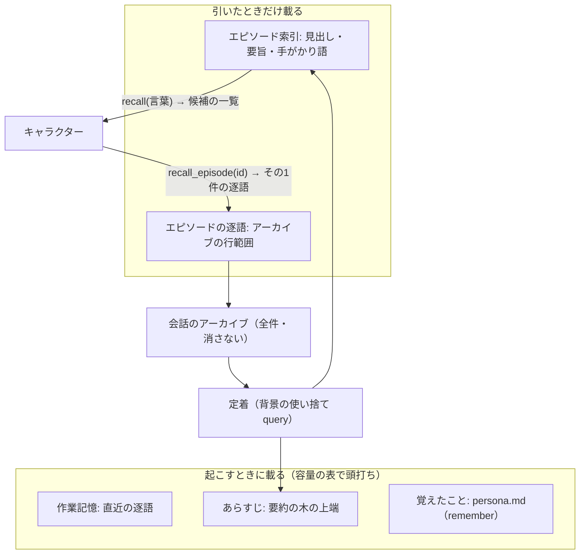

# 雑談の記憶を索引で引く仕組み（提案）

最終更新: 2026-09-25（起こしたのも同日）
ステータス: **提案であって正典ではない。** 決まったら正典（`docs/chat-mode.md` 4.9・`docs/design.md` 7章・
`docs/coding-standards.md`「会話内容の扱い」）へ移し、この文書は経緯として残す。`docs/` の他ファイルに
ある「節の索引」はここには作らない（`docs/research/` の慣習）。

発端は 2026-09-25 のユーザーの指示: 雑談の要約を `/compact` 以外で作りたい。**人間のように大量に
覚えていて、トークンを際限なく使わず、索引を使って局所的に記憶を引っ張れる**仕組みにしたい。

**2026-09-25 のユーザー判断**（下の各節に反映済み）:

- 索引は背景の使い捨て `query()` に作らせる（キャラクター自身に書かせるいまの `index` をやめる）
- 逐語の窓は 64 KiB のまま（提案の叩き台にあった 16 KiB は採らない）
- トークンに余裕があるなら、あらすじなどの容量も増やしてよい。**容量は簡単に上げられるように作る**
- 新しいセッションにするのは利用者の責任で、tsukumo は自動で切り替えない。画面が空になっても構わない

## 着手時に確かめた前提（2026-09-25 のコード）

| 前提                   | いまのコード                                                                                                                                                                                           |
| ---------------------- | ------------------------------------------------------------------------------------------------------------------------------------------------------------------------------------------------------ |
| 記憶の層               | 要約（`/compact` の写し 8 KiB）・旗（`keep` 8 KiB）・逐語の窓（64 KiB）を、新規に起こすときだけ `systemPrompt` に載せる（`src/server/chat/core/chat-memory-prompt.ts` の `takeChatMemoryPromptParts`） |
| 要約の口               | 走行合計が 128 KiB を超えたターンの終わりに `/compact` を投げ、`PostCompact` フックで写す（`chat-compact.ts`・`sdk-driver.ts` の `chatSummaryHooks`）                                                  |
| 索引                   | キャラクターが `index` で1日に何行でも見出しを書き、`recall` が小文字の部分一致で当たった日を新しい順に 8 KiB まで開く（`chat/adapter/chat-archive.ts`）                                               |
| 容量の定数             | `src/shared/chat-log.ts` に `CHAT_COMPACT_THRESHOLD_BYTES` など4つが別々の `const` で並ぶ                                                                                                              |
| 使い捨ての `query()`   | 日記（`src/server/diary/adapter/sdk-diary.ts`）と訪問の台本（`src/server/visit/adapter/sdk-visit-script.ts`）が `persistSession: false`・`settingSources: []` で使っている                             |
| 同じ claude へ渡すこと | `docs/requirements.md` 2.2 は、同じマシンの claude の子プロセスが受ける `query()` を外部送信に数えない（2026-09-25、訪問の台本のとき）                                                                 |
| 雑談の消費（実測）     | `~/.tsukumo/token-usage/` の 2026-09-22〜25 の雑談 82 ターンで、1ターンあたり呼び出し 5.4 回・キャッシュ読み出し約 88 万トークン・約 $0.62。1回の呼び出しで読む文脈は平均約 16 万トークン              |

## 全体: 4つの層と、引いたときだけ載る2段



**起こすときに載る量は、アーカイブが何年分に増えても容量の表の合計で頭打ちになる。** それより前の
会話は、キャラクターが引いたときにだけ、引いた1件ぶんが文脈に入る。

## 容量は1つの表に集める

**容量はすべて1つの定数の表に置き、値を書き換えるだけで上げ下げできるようにする**（ユーザーの指示）。
ほかの値（定着の契機など）は表から導き、別の定数として持たない。

```ts src/shared/chat-memory-budget.ts
export const CHAT_MEMORY_BUDGET = {
  /** 作業記憶: 起こすときに逐語で載せる直近の量 */
  recentBytes: 65_536,
  /** あらすじ: 起こすときに載せる要約の木の上端の量 */
  synopsisBytes: 8_192,
  /** recall が返す候補の一覧の量 */
  recallListBytes: 2_048,
  /** recall_episode が返す1件の逐語の量 */
  recallEpisodeBytes: 8_192,
  /** 1ターンに開けるエピソードの数 */
  recallEpisodesPerTurn: 2,
  /** 窓から溢れた未定着の行がこれだけ溜まったら定着を走らせる */
  consolidateEveryBytes: 8_192,
} satisfies ChatMemoryBudget
```

- **`src/shared/chat-log.ts` の4つの定数（閾値・窓・旗・recall）はこの表へ移し、要らなくなるもの
  （閾値・旗）は消す**
- 値の根拠は各項目の doc コメントではなく `docs/chat-mode.md` 4.9 に1か所だけ書く（二重にしない）
- **設定ファイルや環境変数から上書きする口は作らない。** 利用者は作者本人だけで、表を直して
  上げ直せば足りる。要るようになったら `docs/research/configuration-and-state.md` の置き場に足す

**既定値での見積もり**（換算は日本語 1 KiB ≈ 350 トークンの目安。上の実測から逆算した読み出し単価
約 $0.5/100万トークン）:

| 項目                | 既定値    | いつ載るか                   | 1ターンあたりの費用の増分 |
| ------------------- | --------- | ---------------------------- | ------------------------- |
| 作業記憶            | 64 KiB    | 起こしたセッションの毎ターン | 約 $0.06（いまと同じ）    |
| あらすじ            | 8 KiB     | 起こしたセッションの毎ターン | 約 $0.008                 |
| recall の一覧       | 2 KiB     | 引いたターンだけ             | ふだんは 0                |
| recall のエピソード | 8 KiB × 2 | 開いたターンだけ             | ふだんは 0                |

常に載る量は 72 KiB で、いまの最大（要約 8＋旗 8＋窓 64＝80 KiB）より小さい。

## エピソード索引の形

**いまの `index.jsonl`（キャラクターが書く日ごとの見出し）を置き換える。** 置き場は同じ
`~/.tsukumo/chat-archive/<パック名>/` で、ファイル名は `episode.jsonl`（1行1件、追記。`v` は 2）。

```text
{"v":2,"id":"2026-09-25-3","from":"<アーカイブ行の時刻>","to":"<アーカイブ行の時刻>","title":"（見出し）","gist":"（1〜2文の要旨）","cues":["（手がかり語）"],"weight":2}
```

| 鍵            | 中身                                                                               | 書くのは                                                  |
| ------------- | ---------------------------------------------------------------------------------- | --------------------------------------------------------- |
| `id`          | 日付＋その日の通し番号                                                             | tsukumo                                                   |
| `from` / `to` | アーカイブの行の時刻で範囲を指す。**逐語はアーカイブにしか無く、索引は目次**       | tsukumo                                                   |
| `title`       | 20字までの見出し                                                                   | 定着の `query()`                                          |
| `gist`        | 1〜2文の要旨                                                                       | 定着の `query()`                                          |
| `cues`        | 手がかり語（言い換え・上位の語を含めて10個まで）。**言葉のずれを吸収するのはここ** | 定着の `query()`                                          |
| `weight`      | 大事さ 1〜3。いまの `keep` の旗はここへ吸収する                                    | 定着の `query()`（`keep` が呼ばれたターンを含む範囲は 3） |

- **思い出した記録は別のファイルに追記する**（`recalled.jsonl` に `{"v":1,"id":…,"at":…}`）。
  索引の行を書き換えないので、追記だけの性質は崩れない
- `title`・`gist`・`cues` に書いてよいものの線は、いまの見出しと同じ（自分の言葉で書く・発言を
  引用しない・利用者について知ったことは書かない）

## 引き方: 一覧を引いてから1件を開く

1. **`recall(言葉)`**: 索引を採点して上位の `id`・`title`・`gist` を、一覧の容量まで返す。逐語は渡さない
2. **`recall_episode(id)`**: その範囲の逐語をエピソードの容量まで返す。1ターンに開ける数は表で決める

**採点に使う要素（`node:fs` で索引を読み、TypeScript だけで計算する。外部コマンドも埋め込みの API も使わない）**

| 要素           | 効き方                                                                  |
| -------------- | ----------------------------------------------------------------------- |
| 一致           | `cues`・`title`・`gist` との部分一致。日本語は2文字ずつの重なりでも拾う |
| 重み           | `weight` をそのまま掛ける                                               |
| 新しさ         | `to` から日が経つほど下がる                                             |
| 思い出した回数 | `recalled.jsonl` に記録があるほど、新しさによる下がり方を緩める         |

**忘却は「消える」ではなく「引きにくくなる」で表す。** 古くて一度も思い出していないものは一覧の下へ
沈むが、はっきりした言葉を渡せばまた届く。採点の係数は容量の表とは別に、同じファイルに1つの表で置く。

## 定着: 窓から溢れた行を背景で畳む

- **契機**: ターンの終わりに、作業記憶の窓から溢れていて、まだどのエピソードにも入っていない行が
  `consolidateEveryBytes` 以上あるとき。**同時に走るのは1本だけ**で、走っているあいだの契機は捨てる
  （次のターンの終わりにまた数える）
- **入力**: 溢れた未定着の行と、直前のエピソードの `title`（話題が続いているかを見分けるため）。
  出力は `outputFormat: { type: "json_schema" }` で、話題の切れ目で区切ったエピソードの配列
- **どこまで定着したか**は、最後のエピソードの `to` から分かる（別の印を持たない）
- **置き場**: `src/server/chat/adapter/sdk-chat-consolidation.ts`（原則3。SDK の境界は機能の
  `adapter/` 直下の `sdk-` で始まるファイル）。形は `sdk-diary.ts` に揃える
- **失敗したらその回を諦める**（常駐プロセスは1回の失敗で落ちない）。行は未定着のまま残るので、
  次の契機で拾い直す

## あらすじ: 要約の木の上端だけを載せる

- 定着のたびに、**新しいエピソードの `gist` と前のあらすじ**から、あらすじを書き直させる
  （同じ `query()` の出力に含める）。上限は `synopsisBytes`
- **あらすじの最後に最近の話題の見出しを置く**のは今の `<topics>` と同じ（サイドバーの「最近の話題」）
- 日・週・月の段を別のファイルに持つ木にするかは、あらすじ1つで足りないと分かってから決める
  （はじめは1ファイル上書き。いまの `chat-summary/` と同じ形）

## `/compact` をやめたあと: 新しいセッションにするのは利用者

**`/compact` と `PostCompact` の写しはやめる。** 雑談は今までどおり起こすたびに `resume` し、
**tsukumo が自分から新しいセッションに切り替えることはしない**（2026-09-25 のユーザー判断）。

- **新しいセッションにするのは利用者の責任**（`/clear`・`TSUKUMO_NEW_SESSION=1`）。そのときに
  作業記憶・あらすじ・覚えたことを載せる条件は、いまの `takeChatMemoryPromptParts` と同じ
  （新規に起こしたとき、または `/clear` を見たあと）
- **新しいセッションで画面のログが空になるのは受け入れる。** 画面が空でもキャラクターが覚えて
  いるのは、人がひと晩寝ても記憶が残るのと同じで自然、というのがユーザーの見方。アーカイブから
  画面を復元する口は作らない
- **`resume` を続けるあいだ claude 側の文脈は伸び続ける**（1ターンの読み出しが積もった会話の分だけ
  増える）。これも利用者が新しいセッションにする判断に任せ、受け皿は claude 自身の自動の圧縮だけに
  なる

## 規約の例外で取り直すもの

`docs/coding-standards.md`「会話内容の扱い」の表と `docs/chat-mode.md` 4.9 の承認を、次の3点で取り直す。

| 変わること         | いま                                       | 提案                                                     |
| ------------------ | ------------------------------------------ | -------------------------------------------------------- |
| 要約を作る場所     | 動いている claude の文脈の中（`/compact`） | 使い捨ての `query()`（同じマシンの claude の子プロセス） |
| ディスクに書く要約 | `chat-summary/` の写し1つ（8 KiB）         | あらすじ1つ＋エピソードの `title`・`gist`・`cues`        |
| 索引の書き手       | キャラクター（`index`）                    | 定着の `query()`                                         |

## 移行

- **いまの `index.jsonl` と `kept.jsonl` は読まなくなる。** 消さずに残し、はじめの定着は
  アーカイブの最初の行から順に畳む（そのぶん最初の数回は `query()` が続けて走る）
- **`chat-summary/` の写しは、はじめのあらすじの種として1回だけ読む**
- **消すツール**: `index`・`keep`。**変えるツール**: `recall`（一覧を返す）。**足すツール**: `recall_episode`
- 作法の条（`chat-manner.ts`）とツールの説明を、2段階の引き方に合わせて書き直す

## 未決

- 定着の `query()` 1回の所要時間と費用（日記の実績を測っていない）
- キャラクターが自分から `recall` を呼ぶ頻度。呼ばなければ古い話は出てこない（いまと同じ弱さ）
- 雑談1ターンで読む約 16 万トークンの内訳（記憶の外にある土台のほうが大きい）

## 採らなかった案

| 案                                                   | 採らなかった理由                                                                        |
| ---------------------------------------------------- | --------------------------------------------------------------------------------------- |
| 作業記憶を 16 KiB に縮める                           | 画面の 100 ターン（13〜19 KiB）と同じ幅になり、画面で見た話を忘れうる。費用の差も小さい |
| 索引をキャラクターに書かせ続ける                     | 書き忘れに左右される。区切りも見出しの粒度もそろわない                                  |
| 埋め込みで意味検索する                               | 外部の API か外部コマンドが要る。手がかり語で足りないと分かってから考える               |
| 容量を設定ファイル・環境変数で上書きする             | 利用者は作者本人だけで、表を直して上げ直せば足りる                                      |
| 逐語が 64 KiB 積もったら自動で新しいセッションにする | 新しいセッションにするかは利用者が決める（2026-09-25 のユーザー判断）                   |
| 新しいセッションの画面をアーカイブから復元する       | 画面が空でも覚えているのは自然で、要らない（同上）                                      |
