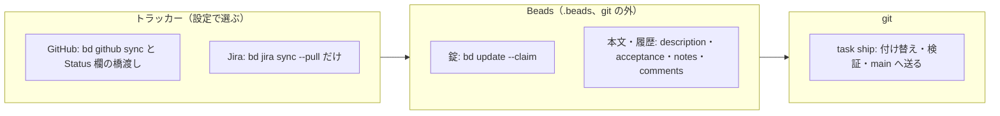

# タスク管理を GitHub Projects へ移すか（2026-09-27）

**この文書は調査メモであって正典ではない。** `docs/` の他ファイルにある「節の索引」はここには
作らない。タスクの管理（`develop/task/` の1件1ファイルと git の外の台帳）を GitHub Projects
（と Issues）へ移すべきかという、ユーザーからの指示（2026-09-27）の検討と、その決定の記録。
**GitHub に Project・Issue を作る・書き込む操作はしていない。**

## 結論

**3層に分け、錠と履歴の層に Beads（`bd`）を使う（2026-09-27 ユーザー決定）。** トラッカーは
差し替えられるようにし、GitHub（読む・作る・状態を書く）と Jira（読むだけ。状態は人が変える）の
2方式を持つ。条件は「今の排他制御と、残したい情報がすべて残ること」（ユーザー）。

- 並列開発の公開事例（下の「並列開発の事例」）は、トラッカー・錠・履歴を別の層に置き、錠は
  トラッカーの外の原子的な仕組みで取っている。Jira の方式は Jira に書けないので、錠はもともと
  ローカルにしか置けない
- 錠を自作の台帳から名前の通った道具へ寄せる。候補のうち、原子的な着手・依存つきの一覧・
  GitHub と Jira との同期を1つで満たすのは Beads だけだった
- 最初は GitHub の紐づく枝を錠にする設計だった（下の「採らなかった錠: 紐づく枝」）
- 状態名の改名（`hold` → `pending`・`dropped` → 見送り）は、Beads の状態の設計に畳む

## 今の運用の前提（実測、2026-09-27・main a2338ed1）

- 正典は `~/.claude/skills/task-workflow/WORKFLOW.md`（claude-skills のリポジトリ）。設計の経緯は
  claude-skills の `docs/task-workflow-redesign.md`（4.2「台帳」・11「採らなかった案」）
- 台帳は `$(git rev-parse --git-common-dir)/task-workflow/` に `claim/T-xxx/owner`・`lock/`（採番の錠）・
  `last-id`。`claim` と `lock` の取り合いは `mkdir` の成否だけで決める（`scripts/ledger.py` の
  `claim_dir`）。コミットしない
- タスクファイルの `status`（`todo`・`hold`・`done`・`dropped`）は git に載り、完了は作業と同じ
  1コミットで `task ship` が `main` へ ff で送る
- 2026-09-20 以降の `main`（merge を除く）は 1214コミット。うち `develop/task/` を触ったのが 283件、
  タスクIDを件名に持たないものが 92件（「指示をタスクにする」51件・「振り返り済みのタスクファイルを
  消す」36件ほか）
- tsukumo の読み手: `src/server/repository/adapter/task-summary.ts`（`main` の `develop/task/*.md` と
  台帳の印を見張り、サイドバーのタスク板へ流す）、`src/server/achievement/`（`git log` で
  `develop/task/` の出入りを読み成果を数える）、`src/browser/features/task-board/`
- `gh` 2.101.0 はこの端末で未ログイン。`sinnlosses/tsukumo` と `sinnlosses/claude-skills` は
  GitHub で公開（未認証の `GET /repos/...` が 200）。`develop/task/` は `origin/main` にも載っている

## GitHub の API で確かめたこと（一次情報）

| 事実                                                                                                                                                                                                                                                                             | 出典                                                                                                                           |
| -------------------------------------------------------------------------------------------------------------------------------------------------------------------------------------------------------------------------------------------------------------------------------- | ------------------------------------------------------------------------------------------------------------------------------ |
| REST の条件付きリクエストは `If-None-Match`・`If-Modified-Since` による読み取り用。「`POST`・`PUT`・`PATCH`・`DELETE` のような unsafe なメソッドの条件付きリクエストは、別に記載が無い限り対応しない」。`304` は一次の回数制限に数えない                                         | https://docs.github.com/en/rest/using-the-rest-api/best-practices-for-using-the-rest-api                                       |
| `updateProjectV2ItemFieldValue` の入力は `projectId`・`itemId`・`fieldId`・`value`・`clientMutationId` だけで、期待する前の値や版の欄は無い。`ProjectV2Item` には `updatedAt` がある（読んでから書くまでの間は守れない）                                                         | https://docs.github.com/en/graphql/reference/projects                                                                          |
| Projects の REST（`PATCH /users/{username}/projectsV2/{project_number}/items/{item_id}`）も `fields` の `id`・`value` を渡すだけで、前提条件の記載は無い                                                                                                                         | https://docs.github.com/en/rest/projects/items                                                                                 |
| 項目の追加と欄の更新は1回の呼び出しでできない（`addProjectV2ItemById` のあと `updateProjectV2ItemFieldValue`）。トークンは `project` スコープ（読むだけなら `read:project`）                                                                                                     | https://docs.github.com/en/issues/planning-and-tracking-with-projects/automating-your-project/using-the-api-to-manage-projects |
| assignee の追加は「既に割り当てられた人は置き換えない」追記（最大10人）。前提条件は無い                                                                                                                                                                                          | https://docs.github.com/en/rest/issues/assignees                                                                               |
| git の参照は原子的に扱える: GraphQL の `updateRefs` は `RefUpdate.beforeOid`（「更新の前にこの値を指していなければならない」）を持ち、「1つでも拒まれれば他の参照も変えない」。REST の参照の作成は `201`／`409 Conflict`／`422`、更新は `force` を省けば fast-forward 以外を拒む | https://docs.github.com/en/graphql/reference/git ・ https://docs.github.com/en/rest/git/refs                                   |
| 回数制限（REST）: 認証したユーザーは 5,000回/時。二次制限は同時 100、900点/分、CPU 90秒/60秒、内容を作る要求は 80回/分・500回/時。書き込みを続けるときは1秒以上あけ、並行でなく直列に打つ                                                                                        | https://docs.github.com/en/rest/using-the-rest-api/rate-limits-for-the-rest-api ・ best-practices（上）                        |
| 回数制限（GraphQL）: 5,000点/時。二次制限の計算で mutation は1回5点、2,000点/分、同時 100（REST と合わせて）                                                                                                                                                                     | https://docs.github.com/en/graphql/overview/rate-limits-and-query-limits-for-the-graphql-api                                   |
| `gh project` の最小スコープは `project`。`gh auth refresh -s project` で足す                                                                                                                                                                                                     | https://cli.github.com/manual/gh_project                                                                                       |

| Issue 同士の依存（blocked by）は REST で読み書きできる: `GET`・`POST /repos/{owner}/{repo}/issues/{issue_number}/dependencies/blocked_by`、`DELETE …/blocked_by/{issue_id}`、`GET …/dependencies/blocking` | https://docs.github.com/en/rest/issues/issue-dependencies |
| Issue と IssueComment は GraphQL の `userContentEdits`（本文の編集の一覧）を持つ | https://docs.github.com/en/graphql/reference/issues |

## 解くべき論点

**この節は、GitHub の Issue に本文を置き、紐づく枝を錠にする案で検討したときのもの。** 錠・本文・履歴の置き場は「運用の設計」が正で、ここは GitHub の API の性質の記録として残す。

### 1. 着手の印を原子的に取れるか

**結論: Project の欄・assignee・label では取れない。Issue に紐づく枝の作成で取る（ユーザー決定）。**

- Project の Status 欄・assignee・label は、前提条件（期待する前の値・`If-Match`）を受け付けず、
  後に書いたほうが勝つ（上の表）。2つの作業ツリーが同時に「着手」を書けば、両方が自分が取ったと読む
- 原子的なのは git の参照の作成だけ（既にあれば失敗する）。「Issue に紐づく枝がある＝着手中」は
  GitHub の画面（Issue の Development 欄）にも出る標準の約束なので、錠をこれに置く
- CLAUDE.md の「自分でブランチを切らない」は、この運用に合わせて改める（ユーザー決定）
- GitHub 上で確かめた結果、GraphQL の `createLinkedBranch` は同名の同時作成で1本だけが勝つ（「運用の設計」）

### 2. `/loop /next-task` の無人運転・オフライン・`gh` の認証・回数制限

**結論: どれも移す妨げにならない。**

- **オフライン**: Claude も同じく止まるので、差は無い（ユーザーの判断）
- **認証**: `gh auth login` と `project` スコープを人が一度通す。失効すると `/loop` が止まるので、
  `task status` 相当の入口で認証の失敗を先頭語にして止める
- **回数制限**: 1サイクルで読み数回・書き数回。6本の作業ツリーが並んでも 5,000回/時・書き 80回/分には
  届かない。書き込みは直列にし、二次制限に当たったときの再試行を持つ

### 3. タスクの本文をどこに置くか

**結論: 公開リポジトリの Issue。登録時の節は本文、着手時と完了時の節はコメントとして積む。**

**本文の節の置き先**

| 節                                         | 置き先                     | 書き方                                  |
| ------------------------------------------ | -------------------------- | --------------------------------------- |
| 目的・完了条件・背景・解くべき論点・注意   | Issue の本文               | 登録時に書く                            |
| 決まっていること（`pending` で決めたこと） | Issue の本文               | 書き換える（`userContentEdits` に残る） |
| やること（着手直後の調べ直し）             | コメント                   | 書き足す                                |
| 結果・振り返り                             | 閉じるときのコメント       | 書き足す                                |
| `difficulty`・`loopable`                   | Project の単一選択の欄     | 登録時に置く                            |
| 依存                                       | Issue の依存（blocked by） | 登録時に置く                            |

**今の読み手と、移したあとの読み方**

| 読み手                                                      | 今読んでいるもの                                                   | 移したあと                                                                                     |
| ----------------------------------------------------------- | ------------------------------------------------------------------ | ---------------------------------------------------------------------------------------------- |
| コミットとタスクの対応                                      | 件名の `T-xxx:` と、同じコミットに入る `## 結果`                   | コミットに Issue 番号を書き、GitHub が自動でつなぐ。結果はコミットの外（コメント）へ移る       |
| `retrospect` の `material.py`                               | 登録時の版と完了時の版のタスクファイルの差                         | コメントの並びがそのまま差になる。本文の書き換えは `userContentEdits`                          |
| `retrospect` の `scan.py`                                   | `## 結果` の `- 振り返り:` の行                                    | 結果のコメントの同じ行                                                                         |
| タスク板（`src/server/repository/adapter/task-summary.ts`） | `main` のファイルと台帳を見張る                                    | API で問い合わせるよう作り直すか、Orca のタブで Project のボードを開くことにしてタスク板を消す |
| 成果（`src/server/achievement/`）                           | `git log` でタスクファイルの出入りを読み、運用だけのコミットを除く | Issue の閉じた時刻を読む。運用だけのコミットが無くなるので、除く処理が要らなくなる             |
| 過去の判断を探す                                            | リポジトリの中を `grep`                                            | `gh search issues`。手元で `grep` できなくなるのが、本文を移して失う実害                       |

- 旧形式の `docs/history/tasks.md` と、git に残る過去の `develop/task/` は動かさない。成果は移行の日を
  境に、前を git、後を Issue から読む
- 採番は Issue 番号（PR と同じ連番）になる。`T-xxx` とは合わないので、移す未完了のタスクは
  Issue の題に旧 ID を添える

### 4. 外部サービスへの公開になる範囲

**結論: GitHub Projects（と同じリポジトリの Issue）の範囲で、エージェントが書いてよい（ユーザー決定）。**

- `sinnlosses/tsukumo` は公開リポジトリなので、本文は書いた時点で公開される（今は push した時点）。
  読める人の範囲は変わらない
- CLAUDE.md の「外部への公開・送信は人の承認を得てから」に、GitHub Projects とこのリポジトリの
  Issue への書き込みを例外として足す
- 会話内容の扱い（`docs/coding-standards.md`「会話内容の扱い」）は SDK のイベントと transcript が
  対象で、タスク本文には直接かからない。ただし本文・コメントに会話の断片を写すと即座に公開される
  ので、「タスク本文に会話を写さない」を運用の規則に書く

## 並列開発の事例

**各事例が、トラッカー・錠・履歴をどこに置いているか**

| 事例                                | トラッカー               | 錠                                                                   | 履歴                        |
| ----------------------------------- | ------------------------ | -------------------------------------------------------------------- | --------------------------- |
| Anthropic の C コンパイラ（16並列） | 置かない                 | `current_tasks/*.txt` をコミットして push し、先に push した側が勝つ | 進捗ファイル                |
| Claude Code の agent teams          | ローカルの共有タスク一覧 | 一覧のファイルロック                                                 | 各セッション                |
| Beads                               | Dolt の issue DB         | `bd update <id> --claim`                                             | 同じ DB                     |
| CCPM                                | GitHub Issues を正とする | `/pm:issue-start`                                                    | ローカルの `.claude/epics/` |

出典: https://www.anthropic.com/engineering/building-c-compiler ・
https://code.claude.com/docs/en/agent-teams ・ https://github.com/gastownhall/beads ・
https://github.com/Ninegd/ccpm ・ https://www.augmentcode.com/guides/how-to-run-a-multi-agent-coding-workspace

## Beads で確かめたこと（2026-09-27、`bd` 1.3.0・捨てたリポジトリ）

**確かめた挙動**

| 場面                                          | 結果                                                                                                                                                                    |
| --------------------------------------------- | ----------------------------------------------------------------------------------------------------------------------------------------------------------------------- |
| 3つの作業ツリーから同じ課題へ同時に `--claim` | 1つだけ終了コード 0。残りは `issue already claimed by <actor>` で終了コード 1                                                                                           |
| 6並列 × 8課題の取り合い（組み込みモード）     | 8課題とも勝者は1人。錠待ちの失敗は 0。server モードは要らなかった                                                                                                       |
| 作業ツリーと `.beads`                         | すべての作業ツリーが本体の `.beads` を自動で共有する                                                                                                                    |
| 1コマンドの時間                               | 約0.2秒                                                                                                                                                                 |
| 着手した actor と違う actor で `bd close`     | 拒まれる（`--force` で通る）                                                                                                                                            |
| `--id t-200` を3つ同時に `bd create`          | 1つだけ作られ、残りは `already exists` で終了コード 1                                                                                                                   |
| ID の接頭辞                                   | 小文字だけ（`T-` は使えない）。`t-100`・`t-1000` は作れる                                                                                                               |
| 独自の状態 `pending:frozen`                   | `bd ready` から外れる                                                                                                                                                   |
| 独自の状態 `cancelled:done`                   | 依存を解決しない（それに依存する課題が `ready` にならない）。`bd close` した課題は解決する                                                                              |
| 本文の書き換え・note・comment                 | `bd history` に版として残る。`bd export` の JSONL に `description`・`acceptance_criteria`・`notes`・`assignee`・`started_at` が出る                                     |
| `bd init --stealth`                           | `.git/info/exclude` で `.beads` を外し、コミットも `AGENTS.md`・`CLAUDE.md` への書き足しもしない（`--stealth` なしでは両方を書き足して自動でコミットする）              |
| `bd github sync --push-only`                  | Issue の作成・着手（label `status::in_progress`）・完了（`COMPLETED` で閉じる）が反映される。label を3つ（`type::task`・`priority::medium`・`status::in_progress`）作る |
| Project の Status 欄                          | `bd` は触らない（自動追加の既定の `Pending` のまま）                                                                                                                    |
| 使用状況の送信                                | 既定で有効。`bd metrics off` で止めた（この端末の全体の設定）                                                                                                           |
| `bd jira sync --pull`                         | 試していない（Jira のサイトとトークンが無い）。`--pull` で取り込みだけにできることはヘルプで確かめた                                                                    |

## 運用の設計

### 3層

`task` は薄い包みとして残し、Beads とトラッカーと git の間をつなぐ。自前で持つのは送り出し
（`ship`）と、下の表で「橋渡し」と書いたものだけにする。

### 今あるものの行き先

**今の排他制御と情報の、Beads での置き場**（「残る」の条件の突き合わせ）

| 今あるもの                                                                | Beads での置き場                                                                         | 自前で持つもの                                                                                      |
| ------------------------------------------------------------------------- | ---------------------------------------------------------------------------------------- | --------------------------------------------------------------------------------------------------- |
| 着手の印（`mkdir`）                                                       | `bd update --claim`（actor は作業ツリー名）                                              | ―                                                                                                   |
| 採番の錠                                                                  | `bd create --id t-<n>`（同じ番号は1つしか作れない）                                      | 次の番号を出して、負けたら数え直す                                                                  |
| `NOT_OWNER`（自分の印でないと完了できない）                               | `bd close` の actor の検査                                                               | ―                                                                                                   |
| 取り残し `STALE:gone`・`shipped`・`no-owner`                              | assignee・`started_at`・状態                                                             | 作業ツリーが消えたかの判定（`git worktree list` と assignee の突き合わせ）。解放は人が `bd unclaim` |
| `todo`・`hold`                                                            | `open`・独自の状態 `pending:frozen`                                                      | ―                                                                                                   |
| `done`                                                                    | `bd close`                                                                               | ―                                                                                                   |
| `dropped`                                                                 | `bd close` と label `cancelled`（独自の状態 `cancelled` は依存を解決しないので使わない） | ―                                                                                                   |
| `difficulty`・`loopable`                                                  | label `difficulty:<model>`・`loopable:<Y/N>`                                             | ―                                                                                                   |
| `dependencies`                                                            | `bd dep`（`--deps`）                                                                     | ―                                                                                                   |
| `## 目的`・`## 背景`・`## 決まっていること`・`## 解くべき論点`・`## 注意` | `description`（見出しのまま）                                                            | ―                                                                                                   |
| `## 完了条件`                                                             | `acceptance_criteria`                                                                    | ―                                                                                                   |
| `## やること`                                                             | `notes`                                                                                  | ―                                                                                                   |
| `## 結果`（`- 振り返り:` を含む）                                         | 閉じるときの comment                                                                     | ―                                                                                                   |
| 登録から完了までの本文の差（`retrospect` の材料）                         | `bd history`                                                                             | `material.py` の読み元を差し替える                                                                  |
| git に残る過去の `develop/task/` と `docs/history/`                       | 動かさない                                                                               | ―                                                                                                   |
| 送り出し（付け替え・検証・`main` へ ff）                                  | ―                                                                                        | `task ship`（今のまま）                                                                             |
| tsukumo のタスク板と成果                                                  | `bd list --json`・`bd export`                                                            | 読み元の差し替え（ネットワークに出ない）                                                            |

`.beads` は git の外（`--stealth`）に置くので、今のように「タスクの記録が git の履歴に残る」ことはなくなる。消えないように、`bd backup`（または `bd export` の JSONL）を git の外の決まった場所へ定期的に取る。`bd export` の JSONL には作成者のメールアドレス（`owner`）が入るので、公開リポジトリにコミットしない。

### GitHub の方式

- 登録は `bd create`、GitHub へは `bd github sync --push-only`（Issue と label）
- Project の Status 欄は `bd` が書かないので、`task` の橋渡しが `gh project item-edit` で書く
  （`pending` → `Pending`、`open` → `Todo`、`in_progress` → `In progress`、閉じた → `Done`、label `cancelled` → `Cancel`）
- Project の自動化「Item closed」はユーザーが無効にした。Status を書くのは橋渡しだけにする

### Jira の方式

- `bd jira sync --pull` だけを打ち、Jira には書かない（`--push` と引数なしの `sync` は `task` が使わない）
- 状態の変更は人が Jira で行う。ローカルで閉じたのに Jira が開いたままのものを、`task status` が
  「Jira で閉じてほしいもの」として出す
- Jira の本文は `## 完了条件` の形をしていないので、着手の前に `acceptance_criteria` と
  `difficulty`・`loopable` を書き起こす（人の確認つき）

### 規約の改訂（切り替えのときに入れる）

- CLAUDE.md「自分でブランチを切らない」は今のまま（紐づく枝を使わなくなったので変えなくてよい）
- CLAUDE.md「外部への公開・送信は人の承認を得てから」→ 例外として、Project 1 と `sinnlosses/tsukumo` の
  Issue・label への書き込みはエージェントが行ってよい
- `orca` 以外の外部コマンド依存に `bd`・`dolt`・`gh` が加わる（ユーザーが承認した）

### 採らなかった錠: 紐づく枝

GraphQL の `createLinkedBranch` は、同じ名前の同時作成で1本だけが `linkedBranch` を返し、負けは
`null`（終了コード 0）になる。錠としては使えるが、Jira の方式では使えず、錠の仕組みが2つになるので
採らなかった（2026-09-27）。

## 移行の段取り

1. **人がやること**（済み）: `gh auth login`・`project` スコープ、Project 1 の作成、Status 欄の選択肢、「Item closed」の無効化。`bd` 1.3.0 と Dolt 2.3.5 の導入
2. **スキルを Beads の上に作り直す**（claude-skills を別の作業ツリーで）: `task-workflow`（`WORKFLOW.md`・`scripts/`）を
   `bd` の包みにし、トラッカーの方式（GitHub・Jira・なし）を設定で選べるようにする。`next-task`・`plan-tasks`・
   `list-tasks`・`retrospect`・`setup-tasks` を追随させる
3. **tsukumo の読み手を移す**: タスク板と成果を `bd list --json`・`bd export` から読む（移す日より前は git の
   `develop/task/`）
4. **移す**: 全作業ツリーの手を止め、`bd init --stealth -p t` で `.beads` を作り、`develop/task/` の未完了を
   `bd create --id t-<旧番号>` で移す。`bd github sync --push-only` で Issue を作り、Status 欄を橋渡しで揃える。
   `develop/task/` と git の外の台帳を片付け、CLAUDE.md と `docs/workflow.md` を切り替える

## 最初の判定と、覆った理由

最初の検討（同日）は「移さない」だった。着手の印はすでにコミットを積まずに取れていて（台帳の
`mkdir`）、指示の動機が満たされていると読んだため。損と数えた4点のうち、読み手に分かりやすいこと
（数えていなかった）・オフライン（Claude も止まるので同じ）・認証（通せばよい）・外への送信
（GitHub Projects の範囲で許す）が、ユーザーの判断で覆った。原子的な着手の印が Project の欄で
取れないことは変わらず、紐づく枝で解く。
