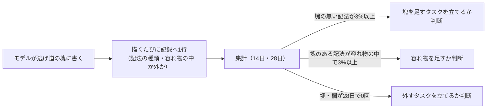

# レポートの組み立て方を、タスクの性質ごとのテンプレートより良い形にする案（2026-09-27）

**この文書は提案であって正典ではない。** `docs/` の他ファイルにある「節の索引」はここには作らない。
正典は `docs/display.md` 4.2（「塊を足す・外す基準」「読む時間を減らすために足すのは、規約の側」）・
`src/shared/report/report-block.ts`（塊の形と組み立て）・`src/server/report/core/report-notation.ts`
（記法の文面）で、**採用が決まるまでコードは1行も変わらない**。

**きっかけ**: 利用者の着想「タスクの性質ごとに HTML テンプレートを複数用意し、Claude の応答の JSON を
埋める。合うテンプレートが無ければ自由形式で書き、その出力からテンプレートへ落とし込める仕組みも
持つ」を叩き台とし、それより良い形を探す。

**対象**: `tsukumo-task` の `ed5a9e03`。`report` は `sections`（節と塊。塊は9種）で受けていて、
使われ方の記録（`~/.tsukumo/report-usage/`）は動き始めたところ。

**結論（5行）**

1. **テンプレートは作らず、塊を唯一の語彙のまま保つ。** 性質はモデルにも tsukumo にも決めさせず、
   どの塊と欄を使ったかから描き方が決まる（合成）。選び違えても「貧しく描かれる」で止まる
2. **性質に固有の良い部分は、テンプレートでなく「型付きの欄と塊」として取る。** 判定（`verdict`）・
   変更の種別（`change`）・前後の値のように、enum か対で意味を持つものだけを塊か欄にする
   （`report-block-richness.md` 7章の2・3がこれに当たる）
3. **自由形式（逃げ道の `markdown` の塊）からの昇格は、きっかけだけを記録の数で機械的に出す。** ただし
   いまの記録は**塊の無い記法（`cols`・`chart`・`dl` など）を数えていない**ので、足す基準が空振りする。
   記録の語彙を直すのが最初の段
4. **`docs/display.md` の「見せ方と再構成の線引き」は変えない。** 変えるのは「塊を足す・外す基準」の
   数える対象の書き方（6章）
5. 移行は「記録を正す → 記録の語彙を足す → 描き方 → 欄 → `options` / `files` → 演出の間 → 数がたまってから判断」の順（7章）

---

## 1. いまの `report` と、使われ方の記録

**いまの形**: `conclusion` / `checks` / `sections` / `favor` / `closing` のうち、本文の `sections` は
節（`heading` と塊の並び）の並びで、塊は `text` / `list` / `table` / `note` / `stats` / `code` /
`mermaid` / `progress` と逃げ道の `markdown` の9種。塊は `reportSectionsMarkdown` が Markdown に組み、
ブラウザは今までの本文と同じ経路（許可リスト・mermaid・`chart`）で描く。

**使われ方の記録**（`~/.tsukumo/report-usage/2026-09-27.jsonl`。記録が始まった日の約7時間・
23セッション・112件。集計した割合だけを使い、中身は見ていない）

| 数えたもの                                                       |     数 |  割合 |
| ---------------------------------------------------------------- | -----: | ----: |
| 塊の種類の組み合わせ（出た種類の集合）の通り数                   | 33通り |     — |
| 上位6通りで覆えるレポート                                        |     62 | 55.4% |
| 90% を覆うのに要る通り数                                         | 22通り |     — |
| 本文の無いレポート（`conclusion` だけ）                          |     10 |  8.9% |
| 逃げ道だけのレポート                                             |      9 |  8.0% |
| 逃げ道の中に塊のある記法（表・箇条書き・`note`）が入ったレポート |      8 |  7.1% |
| 1レポートに出た塊の種類が4つ以上                                 |      9 |  8.0% |

- 塊の種類ごとのレポート数は `table` 60.7%・`text` 50.0%・`list` 41.1%・`note` 31.3%・`markdown` 8.9%・
  `code` 6.3%・`mermaid` 4.5%・`stats` 2.7%・`progress` 2.7%
- 記録は1日ぶんで少なく、その日の仕事の偏りを含む。**割合は方向を決める根拠には使うが、閾値の判断には
  使わない**
- **記録の不具合を1つ見つけた**: `REPORT_BLOCK_KINDS` に `progress` が無く、描けた `progress` の塊が
  `unknownBlockCount`（知らない種類で落とした数）に数えられている（この日の3件はすべてこれ）。
  集計の表でも `progress` は0件のとき行が出ず、外す基準が当たらない（7章の0段）

**塊ごとの JSON Schema の字数**（`z.toJSONSchema(…, { io: "input" })`。`sections` 全体は4369字）

| 塊         | 字数 |
| ---------- | ---: |
| `text`     |  312 |
| `markdown` |  330 |
| `code`     |  445 |
| `note`     |  471 |
| `stats`    |  477 |
| `mermaid`  |  527 |
| `progress` |  570 |
| `list`     |  591 |
| `table`    |  812 |

## 2. 叩き台の効かないところ

叩き台を3つの部品に割って見る: (1) 性質ごとのテンプレートにモデルが JSON を埋める、(2) 合わなければ
自由形式、(3) 自由形式からテンプレートへ落とし込む。

**叩き台の部品ごとの効かないところ**

| 部品                      | 効かないところ                                                                                                                                                                               | 根拠                                                                  |
| ------------------------- | -------------------------------------------------------------------------------------------------------------------------------------------------------------------------------------------- | --------------------------------------------------------------------- |
| 性質ごとのテンプレート    | レポートの形は性質の数ほどに揃っていない。112件で塊の組み合わせが33通りあり、上位6通りでも半分強しか覆えない。少ない枚数では大半が「合わない」側に落ち、覆おうとすると枚数が増える           | 1章の表                                                               |
| 〃（選ぶ単位）            | 選ぶ単位がレポート全体なので、選び違えるとレポート全体の形が崩れる。必須の枠を埋めるために前置きや言い直しの文が入る（条2・条3 の違反）。いまの塊は選び違えても塊1つが素の形で描かれるだけ   | `report-block-richness.md` 5章「貧しく描かれる事故」                  |
| 〃（1ターンに混ざる性質） | 実装して調べて比べる、が1ターンに混ざる。テンプレートを1つ選ぶ形は混ざったターンを書けない                                                                                                   | 塊の種類が4つ以上のレポート 8.0%                                      |
| 〃（短い答え）            | 本文の無いレポートが 8.9% ある。短い答えにも枠を当てるか、「テンプレート無し」を別に持つことになる                                                                                           | 1章の表                                                               |
| JSON を埋める schema      | 枠が塊を持つなら、枠ごとに塊の schema が入る（再帰と `$ref` の使い回しの無い形を選んでいるため。`report-block.md` 9章）。表・箇条書き・`note` を持つ1枚で約2千字、5枚で約1万字が毎ターン載る | 1章の字数の表（いまの `sections` 全体は4369字）                       |
| 自由形式への逃げ道        | いまの `markdown` の塊がすでにこれで、節の中の1つの塊として置けるので、逃げても他の塊の型は崩れない。叩き台の「レポート全体を自由形式にする」逃げ方は、この利点を捨てる                      | `docs/display.md`「本文は `report` の `sections`」                    |
| 自由形式からの落とし込み  | 実行時に tsukumo が自由形式の本文をテンプレートへ詰め直すのは、本文から構造を起こす再構成（スコープ外）。人が後から形を起こすなら、記録は中身を持たないので、数からは形が出てこない          | `docs/display.md`「見せ方と再構成の線引き」・「会話内容の扱い」の規約 |

**叩き台の良いところ**も2つある。どちらも推す案に取り込む（3章）。

- **性質に固有の意味を型で持てる**（調査の「未確認」・比較の「採る / 採らない」・実装の「触ったファイル」）
- **見た目が揃う**（同じ種類の中身は同じに描かれる）

## 3. 候補の比べ方

**4つの候補**

| 候補                                | 形                                                                                                                      | 性質を誰が決めるか                         | 選び違えたときの壊れ方                       | schema の増分（目安）                      |
| ----------------------------------- | ----------------------------------------------------------------------------------------------------------------------- | ------------------------------------------ | -------------------------------------------- | ------------------------------------------ |
| A. 叩き台                           | `template`（`investigation` / `implementation` / `comparison` …）を選ばせ、枠ごとに JSON を埋める。合わなければ自由形式 | モデル                                     | レポート全体の形が崩れる・枠を埋め草で埋める | 1枚約2千字 × 枚数                          |
| B. 部品の組                         | 塊より大きい組（例: 調査の結論＋根拠の表＋未確認）を塊の1種類として足し、組と素の塊を混ぜて並べる                       | モデル（組ごとに）                         | 組1つの形が崩れる                            | 1組 1.5〜2千字                             |
| C. いまの塊の延長                   | `report-block-richness.md` 7章の1〜4のまま（描き方・欄4つ・`options` / `files`・演出の間）                              | 決めない                                   | 塊1つが素の形で描かれる                      | +1778字（`report-block-richness.md` 5章）  |
| **D. 塊の合成＋数える昇格（推す）** | C に、昇格の仕組みを直すことと、性質の部品を塊か欄にする基準を足す。テンプレートと組は作らない                          | 決めない（使った塊と欄から描き方が決まる） | 塊1つが素の形で描かれる                      | C と同じ（記録の拡張は schema に載らない） |

- **A を採らない**: 2章のとおり、形の散らばりに対して選ぶ単位が大きすぎ、schema が重い。
  tsukumo が性質を推す形にすると、ツールの定義はセッションを通して固定なので、書く前のモデルに枠を
  見せられない。書いたあとに tsukumo が詰め直すなら再構成になる
- **B を採らない**: 組の中身が素の塊の並びで書けるなら、組にしても意味が増えない（「表のあとに
  `note`」は書き方の癖で、概念ではない）。組の schema は中の塊を抱えるので重い。**組に意味が
  あるのは、組そのものが enum か対で判定を持つときだけ**で、それは塊1つ（`options` が
  「名前・判定・理由」の組）として足せば足りる
- **C だけでは足りない**: 昇格の仕組みが「塊の無い記法」を数えていないので、自由形式から新しい塊が
  生まれる道が閉じている（1章・6章）。その4段は 2026-09-23〜26 の実測（`body` の時代の transcript を
  正規表現で数えたもの）で決めた一度きりの追加で、その後の追加を決める仕組みが働かない
- **D を推す理由**: 叩き台の良いところ2つを、選ぶ単位を塊に保ったまま取れる。性質に固有の意味は
  型付きの欄と塊（4章）が持ち、見た目の揃いは tsukumo が型から決める描き方（7章の2段）が持つ。
  昇格は数が決め、人が決めるのは「タスクを立てるか」と形だけになる

## 4. 推す案の形

### 4.1 モデルに渡す schema

- **レポートの枠（`conclusion` / `checks` / `sections` / `favor` / `closing`）は変えない。** 性質を
  言う欄（`template` / `kind`）は置かない
- 塊に足すのは**事実か判定を言う欄**だけにする（`report-block-richness.md` 6章の、汎用の重要度を持たせない判断を
  そのまま引き継ぐ）。欄の段の `from` / `to`・`before`・`label`・`flow` と、塊を足す段の
  `options`（`verdict`）・`files`（`change`）がこれに当たる
- **塊か欄を足してよい条件**（`report-block.md` 4章の2つの基準を、性質の部品にも当てる）:
  1. 記録か実測で、直近のレポートの3%以上に現れる（6章の数）
  2. 型にすると、描き方を tsukumo が意味から決められる（enum か対で、文字のラベルで描ける）か、
     検査か心がけの条が1つ消える
- 塊の種類は逃げ道を含めて11までを目安にする（`report-block-richness.md` 5章のまま）

### 4.2 tsukumo の組み立て

- **組み立ては `reportSectionsMarkdown` の1箇所のまま**（塊 → Markdown → 許可リスト → 描画）。
  描き方の判定（数の列の右揃え・状態の列の揃えなど）もここに置き、型から機械的に決める（7章の2段）
- 性質の推定・並べ替え・要約はしない（`docs/display.md`「見せ方と再構成の線引き」）
- **塊ごとの React の部品で描く形へ移るのは、塊が許可リストを通る HTML で表せない振る舞い
  （状態・押したときの動き）を要したとき**。`files` の塊 がファイルを開くのは既存の
  `repository-link` で足り、これには当たらない

### 4.3 画面の描き方

- 塊の見た目は種類ごとに1通りで、どのレポートでも同じに描く（テンプレートの「見た目が揃う」はこれで取る）
- 節を書き上げる演出の単位にする（7章の2段）。筆を留めるのは型で分かる大事な塊だけ（7章の5段）

### 4.4 自由形式からの昇格の流れ

- **機械が決めるのは「タスクを立てるか考えるきっかけ」まで。** 塊の形（欄・enum）は記録から出て
  こない（記録は中身を持たない）。形を決めるのは、きっかけの出たときに
  `report-block-richness.md` 1章と同じ「transcript を正規表現で数え、数だけを出す」調べをすること
- **組（塊の並び）の昇格は数えない。** 並びは中身を持たずに記録できるが、よく出る並び（`text` の
  あとに `table` など）は書き方の癖で、概念とは区別できない。組に値打ちがあるのは判定を持つときで、
  それは記録の数ではなく上の調べで見つける
- 容れ物の数（逃げ道の中の塊のある記法 7.1%）は、1日ぶんでも3%を超えている。ただし差し戻しの枠を
  使い切った2回目の呼び出しでも同じ記録になるので、「容れ物の中か外か」を分けて数えるまで判断しない

## 5. 解くべき論点への答え

- **性質を誰が決めるか**: **決めない。** モデルに選ばせると選ぶ単位がレポート全体になり、選び違えの害が
  大きい。tsukumo が依頼や道具の使われ方から推すのはヒューリスティックで（`docs/display.md`
  「tsukumo 側のヒューリスティック分類」）、書く前のモデルに枠を見せる経路も無い。
  使った塊と欄から描き方が決まるので、性質を名前で持つ必要が無い
- **テンプレートの単位**: レポート全体でも組でもなく、**塊**。組が意味を持つのは判定か対を持つときだけで、
  そのときは塊1つとして足す（`options` がその例）
- **昇格を機械的に行えるか**: **きっかけは機械的に出せ、形は出せない。** いまの記録は塊の無い記法を
  数えていないので、きっかけも出ていない。記録の語彙を足せば、足す基準（3%）と外す基準（0回）で
  「タスクを立てるか」だけの判断になる
- **schema の大きさと書き違い**: テンプレートは1枚約2千字で、枚数に比例して増える。塊は1種類300〜800字で、
  欄は1つ10〜100字。書き違いは、塊なら差し戻し（`ragged-table` など）か境界で塊1つを落とすだけで、
  レポートは描かれる。いまの `sections` 全体は4369字で、C / D の追加を全部入れても約6千字に収まる

## 6. `docs/display.md` との食い違いと、どちらを変えるか

| 小節                                                 | 食い違い                                                                                                                                                                                                                                                                                    | 変える側                                                                                                                                                                              |
| ---------------------------------------------------- | ------------------------------------------------------------------------------------------------------------------------------------------------------------------------------------------------------------------------------------------------------------------------------------------- | ------------------------------------------------------------------------------------------------------------------------------------------------------------------------------------- |
| 「読む時間を減らすために足すのは、規約の側」の線引き | 推す案とは食い違わない（tsukumo は型から見せ方を決めるだけで、本文を詰め直さない）。叩き台の「tsukumo が自由形式をテンプレートへ落とし込む」とは食い違う                                                                                                                                    | **変えない。** 叩き台の落とし込みの部品を採らない                                                                                                                                     |
| 「塊を足す・外す基準」                               | 足す基準は「逃げ道の中の同じ記法が3%以上」だが、記録する記法（`MARKDOWN_NOTATIONS`）は塊のある8種だけで、塊の無い記法（`cols` / `card`・`chart`・`svg`・`dl`・引用・区切り線・`
`）は数えていない。塊のある記法が3%を超えても、それは新しい塊ではなく容れ物か差し戻しの枠切れを指す | **基準の書き方を変える。** 記録を「塊の無い記法」と「塊のある記法（容れ物の中か外か）」に分け、足す基準は前者に、容れ物の判断は後者に当てる。足す欄（7章の3段）も外す基準の対象にする |

## 7. 移行の段

|  段 | 中身                                                                                                             | モデルの出力が変わるか | 行き先                                                |
| --: | ---------------------------------------------------------------------------------------------------------------- | ---------------------- | ----------------------------------------------------- |
|   0 | 記録を正す: `REPORT_BLOCK_KINDS` に `progress` を足し、塊の一覧が抜けないように形から導く                        | 変わらない             | ドラフト `2026-09-27-report-block-kinds-progress.md`  |
|   1 | 記録の語彙を足す: 塊の無い記法と、塊のある記法が容れ物の中か外か。集計と `docs/display.md` の基準を6章に合わせる | 変わらない             | ドラフト `2026-09-27-report-usage-escape-notation.md` |
|   2 | 描き方だけ（数の列・状態の列・節を演出の単位に）                                                                 | 変わらない             | `report-block-richness.md` 7章の1                     |
|   3 | 欄の4つ（`from` / `to`・`before`・`label`・`flow`）と、欄を記録に数えること                                      | 変わる                 | 同 7章の2                                             |
|   4 | 塊 `options` と `files`                                                                                          | 変わる                 | 同 7章の3                                             |
|   5 | 演出の間（注意・異常と「採る」で筆を留める）                                                                     | 変わらない             | 同 7章の4                                             |
|   6 | 記録が28日たまったら: 塊の無い記法の昇格・容れ物・外す塊と欄を、基準の数で判断する                               | 判断次第               | そのときタスクを立てる                                |

- 1 を 3 より前に置くのは、欄と塊を足す前後で逃げ道の使われ方を見比べるため（`report-block-richness.md` 7章で、塊の追加と欄の追加を
  分けたのと同じ理由）
- 2 と 5 はモデルの出力を変えないので、1 と並べて進めてよい
