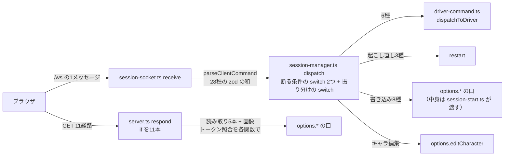

# アーキテクチャ提案: サーバの受け口を「機能ごとの手続き」にし、流れを1枚の表から辿れるようにする（2026-09-26）

**2026-09-26 に段1〜3を採用した。正典は `docs/design.md` 2章「コマンドの受け手と手続きの置き方」（あわせて 5章「session-manager.ts（core）」「server.ts と session-socket.ts（adapter）」、`docs/glossary.md` の「契約」「手続き」「コマンド」）で、この文書は経緯として残す**（段4は 2026-09-26 に実物で確かめて採用した。結果は 9章。受け手の中身の設計（9章）は正典で決めた）。

**この文書は提案であって正典ではない。** `docs/` の他ファイルにある「節の索引」はここには作らない。
採用したら正典（`docs/design.md` 2章・5章「server.ts と session-socket.ts（adapter）」「session-manager.ts（core）」、
`docs/architecture.md` 原則2、`docs/glossary.md`）へ反映し、この文書は経緯として `docs/research/` に残す。

**対象コミット**: `main` の `8b4efe8d`。**書き方**: `~/.claude/skills/architecture-proposal` の手順
（性質 → 候補 → 木 → 差分 → 段階）。前回の提案（`docs/research/architecture-proposal.md`）と Hono の試算
（`docs/research/hono-server.md`）の続きで、**3層（`shared` / `server` / `browser`）と、機能の中の
`core` / `adapter` の割り（2026-09-25 決定）は動かさない**。

**問いの出どころ**: ユーザーの言葉「レイヤードとか、層を意識した構成になってなくて流れが追いづらい」
「TypeScript でサーバーを組むときの手本になるリポジトリを見つけて、ライブラリやフレームワークを含めて
再検討してもらっていい？ 今のフェーズに合った、拡張性と流れの追いやすさを追求したものを」。

**結論（3行）**

1. **性質**: 常駐プロセスが Agent SDK からのイベントを畳んで WebSocket で押し、ブラウザからは
   **28種のコマンド（WebSocket）と5本の読み取り（HTTP の JSON）**が入ってくる。追いにくさの芯は層の数ではなく、
   **「どのコマンドをどこが受けるか」が `session-manager.ts`（829行）の `switch` と
   `SessionManagerOptions` の20本の口に埋まっていて、機能の側から見えない**こと
2. **様式**: 手本の2つ（opencode・t3code）に共通する「**機能ごとに契約と受け手（コントローラー）を1枚ずつ
   置き、それを1枚のルータで束ねる**」形を採る。道具は **oRPC**（契約を `shared` に置ける contract-first の
   型付き RPC。`ws` の上で動く）。Effect への全面移行（手本2つの土台）と Hono は採らない
3. **最初の段階**: 依存を足さずに、`server.ts` の `if` 11本を経路の表に、`session-manager.ts` の `switch` を
   **機能ごとのコマンドの受け手の表**（どの条件で断るかも表に書く）に置き換える。ここで止めても流れは
   表から辿れるようになり、oRPC へ移す段はこの表を機械的に写すだけになる

---

## 1. アプリの性質

| 軸               | 読み取ったこと                                                                                                                                                                   | 根拠                                                                                                                           |
| ---------------- | -------------------------------------------------------------------------------------------------------------------------------------------------------------------------------- | ------------------------------------------------------------------------------------------------------------------------------ |
| 何を中心に回るか | **常駐プロセス + 双方向の押し出し**。入力は画面からのコマンド、出力は SDK のイベントを畳んだフレーム。要求応答は読み取りの JSON 5本と画像1本だけ                                 | `src/server/view-server/adapter/session-socket.ts`（`receive` → `dispatch`）、`src/server/session/core/session-manager.ts:672` |
| 外の世界との境界 | SDK・`ws`・`node:http`・ファイル（ホーム）・`git`・Orca。機能の `adapter/` に閉じている                                                                                          | `docs/design.md` 2章「サーバの機能と、機能どうしの辺」                                                                         |
| 状態の持ち方     | メモリ上の1セッション（代 `generation` を起こし直す）。永続化はホームのファイル                                                                                                  | `session-manager.ts` の `restart` / `write`                                                                                    |
| 実行環境の数     | 2（Bun とブラウザ）。同じ reducer とスキーマを両側で import                                                                                                                      | `src/shared/`                                                                                                                  |
| 変わりやすい場所 | 2026-09-13 以降の変更回数の上位は `session-start.ts`（64）・`sdk-driver.ts`（50）・`session-manager.ts`（45）・`session-driver.ts`（40）。**受け口と束ね役に変更が集中している** | `git log --since=2026-09-13 --name-only`                                                                                       |
| 守られている制約 | 層の辺・機能どうしの辺は `test/architecture.test.ts`。インターフェースは実装が2つある境界だけ（「教科書的なヘキサゴナル」は却下済み）                                            | `docs/research/architecture-proposal.md` 6章                                                                                   |
| 利用者と開発体制 | 作者1人。タスクはサブエージェントへ委譲する。**ディレクトリ名とファイル名が指示書の代わり**                                                                                      | `CLAUDE.md`「タスク運用」                                                                                                      |
| テストできる範囲 | 配信（バインド・経路・push）とコマンドの振り分けは自動、絵は目視                                                                                                                 | `CLAUDE.md`「テスト方針」                                                                                                      |

### 流れを1本追った結果（いまの形）



### いま痛んでいる兆候

- **1つのコマンドを追うのに3ファイルを跳ねる**: `shared/command.ts`（形）→ `session-manager.ts`（断る条件と
  振り分け）→ `session-start.ts`（口の中身。494行）。たとえば `set-visit-enabled` の実体は
  `session-start.ts` が渡す `rememberVisitEnabled` で、`visit/` の中からは受けていることが見えない
- **断る条件が振り分けと別の `switch` にある**: 「雑談の外なら断る」「ターン中なら断る」はコマンドごとの
  性質なのに、`session-manager.ts:672` の3つの `switch` に分かれている。新しいコマンドを足すときに
  3箇所を見ることになる
- **読み取りの5本が、同じ手順を5回手で書いている**: トークン照合 → 403 → 中身 → JSON。経路名は
  `src/shared/*.ts` に1本ずつ定数で置かれ、ブラウザ側の6ファイル（hook 5つと `browser/domain/context-usage.ts`）が手で `fetch` している
- **束ね役が膨らみ続けている**: `SessionManagerOptions` の口は20本。機能を足すたびにここと
  `session-start.ts` の両方が伸びる（変更回数の上位2つ）
- **Hono の「入れ時」の条件を2つ満たした**: `docs/research/hono-server.md` は「経路が5つを超える」
  「トークン・`Origin` の照合が要る経路が2つ以上になる」を入れ時にしていた。いまは経路が11本と `/ws`、
  照合の要る経路は `/ws` を含めて7本

## 2. 手本にしたリポジトリ

**性質の近い2つ**（AI エージェントを常駐プロセスで動かし、ブラウザや TUI に双方向で配る TypeScript のサーバ）を
読んだ。どちらも**機能ディレクトリ + 機能ごとの契約と受け手 + 1枚のルータ**という同じ形に落ち着いている。

|                          | [sst/opencode](https://github.com/sst/opencode)（`dev` の `34aa427`）                                                              | [pingdotgg/t3code](https://github.com/pingdotgg/t3code)（`d06f0ff`）                                                      |
| ------------------------ | ---------------------------------------------------------------------------------------------------------------------------------- | ------------------------------------------------------------------------------------------------------------------------- |
| 何か                     | コーディングエージェント。サーバ + TUI/Web クライアント                                                                            | Claude/Codex を動かす Web GUI。WebSocket のサーバ                                                                         |
| 土台                     | Effect（`effect/unstable/httpapi`）、Bun、`ws`、drizzle                                                                            | Effect（`@effect/rpc`・`@effect/platform-node`）                                                                          |
| 機能の置き方             | `src/<機能>/`（`session/` `question/` `permission/` `bus/` など約35）。各機能が `Service` を出す                                   | `apps/server/src/<機能>/`。`Services/`（型）と `Layers/`（実装）の対                                                      |
| 契約                     | `server/routes/instance/httpapi/groups/<機能>.ts`（経路・入出力・エラーのスキーマ）                                                | `packages/contracts/src/rpc.ts`（`Rpc.make` を WebSocket のメソッドごとに1つ）                                            |
| 受け手（コントローラー） | `handlers/<機能>.ts`。**機能の `Service` を1回取り出し、各経路は1〜数行で委ねる**。ドメインのエラーはここでだけ API のエラーに訳す | RPC グループの実装が `orchestration` の `decider`（コマンド → イベント）と `projector`（イベント → 読み取りモデル）へ渡す |
| 束ね                     | `server.ts` が groups と handlers を1つの API にまとめる                                                                           | RPC グループを1つのサーバに載せる                                                                                         |

**tsukumo へ持ち込むもの**: 「受け手は機能ごとに1枚、中身は機能へ委ねるだけ」「断る条件（認可・前提）は受け手の
外で宣言的に掛ける（opencode の `middleware/`）」「全経路を1枚で束ねる」の3つ。**持ち込まないもの**:
Effect そのもの（4章 候補 D）。t3code の `decider` / `projector` は、tsukumo がすでに `shared` の reducer
（`applySessionEvent`）で同じ形を持っている。

## 3. 道具の事実（一次情報）

| 項目                                               | 事実                                                                                                                                                                                              | 出典                          |
| -------------------------------------------------- | ------------------------------------------------------------------------------------------------------------------------------------------------------------------------------------------------- | ----------------------------- |
| `@orpc/server` / `@orpc/contract` / `@orpc/client` | 1.15.4。server は `@orpc/*` の内部パッケージ約9個と `cookie` に依存し、peer に `ws`。contract は `@orpc/client` `@orpc/shared` `openapi-types` `@standard-schema/spec` だけ（`node:` に触らない） | npm registry（2026-09-26）    |
| 検証ライブラリ                                     | Standard Schema を受ける（Zod / Valibot / ArkType）。**zod 4 は Standard Schema を実装しているので `@orpc/zod` は要らない**（それは OpenAPI の JSON Schema 化のためのもの）                       | orpc.dev「Define Contract」   |
| contract-first                                     | `oc` で契約（入力・出力・エラー・`meta`）だけを書き、サーバ側で `implement(contract)` に受け手を付ける。契約に受け手は含まれない                                                                  | orpc.dev「Define Contract」   |
| WebSocket                                          | `@orpc/server/websocket` の `RPCHandler` を `ws` の `WebSocketServer` の接続ごとに `handler.upgrade(ws, { context })` で載せる。context はメッセージごとに作れる                                  | orpc.dev「WebSocket Adapter」 |
| React Query                                        | `@orpc/tanstack-query`（peer に `@tanstack/query-core`）。tsukumo は既に `@tanstack/react-query` を使っている                                                                                     | npm registry                  |
| ストリーム                                         | 受け手を async generator にすると Event Iterator になる（`lastEventId` で再開）。**文書は SSE の例だけで、WebSocket 上での順序と再接続は確かめていない**                                          | orpc.dev「Event Iterator」    |
| `hono` / `@hono/node-server`                       | 4.13.9 / 2.1.1。どちらも実行時の依存0                                                                                                                                                             | npm registry                  |
| `effect`                                           | 3.22.2。opencode・t3code とも `@effect/platform-node` と併用                                                                                                                                      | npm registry                  |

## 4. 候補と選択

**土台は動かさない。** 3層と、機能の中の `core` / `adapter` は性質（実行環境2つ・境界が多い・委譲する体制）から
直接出ていて、今回の不満（流れ）とは別の軸。候補は**受け口の形と道具**で立てる。

### 候補 A: 依存を足さず、受け口を表にする

- 効く性質: 「何を中心に回るか」— 28種のコマンドの行き先と断る条件が**1行ずつの表**になり、機能の側に置ける。
  「変わりやすい場所」— `session-manager.ts` の `switch` と `SessionManagerOptions` の口が、機能ごとの表へ分かれる
- 合わない点: 読み取りの5本の定型（照合・JSON）と、ブラウザ側の6ファイルの手書き `fetch` は残る。コマンドの形
  （`shared/command.ts`）と受け手の対応はテストで守るしかない（型で結ばれない）
- 要求する形: `src/server/<機能>/core/<機能>-command.ts`（その機能が受けるコマンドの表）と、束ねる
  `src/server/session/core/command-route.ts`
- 確度: **固い**

### 候補 B: oRPC で、機能ごとの契約と手続きにする（A を第1段にして）

- 効く性質: 「実行環境の数」— 契約（`@orpc/contract`）は `node:` に触らないので `shared` に置け、
  **ブラウザは型付きの client で呼ぶ**（手書きの `fetch` と経路名の定数が消える）。「外の世界との境界」—
  トークン照合が1つのミドルウェアになり、HTTP と WebSocket で同じ手続きを配れる。「何を中心に回るか」—
  読み取りとコマンドが同じ「手続き」になり、`src/router.ts` の1枚から全部辿れる
- 合わない点: 依存が約12パッケージ増える（`@orpc/*` と、`cookie` `openapi-types` `@standard-schema/spec`）。フレーム（サーバからの押し出し）を
  Event Iterator に寄せる段は、WebSocket 上の順序を確かめていない。**補い方: 押し出しは今の `subscribe` の
  まま残し、段4を「推測」として切り離す**
- 要求する形: `src/shared/contract/<機能>.ts`、`src/server/<機能>/adapter/<機能>-procedure.ts`、`src/router.ts`
- 確度: **試す価値あり**（手本2つの形と一致するが、Bun + `ws` + zod 4 で動くことは段2で確かめる）

### 候補 C: HTTP だけ Hono に置き換える

- 効く性質: `hono-server.md` の入れ時の条件を満たした。11経路が宣言的になり、照合が1つのミドルウェアになる
- 合わない点: **追いにくさの中心は WebSocket のコマンドの側**で、Hono はそこに触れない。B を採ると読み取りの
  5本が手続きへ移り、HTTP に残るのは静的な配信5本（`/`・スクリプト・CSS・`/vendor/`・`/character/`）と
  画像1本になって、入れ時の条件をまた下回る
- 確度: 却下（B の後では要らなくなる）

### 候補 D: Effect へ寄せる（opencode・t3code の土台）

- 効く性質: 手本2つがそのまま参考になる。起こし直し（代）・`AbortSignal`・タイマーのような資源の後始末を
  構造化できる
- 合わない点: サーバ全体を別の書き方（generator・`Layer` の DI・Effect の `Schema`）へ移すことになり、
  **`shared` の zod を両側で回す今の契約と二重になる**。作者1人のいまのフェーズでは、流れを見せるための
  変更として重すぎる。`docs/coding-standards.md` の remeda・`Temporal` の規約とも書き方が重なる
- 確度: 却下（時期尚早）。再検討の条件は 8章

### 選んだもの: A を第1段にして B

- **A は無条件に採る**（段1）。依存を足さずに流れが表から辿れるようになり、B の段3はこの表を写すだけになる
- **B を採る理由**: 手本2つが同じ形に収束していること、契約を `shared` に置ける contract-first は tsukumo の
  3層とそのまま噛み合うこと、読み取りとコマンドの2系統が1つの仕組みになること
- **C を捨てた理由**: 追いにくさの中心に触れず、B の後では条件を満たさなくなる
- **D を捨てた理由**: 流れを見せるための変更として重く、zod の契約と二重になる

## 5. 目標のディレクトリ構造（段3まで終えた形）

```
src/
├── router.ts                 全機能の手続きを1枚に束ねる（配線）。「どこで受けるか」の答えはこのファイル
│                             ✗ 手続きの中身・断る条件の判定を書かない（名前と手続きの対応だけ）
├── session-start.ts          外の世界の実装を選んで渡す（配線）。口の数は機能ごとの手続きへ分かれて減る
├── shared/
│   └── contract/<機能>.ts    その機能の手続きの契約（入力・出力・エラー・断る条件の meta）。zod と @orpc/contract
│                             ✗ @orpc/server・node: を import しない（ブラウザでも読む）
└── server/
    ├── <機能>/
    │   ├── core/             判断（今のまま）
    │   └── adapter/
    │       └── <機能>-procedure.ts  受け手（コントローラー）。implement(contract.<機能>) の中身は core へ委ねる数行
    │                         ✗ 判断を書かない。ドメインの失敗を契約のエラーに訳すのはここだけ
    ├── session/
    │   ├── core/session-manager.ts  代と状態と押し出しだけ（コマンドの switch は無くなる）
    │   └── adapter/session-procedure.ts  prompt・interrupt・answer・起こし直し3種など
    └── view-server/adapter/
        ├── server.ts         静的な配信（5本 + 画像）と、/rpc と /ws に router を載せる
        └── rpc-guard.ts      トークン・Origin の照合と、契約の meta（「ターン中は断る」など）を見る1つのミドルウェア
test/
└── architecture.test.ts      shared → @orpc/contract を許し、@orpc/server は adapter だけに許す
```

**辿り方**（段3のあと）: `src/router.ts` で名前を探す → `shared/contract/<機能>.ts` で形と断る条件を見る →
`<機能>/adapter/<機能>-procedure.ts` で委ね先を見る → `<機能>/core/`。**どのコマンドでも同じ4段**。

### 許す依存の辺（変わるところだけ）

| 辺                                    | いま       | 目標                                                                                     |
| ------------------------------------- | ---------- | ---------------------------------------------------------------------------------------- |
| `shared` → 外部                       | `zod` だけ | `zod` と `@orpc/contract`                                                                |
| `browser` → 外部                      | React など | `@orpc/client` と `@orpc/tanstack-query` を足す                                          |
| `@orpc/server` を import してよい場所 | —          | 機能の `adapter/` と `view-server/adapter/` だけ（`core` は禁止のまま）                  |
| `src/router.ts`（配線）               | —          | すべての機能の `adapter/<機能>-procedure.ts`。**配線なので機能どうしの辺の表は増えない** |
| 機能どうしの辺                        | 表のとおり | 変えない（受け手が別の機能の判断を要るときは、今と同じく表に足す）                       |

### 用語集に足す項目の文面案

- **契約（contract）**: ブラウザとサーバが取り交わす手続きの形（入力・出力・エラー・断る条件）。
  `src/shared/contract/` に機能ごとに置く。**英語識別子（予定）**: `contract`
- **手続き（procedure）**: 契約に受け手を付けたもの。画面からのコマンドと読み取りのどちらもこれで受ける。
  **英語識別子（予定）**: `procedure`
- **コマンド**（既存の項目への追記）: 段3のあとは「書き込みの手続き」を指す。`ClientCommand` の和は無くなる

## 6. 現状との差分

| 段  | 動くファイル                                                                                                                                                                                                                                                       | 動かさないもの                                     |
| --- | ------------------------------------------------------------------------------------------------------------------------------------------------------------------------------------------------------------------------------------------------------------------ | -------------------------------------------------- |
| 1   | `view-server/adapter/server.ts`（`respond` を表に）、`session/core/session-manager.ts`（`switch` 3つを抜く）、新規 `<機能>/core/<機能>-command.ts` を約6機能、新規 `session/core/command-route.ts`                                                                 | `shared/command.ts`、`session-socket.ts`、ブラウザ |
| 2   | `package.json`、`view-server/adapter/server.ts`（読み取り5本を外す）、新規 `shared/contract/` の4機能分（`repository` `token-usage` `context-usage` `achievement`）、`<機能>/adapter/<機能>-procedure.ts`、ブラウザの6ファイル、`shared/*` の経路名の定数5つを削除 | コマンド、`/ws`                                    |
| 3   | `session-socket.ts`（`receive` を `RPCHandler` に）、`shared/command.ts`（契約へ移して削除）、`session-manager.ts` の `dispatch`、ブラウザの `stores/session.tsx` の `dispatch`                                                                                    | フレームと `subscribe`（押し出し）                 |
| 4   | `shared/frame.ts`、`session-manager.ts` の `subscribe`、ブラウザの受信                                                                                                                                                                                             | —                                                  |

**ずっと動かさないもの**: 3層、機能の中の `core` / `adapter`、`shared` の reducer と `SessionState`、
SDK の境界（`sdk-*`）、静的な配信、`MAX_MESSAGE_BYTES`（`WebSocketServer` は自分で作って渡すまま）。

## 7. 移行の段階

| 段                                 | 中身                                                                                                                                                                                                                                                                                                                                                              | 終わったと分かる証拠                                                                                                                                                            | 確度                       |
| ---------------------------------- | ----------------------------------------------------------------------------------------------------------------------------------------------------------------------------------------------------------------------------------------------------------------------------------------------------------------------------------------------------------------- | ------------------------------------------------------------------------------------------------------------------------------------------------------------------------------- | -------------------------- |
| **1** 受け口を表にする（依存なし） | `respond` の `if` 11本を `{ path, method, guard, handle }` の表に。`session-manager.ts` の `switch` を、機能ごとの `<機能>-command.ts` が出す「コマンドの種類 → 受け手」の表（`satisfies` で28種を網羅させ、断る条件 `chatOnly` / `idleTurn` を行に書く）と、それを束ねて条件を1箇所で見る `command-route.ts` に。受け手の中身は `codebase-design` で別に設計する | `bun run check` が通り、テスト件数が減らない。`grep -c 'case "' session-manager.ts` が 0。新しいコマンドを1つ足す手順が「契約に1行・表に1行」になる                             | 固い                       |
| **2** oRPC を読み取りの5本で試す   | `@orpc/server` `@orpc/contract` `@orpc/client` `@orpc/tanstack-query` を入れ、読み取り5本を手続きにして `/rpc` に載せる。照合を `rpc-guard.ts` の1つに。ブラウザの6ファイルを型付き client に。画像（`/prompt-image/`）は `` で読むので HTTP に残す                                                                                                      | `bun run check` が通る。`src/shared/` から経路名の定数5つが消える。Bun の上で6箇所（トークン消費・コンテキスト・成果・暦・`@` 補完・日記）を目視で開ける                        | 試す価値あり               |
| **3** コマンドを手続きへ           | 段1の表をそのまま `shared/contract/<機能>.ts` と `<機能>-procedure.ts` に写す。断る条件は契約の `meta` に書き、`rpc-guard.ts` が見る。`/ws` は `RPCHandler` に                                                                                                                                                                                                    | `parseClientCommand` と `ClientCommand` の和が消える。fake driver で1往復し、依頼・答え・キャラの切り替え・雑談の切り替えが目視で通る。画像2枚つきの依頼が通る（16 MiB の上限） | 試す価値あり               |
| **4** 押し出しも手続きへ           | `hello` + `events` を Event Iterator の購読に                                                                                                                                                                                                                                                                                                                     | 再接続で `hello` の取り直しと同じ結果になることを確かめる                                                                                                                       | 推測 → 確かめて採用（9章） |

**段1で止めても価値が残る。** 段2は「読み取りだけ」なので、oRPC が Bun や zod 4 と合わなかったら段2だけ
戻せば済む。

## 8. 採らなかった案

- **tRPC**: code-first だけで、契約はサーバのルータの型から生まれる。ブラウザがサーバの型を import することになり、
  `browser` → `server` の辺（禁止）を型で破る。oRPC は契約だけを `shared` に置ける
- **ts-rest**: REST の契約で、WebSocket を持たない。コマンドは `/ws` で運んでいる（画像の data URL を含む）
- **NestJS**: デコレータと DI コンテナが前提。層を増やす方向の道具で、今回の不満（流れ）に対して儀式が重い
- **DI コンテナ（awilix・inversify）**: 口が20本あるのは束ね役に集まっているからで、機能ごとの受け手へ分ければ
  手書きの配線で足りる。`session-start.ts` が組み立ての唯一の場所であることは保つ
- **Effect（候補 D）**: 再検討の条件は「資源の後始末（代・`AbortSignal`・タイマー・子プロセス）が原因の不具合が
  続く」「サーバを複数のクライアント（TUI・別の端末）から使うと決める」のどちらか。そのときは opencode の
  `server/routes/instance/httpapi/`（`groups/` と `handlers/` の対）を最初の手本にする
- **レイヤードの横の層（`controller/` `service/` `repository/`）を作る**: 手本2つとも機能で割っており、横の層を
  立てると1つの機能を追うのに3つのディレクトリを開く（`docs/history/decision.md` の物差し1）。受け手を
  `<機能>-procedure.ts` という**名前**で揃えれば、層の役割は横に並べなくても読める

## 9. 未決事項

- ~~依存を約12パッケージ増やしてよいか~~ → **2026-09-26 にユーザーが承認した**（段2で入れてよい）。
  入れたら `docs/research/external-dependency.md` の表1に足す
- ~~段4の前提は確かめていない~~ → **2026-09-26 に実物で確かめ、保てたので置き換えた**（下の「段4を確かめた結果」）
- **受け手の中身の設計**（段1の表の受け手が `restart` / `write` / 駆動をどう受け取るか）は `codebase-design` の
  領分として、この提案では決めない
- **`docs/README.md` は作っていない**: このリポジトリの `docs/research/` には索引が無く、既存の調査メモも
  索引に載せていないため。作るなら `maintenance-docs` で決める

### 段4を確かめた結果（2026-09-26）

**結論: 置き換えられる。置き換えた。** `hello` / `events` / `refresh` は購読の手続き `frame.subscribe`
（`src/shared/contract/frame.ts`、受け手は `src/server/view-server/adapter/frame-procedure.ts`）の
Event Iterator で流れ、`/ws` の上はすべて oRPC の要求と応答になった。正典は `docs/design.md` 2章
「コマンドの受け手と手続きの置き方」と 3章「接続」「再接続」。

**確かめ方**: `@orpc/*` 1.15.4 と `ws` をそのまま使い、リポジトリの外に試しのサーバ（`RPCHandler` を
`ws` の接続ごとに `message` / `close` で呼ぶ、いまの `session-socket.ts` と同じ載せ方）と、`subscribe`
の約束（呼んだ瞬間に `hello` を同期で送る・起こし直しで途中にも `hello`）を写した偽の購読元を立て、
Bun の `WebSocket` と Chrome 153（Playwright で開いたページの `RPCLink`）の両方から購読した。

| 見たこと                 | 結果                                                                                                                                                                                                                                                                               |
| ------------------------ | ---------------------------------------------------------------------------------------------------------------------------------------------------------------------------------------------------------------------------------------------------------------------------------- |
| 順序                     | 購読の最初は必ず `hello`。購読した直後（generator の最初の `yield` より前）に同期で押した束も、続けて押した 500 束（数の並び 2000 件）も、欠けず・入れ替わらずに届いた。同じ接続でコマンドを並行して呼んでも崩れない                                                               |
| 途中の `hello`           | 起こし直しの `hello` も押した順（`hello` → `events` → `hello` → `events`）に届く                                                                                                                                                                                                   |
| 切れたとき（サーバ側）   | oRPC は接続の `close` で手続きの `signal` を中断するだけで、**generator が次のフレームを待っている間は `finally` が走らない**（次に押したときに初めて外れる）。受け手が `signal` を聞いて待ちを起こせば、次のフレームを待たずに購読が外れる。サーバから `terminate` したときも同じ |
| 切れたとき（ブラウザ側） | 反復が `AbortError`（`[AsyncIdQueue] ... closed or aborted`）を投げて終わる。これを合図に繋ぎ直せる                                                                                                                                                                                |
| 再接続                   | 新しい `WebSocket` と `RPCLink` で購読し直すと、最初の `hello` に切れている間に進んだ姿が入る。`lastEventId` での再開は要らない（いまと同じ「snapshot で置き換える」）                                                                                                             |
| 大きなフレーム           | 50 万件の数を1束で押して 75ms。サーバ → ブラウザには `maxPayload` が掛からない                                                                                                                                                                                                     |

**置き換えで変わったこと**:

- **ブラウザの振り分けが消えた**: `src/browser/lib/socket.ts` の `CommandChannel`（`i` の有無でフレームと
  手続きの応答を分け、応答だけを `RPCLink` へ流し直す見かけの接続）と `safeParseJson` が無くなり、接続を
  そのまま `RPCLink` へ渡す。購読が終わったら（投げても）接続を閉じて繋ぎ直す
- **サーバの生の送り口が消えた**: `session-socket.ts` は接続ごとの `send` と `unsubscribe` を持たず、購読の元
  `subscribe` を context（`SocketRpcContext`）に載せるだけ。購読の元（`session-manager` の `subscribe` と
  `view-delivery.ts` の `refresh`）はコールバックのまま変えていない
- **受け手に要る決まりが2つ**（`frame-procedure.ts` の doc コメント）: (1) **溜めて捨てない** — oRPC の
  `EventPublisher` は既定で100件を超えると古いものから捨て、畳み込みが食い違うので使わない
  (2) **`signal` で待ちを起こす** — 上の表の「切れたとき（サーバ側）」。どちらもテスト
  （`test/server/view-server/adapter/session-socket.test.ts`）が見る
- **封筒の検証はブラウザの1箇所のまま**: 契約の出力は `type<ServerFrame>()`（型だけ）にして、サーバでは
  zod を回さない。ブラウザは届いた値を `parseServerFrame` で見る（`docs/design.md` 4章の決め）
- **E2E のメッセージの列は変わらない**: 記録（`test/e2e/scenario-run.ts`）が購読の封筒をほどいてフレームと
  して並べ、購読の要求と応答は載せない。成果物の差分は `protocolVersion` の 21 → 22 だけ
- **`PROTOCOL_VERSION` を 22 に上げた**。ただし**この変更をまたぐ組（古いタブと新しいプロセス）には
  `hello` そのものが届かない**ので、版の知らせは出ない。以後は `frame.subscribe` の名前と `hello` の封筒を
  変えない限り、版の知らせの道は今までどおり効く（契約の doc コメントに書いた）

**目視**: 疑似セッション（`TSUKUMO_DRIVER=fake`、39055 番）を起こし、Chrome のタブ1の `/ws` を
Playwright の `routeWebSocket` で切って繋ぎ直しを塞いだまま、タブ2から依頼を送った。切れている間の
タブ1は依頼を出しておらず、塞ぎを外すとタブ1は購読し直して `hello` を2回目に受け取り、**本文の文字が
タブ2と一致した**（依頼の見出し「1 / 1」、疑似セッションのレポート、立ち絵の吹き出しまで同じ画面）。

---

次の一手: 選んだ候補を問い詰めたいなら `grilling`。採用して進めるなら段1から（依存を足さない段なので、
採否を決める前に試しても戻せる）。
